# Entities

**Project**: sakura-market
**Generated**: 2026-09-08

**Source of truth**: `supabase/migrations/*.sql` (14 files, chronological, listed below). `src/lib/db/types.ts` is Supabase-typegen output over the same schema — cross-checked only, never primary. Its `Enums` registry is empty (`Constants.public.Enums = {}` at `src/lib/db/types.ts:1020-1024`) because every enum here is a `text` column with a `CHECK (col IN (...))`, not a native Postgres `ENUM` type — confirms the graph draft's finding that this codebase has no real ORM class layer.

**Migration file order** (chronological, doubles as entity discovery order for DISC-### numbering):
`20260904090000_core_identity.sql` → `..090100_participant.sql` → `..090200_lot.sql` → `..090300_transaction.sql` → `..090400_delivery.sql` → `..090500_business_day_lock.sql` → `..090600_correction.sql` → `..090700_incentive.sql` → `..090800_reconciliation_view.sql` → `..090900_rls_core.sql` → `..091000_rls_ops.sql` → `..091100_lock_enforcement_fix.sql` → `20260907090000_lot_attachment.sql` → `20260908090000_accounting_export.sql`.

**Table count**: 18 tables + 1 view (`reconciliation_line`) = 19 entities. **This differs from the 16 expected by the task brief** — see § Deviation from Expected Count at the end of this document.

## Entity Relationship Diagram

`reconciliation_line` is a computed view with no stored primary key (it UNIONs three other tables) — omitted from the ERD below by convention, documented in prose only under its own entity section.

```mermaid
erDiagram
    app_user {
        uuid id PK
        text role
        boolean is_active
    }
    audit_log {
        uuid id PK
        uuid actor_id FK
    }
    participant {
        uuid id PK
        text category
        text status
    }
    participant_status_history {
        uuid id PK
        uuid participant_id FK
        uuid changed_by FK
    }
    lot {
        uuid id PK
        text status
        date business_date
    }
    mekiki_record {
        uuid id PK
        uuid lot_id FK
        uuid assessor_id FK
    }
    transaction {
        uuid id PK
        uuid lot_id FK
        uuid buyer_participant_id FK
        text status
    }
    seri_result {
        uuid id PK
        uuid lot_id FK
        uuid winner_participant_id FK
    }
    delivery {
        uuid id PK
        uuid transaction_id FK
        text status
    }
    delivery_shipment {
        uuid id PK
        uuid delivery_id FK
    }
    business_day_lock {
        date business_date PK
        uuid locked_by FK
    }
    correction_request {
        uuid id PK
        uuid target_txn_id FK
        text status
    }
    transaction_adjustment {
        uuid id PK
        uuid source_correction_id FK
        uuid target_txn_id FK
        text kind
    }
    incentive_rule_version {
        uuid id PK
        text status
    }
    incentive_result {
        uuid id PK
        uuid participant_id FK
        uuid rule_version_id FK
        uuid source_correction_id FK
        text kind
    }
    payment_record {
        uuid id PK
        uuid participant_id FK
    }
    lot_attachment {
        uuid id PK
        uuid lot_id FK
    }
    accounting_export_batch {
        uuid id PK
        text kind
    }

    app_user ||--o{ audit_log : "acts as actor_id"
    participant ||--o{ participant_status_history : "has"
    app_user ||--o{ participant_status_history : "changed_by"
    lot ||--o{ mekiki_record : "assessed via"
    app_user ||--o{ mekiki_record : "assessor_id"
    lot ||--o{ transaction : "sold via"
    participant ||--o{ transaction : "buys via"
    app_user ||--o{ transaction : "confirmed_by/cancelled_by"
    lot ||--o{ seri_result : "won via"
    participant ||--o{ seri_result : "wins via"
    transaction ||--o{ delivery : "fulfilled by"
    delivery ||--o{ delivery_shipment : "shipped via"
    app_user ||--o{ delivery_shipment : "confirmed_by"
    app_user ||--o{ business_day_lock : "locked_by"
    transaction ||--o{ correction_request : "corrected via"
    app_user ||--o{ correction_request : "requested_by/approved_by"
    correction_request ||--o{ transaction_adjustment : "produces"
    transaction ||--o{ transaction_adjustment : "target_txn_id"
    app_user ||--o{ incentive_rule_version : "created_by/approved_by"
    participant ||--o{ incentive_result : "earns"
    incentive_rule_version ||--o{ incentive_result : "computed under"
    correction_request ||--o{ incentive_result : "delta source"
    participant ||--o{ payment_record : "pays"
    lot ||--o{ lot_attachment : "carries"
    app_user ||--o{ lot_attachment : "uploaded_by"
    app_user ||--o{ accounting_export_batch : "exported_by"
```

## Entities

### MODEL001_AppUser

**Description**: Internal operator account. `role` drives every RLS policy in the system (F001/F011).

**Source**: `supabase/migrations/20260904090000_core_identity.sql:7-24`

| Attribute | Type | Constraints | Description |
|-----------|------|-------------|-------------|
| id | uuid | PK, references `auth.users(id)` on delete cascade | Shared identity with Supabase Auth |
| email | text | NOT NULL, UNIQUE | Login identity |
| display_name | text | | |
| role | text | NOT NULL, CHECK IN 7 values | See Discriminator Fields |
| is_active | boolean | NOT NULL, default `true` | Account enabled/disabled |
| failed_login_count | integer | NOT NULL, default 0 | |
| locked_until | timestamptz | | Login lockout expiry |
| created_at | timestamptz | NOT NULL, default `now()` | |

**Relationships**:
- One-to-Many with `audit_log` via `actor_id`
- One-to-Many (referenced by, actor-column pattern) with `participant_status_history.changed_by`, `mekiki_record.assessor_id`, `transaction.confirmed_by`/`cancelled_by`, `seri_result.confirmed_by`, `delivery_shipment.confirmed_by`, `business_day_lock.locked_by`, `correction_request.requested_by`/`approved_by`, `incentive_rule_version.created_by`/`approved_by`, `lot_attachment.uploaded_by`, `accounting_export_batch.exported_by`

**Discriminator Fields**:

| Field | DISC-### | Values | Description |
|-------|----------|--------|-------------|
| role | DISC-001 | ROLE-INTAKE, ROLE-JUDGE, ROLE-TRADE, ROLE-DELIVERY, ROLE-SETTLEMENT, ROLE-RULE-ADMIN, ROLE-SYS-ADMIN | The 7 fixed operator roles; each backs a distinct set of RLS write policies (`rls_core.sql`, `rls_ops.sql`, `lock_enforcement_fix.sql`) |

`is_active` is a boolean flag (enabled/disabled), not a discriminator — see Business Rules in the feature spec that owns account lifecycle.

---

### MODEL002_AuditLog

**Description**: FR-AUDIT-01 (F011) trail. Append-only — no update/delete policy exists anywhere for this table.

**Source**: `supabase/migrations/20260904090000_core_identity.sql:26-40`; RLS: `20260904090900_rls_core.sql:33-34,66-67` (select + insert only, no update/delete)

| Attribute | Type | Constraints | Description |
|-----------|------|-------------|-------------|
| id | uuid | PK, default `gen_random_uuid()` | |
| actor_id | uuid | FK → `app_user.id` | Who performed the action |
| action | text | NOT NULL | Free-text action name, not a fixed enum |
| entity | text | NOT NULL | Free-text entity name |
| entity_id | text | NOT NULL | |
| before | jsonb | | Snapshot pre-change |
| after | jsonb | | Snapshot post-change |
| reason | text | | |
| created_at | timestamptz | NOT NULL, default `now()` | |

**Relationships**:
- Many-to-One with `app_user` via `actor_id`

**Discriminator Fields**: None. `action`/`entity` are open-vocabulary free text, not a fixed value set.

---

### MODEL003_Participant

**Description**: F002 market participant, 1 of 4 fixed categories + FIG-010 eligibility status.

**Source**: `supabase/migrations/20260904090100_participant.sql:2-16`

| Attribute | Type | Constraints | Description |
|-----------|------|-------------|-------------|
| id | uuid | PK, default `gen_random_uuid()` | |
| category | text | NOT NULL, CHECK IN 4 values | See Discriminator Fields; immutable after create (app-layer only, no DB constraint) |
| name | text | NOT NULL | |
| license_type | text | NOT NULL | Free text, no CHECK |
| status | text | NOT NULL, default `'có hiệu lực'`, CHECK IN 4 values | See Discriminator Fields |
| valid_from | date | NOT NULL | |
| valid_to | date | | |
| created_at | timestamptz | NOT NULL, default `now()` | |

**Relationships**:
- One-to-Many with `participant_status_history` via `participant_id`
- One-to-Many with `transaction` (as `buyer_participant_id`), `seri_result` (as `winner_participant_id`), `incentive_result`, `payment_record`

**Discriminator Fields**:

| Field | DISC-### | Values | Description |
|-------|----------|--------|-------------|
| category | DISC-002 | 卸売業者, 仲卸, 売買参加者, 買出人 | The 4 fixed participant categories (wholesaler, intermediate wholesaler, trading participant, buyer) |
| status | DISC-003 | có hiệu lực, tạm ngừng, mất hiệu lực, xét lại | FIG-010 eligibility state: active, suspended, revoked, under review |

---

### MODEL004_ParticipantStatusHistory

**Description**: F002 A3 audit trail — one row per FIG-010 transition, source for audit + state replay.

**Source**: `supabase/migrations/20260904090100_participant.sql:18-32`

| Attribute | Type | Constraints | Description |
|-----------|------|-------------|-------------|
| id | uuid | PK, default `gen_random_uuid()` | |
| participant_id | uuid | NOT NULL, FK → `participant.id` | |
| from_status | text | | No CHECK; records prior `participant.status` value |
| to_status | text | NOT NULL | No CHECK; records new `participant.status` value |
| reason | text | NOT NULL | |
| changed_by | uuid | FK → `app_user.id` | |
| changed_at | timestamptz | NOT NULL, default `now()` | |

**Relationships**:
- Many-to-One with `participant` via `participant_id`
- Many-to-One with `app_user` via `changed_by`

**Discriminator Fields**: None. `from_status`/`to_status` replay the DISC-003 value set from `participant.status` but carry no independent CHECK constraint of their own — not a new discriminator.

---

### MODEL005_Lot

**Description**: F003 lot intake + 目利き (mekiki). BR-LOT-02: `available_qty` never negative — this CHECK is the second line of defense after the atomic conditional `UPDATE ... WHERE available_qty >= qty` used at every F004/F005/F006 call site.

**Source**: `supabase/migrations/20260904090200_lot.sql:5-20`

| Attribute | Type | Constraints | Description |
|-----------|------|-------------|-------------|
| id | uuid | PK, default `gen_random_uuid()` | |
| lot_code | text | NOT NULL, UNIQUE | LOT-YYYYMMDD-NNN (`src/lib/lots/lot-code.ts:6`) |
| item | text | NOT NULL | |
| package_count | integer | NOT NULL, CHECK `> 0` | |
| initial_qty | numeric(12,2) | NOT NULL, CHECK `> 0` | |
| available_qty | numeric(12,2) | NOT NULL, CHECK `>= 0` | BR-LOT-02 |
| status | text | NOT NULL, default `'received'`, CHECK IN 4 values | See Discriminator Fields |
| business_date | date | NOT NULL | QĐ-2 denormalization; **exempt** from `trg_block_after_lock` (QĐ-3) |
| created_at | timestamptz | NOT NULL, default `now()` | |

**Relationships**:
- One-to-Many with `mekiki_record`, `transaction`, `seri_result`, `lot_attachment` via `lot_id`

**Discriminator Fields**:

| Field | DISC-### | Values | Description |
|-------|----------|--------|-------------|
| status | DISC-004 | received, published, traded, delivered | Lot lifecycle stage |

**Verified fact**: `lot` is deliberately exempt from `trg_block_after_lock` — comment at `lot.sql:19-20`: *"NOT covered by trg_block_after_lock — a lot received on a locked day still sells the next day."*

---

### MODEL006_MekikiRecord

**Description**: F003 A2 manual 目利き grading. Manual grade input only, no auto-grading (SCOPE-OUT-01).

**Source**: `supabase/migrations/20260904090200_lot.sql:22-35`

| Attribute | Type | Constraints | Description |
|-----------|------|-------------|-------------|
| id | uuid | PK, default `gen_random_uuid()` | |
| lot_id | uuid | NOT NULL, FK → `lot.id` | |
| grade | text | NOT NULL | Free text, no CHECK |
| assessor_id | uuid | FK → `app_user.id` | |
| assessed_at | timestamptz | NOT NULL, default `now()` | |
| business_date | date | NOT NULL | QĐ-2: trigger reads this column directly, no JOIN (`lot.sql:28`) |

**Relationships**:
- Many-to-One with `lot` via `lot_id`
- Many-to-One with `app_user` via `assessor_id`

**Discriminator Fields**: None. `grade` is free text.

**Verified fact**: locked by `trg_block_after_lock` (`business_day_lock.sql:69-71`) — one of exactly 4 tables covered.

---

### MODEL007_Transaction

**Description**: F004 相対取引 (aitai negotiated trade).

**Source**: `supabase/migrations/20260904090300_transaction.sql:7-29`

| Attribute | Type | Constraints | Description |
|-----------|------|-------------|-------------|
| id | uuid | PK, default `gen_random_uuid()` | |
| txn_code | text | NOT NULL, UNIQUE | NNN = count of txns for that JST business day + 1 (`src/lib/transactions/txn-code.ts:5`) |
| type | text | NOT NULL, default `'aitai'`, CHECK `= 'aitai'` | Single fixed value — see note below |
| lot_id | uuid | NOT NULL, FK → `lot.id` | |
| buyer_participant_id | uuid | NOT NULL, FK → `participant.id` | |
| qty | numeric(12,2) | NOT NULL, CHECK `> 0` | |
| unit_price | integer | NOT NULL, CHECK `> 0` | JPY, integer only, no decimals |
| business_date | date | NOT NULL | |
| status | text | NOT NULL, default `'draft'`, CHECK IN 3 values | See Discriminator Fields |
| confirmed_by | uuid | FK → `app_user.id` | |
| confirmed_at | timestamptz | | |
| cancel_reason | text | | |
| cancelled_by | uuid | FK → `app_user.id` | |
| cancelled_at | timestamptz | | |
| created_at | timestamptz | NOT NULL, default `now()` | |

**Relationships**:
- Many-to-One with `lot` via `lot_id`, `participant` via `buyer_participant_id`
- One-to-Many with `delivery`, `correction_request`, `transaction_adjustment` via `target_txn_id`/`transaction_id`

**Discriminator Fields**:

| Field | DISC-### | Values | Description |
|-------|----------|--------|-------------|
| status | DISC-005 | draft, confirmed, cancelled | Transaction lifecycle |

**`type` is NOT a discriminator** — CHECK constrains it to the single literal `'aitai'`, so it has no second value to branch on. This directly contradicts the raw F004 spec's original DISC-001 claim (a shared `transaction.type` discriminator with せり/seri): the comment at `transaction.sql:2-6` records that QĐ-1 kept `seri_result` as its own table (3-vs-1 majority across F005/F007/F010), leaving `type` a vestigial single-value column. Flagged per ground rules rather than inferred as a real discriminator.

**Verified fact**: locked by `trg_block_after_lock` (`business_day_lock.sql:61-63`).

---

### MODEL008_SeriResult

**Description**: F005 せり (auction) result. Kept as its own table, not a `transaction.type` value (QĐ-1).

**Source**: `supabase/migrations/20260904090300_transaction.sql:31-47`

| Attribute | Type | Constraints | Description |
|-----------|------|-------------|-------------|
| id | uuid | PK, default `gen_random_uuid()` | |
| lot_id | uuid | NOT NULL, FK → `lot.id` | |
| winner_participant_id | uuid | NOT NULL, FK → `participant.id` | |
| qty | numeric(12,2) | NOT NULL, CHECK `> 0` | |
| unit_price | integer | NOT NULL, CHECK `> 0` | JPY |
| decided_at | timestamptz | NOT NULL, default `now()` | |
| confirmed_by | uuid | FK → `app_user.id` | |
| business_date | date | NOT NULL | QĐ-2 denormalization |
| created_at | timestamptz | NOT NULL, default `now()` | |

**Relationships**:
- Many-to-One with `lot` via `lot_id`, `participant` via `winner_participant_id`

**Discriminator Fields**: None.

**Verified fact (fact #1)**: `seri_result` is its own table, not a status discriminator on `transaction` — comment at `transaction.sql:2-6` confirms this is QĐ-1, chosen because F005/F007/F010 all treat seri as separate (3-vs-1 vote), diverging from the original spec's shared-discriminator design.

**Verified fact**: locked by `trg_block_after_lock` (`business_day_lock.sql:65-67`).

---

### MODEL009_Delivery

**Description**: F006 delivery header, tracks cumulative shipped quantity against one transaction.

**Source**: `supabase/migrations/20260904090400_delivery.sql:7-19`

| Attribute | Type | Constraints | Description |
|-----------|------|-------------|-------------|
| id | uuid | PK, default `gen_random_uuid()` | |
| transaction_id | uuid | NOT NULL, FK → `transaction.id` | No UNIQUE — schema does not enforce 1:1, though 1 delivery per transaction is the business norm |
| status | text | NOT NULL, default `'chờ'`, CHECK IN 4 values | See Discriminator Fields |
| delivered_qty | numeric(12,2) | NOT NULL, default 0, CHECK `>= 0` | |
| created_at | timestamptz | NOT NULL, default `now()` | |

**Relationships**:
- Many-to-One with `transaction` via `transaction_id`
- One-to-Many with `delivery_shipment` via `delivery_id`

**Discriminator Fields**:

| Field | DISC-### | Values | Description |
|-------|----------|--------|-------------|
| status | DISC-006 | chờ, đang giao, hoàn tất, ngoại lệ | Delivery lifecycle: pending, in transit, complete, exception |

**Verified fact (fact #3)**: `delivery` is deliberately exempt from `trg_block_after_lock` — comment at `delivery.sql:16-17`: *"NOT covered by trg_block_after_lock — spans business days."*

---

### MODEL010_DeliveryShipment

**Description**: F006 A2 per-shipment ledger — one row per actual shipment event, cumulative into `delivery.delivered_qty`.

**Source**: `supabase/migrations/20260904090400_delivery.sql:21-38`

| Attribute | Type | Constraints | Description |
|-----------|------|-------------|-------------|
| id | uuid | PK, default `gen_random_uuid()` | |
| delivery_id | uuid | NOT NULL, FK → `delivery.id` | |
| seq | integer | NOT NULL, CHECK `> 0` | |
| qty | numeric(12,2) | NOT NULL, CHECK `> 0` | |
| shipped_at | timestamptz | NOT NULL, default `now()` | |
| confirmed_by | uuid | FK → `app_user.id` | |
| business_date | date | NOT NULL | QĐ-2: the day THIS shipment happened, independent of the parent transaction's `business_date` |
| created_at | timestamptz | NOT NULL, default `now()` | |
| — | — | UNIQUE (delivery_id, seq) | |

**Relationships**:
- Many-to-One with `delivery` via `delivery_id`

**Discriminator Fields**: None. `seq` is a per-delivery ordinal, not an enum.

**Verified fact**: locked by `trg_block_after_lock` (`business_day_lock.sql:73-75`), keyed off its own `business_date` — independent of the parent transaction's business day.

---

### MODEL011_BusinessDayLock

**Description**: F007 A2 business-day lock. The existence of a row IS "locked" — insert-only.

**Source**: `supabase/migrations/20260904090500_business_day_lock.sql:12-20`

| Attribute | Type | Constraints | Description |
|-----------|------|-------------|-------------|
| business_date | date | PK | Row existence = locked; PK rejects a double-lock race with a unique-violation |
| locked_at | timestamptz | NOT NULL, default `now()` | |
| locked_by | uuid | FK → `app_user.id` | |

**Relationships**:
- Many-to-One with `app_user` via `locked_by`

**Discriminator Fields**: None.

**Verified fact (fact #4)**: `trg_block_after_lock` is `BEFORE UPDATE OR DELETE` (never INSERT) on exactly 4 tables — `transaction` (`business_day_lock.sql:61-63`), `seri_result` (`:65-67`), `mekiki_record` (`:69-71`), `delivery_shipment` (`:73-75`). Two layers enforce this: RLS write policies (bypassable by `service_role`/BYPASSRLS) and this trigger, which fires for every caller including `service_role` and raw `psql` (comment at `business_day_lock.sql:1-10`).

**Verified fact (fact #2, partially)**: `business_date` is denormalized so the lock trigger can read it locally with no JOIN. The comment framing this explicitly as "for the trigger" appears on exactly 3 of the 4 locked tables — `mekiki_record` ("trigger reads this column directly, no JOIN", `lot.sql:28`), `seri_result` ("QĐ-2 denormalization", `transaction.sql:39`), `delivery_shipment` ("the day THIS shipment happened", `delivery.sql:28`). `transaction.business_date` (`transaction.sql:15`) carries no such comment — it is the trade's own natural business date, needed independent of the lock mechanism. `lot.business_date` is also QĐ-2-tagged (`lot.sql:14`) but `lot` is *not* one of the 4 locked tables, so its denormalization is not "for the trigger" in the same sense. **Fact #2 as stated ("three tables") is supported reading it as the 3-of-4 locked tables where the source comments explicitly frame the column as trigger-motivated; it is not literally "3 tables carry business_date" (6 tables do: lot, mekiki_record, transaction, seri_result, delivery_shipment, plus accounting_export_batch/payment_record for unrelated reasons).**

---

### MODEL012_CorrectionRequest

**Description**: F008 A1/A3 post-lock correction request. BR-001: the original transaction is never touched — only this row and `transaction_adjustment` change, both append-only.

**Source**: `supabase/migrations/20260904090600_correction.sql:4-17`

| Attribute | Type | Constraints | Description |
|-----------|------|-------------|-------------|
| id | uuid | PK, default `gen_random_uuid()` | |
| target_txn_id | uuid | NOT NULL, FK → `transaction.id` | |
| reason | text | NOT NULL | |
| evidence_path | text | NOT NULL | Path into the private `correction-evidence` storage bucket |
| status | text | NOT NULL, default `'pending'`, CHECK IN 3 values | See Discriminator Fields |
| requested_by | uuid | FK → `app_user.id` | Maker (maker-checker, app-layer enforced) |
| approved_by | uuid | FK → `app_user.id` | Checker |
| created_at | timestamptz | NOT NULL, default `now()` | |

**Relationships**:
- Many-to-One with `transaction` via `target_txn_id`
- One-to-Many with `transaction_adjustment` via `source_correction_id`, `incentive_result` via `source_correction_id`

**Discriminator Fields**:

| Field | DISC-### | Values | Description |
|-------|----------|--------|-------------|
| status | DISC-007 | pending, approved, rejected | Correction request approval state |

**Verified fact**: INSERT into this table is never blocked by `trg_block_after_lock` (`correction.sql:1-3`) — the one valid write path once a business day is locked.

---

### MODEL013_TransactionAdjustment

**Description**: F008 A3 approve output — append-only reverse/delta ledger entry.

**Source**: `supabase/migrations/20260904090600_correction.sql:19-33`

| Attribute | Type | Constraints | Description |
|-----------|------|-------------|-------------|
| id | uuid | PK, default `gen_random_uuid()` | |
| source_correction_id | uuid | NOT NULL, FK → `correction_request.id` | |
| target_txn_id | uuid | NOT NULL, FK → `transaction.id` | |
| kind | text | NOT NULL, CHECK IN 2 values | See Discriminator Fields |
| qty_delta | numeric(12,2) | NOT NULL | |
| unit_price_delta | integer | NOT NULL | |
| amount_delta | integer | NOT NULL | JPY, integer only |
| created_at | timestamptz | NOT NULL, default `now()` | |

**Relationships**:
- Many-to-One with `correction_request` via `source_correction_id`, `transaction` via `target_txn_id`

**Discriminator Fields**:

| Field | DISC-### | Values | Description |
|-------|----------|--------|-------------|
| kind | DISC-008 | reverse, delta | `reverse` zeroes the original value; `delta` records a partial correction. Never an UPDATE of the original row (`correction.sql:31-32`). Confirmed behavioral branch: `src/lib/corrections/build-adjustment.ts:39` (`if (kind === "reverse")`), `src/components/corrections/correction-approval-panel.tsx:33,71` |

---

### MODEL014_IncentiveRuleVersion

**Description**: F009 完納奨励金 (full-payment incentive) rule version. SM-001: maker-checker (BR-003), future `effective_from`, per-version rollback.

**Source**: `supabase/migrations/20260904090700_incentive.sql:2-19`

| Attribute | Type | Constraints | Description |
|-----------|------|-------------|-------------|
| id | uuid | PK, default `gen_random_uuid()` | |
| version_no | integer | NOT NULL, UNIQUE (via index) | |
| effective_from | date | NOT NULL | Must be strictly after today JST (FR-201, app-layer) |
| status | text | NOT NULL, default `'pending_approval'`, CHECK IN 3 values | See Discriminator Fields |
| rate_table | jsonb | | |
| created_by | uuid | FK → `app_user.id` | Maker |
| approved_by | uuid | FK → `app_user.id` | Checker — BR-003 maker-checker is compared to caller in the app layer, not a DB constraint |
| created_at | timestamptz | NOT NULL, default `now()` | |

**Relationships**:
- One-to-Many with `incentive_result` via `rule_version_id`

**Discriminator Fields**:

| Field | DISC-### | Values | Description |
|-------|----------|--------|-------------|
| status | DISC-009 | pending_approval, active, rolled_back | Rule version lifecycle |

---

### MODEL015_IncentiveResult

**Description**: F009 A5 output, append-only. `kind=delta` rows amend a locked prior period without ever touching that period's `kind=normal` row (FR-401).

**Source**: `supabase/migrations/20260904090700_incentive.sql:21-37`

| Attribute | Type | Constraints | Description |
|-----------|------|-------------|-------------|
| id | uuid | PK, default `gen_random_uuid()` | |
| participant_id | uuid | NOT NULL, FK → `participant.id` | |
| period | date | NOT NULL | |
| amount_jpy | integer | NOT NULL | JPY, integer only |
| rule_version_id | uuid | NOT NULL, FK → `incentive_rule_version.id` | |
| kind | text | NOT NULL, default `'normal'`, CHECK IN 2 values | See Discriminator Fields |
| origin_period | date | | |
| source_correction_id | uuid | FK → `correction_request.id`, nullable | Only set for `kind=delta` rows |
| created_at | timestamptz | NOT NULL, default `now()` | |

**Relationships**:
- Many-to-One with `participant` via `participant_id`, `incentive_rule_version` via `rule_version_id`, `correction_request` via `source_correction_id`

**Discriminator Fields**:

| Field | DISC-### | Values | Description |
|-------|----------|--------|-------------|
| kind | DISC-010 | normal, delta | `normal` is the original period result; `delta` amends a locked prior period. Confirmed behavioral branch: `src/components/incentive/incentive-result-table.tsx:39-40` (badge style + label), `src/lib/incentive/run-incentive-delta.ts:57,116` |

**Note**: no authenticated write policy exists for this table (`rls_ops.sql:69-72`) — written only via `service_role` or a `SECURITY DEFINER` function (background job, F009 A5); regular sessions get read-only access from the shared read policy.

---

### MODEL016_PaymentRecord

**Description**: **MOCK TABLE** — added by the LAB-3 plan, not defined in any F00x spec. F009's ALG-002 needs `eligible_amount_jpy` and `paid_on_time` as inputs and no spec supplies a source table for them. Do not treat as a real payment ledger.

**Source**: `supabase/migrations/20260904090700_incentive.sql:43-60`

| Attribute | Type | Constraints | Description |
|-----------|------|-------------|-------------|
| id | uuid | PK, default `gen_random_uuid()` | |
| participant_id | uuid | NOT NULL, FK → `participant.id` | |
| business_date | date | NOT NULL | |
| due_date | date | NOT NULL | |
| paid_on | date | | Date only (JST), like every other business date in this schema |
| eligible_amount_jpy | integer | NOT NULL, CHECK `>= 0` | |
| paid_on_time | boolean | GENERATED ALWAYS AS `(paid_on is not null and paid_on <= due_date)` STORED | Computed column |
| created_at | timestamptz | NOT NULL, default `now()` | |

**Relationships**:
- Many-to-One with `participant` via `participant_id`

**Discriminator Fields**: None. `paid_on_time` is a generated boolean (2-value flag), a Business Rule concern, not a DISC.

**Note**: seed-only mock data — deliberately no authenticated write policy (`rls_ops.sql:74-75`).

---

### MODEL017_ReconciliationLine (VIEW, not a table)

**Description**: F007 A1 (SCR013) reconciliation source. Computed on demand via `UNION ALL` over `transaction`, `seri_result`, `delivery_shipment` (joined to `delivery` for variance) — never a physical table, so it never duplicates their data.

**Source**: `supabase/migrations/20260904090800_reconciliation_view.sql:6-50`

| Attribute | Type | Description |
|-----------|------|-------------|
| business_date | date | From source row |
| source_type | text | See Discriminator Fields |
| source_id | uuid | id of the originating `transaction`/`seri_result`/`delivery_shipment` row |
| participant_id | uuid, nullable | Null for `source_type=delivery` rows |
| qty | numeric | |
| amount_jpy | integer, nullable | Non-null for `aitai` AND `seri` — both compute `(qty * unit_price)::integer`. Null **only** for `delivery` rows (`reconciliation_view.sql:44`), because a shipment carries no price. |
| variance | numeric, nullable | Only meaningful for `source_type=aitai`: qty ordered minus cumulative shipped so far. Null otherwise (`reconciliation_view.sql:49-50`) |

**Relationships**:
- Derived (not FK) from `transaction`, `seri_result`, `delivery_shipment`/`delivery` — a view, not a stored relationship

**Discriminator Fields**:

| Field | DISC-### | Values | Description |
|-------|----------|--------|-------------|
| source_type | DISC-011 | aitai, seri, delivery | Which underlying table produced this reconciliation row; drives which of `participant_id`/`amount_jpy`/`variance` are populated vs null |

**Security note**: `security_invoker = true` (`reconciliation_view.sql:7`) — the view runs under the *caller's* own RLS, not the view owner's, so it cannot leak rows the caller has no policy for.

---

### MODEL018_LotAttachment

**Description**: FR-LOT-01 receipt document (chứng từ tiếp nhận). One lot can carry more than one receipt image/PDF, so this is its own table keyed to `lot`, mirroring the `correction_request`/`evidence_path` (F008) attachment-storage shape.

**Source**: `supabase/migrations/20260907090000_lot_attachment.sql:14-29`

| Attribute | Type | Constraints | Description |
|-----------|------|-------------|-------------|
| id | uuid | PK, default `gen_random_uuid()` | |
| lot_id | uuid | NOT NULL, FK → `lot.id` | |
| file_path | text | NOT NULL | Path into the private `lot-attachment` storage bucket |
| file_name | text | NOT NULL | |
| mime_type | text | NOT NULL | Free text, arbitrary MIME string — not a fixed enum |
| file_size | integer | NOT NULL, CHECK `> 0` | |
| uploaded_by | uuid | FK → `app_user.id` | |
| created_at | timestamptz | NOT NULL, default `now()` | |

**Relationships**:
- Many-to-One with `lot` via `lot_id`, `app_user` via `uploaded_by`

**Discriminator Fields**: None.

**Note**: append-only — no update/delete policy (`lot_attachment.sql:35-41`), matching `audit_log`. No `business_date`/no `trg_block_after_lock` — mirrors `lot`'s own exemption (`lot_attachment.sql:9-13`).

---

### MODEL019_AccountingExportBatch

**Description**: IF-ACC-01/FR-SETTLE-02 daily reconciled-data export to the finance department's accounting system. Append-only: no update/delete policy exists anywhere — an export already handed to finance must never be edited in place, only superseded by a new batch.

**Source**: `supabase/migrations/20260908090000_accounting_export.sql:16-42`

| Attribute | Type | Constraints | Description |
|-----------|------|-------------|-------------|
| id | uuid | PK, default `gen_random_uuid()` | |
| batch_code | text | NOT NULL, UNIQUE | `ACC-YYYYMMDD-NN`, working assumption (`src/lib/accounting/batch-code.ts:4-13`) |
| business_date | date | NOT NULL | |
| seq | integer | NOT NULL, CHECK `> 0` | 1-based, per `business_date` — not unique per calendar day alone |
| kind | text | NOT NULL, CHECK IN 2 values | See Discriminator Fields |
| tax_rate_bps | integer | NOT NULL, CHECK `>= 0` | Rate stamped per batch (`src/lib/accounting/tax.ts:15`, `TAX_RATE_BPS = 800`, 8%) |
| tax_basis | text | NOT NULL, CHECK IN `('exclusive', 'inclusive')` | See note below — not assigned a DISC |
| row_count | integer | NOT NULL, CHECK `>= 0` | |
| total_net_amount_jpy | bigint | NOT NULL | bigint: a wholesale market's daily total can exceed int4 |
| total_tax_jpy | bigint | NOT NULL | |
| lines | jsonb | NOT NULL | Immutable snapshot of exactly the lines this batch sent |
| exported_by | uuid | FK → `app_user.id` | |
| exported_at | timestamptz | NOT NULL, default `now()` | |
| — | — | UNIQUE (business_date, seq) | |

**Relationships**:
- Many-to-One with `app_user` via `exported_by`

**Discriminator Fields**:

| Field | DISC-### | Values | Description |
|-------|----------|--------|-------------|
| kind | DISC-012 | full, re-export | First export of a business_date vs. any subsequent re-export. Computed as `seq === 1 ? "full" : "re-export"` (`src/lib/accounting/create-export-batch.ts:54`) |

**`tax_basis` is deliberately NOT assigned a DISC.** It is structurally a 2-value CHECK enum, but it drives no behavioral branch anywhere in the codebase today: `src/lib/accounting/tax.ts:16` hardcodes `TAX_BASIS = "exclusive" as const`, `create-export-batch.ts:56` always writes that constant, and a repo-wide grep for `tax_basis`/`taxBasis` (`src/lib/db/types.ts`, `create-export-batch.ts`) shows no code path that reads the stored value back and computes differently for `'inclusive'`. It is a write-only audit stamp today (same FR-AUDIT-03 discipline as `tax_rate_bps`), not a live discriminator — flagged rather than inferred as behavioral, per ground rules.

**Verified fact (fact #5, fully confirmed)**:
- `batch_code` UNIQUE — `accounting_export.sql:18`
- `seq` UNIQUE together with `business_date` — `accounting_export.sql:30` (`unique (business_date, seq)`)
- `kind` is `full` \| `re-export` — `accounting_export.sql:21`
- `total_net_amount_jpy`/`total_tax_jpy` are `bigint` — `accounting_export.sql:25-26`
- `lines` is an immutable `jsonb` snapshot — `accounting_export.sql:27`, comment `:33-41`
- RLS: insert allowed for `ROLE-SETTLEMENT` only (`accounting_export.sql:56-57`), and **no update/delete policy is defined anywhere** for this table — confirmed by grep across all 14 migration files (only `read_all_active_users` select + `write_settlement` insert exist)

**Verified fact**: no `trg_block_after_lock` on this table by design — that trigger is `BEFORE UPDATE OR DELETE` on exactly 4 tables and never fires on INSERT; this table only ever receives INSERTs, and an export must succeed even for an already-locked day (`accounting_export.sql:59-67`).

---

## Validation Rules

### MODEL001_AppUser / MODEL003_Participant / MODEL005_Lot / MODEL007_Transaction / MODEL008_SeriResult (quantity & price guards)

| Rule | Field | Constraint | Error Message |
|------|-------|------------|---------------|
| Lot package count positive | lot.package_count | `> 0` | Postgres `23514 check_violation` (no custom message) |
| Lot initial qty positive | lot.initial_qty | `> 0` | `23514 check_violation` |
| BR-LOT-02: available qty never negative | lot.available_qty | `>= 0` | `23514 check_violation` (2nd line of defense; 1st is the atomic conditional `UPDATE ... WHERE available_qty >= qty` at every F004/F005/F006 call site) |
| Transaction qty positive | transaction.qty | `> 0` | `23514 check_violation` |
| Transaction unit price positive, JPY integer | transaction.unit_price | `> 0` | `23514 check_violation` |
| Seri qty/price positive | seri_result.qty, seri_result.unit_price | `> 0` | `23514 check_violation` |
| Delivered qty never negative | delivery.delivered_qty | `>= 0` | `23514 check_violation` |
| Shipment seq/qty positive | delivery_shipment.seq, delivery_shipment.qty | `> 0` | `23514 check_violation` |
| Shipment seq unique per delivery | delivery_shipment (delivery_id, seq) | UNIQUE | `23505 unique_violation` |
| Attachment file size positive | lot_attachment.file_size | `> 0` | `23514 check_violation` |
| Export batch seq positive, unique per business_date | accounting_export_batch.seq | `> 0`, UNIQUE (business_date, seq) | `23514`/`23505`; app retries on `23505` up to 5 times (`create-export-batch.ts:9,48-88`) |
| Payment eligible amount non-negative | payment_record.eligible_amount_jpy | `>= 0` | `23514 check_violation` |

### Business-day lock (F007) — DB-level guarantee, not application validation

| Rule | Field | Constraint | Error Message |
|------|-------|------------|---------------|
| BR-001/BR-002/FR-402: no write to a locked business day on `transaction`, `seri_result`, `mekiki_record`, `delivery_shipment` | `business_date` (per-row, `coalesce(new.business_date, old.business_date)`) | `BEFORE UPDATE OR DELETE` trigger `trg_block_after_lock` → `private.block_writes_when_locked()` | `ERR_LOCKED_BUSINESS_DAY: ngay nghiep vu % da lock, khong the sua/xoa ban ghi` (SQLSTATE `P0001`) — fires for every caller, including `service_role`/BYPASSRLS and raw `psql` (`business_day_lock.sql:37-54`) |
| Double-lock race | business_day_lock.business_date | PK | `23505 unique_violation` → surfaced as 409 by the app layer |

### Uniqueness (identity codes)

| Rule | Field | Constraint | Error Message |
|------|-------|------------|---------------|
| Lot code unique | lot.lot_code | UNIQUE | `23505 unique_violation` |
| Transaction code unique | transaction.txn_code | UNIQUE | `23505 unique_violation` |
| Rule version number unique | incentive_rule_version.version_no | UNIQUE (index) | `23505 unique_violation` |
| Export batch code unique | accounting_export_batch.batch_code | UNIQUE | `23505 unique_violation` |
| App user email unique | app_user.email | UNIQUE | `23505 unique_violation` |

---

## Discriminator Registry (DISC-### quick index)

| DISC-### | Entity | Field | Value count |
|----------|--------|-------|--------------|
| DISC-001 | MODEL001_AppUser | role | 7 |
| DISC-002 | MODEL003_Participant | category | 4 |
| DISC-003 | MODEL003_Participant | status | 4 |
| DISC-004 | MODEL005_Lot | status | 4 |
| DISC-005 | MODEL007_Transaction | status | 3 |
| DISC-006 | MODEL009_Delivery | status | 4 |
| DISC-007 | MODEL012_CorrectionRequest | status | 3 |
| DISC-008 | MODEL013_TransactionAdjustment | kind | 2 |
| DISC-009 | MODEL014_IncentiveRuleVersion | status | 3 |
| DISC-010 | MODEL015_IncentiveResult | kind | 2 |
| DISC-011 | MODEL017_ReconciliationLine | source_type | 3 |
| DISC-012 | MODEL019_AccountingExportBatch | kind | 2 |

**Excluded as boolean (Business Rule, not DISC), per this run's explicit boundary**: `app_user.is_active`, `payment_record.paid_on_time`.
**Excluded as single-value (fails ≥2-values test)**: `transaction.type` (CHECK constrains to the one literal `'aitai'`).
**Excluded as no current behavioral branch (judgment call, see MODEL019 note)**: `accounting_export_batch.tax_basis`.

---

## Cross-cutting facts (verified against SQL)

1. **Money**: every currency column is `integer` (`unit_price`, `amount_delta`, `unit_price_delta`, `amount_jpy`, `eligible_amount_jpy`, `tax_rate_bps`) or `bigint` for the two batch totals (`total_net_amount_jpy`, `total_tax_jpy` — `accounting_export.sql:25-26`, sized up because a market's daily total can exceed int4). No `numeric`/`decimal` currency column exists anywhere. Rounding is always down: `Math.floor` at `src/lib/incentive/calculate-incentive.ts:15` (BR-001) and `src/lib/accounting/tax.ts:26`.
2. **Business dates are JST**: `src/lib/db/business-date.ts:6` hardcodes `BUSINESS_DAY_TIMEZONE = "Asia/Tokyo"`; every `business_date`/`period`/`effective_from` column in this schema is populated from that helper (confirmed comments at `payment_record` (`incentive.sql:48`), `business-date-validation.ts:7-8`, `eligibility.ts:13`).
3. **7 roles**, enumerated from `app_user.role`'s CHECK constraint (`core_identity.sql:11-16`): `ROLE-INTAKE`, `ROLE-JUDGE`, `ROLE-TRADE`, `ROLE-DELIVERY`, `ROLE-SETTLEMENT`, `ROLE-RULE-ADMIN`, `ROLE-SYS-ADMIN`.
4. **RLS recursion-breaker**: every policy needing the caller's role calls `private.current_user_role()` (SECURITY DEFINER, `set search_path = ''`) instead of querying `app_user` directly — avoids Postgres `42P17` infinite-recursion (`core_identity.sql:42-55`).
5. **Append-only tables** (no update/delete policy defined anywhere, confirmed by grep across all 14 migrations): `audit_log`, `lot_attachment`, `accounting_export_batch`. `correction_request`/`transaction_adjustment` are also insert-heavy but `correction_request` does have an update policy (`write_settlement_update`, `rls_ops.sql:55-57`) for its approve/reject step.

---

## Deviation from Expected Count

The task brief expected **16 tables**. This document found **18 tables + 1 view**:

- 16 tables existed as of `20260904091100_lock_enforcement_fix.sql` (the last of the 12 migrations dated `20260904*`) — matches the RLS comments at that point in time ("all 16 business tables", `rls_core.sql:1`).
- `20260907090000_lot_attachment.sql` added table #17 (`lot_attachment`), and its own comment already updates the count: *"consistent with read_all_active_users on the other 16 business tables"* (`lot_attachment.sql:34`).
- `20260908090000_accounting_export.sql` added table #18 (`accounting_export_batch`), whose comment says *"the other 17 business tables"* (`accounting_export.sql:48`).
- Plus 1 view (`reconciliation_line`, `20260904090800_reconciliation_view.sql`), which was never a table and is not part of either count above.

The 16-table figure was accurate for the schema as it stood before the two most recent migrations (2026-09-07 and 2026-09-08); the two later migration files' own comments track their own incrementing counts, so this is a schema that grew after whatever prior artifact stated "16" — not a miscount in either direction.

---

## Summary

- **Total Entities**: 19 (18 tables + 1 view)
- **Total Relationships**: 31 foreign-key relationships + 3 derived (non-FK) source relationships in the `reconciliation_line` view
- **Total DISC-###**: 12 (DISC-001 – DISC-012)
- **Mock/non-canonical entities**: `payment_record` (MOCK TABLE, not in any F00x spec — see MODEL016)
- **Roles enumerated**: 7 (DISC-001)
