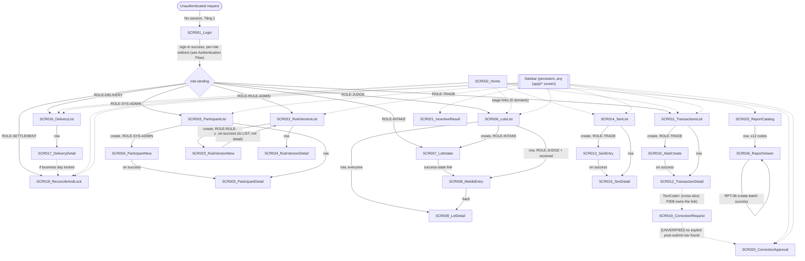

# Screen Flow

**Project**: sakura-market
**Generated**: 2026-09-08
**Analysis Scope**: 26 SCR### from `screen-list.md` (Wave 2, this pass) + `route-list.md` (Wave 1, gate-passed)

**Code Format**: All SCR codes follow `SCR###_NameSlug` | `SCR###/REG###` for region-scoped transitions.

## Navigation Map

Sidebar nav (`src/lib/nav-items.ts:29-70`) is persistent across every `(app)/*` screen and lets any role jump directly between the list-level screens its role can see — drawn once below as edges from a single "Sidebar" node rather than repeated from every screen, to keep the diagram readable. The pipeline spine (top) mirrors the business flow the app's own Home dashboard draws (`src/components/pipeline/process-flow-config.ts` lanes).



## Feature Entry Points

{Populated by FS.1 researchers (feature-specs pass) AFTER feature-list.md exists. This W2 ScreenFlow pass leaves this section as the placeholder below — feature-list.md does not exist yet (Wave 5 pending, per `_session-context.md`: `feature_count: <pending-W5>`).}

_Not populated. The feature-specs pass (`--feature-specs`) has not been run: all 12 feature
folders under `artifacts/features/` are still `.pending`. This section stays empty rather than
carrying a raw template token — run the feature-specs pass to fill it._

---

## Screen Access Paths

| From Screen | To Screen | Action/Trigger | Conditions | Region |
|-------------|-----------|----------------|------------|--------|
| START | SCR001_Login | Initial unauthenticated request | Tầng 1 (`proxy.ts`) has no valid session | |
| SCR001_Login | *(role-landing, 7 targets)* | Sign-in success | See Authentication Flow table | |
| Any `(app)/*` screen | SCR001_Login | Sign out | `user-menu.tsx:39` | |
| SCR002_Home | SCR006_LotsList | Stage-node click (lots-received / lots-published) | None (open to all active roles) | |
| SCR002_Home | SCR011_TransactionsList | Stage-node click (transactions-draft/confirmed/cancelled) | `?status=` set per node | |
| SCR002_Home | SCR014_SeriList | Stage-node click (seri-results) | None | |
| SCR002_Home | SCR016_DeliveryList | Stage-node click (deliveries-in-progress/exception) | `?status=` set per node | |
| SCR002_Home | SCR018_ReconcileAndLock | Stage-node click (business-day-lock) | None | |
| SCR002_Home | SCR020_CorrectionApproval | Stage-node click (corrections-pending) | Card shows `forbidden` state unless `ROLE-SETTLEMENT` | |
| Sidebar (any `(app)/*`) | SCR006_LotsList | Nav item "lots" | None | |
| Sidebar | SCR011_TransactionsList | Nav item "transactions" | None | |
| Sidebar | SCR014_SeriList | Nav item "seri" | None | |
| Sidebar | SCR016_DeliveryList | Nav item "deliveries" | None | |
| Sidebar | SCR018_ReconcileAndLock | Nav item "reconciliation" | None | |
| Sidebar | SCR020_CorrectionApproval | Nav item "corrections" | Item hidden unless `ROLE-SETTLEMENT` (`nav-items.ts:52`) | |
| Sidebar | SCR021_IncentiveResult | Nav item "incentive" | Item hidden unless `ROLE-SETTLEMENT` (`nav-items.ts:53`) | |
| Sidebar | SCR022_RuleVersionList | Nav item "incentive-rules" | Item hidden unless `ROLE-RULE-ADMIN` (`nav-items.ts:58-62`) | |
| Sidebar | SCR025_ReportCatalog | Nav item "reports" | None | |
| Sidebar | SCR003_ParticipantList | Nav item "participants" | None | |
| Sidebar | SCR002_Home | Logo click (`role-sidebar.tsx:39`) | None | |
| SCR003_ParticipantList | SCR004_ParticipantNew | "Create" link | `role==='ROLE-SYS-ADMIN'` (else `HandoffCaption`) | |
| SCR003_ParticipantList | SCR005_ParticipantDetail | Row link | None | |
| SCR004_ParticipantNew | SCR005_ParticipantDetail | Form submit success | `router.push` to new id (`participant-form.tsx:73`) | |
| SCR005_ParticipantDetail | SCR003_ParticipantList | Back link | None | |
| SCR005_ParticipantDetail | SCR005_ParticipantDetail | Edit / transition submit success | `router.refresh()`-style in-place update; role `ROLE-SYS-ADMIN` | SCR005/REG002, SCR005/REG003 |
| SCR006_LotsList | SCR007_LotIntake | "Create" link | `role==='ROLE-INTAKE'` (else `HandoffCaption`) | |
| SCR006_LotsList | SCR008_MekikiEntry | Row "mekiki" link | `role==='ROLE-JUDGE'` AND `lot.status==='received'` | |
| SCR006_LotsList | SCR009_LotDetail | Row "detail" link | None | |
| SCR007_LotIntake | SCR008_MekikiEntry | Success-state link | None (post-submit) | |
| SCR008_MekikiEntry | SCR009_LotDetail | Back link | None | |
| SCR009_LotDetail | SCR006_LotsList | Back link | None | |
| SCR009_LotDetail | SCR009_LotDetail | Edit submit success | `role==='ROLE-SETTLEMENT'` | SCR009/REG003 |
| SCR010_AitaiCreate | SCR012_TransactionDetail | Form submit success | `router.push` to new id (`aitai-create-form.tsx:54`) | |
| SCR011_TransactionsList | SCR010_AitaiCreate | "Create" link | `role==='ROLE-TRADE'` (else `HandoffCaption`) | |
| SCR011_TransactionsList | SCR012_TransactionDetail | Row link | None | |
| SCR012_TransactionDetail | SCR011_TransactionsList | Back link | None | |
| SCR012_TransactionDetail | SCR012_TransactionDetail | Confirm/cancel submit success | `role==='ROLE-TRADE'`; section removed once `status==='cancelled'` | SCR012/REG002 |
| SCR012_TransactionDetail | SCR019_CorrectionRequest | `?txnCode=` link | **[UNVERIFIED]** owning `Link` lives in a different file/scope per SCR019's own comment | |
| SCR013_SeriEntry | SCR015_SeriDetail | Form submit success | `router.push` to new id (`seri-entry-form.tsx:94`) | |
| SCR014_SeriList | SCR013_SeriEntry | "Create" link | `role==='ROLE-TRADE'` (else `HandoffCaption`) | |
| SCR014_SeriList | SCR015_SeriDetail | Row link | None | |
| SCR015_SeriDetail | SCR014_SeriList | Back link | None | |
| SCR015_SeriDetail | SCR015_SeriDetail | Edit submit success | `role==='ROLE-TRADE'`\|`'ROLE-SETTLEMENT'` | SCR015/REG002 |
| SCR016_DeliveryList | SCR017_DeliveryDetail | Row link | None | |
| SCR017_DeliveryDetail | SCR016_DeliveryList | Back link | None | |
| SCR017_DeliveryDetail | SCR018_ReconcileAndLock | "Reconciliation" link in page meta | Business day already locked (`page.tsx:64-71`) | |
| SCR017_DeliveryDetail | SCR017_DeliveryDetail | New-shipment submit success | `role==='ROLE-DELIVERY'`; section removed once `status==='hoàn tất'` | SCR017/REG002 |
| SCR018_ReconcileAndLock | SCR018_ReconcileAndLock | Lock confirm success | `role==='ROLE-SETTLEMENT'`; day not yet locked; retype-to-confirm | |
| SCR019_CorrectionRequest | SCR020_CorrectionApproval | **[UNVERIFIED]** post-submit nav | No explicit navigation found in `CorrectionRequestForm` | |
| SCR020_CorrectionApproval | SCR019_CorrectionRequest | "Create" link | None (screen itself is `ROLE-SETTLEMENT`-only) | |
| SCR021_IncentiveResult | — | None outbound found | | |
| SCR022_RuleVersionList | SCR023_RuleVersionNew | "Create" link | `ROLE-RULE-ADMIN` (screen itself is role-gated) | |
| SCR022_RuleVersionList | SCR024_RuleVersionDetail | Row link | None | |
| SCR023_RuleVersionNew | SCR022_RuleVersionList | Form submit success | `router.push("/incentive/rules")` — goes to LIST, not the new version's detail (`rule-version-form.tsx:43`) | |
| SCR024_RuleVersionDetail | SCR022_RuleVersionList | Back link | None | |
| SCR024_RuleVersionDetail | SCR024_RuleVersionDetail | Approve/rollback submit success | Maker-checker: creator excluded (`isCreator` check) | |
| SCR025_ReportCatalog | SCR026_ReportViewer | Row link, ×12 codes | None | |
| SCR026_ReportViewer | SCR025_ReportCatalog | Back link | None | |
| SCR026_ReportViewer | SCR026_ReportViewer | Create-batch success | `router.push(/reports/RPT-06?...)` — same screen, re-queried (`create-export-batch-button.tsx:41`) | SCR026/REG002 |

> Region column: filled only for a transition that resolves inside a named REG### without changing the screen; left blank for whole-screen/URL transitions.

## Screen Transitions

### SCR001_Login

**Entry Points**: Direct URL access; Tầng 1 307 redirect from any unauthenticated request (`src/lib/supabase/proxy.ts:41-54`); sign-out from any `(app)/*` screen.
**Exit Points**: To role-landing target on sign-in success (see Authentication Flow).
**Decision Points**: `getCurrentUser()` already-signed-in check → redirect away via `roleLanding(role)` before the form renders (`page.tsx:23-25`), so an authenticated user never sees this form.

---

### SCR002_Home

**Entry Points**: Sidebar logo click (any `(app)/*` screen); direct URL `/`.
**Exit Points**: To SCR006/SCR011/SCR014/SCR016/SCR018/SCR020 via stage-node links.
**Decision Points**: Each stage card independently gates on `stage.allowedRoles` before querying (`resolve-stage-value.ts:39-41`) — the "corrections-pending" card alone renders `forbidden` for every role but `ROLE-SETTLEMENT`.

---

### SCR003_ParticipantList

**Entry Points**: Sidebar "participants"; role-landing target for `ROLE-SYS-ADMIN`.
**Exit Points**: To SCR004 (create, role-gated); to SCR005 (row).
**Decision Points**: `canWrite = user?.role==='ROLE-SYS-ADMIN'` toggles the create CTA vs. `HandoffCaption`.

---

### SCR004_ParticipantNew

**Entry Points**: From SCR003 (create link).
**Exit Points**: To SCR005 on submit success.
**Decision Points**: None (single form, single outcome).

---

### SCR005_ParticipantDetail

**Entry Points**: From SCR003 (row); from SCR004 (post-create).
**Exit Points**: Back to SCR003; in-place refresh on Edit/Transition success.
**Decision Points**: `canWrite = user?.role==='ROLE-SYS-ADMIN'` toggles Edit/Transition forms vs. `HandoffCaption` in REG002/REG003.

---

### SCR006_LotsList

**Entry Points**: Sidebar "lots"; role-landing target for `ROLE-JUDGE`; Home stage links.
**Exit Points**: To SCR007 (create, role-gated); to SCR008 (row, role+status-gated); to SCR009 (row, everyone).
**Decision Points**: `canCreate = user.role==='ROLE-INTAKE'`; mekiki row-link only rendered when `lot.status==='received' && user.role==='ROLE-JUDGE'`.

---

### SCR007_LotIntake

**Entry Points**: From SCR006 (create link); role-landing target for `ROLE-INTAKE`.
**Exit Points**: To SCR008 (success-state link forward).
**Decision Points**: `resetForm()` lets the same operator create another lot without navigating away — the success state is a branch WITHIN this screen, not a transition.

---

### SCR008_MekikiEntry

**Entry Points**: From SCR006 (row, role+status-gated); from SCR007 (success link).
**Exit Points**: Back to SCR009.
**Decision Points**: 3-way render — form (`role==='ROLE-JUDGE' && status==='received'`) vs. wrong-role notice vs. already-done notice (`page.tsx:46-52`).

---

### SCR009_LotDetail

**Entry Points**: From SCR006 (row, everyone); from SCR008 (back).
**Exit Points**: Back to SCR006.
**Decision Points**: `user.role==='ROLE-SETTLEMENT'` toggles REG003_Edit's form vs. `HandoffCaption`.

---

### SCR010_AitaiCreate

**Entry Points**: From SCR011 (create link, role-gated).
**Exit Points**: To SCR012 on submit success.
**Decision Points**: None (single form, single outcome); lot dropdown pre-filtered server-side.

---

### SCR011_TransactionsList

**Entry Points**: Sidebar "transactions"; role-landing target for `ROLE-TRADE`; Home stage links (filtered).
**Exit Points**: To SCR010 (create, role-gated); to SCR012 (row).
**Decision Points**: `canAct = user.role==='ROLE-TRADE'` toggles create CTA and per-row confirm/cancel affordance.

---

### SCR012_TransactionDetail

**Entry Points**: From SCR011 (row); from SCR010 (post-create).
**Exit Points**: Back to SCR011; `?txnCode=` link to SCR019 (**[UNVERIFIED]** owning file).
**Decision Points**: `canAct = user.role==='ROLE-TRADE'` toggles REG002_Actions' button group vs. `HandoffCaption`; that card disappears entirely once `status==='cancelled'`.

---

### SCR013_SeriEntry

**Entry Points**: From SCR014 (create link, role-gated).
**Exit Points**: To SCR015 on submit success.
**Decision Points**: Lot dropdown excludes lots already carrying a `seri_result`.

---

### SCR014_SeriList

**Entry Points**: Sidebar "seri"; Home stage link.
**Exit Points**: To SCR013 (create, role-gated); to SCR015 (row).
**Decision Points**: `canCreate = user.role==='ROLE-TRADE'`.

---

### SCR015_SeriDetail

**Entry Points**: From SCR014 (row); from SCR013 (post-create).
**Exit Points**: Back to SCR014.
**Decision Points**: `canEdit = role==='ROLE-TRADE' || role==='ROLE-SETTLEMENT'` toggles REG002_Edit's form vs. `HandoffCaption`.

---

### SCR016_DeliveryList

**Entry Points**: Sidebar "deliveries"; role-landing target for `ROLE-DELIVERY`; Home stage link (filtered).
**Exit Points**: To SCR017 (row).
**Decision Points**: None screen-level (list + filter only; no create action on this screen — deliveries are created implicitly by the transaction-confirm flow, per `route-list.md` ROUTE010 note).

---

### SCR017_DeliveryDetail

**Entry Points**: From SCR016 (row).
**Exit Points**: Back to SCR016; conditional link to SCR018 when the day is locked.
**Decision Points**: `canRecordShipment = role==='ROLE-DELIVERY' && status!=='hoàn tất'` toggles REG002; that card is entirely omitted once `status==='hoàn tất'`. `canComplete = role==='ROLE-SETTLEMENT'` gates the complete action inside REG001_Overview's progress display.

---

### SCR018_ReconcileAndLock

**Entry Points**: Sidebar "reconciliation"; role-landing target for `ROLE-SETTLEMENT`; Home stage link; SCR017's conditional link.
**Exit Points**: None outbound found (terminal-ish screen for this pass).
**Decision Points**: `canLock = role==='ROLE-SETTLEMENT' && !lock.locked` toggles `LockConfirmDialog` vs. `HandoffCaption`; the dialog itself gates its confirm button on retyping the exact business date.

---

### SCR019_CorrectionRequest

**Entry Points**: `?txnCode=` from SCR012 (**[UNVERIFIED]** owning file); direct URL with its own lookup form.
**Exit Points**: **[UNVERIFIED]** post-submit navigation to SCR020 not confirmed in `CorrectionRequestForm`.
**Decision Points**: `trimmedCode && !txn` → error message; `txn` found → reveal read-only summary + `CorrectionRequestForm`.

---

### SCR020_CorrectionApproval

**Entry Points**: Sidebar "corrections" (role-gated); Home stage link (role-gated card).
**Exit Points**: To SCR019 (create link).
**Decision Points**: Per row, `canDecide = status==='pending' && requested_by!==user.id` vs. `isOwnPendingRequest = status==='pending' && requested_by===user.id` — DEC-001 maker-checker split rendered inline per row, not as a screen-level branch.

---

### SCR021_IncentiveResult

**Entry Points**: Sidebar "incentive" (role-gated).
**Exit Points**: None found.
**Decision Points**: None screen-level (read-only, period-filtered).

---

### SCR022_RuleVersionList

**Entry Points**: Sidebar "incentive-rules" (role-gated); role-landing target for `ROLE-RULE-ADMIN`.
**Exit Points**: To SCR023 (create); to SCR024 (row); receives return-navigation from SCR023 on submit success.
**Decision Points**: `computeDisplayStatuses` derives a client-visible status (distinct from the raw DB `status`) from `effective_from` vs. today — display-only, not a navigation branch.

---

### SCR023_RuleVersionNew

**Entry Points**: From SCR022 (create link).
**Exit Points**: To SCR022 (list, not detail) on submit success.
**Decision Points**: None.

---

### SCR024_RuleVersionDetail

**Entry Points**: From SCR022 (row).
**Exit Points**: Back to SCR022.
**Decision Points**: `isCreator` excludes the version's own maker from `canApprove`/`canRollback` (maker-checker); `hasActions` omits the entire Actions card (not merely disables it) for a superseded/rolled-back version with nothing left to do.

---

### SCR025_ReportCatalog

**Entry Points**: Sidebar "reports".
**Exit Points**: To SCR026, ×12 report codes.
**Decision Points**: None (static registry render).

---

### SCR026_ReportViewer

**Entry Points**: From SCR025 (row, per report code).
**Exit Points**: Back to SCR025; in-place refresh on RPT-06 batch-create success.
**Decision Points**: 3-way render — `definition.isMock` (disabled export + badge) vs. `isRpt06` (accounting block) vs. normal export link (`page.tsx:94-137`); within the RPT-06 branch, `hasBatchCode` further toggles a live export link vs. a disabled "preview mode" button.

---

## Region Transitions

N/A — no modal/portal-based region transitions detected (`grep -rn "<dialog|role=\"dialog\"|Modal|createPortal" src/components` returned no matches). Every REG### documented in `screen-list.md` is a static in-page section of its parent SCR###, not an independently navigable target. `LockConfirmDialog` (SCR018) is a client-state inline expand (a `useState` toggle rendering a card in place), not a portal/modal, and never leaves its own screen.

---

## Authentication Flow

```mermaid
graph LR
    A[Unauthenticated] -->|"Tầng 1: no session"| B[SCR001_Login]
    B -->|Sign-in success| C{role}
    C -->|ROLE-INTAKE| D1[/lots/new]
    C -->|ROLE-JUDGE| D2[/lots]
    C -->|ROLE-TRADE| D3[/transactions]
    C -->|ROLE-DELIVERY| D4[/deliveries]
    C -->|ROLE-SETTLEMENT| D5[/reconciliation]
    C -->|ROLE-RULE-ADMIN| D6[/incentive/rules]
    C -->|ROLE-SYS-ADMIN| D7[/participants]
    D1 & D2 & D3 & D4 & D5 & D6 & D7 -->|Sign out| B
```

| Screen | Authentication Required | Authorization Level |
|--------|-------------------------|----------------------|
| SCR001_Login | No (pre-auth; Tầng 1 explicitly excludes `/login` and `/api/auth/*`) | Public |
| SCR002_Home | Yes (Tầng 2, `requireUser` via layout) | Any active role |
| SCR003_ParticipantList | Yes (layout) | Any active role (write-CTA gated to `ROLE-SYS-ADMIN`) |
| SCR004_ParticipantNew | Yes (`requireRole`) | `ROLE-SYS-ADMIN` (404 for any other role) |
| SCR005_ParticipantDetail | Yes (layout) | Any active role (edit/transition gated to `ROLE-SYS-ADMIN`) |
| SCR006_LotsList | Yes (layout) | Any active role (create-CTA gated to `ROLE-INTAKE`) |
| SCR007_LotIntake | Yes (`requireRole`) | `ROLE-INTAKE` (404 otherwise) |
| SCR008_MekikiEntry | Yes (layout) | Any active role (write form gated to `ROLE-JUDGE`) |
| SCR009_LotDetail | Yes (layout) | Any active role (edit gated to `ROLE-SETTLEMENT`) |
| SCR010_AitaiCreate | Yes (`requireRole`) | `ROLE-TRADE` (404 otherwise) |
| SCR011_TransactionsList | Yes (layout) | Any active role (create/row-actions gated to `ROLE-TRADE`) |
| SCR012_TransactionDetail | Yes (layout) | Any active role (confirm/cancel gated to `ROLE-TRADE`) |
| SCR013_SeriEntry | Yes (`requireRole`) | `ROLE-TRADE` (404 otherwise) |
| SCR014_SeriList | Yes (layout) | Any active role (create-CTA gated to `ROLE-TRADE`) |
| SCR015_SeriDetail | Yes (layout) | Any active role (edit gated to `ROLE-TRADE`\|`ROLE-SETTLEMENT`) |
| SCR016_DeliveryList | Yes (layout) | Any active role |
| SCR017_DeliveryDetail | Yes (layout) | Any active role (new-shipment gated to `ROLE-DELIVERY`; complete gated to `ROLE-SETTLEMENT`) |
| SCR018_ReconcileAndLock | Yes (layout) | Any active role (lock gated to `ROLE-SETTLEMENT`) |
| SCR019_CorrectionRequest | Yes (`requireRole`) | `ROLE-SETTLEMENT` (404 otherwise) |
| SCR020_CorrectionApproval | Yes (`requireRole`) | `ROLE-SETTLEMENT` (404 otherwise) |
| SCR021_IncentiveResult | Yes (`requireRole`) | `ROLE-SETTLEMENT` (404 otherwise) |
| SCR022_RuleVersionList | Yes (`requireRole`) | `ROLE-RULE-ADMIN` (404 otherwise) |
| SCR023_RuleVersionNew | Yes (`requireRole`) | `ROLE-RULE-ADMIN` (404 otherwise) |
| SCR024_RuleVersionDetail | Yes (`requireRole`) | `ROLE-RULE-ADMIN` (404 otherwise; maker-checker further excludes the version's own creator from actions) |
| SCR025_ReportCatalog | Yes (layout) | Any active role |
| SCR026_ReportViewer | Yes (layout) | Any active role (RPT-06 batch-create gated to `ROLE-SETTLEMENT`) |

Two-tier guard, per `route-list.md` Conventions (unchanged for this pass): **Tầng 1** (`src/proxy.ts` + `updateSession`) rejects any request without a valid Supabase session (307 → `/login?reason=unauthenticated`), matcher excludes only `/login` and `/api/auth/*`. **Tầng 2** (`requireUser`/`requireRole`, `src/lib/auth/require-role.ts:58-78`) requires an active `app_user` row (307 → `/login?reason=inactive` if missing/inactive); `requireRole` on top of that 404s (not 403) for the wrong role — deliberate, so an unauthorized role gets no signal about what exists behind the guard (`require-role.ts:66-77`).

---

## Error Handling Flows

| Screen | Error | Handling | Scope |
|--------|-------|----------|-------|
| SCR001_Login | Invalid credentials / locked account | Inline error message keyed by `?reason=` / API response | screen |
| Any `(app)/*` screen | No/inactive session | 307 redirect to `/login?reason=inactive` (Tầng 2, layout) | screen |
| SCR004/SCR007/SCR010/SCR013/SCR019/SCR020/SCR021/SCR023/SCR024 (role-gated pages) | Wrong role | `notFound()` → Next.js 404 (deliberately not 403) | screen |
| SCR008_MekikiEntry | Lot not found | `notFound()` → 404 (`page.tsx:30`) | screen |
| SCR005/SCR009/SCR012/SCR015/SCR017/SCR024 (detail pages) | Record not found | `notFound()` → 404 | screen |
| SCR012_TransactionDetail, SCR017_DeliveryDetail, SCR009_LotDetail, SCR015_SeriDetail (mutation regions) | Business day locked | 423 response from the API; **[UNVERIFIED]** exact client-side surfacing of the 423 status was not traced in this pass — REG-level error handling not directly observed in the page files read | region |
| SCR005_ParticipantDetail/REG002, REG003 | Validation failure (`category_immutable`, `illegal_transition`, etc.) | 422 response, inline form error (component-level, not traced field-by-field in this pass) | region:REG002, region:REG003 |
| SCR018_ReconcileAndLock | Lock request fails (already locked / race) | Inline `errorKey` message inside `LockConfirmDialog` (`lock-confirm-dialog.tsx:28-35`) | screen |
| SCR013_SeriEntry, SCR015_SeriDetail/REG002 | Duplicate seri result (409) | `seri.create.error.duplicate` inline message (`seri-entry-form.tsx:90`) | screen / region:REG002 |
| SCR026_ReportViewer | Mock report export attempted | Export button rendered `disabled` client-side; server independently returns 403 `MOCK_REPORT` if bypassed (`route-list.md` ROUTE028) | region:REG001 |
| Every server component page read in this pass | Unhandled Supabase query error | `throw new Error(...)` — surfaces as Next.js's default error boundary, no custom per-screen error UI observed | screen |

> Scope values: `screen` (affects entire screen) | `region:REG###` (error contained within the named region).

---

## Circular Dependencies Check

- [x] No circular dependencies detected. Sidebar nav (persistent on every `(app)/*` screen) intentionally permits direct navigation between any two list-level screens at will — this is normal persistent-nav design (`src/lib/nav-items.ts`), not an a→b→a dependency loop.
- [x] All screens have valid entry/exit points (SCR018_ReconcileAndLock and SCR021_IncentiveResult have no further outbound screen link, which is expected for pipeline-terminal read/action screens, not a dead end that traps the user — the sidebar remains available).
- [x] All navigation paths terminate. The one login↔landing loop risk is explicitly guarded in source: `LoginPage` checks `getCurrentUser()` and redirects away via `roleLanding()` before rendering the form (`src/app/(auth)/login/page.tsx:23-25`), so an already-authenticated session can never bounce back to the login form.

---

## Guard Logic

### GUARD-001 — Session guard (Tầng 1) on all paths
**trigger:** `middleware` (Next.js 16 `proxy.ts`)
**source:** `src/proxy.ts:9-11` + `src/lib/supabase/proxy.ts:updateSession`
**logic:**
```pseudo
if (path !== "/login" && !path.startsWith("/api/auth/")) {
  if (!session) → redirect /login?reason=unauthenticated
}
```
**failure path:** 307 redirect to `/login?reason=unauthenticated`, carrying refreshed cookies

---

### GUARD-002 — Active-user guard (Tầng 2) on every `(app)/*` screen
**trigger:** Server Component call at the top of the shared layout
**source:** `src/app/(app)/layout.tsx:11` → `src/lib/auth/require-role.ts:58-64`
**logic:**
```pseudo
if (!requireUser()) → redirect /login?reason=inactive
```
**failure path:** 307 redirect to `/login?reason=inactive`

---

### GUARD-003 — Role guard on SCR004_ParticipantNew
**trigger:** Server Component call at page top
**source:** `src/app/(app)/participants/new/page.tsx:11`
**logic:** `if (!["ROLE-SYS-ADMIN"].includes(role)) → notFound()`
**failure path:** 404 (not 403)

---

### GUARD-004 — Role guard on SCR007_LotIntake
**source:** `src/app/(app)/lots/new/page.tsx:10` — `requireRole(["ROLE-INTAKE"])`
**failure path:** 404

---

### GUARD-005 — Role guard on SCR010_AitaiCreate
**source:** `src/app/(app)/transactions/new/page.tsx:16` — `requireRole(["ROLE-TRADE"])`
**failure path:** 404

---

### GUARD-006 — Role guard on SCR013_SeriEntry
**source:** `src/app/(app)/seri/new/page.tsx:16` — `requireRole(["ROLE-TRADE"])`
**failure path:** 404

---

### GUARD-007 — Role guard on SCR019_CorrectionRequest
**source:** `src/app/(app)/corrections/new/page.tsx:20` — `requireRole(["ROLE-SETTLEMENT"])`
**failure path:** 404

---

### GUARD-008 — Role guard on SCR020_CorrectionApproval
**source:** `src/app/(app)/corrections/page.tsx:25` — `requireRole(["ROLE-SETTLEMENT"])`
**failure path:** 404

---

### GUARD-009 — Role guard on SCR021_IncentiveResult
**source:** `src/app/(app)/incentive/page.tsx:21` — `requireRole(["ROLE-SETTLEMENT"])`
**failure path:** 404

---

### GUARD-010 — Role guard on SCR022_RuleVersionList
**source:** `src/app/(app)/incentive/rules/page.tsx:24` — `requireRole(["ROLE-RULE-ADMIN"])`
**failure path:** 404

---

### GUARD-011 — Role guard on SCR023_RuleVersionNew
**source:** `src/app/(app)/incentive/rules/new/page.tsx:10` — `requireRole(["ROLE-RULE-ADMIN"])`
**failure path:** 404

---

### GUARD-012 — Role guard on SCR024_RuleVersionDetail
**source:** `src/app/(app)/incentive/rules/[id]/page.tsx:23` — `requireRole(["ROLE-RULE-ADMIN"])`
**logic:**
```pseudo
if (!["ROLE-RULE-ADMIN"].includes(role)) → notFound()
// downstream, in-page (not a route guard): isCreator excludes the maker
// from approve/rollback regardless of role
```
**failure path:** 404 (role); silent (button omission) for the maker-checker case

---

## Deep-Link State Restoration

### SCR001_Login
**URL pattern:** `/login?reason={r}`
**State restored:**

| Param | Restores | Default if missing |
|-------|----------|---------------------|
| reason | Which error copy `LoginForm` shows (`unauthenticated`\|`inactive`\|lockout) | No error message shown |

**Failure mode:** unrecognized value falls through to no error message (client-side switch, not traced field-by-field in this pass).

---

### SCR011_TransactionsList
**URL pattern:** `/transactions?businessDate={d}&status={s}`
**State restored:**

| Param | Restores | Default if missing |
|-------|----------|---------------------|
| businessDate | Date filter input | Unfiltered (all dates) |
| status | Status `<select>` | "All statuses" |

**Failure mode:** an unrecognized `status` is dropped silently (`(STATUSES as readonly string[]).includes(status)` guard, `page.tsx:26`) — filter reverts to unfiltered rather than erroring.

---

### SCR014_SeriList
**URL pattern:** `/seri?businessDate={d}&lotCode={c}&winnerName={n}`
**State restored:**

| Param | Restores | Default if missing |
|-------|----------|---------------------|
| businessDate, lotCode, winnerName | 3 filter inputs | Unfiltered |

**Failure mode:** N/A — free-text/date fields, no enum validation to fail.

---

### SCR016_DeliveryList
**URL pattern:** `/deliveries?businessDate={d}&status={s}`
**State restored:**

| Param | Restores | Default if missing |
|-------|----------|---------------------|
| businessDate | Date filter input | Unfiltered |
| status | Status `<select>` (chờ/đang giao/hoàn tất only — "ngoại lệ" deliberately excluded) | "All statuses" |

**Failure mode:** unrecognized status silently drops to unfiltered.

---

### SCR018_ReconcileAndLock
**URL pattern:** `/reconciliation?date={d}`
**State restored:**

| Param | Restores | Default if missing |
|-------|----------|---------------------|
| date | Business-date filter, capped at `max={todayJst()}` | Today (JST) |

**Failure mode:** invalid date falls back to today (`isValidBusinessDate` guard, `page.tsx:26`).

---

### SCR019_CorrectionRequest
**URL pattern:** `/corrections/new?txnCode={c}`
**State restored:**

| Param | Restores | Default if missing |
|-------|----------|---------------------|
| txnCode | Pre-fills the lookup form and, if found, reveals the transaction summary + create form | Blank lookup form |

**Failure mode:** code not found → inline `corrections.error.txnNotFound` message, form stays hidden.

---

### SCR020_CorrectionApproval
**URL pattern:** `/corrections?status={s}`
**State restored:**

| Param | Restores | Default if missing |
|-------|----------|---------------------|
| status | Which corrections are listed | `"pending"` (`page.tsx:31`) |

**Failure mode:** N/A — passed straight to `listCorrections`, no client-side enum guard observed.

---

### SCR021_IncentiveResult
**URL pattern:** `/incentive?period={p}`
**State restored:**

| Param | Restores | Default if missing |
|-------|----------|---------------------|
| period | Period date filter | Today (JST) |

**Failure mode:** invalid period falls back to today (`isValidPeriod` guard, `page.tsx:24`).

---

### SCR022_RuleVersionList
**URL pattern:** `/incentive/rules?status={s}`
**State restored:**

| Param | Restores | Default if missing |
|-------|----------|---------------------|
| status | Status `<select>` (pending_approval/active/rolled_back) | "All statuses" |

**Failure mode:** unrecognized status silently drops to unfiltered.

---

### SCR026_ReportViewer
**URL pattern:** `/reports/{reportCode}?page={n}&{per-report filter fields}`
**State restored:**

| Param | Restores | Default if missing |
|-------|----------|---------------------|
| page | Pagination position (`REPORT_PAGE_SIZE` per page) | 1 (`Math.max(1, Number(...)||1)`, `page.tsx:53`) |
| *(per-report filter fields)* | `ReportFilterForm` field values | Defined per `definition.filterFields` (`parseReportFilters`) |

**Failure mode:** non-numeric/invalid `page` silently falls back to 1.

---

## Unsaved-Changes Protection

`N/A — no unsaved-changes guards detected.` Confirmed by `grep -rn "beforeunload|isDirty|useBeforeUnload|leaveGuard" src/` — zero matches across the entire `src/` tree. Every create/edit form in this app (`LotIntakeForm`, `ParticipantForm`, `AitaiCreateForm`, `SeriEntryForm`, `CorrectionRequestForm`, `RuleVersionForm`, `ShipmentForm`, `LotEditForm`, `MekikiForm`) navigates or refreshes on success with no dirty-check on discard/navigate-away.

---

## Extraction Signatures

Framework-agnostic identifier patterns for locating the above constructs.

### Guard Logic
Function/method definitions tied to a route: `beforeEnter|canActivate|middleware|loader|before_action|authenticate|authorize` — check if called from a router config or route registration. In this codebase: `requireUser`/`requireRole` (`src/lib/auth/require-role.ts`), called at the top of a Server Component page or the shared layout.

### Deep-Link State Restoration
URL param reads at component mount synced to state: `useSearchParams|useQuery|router\.query|URLSearchParams|params\[|$route\.query` — in this codebase, every list/detail page's `searchParams: Promise<{...}>` prop (Next.js 16 App Router async API).

### Unsaved-Changes Protection
`beforeunload|onbeforeunload|usePrompt|useBeforeUnload|leaveGuard|isDirty|formState\.isDirty|data-turbo-confirm` — presence confirms protection; absence (confirmed here) is a potential gap to flag, though out of this prototype's stated scope (no test suite, 11-hour budget per `docs/pham-vi-va-phan-mock.md`).
