# Database diagram — LAB-4

Sản phẩm nộp "Database diagram" của LAB-4. Không phải ERD vẽ lý thuyết: mọi bảng, cột, ràng buộc
dưới đây đọc từ DDL thật trong `supabase/migrations/`, và đã đếm lại trên database đang chạy (§ 6).

**Nguồn duy nhất cho DDL:** 14 file trong `supabase/migrations/`. `src/lib/db/types.ts` là output
typegen trên cùng schema — chỉ dùng soát chéo, không bao giờ là nguồn.

**Nền:** `docs/generated/entities.md` (785 dòng, do rebuild-spec sinh, đã có `erDiagram` ở dòng 17
và đã đối chiếu 18 bảng thật). Tài liệu này tinh chỉnh bản đó và thêm ba mục `entities.md` không
có: **ba tầng ràng buộc** (§ 3), **đối chiếu thiết kế ↔ thi công** (§ 4), **bảng cần thêm cho 12
màn chưa dựng** (§ 5). `docs/generated/*` giữ nguyên làm bằng chứng, không sửa.

**Roster màn:** `00-roster-va-gap.md` — 32 màn `SC-01..SC-32`, § 5 phân loại 12 màn chưa dựng.

## 0. Quy ước dẫn nguồn

Mọi khẳng định về DB dẫn `file:dòng`. Tên file migration viết tắt bỏ tiền tố timestamp; đầy đủ như
bảng dưới, tất cả nằm trong `supabase/migrations/`.

| Viết tắt trong tài liệu | File đầy đủ |
|---|---|
| `core_identity.sql` | `20260904090000_core_identity.sql` |
| `participant.sql` | `20260904090100_participant.sql` |
| `lot.sql` | `20260904090200_lot.sql` |
| `transaction.sql` | `20260904090300_transaction.sql` |
| `delivery.sql` | `20260904090400_delivery.sql` |
| `business_day_lock.sql` | `20260904090500_business_day_lock.sql` |
| `correction.sql` | `20260904090600_correction.sql` |
| `incentive.sql` | `20260904090700_incentive.sql` |
| `reconciliation_view.sql` | `20260904090800_reconciliation_view.sql` |
| `rls_core.sql` | `20260904090900_rls_core.sql` |
| `rls_ops.sql` | `20260904091000_rls_ops.sql` |
| `lock_enforcement_fix.sql` | `20260904091100_lock_enforcement_fix.sql` |
| `lot_attachment.sql` | `20260907090000_lot_attachment.sql` |
| `accounting_export.sql` | `20260908090000_accounting_export.sql` |

Đường dẫn code (`src/...`) viết đủ. RFP là
`RFP_He-thong-ho-tro-nghiep-vu-cho-ban-buon-thuy-san_VI_v1.0.md` (nằm ngoài repo, cùng thư mục cha).

## 1. ERD — 18 bảng + 1 view

Nhóm theo 8 domain: identity · participant · lot · trade · delivery · settle · rule · report.
`erDiagram` của mermaid không có subgraph, nên domain được đánh dấu bằng comment `%%` và thứ tự
khai báo.

**Hai điều ERD này khai mà một ERD vẽ lý thuyết sẽ vẽ sai:**

1. `business_day_lock` **không có FK nào** tới 4 bảng nó khoá. Quan hệ là so trùng **giá trị**
   `business_date` bên trong hàm `private.is_business_day_locked()` (`business_day_lock.sql:22-30`),
   do trigger gọi. Vẽ thành FK là sai bản chất — xoá một dòng lock không hề bị bảng con chặn.
2. `reconciliation_line` là **view** `UNION ALL` ba bảng (`reconciliation_view.sql:6-46`), không có
   PK, không lưu dòng nào. Quan hệ tới nó vẽ bằng nét gián đoạn (`..`).

Kiểu dữ liệu trong ERD viết gọn (`numeric`, không `numeric(12,2)`) cho khỏi vỡ layout; độ chính xác
đúng nằm ở § 2. Comment cạnh cột viết không dấu vì mermaid render nhãn bằng font mặc định của
trình xem, dấu tiếng Việt trong SVG hay bị cắt — phần diễn giải đầy đủ ở § 2 và § 4.

```mermaid
erDiagram
    %% ======== identity ========
    app_user {
        uuid id PK
        text email UK
        text role "CHECK 7 role"
        boolean is_active
        integer failed_login_count
        timestamptz locked_until
    }
    audit_log {
        uuid id PK
        uuid actor_id FK
        text action "free text - khong CHECK"
        text entity "free text - khong CHECK"
        text entity_id
        jsonb before
        jsonb after
        text reason
    }

    %% ======== participant ========
    participant {
        uuid id PK
        text category "CHECK 4 loai"
        text license_type "NOT NULL - KHONG CHECK"
        text status "CHECK 4 trang thai"
        date valid_from
        date valid_to
    }
    participant_status_history {
        uuid id PK
        uuid participant_id FK
        text from_status "khong CHECK"
        text to_status "khong CHECK"
        text reason
        uuid changed_by FK
    }

    %% ======== lot ========
    lot {
        uuid id PK
        text lot_code UK
        text item
        integer package_count "CHECK gt 0"
        numeric initial_qty "CHECK gt 0"
        numeric available_qty "CHECK gte 0"
        text status "CHECK 4 gia tri"
        date business_date "QD-2 - nhung lot MIEN trigger"
    }
    mekiki_record {
        uuid id PK
        uuid lot_id FK
        text grade
        uuid assessor_id FK
        date business_date "QD-2 - trigger doc truc tiep"
    }
    lot_attachment {
        uuid id PK
        uuid lot_id FK
        text file_path
        text file_name
        text mime_type
        integer file_size "CHECK gt 0"
        uuid uploaded_by FK
    }

    %% ======== trade ========
    transaction {
        uuid id PK
        text txn_code UK
        text type "CHECK bang aitai - cot chet"
        uuid lot_id FK
        uuid buyer_participant_id FK
        numeric qty "CHECK gt 0"
        integer unit_price "CHECK gt 0 - JPY"
        date business_date
        text status "CHECK 3 gia tri"
        uuid confirmed_by FK
        uuid cancelled_by FK
    }
    seri_result {
        uuid id PK
        uuid lot_id FK
        uuid winner_participant_id FK
        numeric qty "CHECK gt 0"
        integer unit_price "CHECK gt 0"
        uuid confirmed_by FK
        date business_date "QD-2"
    }

    %% ======== delivery ========
    delivery {
        uuid id PK
        uuid transaction_id FK
        text status "CHECK 4 gia tri - co ngoai le"
        numeric delivered_qty "CHECK gte 0"
    }
    delivery_shipment {
        uuid id PK
        uuid delivery_id FK
        integer seq "CHECK gt 0 - UNIQUE cung delivery_id"
        numeric qty "CHECK gt 0"
        uuid confirmed_by FK
        date business_date "QD-2 - ngay cua chinh lan giao nay"
    }

    %% ======== settle ========
    business_day_lock {
        date business_date PK
        timestamptz locked_at
        uuid locked_by FK
    }
    correction_request {
        uuid id PK
        uuid target_txn_id FK
        text reason
        text evidence_path
        text status "CHECK 3 gia tri"
        uuid requested_by FK
        uuid approved_by FK
    }
    transaction_adjustment {
        uuid id PK
        uuid source_correction_id FK
        uuid target_txn_id FK
        text kind "CHECK reverse hoac delta"
        numeric qty_delta
        integer unit_price_delta
        integer amount_delta
    }
    payment_record {
        uuid id PK
        uuid participant_id FK
        date business_date
        date due_date
        date paid_on
        integer eligible_amount_jpy "CHECK gte 0"
        boolean paid_on_time "GENERATED STORED"
    }

    %% ======== rule ========
    incentive_rule_version {
        uuid id PK
        integer version_no UK
        date effective_from
        text status "CHECK 3 gia tri"
        jsonb rate_table
        uuid created_by FK
        uuid approved_by FK
    }
    incentive_result {
        uuid id PK
        uuid participant_id FK
        date period
        integer amount_jpy
        uuid rule_version_id FK
        text kind "CHECK normal hoac delta"
        date origin_period
        uuid source_correction_id FK
    }

    %% ======== report ========
    accounting_export_batch {
        uuid id PK
        text batch_code UK
        date business_date
        integer seq "CHECK gt 0 - UNIQUE cung business_date"
        text kind "CHECK full hoac re-export"
        integer tax_rate_bps "CHECK gte 0"
        text tax_basis "CHECK exclusive hoac inclusive"
        integer row_count "CHECK gte 0"
        bigint total_net_amount_jpy
        bigint total_tax_jpy
        jsonb lines
        uuid exported_by FK
    }
    reconciliation_line {
        date business_date "VIEW - khong co PK"
        text source_type "aitai / seri / delivery"
        uuid source_id
        uuid participant_id
        numeric qty
        integer amount_jpy
        numeric variance
    }

    %% ======== FK thuc te ========
    app_user ||--o{ audit_log : "actor_id"
    app_user ||--o{ participant_status_history : "changed_by"
    app_user ||--o{ mekiki_record : "assessor_id"
    app_user ||--o{ lot_attachment : "uploaded_by"
    app_user ||--o{ transaction : "confirmed_by / cancelled_by"
    app_user ||--o{ seri_result : "confirmed_by"
    app_user ||--o{ delivery_shipment : "confirmed_by"
    app_user ||--o{ business_day_lock : "locked_by"
    app_user ||--o{ correction_request : "requested_by / approved_by"
    app_user ||--o{ incentive_rule_version : "created_by / approved_by"
    app_user ||--o{ accounting_export_batch : "exported_by"

    participant ||--o{ participant_status_history : "participant_id"
    participant ||--o{ transaction : "buyer_participant_id"
    participant ||--o{ seri_result : "winner_participant_id"
    participant ||--o{ incentive_result : "participant_id"
    participant ||--o{ payment_record : "participant_id"

    lot ||--o{ mekiki_record : "lot_id"
    lot ||--o{ lot_attachment : "lot_id"
    lot ||--o{ transaction : "lot_id"
    lot ||--o{ seri_result : "lot_id"

    transaction ||--o{ delivery : "transaction_id"
    transaction ||--o{ correction_request : "target_txn_id"
    transaction ||--o{ transaction_adjustment : "target_txn_id"
    delivery ||--o{ delivery_shipment : "delivery_id"

    correction_request ||--o{ transaction_adjustment : "source_correction_id"
    correction_request ||--o{ incentive_result : "source_correction_id"
    incentive_rule_version ||--o{ incentive_result : "rule_version_id"

    %% ======== quan he KHONG phai FK ========
    business_day_lock }o..o{ transaction : "so trung business_date trong trigger"
    business_day_lock }o..o{ seri_result : "so trung business_date trong trigger"
    business_day_lock }o..o{ mekiki_record : "so trung business_date trong trigger"
    business_day_lock }o..o{ delivery_shipment : "so trung business_date trong trigger"

    transaction ||..o{ reconciliation_line : "UNION nhanh aitai"
    seri_result ||..o{ reconciliation_line : "UNION nhanh seri"
    delivery_shipment ||..o{ reconciliation_line : "UNION nhanh delivery"
```



`app_user.id` còn một FK ra ngoài schema `public`: tham chiếu `auth.users(id)` với
`on delete cascade` (`core_identity.sql:8`). Không vẽ vào ERD vì `auth` là schema do Supabase quản,
ngoài phạm vi thiết kế này.

## 2. Chi tiết từng thực thể

18 bảng, theo đúng thứ tự domain ở § 1, rồi tới view. Cột `Nguồn` là `file:dòng` trong migration.

### 2.1 `app_user` — identity

Tài khoản người dùng nội bộ. `role` là đầu vào của **mọi** RLS policy trong hệ thống
(`core_identity.sql:23-24`).

| Cột | Kiểu | Ràng buộc | Nguồn |
|---|---|---|---|
| `id` | uuid | PK, FK → `auth.users(id)` `on delete cascade` | `core_identity.sql:8` |
| `email` | text | NOT NULL, UNIQUE | `core_identity.sql:9` |
| `display_name` | text | — | `core_identity.sql:10` |
| `role` | text | NOT NULL, CHECK IN 7 giá trị `ROLE-INTAKE`, `ROLE-JUDGE`, `ROLE-TRADE`, `ROLE-DELIVERY`, `ROLE-SETTLEMENT`, `ROLE-RULE-ADMIN`, `ROLE-SYS-ADMIN` | `core_identity.sql:11-16` |
| `is_active` | boolean | NOT NULL, default `true` | `core_identity.sql:17` |
| `failed_login_count` | integer | NOT NULL, default `0` | `core_identity.sql:18` |
| `locked_until` | timestamptz | — | `core_identity.sql:19` |
| `created_at` | timestamptz | NOT NULL, default `now()` | `core_identity.sql:20` |

RLS: bật ở `rls_core.sql:11`; chỉ có policy SELECT (`rls_core.sql:31-32`) — **không có policy
INSERT/UPDATE/DELETE nào cho `authenticated`**. Tạo tài khoản đi qua `service_role`.

### 2.2 `audit_log` — identity

Vết kiểm toán FR-AUDIT-01. Append-only: không tồn tại policy update/delete ở bất kỳ file nào
(`core_identity.sql:38-40`, `rls_core.sql:33-34,66-67`).

| Cột | Kiểu | Ràng buộc | Nguồn |
|---|---|---|---|
| `id` | uuid | PK, default `gen_random_uuid()` | `core_identity.sql:27` |
| `actor_id` | uuid | FK → `app_user(id)`, nullable | `core_identity.sql:28` |
| `action` | text | NOT NULL, **không CHECK** | `core_identity.sql:29` |
| `entity` | text | NOT NULL, **không CHECK** | `core_identity.sql:30` |
| `entity_id` | text | NOT NULL (text, không uuid — ghi được cả khoá không phải uuid) | `core_identity.sql:31` |
| `before` | jsonb | — | `core_identity.sql:32` |
| `after` | jsonb | — | `core_identity.sql:33` |
| `reason` | text | — | `core_identity.sql:34` |
| `created_at` | timestamptz | NOT NULL, default `now()` | `core_identity.sql:35` |

Không có index nào ngoài PK — xem § 5.1 SC-30.

### 2.3 `participant` — participant

| Cột | Kiểu | Ràng buộc | Nguồn |
|---|---|---|---|
| `id` | uuid | PK, default `gen_random_uuid()` | `participant.sql:3` |
| `category` | text | NOT NULL, CHECK IN `卸売業者`, `仲卸`, `売買参加者`, `買出人` | `participant.sql:4` |
| `name` | text | NOT NULL | `participant.sql:5` |
| `license_type` | text | NOT NULL, **KHÔNG CHECK** | `participant.sql:6` |
| `status` | text | NOT NULL, default `có hiệu lực`, CHECK IN `có hiệu lực`, `tạm ngừng`, `mất hiệu lực`, `xét lại` | `participant.sql:7-8` |
| `valid_from` | date | NOT NULL | `participant.sql:9` |
| `valid_to` | date | — (null = vô hạn) | `participant.sql:10` |
| `created_at` | timestamptz | NOT NULL, default `now()` | `participant.sql:11` |

Comment bảng tự khai `category` bất biến sau khi tạo *"enforced by the app layer, not a DB
constraint"* (`participant.sql:14-16`). Hai divergence tầng 3 nằm ở bảng này — § 4 dòng D-06, D-07.

RLS: write chỉ `ROLE-SYS-ADMIN` (`rls_core.sql:71-75`).

### 2.4 `participant_status_history` — participant

Một dòng cho mỗi chuyển trạng thái FIG-010.

| Cột | Kiểu | Ràng buộc | Nguồn |
|---|---|---|---|
| `id` | uuid | PK, default `gen_random_uuid()` | `participant.sql:19` |
| `participant_id` | uuid | NOT NULL, FK → `participant(id)` | `participant.sql:20` |
| `from_status` | text | nullable, **không CHECK** | `participant.sql:21` |
| `to_status` | text | NOT NULL, **không CHECK** | `participant.sql:22` |
| `reason` | text | NOT NULL | `participant.sql:23` |
| `changed_by` | uuid | FK → `app_user(id)` | `participant.sql:24` |
| `changed_at` | timestamptz | NOT NULL, default `now()` | `participant.sql:25` |

Index: `idx_participant_status_history_participant (participant_id)` (`participant.sql:31-32`).
Hai cột status không có CHECK riêng — § 4 dòng D-14.

### 2.5 `lot` — lot

| Cột | Kiểu | Ràng buộc | Nguồn |
|---|---|---|---|
| `id` | uuid | PK, default `gen_random_uuid()` | `lot.sql:6` |
| `lot_code` | text | NOT NULL, UNIQUE | `lot.sql:7` |
| `item` | text | NOT NULL | `lot.sql:8` |
| `package_count` | integer | NOT NULL, CHECK `> 0` | `lot.sql:9` |
| `initial_qty` | numeric(12,2) | NOT NULL, CHECK `> 0` | `lot.sql:10` |
| `available_qty` | numeric(12,2) | NOT NULL, CHECK `>= 0` (BR-LOT-02) | `lot.sql:11` |
| `status` | text | NOT NULL, default `received`, CHECK IN `received`, `published`, `traded`, `delivered` | `lot.sql:12-13` |
| `business_date` | date | NOT NULL (QĐ-2) | `lot.sql:14` |
| `created_at` | timestamptz | NOT NULL, default `now()` | `lot.sql:15` |

Miễn `trg_block_after_lock` có chủ đích: *"a lot received on a locked day still sells the next
day"* (`lot.sql:18-20`). RLS update mở cho 4 role (`rls_core.sql:84-86`) vì cả F003/F004/F005/F006
đều đụng `available_qty`/`status`.

### 2.6 `mekiki_record` — lot

| Cột | Kiểu | Ràng buộc | Nguồn |
|---|---|---|---|
| `id` | uuid | PK, default `gen_random_uuid()` | `lot.sql:23` |
| `lot_id` | uuid | NOT NULL, FK → `lot(id)` | `lot.sql:24` |
| `grade` | text | NOT NULL, **không CHECK** (nhập tay, không auto-grading — SCOPE-OUT-01) | `lot.sql:25`, comment `lot.sql:31-33` |
| `assessor_id` | uuid | FK → `app_user(id)` | `lot.sql:26` |
| `assessed_at` | timestamptz | NOT NULL, default `now()` | `lot.sql:27` |
| `business_date` | date | NOT NULL — QĐ-2, *"trigger reads this column directly, no JOIN"* | `lot.sql:28` |

Có `trg_block_after_lock` (`business_day_lock.sql:69-71`). Index `idx_mekiki_record_lot (lot_id)`
(`lot.sql:35`).

### 2.7 `lot_attachment` — lot

Chứng từ tiếp nhận thật (QĐ-6). Append-only: không có policy update/delete
(`lot_attachment.sql:25-27,35-41`).

| Cột | Kiểu | Ràng buộc | Nguồn |
|---|---|---|---|
| `id` | uuid | PK, default `gen_random_uuid()` | `lot_attachment.sql:15` |
| `lot_id` | uuid | NOT NULL, FK → `lot(id)` | `lot_attachment.sql:16` |
| `file_path` | text | NOT NULL (đường dẫn trong bucket riêng tư `lot-attachment`) | `lot_attachment.sql:17` |
| `file_name` | text | NOT NULL | `lot_attachment.sql:18` |
| `mime_type` | text | NOT NULL, **không CHECK** — allow-list 4 MIME kiểm ở server | `lot_attachment.sql:19` |
| `file_size` | integer | NOT NULL, CHECK `> 0` — trần 5MB kiểm ở server, không ở DB | `lot_attachment.sql:20` |
| `uploaded_by` | uuid | FK → `app_user(id)` | `lot_attachment.sql:21` |
| `created_at` | timestamptz | NOT NULL, default `now()` | `lot_attachment.sql:22` |

Không có `business_date`, không có trigger — có chủ đích, cùng lý do `lot` được miễn
(`lot_attachment.sql:9-13`). Index `idx_lot_attachment_lot (lot_id)` (`lot_attachment.sql:29`).
Bucket riêng tư `lot-attachment` (`lot_attachment.sql:46-48`), đọc qua signed URL.

### 2.8 `transaction` — trade

相対取引 (F004).

| Cột | Kiểu | Ràng buộc | Nguồn |
|---|---|---|---|
| `id` | uuid | PK, default `gen_random_uuid()` | `transaction.sql:8` |
| `txn_code` | text | NOT NULL, UNIQUE | `transaction.sql:9` |
| `type` | text | NOT NULL, default `aitai`, **CHECK `type = 'aitai'`** — một literal duy nhất | `transaction.sql:10` |
| `lot_id` | uuid | NOT NULL, FK → `lot(id)` | `transaction.sql:11` |
| `buyer_participant_id` | uuid | NOT NULL, FK → `participant(id)` | `transaction.sql:12` |
| `qty` | numeric(12,2) | NOT NULL, CHECK `> 0` | `transaction.sql:13` |
| `unit_price` | integer | NOT NULL, CHECK `> 0` — JPY, không thập phân | `transaction.sql:14` |
| `business_date` | date | NOT NULL | `transaction.sql:15` |
| `status` | text | NOT NULL, default `draft`, CHECK IN `draft`, `confirmed`, `cancelled` | `transaction.sql:16` |
| `confirmed_by` | uuid | FK → `app_user(id)` | `transaction.sql:17` |
| `confirmed_at` | timestamptz | — | `transaction.sql:18` |
| `cancel_reason` | text | — (không NOT NULL; lý do hủy bắt buộc ở tầng ứng dụng) | `transaction.sql:19` |
| `cancelled_by` | uuid | FK → `app_user(id)` | `transaction.sql:20` |
| `cancelled_at` | timestamptz | — | `transaction.sql:21` |
| `created_at` | timestamptz | NOT NULL, default `now()` | `transaction.sql:22` |

Có `trg_block_after_lock` (`business_day_lock.sql:61-63`). Index: `(lot_id)`, `(business_date)`
(`transaction.sql:28-29`). Cột `type` là cột chết — § 4 dòng D-01.

### 2.9 `seri_result` — trade

せり (F005), bảng riêng theo QĐ-1 (`transaction.sql:2-6`).

| Cột | Kiểu | Ràng buộc | Nguồn |
|---|---|---|---|
| `id` | uuid | PK, default `gen_random_uuid()` | `transaction.sql:32` |
| `lot_id` | uuid | NOT NULL, FK → `lot(id)` | `transaction.sql:33` |
| `winner_participant_id` | uuid | NOT NULL, FK → `participant(id)` | `transaction.sql:34` |
| `qty` | numeric(12,2) | NOT NULL, CHECK `> 0` | `transaction.sql:35` |
| `unit_price` | integer | NOT NULL, CHECK `> 0` | `transaction.sql:36` |
| `decided_at` | timestamptz | NOT NULL, default `now()` | `transaction.sql:37` |
| `confirmed_by` | uuid | FK → `app_user(id)` | `transaction.sql:38` |
| `business_date` | date | NOT NULL — QĐ-2 denormalize | `transaction.sql:39` |
| `created_at` | timestamptz | NOT NULL, default `now()` | `transaction.sql:40` |

Không có `txn_code` tương đương, không có `status` — せり chốt là xong, không có draft. Có
`trg_block_after_lock` (`business_day_lock.sql:65-67`). Index `(lot_id)` (`transaction.sql:47`).

### 2.10 `delivery` — delivery

| Cột | Kiểu | Ràng buộc | Nguồn |
|---|---|---|---|
| `id` | uuid | PK, default `gen_random_uuid()` | `delivery.sql:8` |
| `transaction_id` | uuid | NOT NULL, FK → `transaction(id)` | `delivery.sql:9` |
| `status` | text | NOT NULL, default `chờ`, CHECK IN `chờ`, `đang giao`, `hoàn tất`, `ngoại lệ` | `delivery.sql:10-11` |
| `delivered_qty` | numeric(12,2) | NOT NULL, default `0`, CHECK `>= 0` | `delivery.sql:12` |
| `created_at` | timestamptz | NOT NULL, default `now()` | `delivery.sql:13` |

Miễn trigger có chủ đích (`delivery.sql:16-17`). Index `(transaction_id)` (`delivery.sql:19`).
Giá trị `ngoại lệ` tồn tại nhưng không có bảng/cột nào lưu **lý do** ngoại lệ — § 5.2 SC-17.

### 2.11 `delivery_shipment` — delivery

Một dòng mỗi lần giao, cộng dồn vào `delivery.delivered_qty` (`delivery.sql:33-36`).

| Cột | Kiểu | Ràng buộc | Nguồn |
|---|---|---|---|
| `id` | uuid | PK, default `gen_random_uuid()` | `delivery.sql:22` |
| `delivery_id` | uuid | NOT NULL, FK → `delivery(id)` | `delivery.sql:23` |
| `seq` | integer | NOT NULL, CHECK `> 0` | `delivery.sql:24` |
| `qty` | numeric(12,2) | NOT NULL, CHECK `> 0` | `delivery.sql:25` |
| `shipped_at` | timestamptz | NOT NULL, default `now()` | `delivery.sql:26` |
| `confirmed_by` | uuid | FK → `app_user(id)` | `delivery.sql:27` |
| `business_date` | date | NOT NULL — QĐ-2, ngày của **chính lần giao này**, độc lập với `transaction.business_date` | `delivery.sql:28` |
| `created_at` | timestamptz | NOT NULL, default `now()` | `delivery.sql:29` |
| — | — | UNIQUE `(delivery_id, seq)` | `delivery.sql:30` |

Có `trg_block_after_lock` (`business_day_lock.sql:73-75`). Index `(delivery_id)` (`delivery.sql:38`).

### 2.12 `business_day_lock` — settle

Sự tồn tại của dòng **chính là** "đã lock" (`business_day_lock.sql:18-20`).

| Cột | Kiểu | Ràng buộc | Nguồn |
|---|---|---|---|
| `business_date` | date | **PK** — PK biến đua double-lock thành `23505 unique_violation`, app trả 409 | `business_day_lock.sql:13` |
| `locked_at` | timestamptz | NOT NULL, default `now()` | `business_day_lock.sql:14` |
| `locked_by` | uuid | FK → `app_user(id)` | `business_day_lock.sql:15` |

Insert-only: chỉ có policy INSERT cho `ROLE-SETTLEMENT` (`rls_ops.sql:45-46`), không có policy
delete → **không có đường unlock** qua client `authenticated`. Đây là nơi ở của cơ chế tầng 2:

- `private.is_business_day_locked(date)` — `business_day_lock.sql:22-30`
- `private.block_writes_when_locked()` — `business_day_lock.sql:37-49`, raise `P0001` với message
  `ERR_LOCKED_BUSINESS_DAY`
- 4 trigger `trg_block_after_lock` — `business_day_lock.sql:61-75`

### 2.13 `correction_request` — settle

| Cột | Kiểu | Ràng buộc | Nguồn |
|---|---|---|---|
| `id` | uuid | PK, default `gen_random_uuid()` | `correction.sql:5` |
| `target_txn_id` | uuid | NOT NULL, FK → `transaction(id)` | `correction.sql:6` |
| `reason` | text | NOT NULL | `correction.sql:7` |
| `evidence_path` | text | **NOT NULL** — bằng chứng bắt buộc (khác `lot_attachment` là tùy chọn) | `correction.sql:8` |
| `status` | text | NOT NULL, default `pending`, CHECK IN `pending`, `approved`, `rejected` | `correction.sql:9` |
| `requested_by` | uuid | FK → `app_user(id)` | `correction.sql:10` |
| `approved_by` | uuid | FK → `app_user(id)` | `correction.sql:11` |
| `created_at` | timestamptz | NOT NULL, default `now()` | `correction.sql:12` |

INSERT vào bảng này **không bao giờ** bị trigger chặn — đây là đường ghi hợp lệ duy nhất sau lock
(`correction.sql:1-3`). Maker-checker (`requested_by != approved_by`) không có constraint DB, chỉ
so ở tầng ứng dụng (`rls_ops.sql:48-52`). Index `(target_txn_id)` (`correction.sql:34`). Bucket
riêng tư `correction-evidence` (`correction.sql:39-41`).

### 2.14 `transaction_adjustment` — settle

| Cột | Kiểu | Ràng buộc | Nguồn |
|---|---|---|---|
| `id` | uuid | PK, default `gen_random_uuid()` | `correction.sql:20` |
| `source_correction_id` | uuid | NOT NULL, FK → `correction_request(id)` | `correction.sql:21` |
| `target_txn_id` | uuid | NOT NULL, FK → `transaction(id)` | `correction.sql:22` |
| `kind` | text | NOT NULL, CHECK IN `reverse`, `delta` | `correction.sql:23` |
| `qty_delta` | numeric(12,2) | NOT NULL (âm được — `reverse` triệt tiêu giá trị gốc) | `correction.sql:24` |
| `unit_price_delta` | integer | NOT NULL | `correction.sql:25` |
| `amount_delta` | integer | NOT NULL — JPY | `correction.sql:26` |
| `created_at` | timestamptz | NOT NULL, default `now()` | `correction.sql:27` |

Append-only, chỉ có policy INSERT (`rls_ops.sql:58-59`). Index `(target_txn_id)`
(`correction.sql:35`).

### 2.15 `payment_record` — settle (**bảng mock**)

Bảng do plan LAB-3 thêm, **không có trong bất kỳ spec F00x nào** (`incentive.sql:39-42,55-57`).
Nó cấp hai đầu vào cho ALG-002 mà không spec nào cung cấp nguồn.

| Cột | Kiểu | Ràng buộc | Nguồn |
|---|---|---|---|
| `id` | uuid | PK, default `gen_random_uuid()` | `incentive.sql:44` |
| `participant_id` | uuid | NOT NULL, FK → `participant(id)` | `incentive.sql:45` |
| `business_date` | date | NOT NULL | `incentive.sql:46` |
| `due_date` | date | NOT NULL | `incentive.sql:47` |
| `paid_on` | date | nullable — date, không timestamptz (JST) | `incentive.sql:48` |
| `eligible_amount_jpy` | integer | NOT NULL, CHECK `>= 0` | `incentive.sql:49` |
| `paid_on_time` | boolean | **GENERATED ALWAYS AS `(paid_on is not null and paid_on <= due_date)` STORED** — không ghi tay được | `incentive.sql:50-51` |
| `created_at` | timestamptz | NOT NULL, default `now()` | `incentive.sql:52` |

Không có policy write cho `authenticated` — seed-only (`rls_ops.sql:74-75`). Index
`(participant_id, business_date)` (`incentive.sql:59-60`).

### 2.16 `incentive_rule_version` — rule

| Cột | Kiểu | Ràng buộc | Nguồn |
|---|---|---|---|
| `id` | uuid | PK, default `gen_random_uuid()` | `incentive.sql:3` |
| `version_no` | integer | NOT NULL, UNIQUE (index riêng) | `incentive.sql:4`, `incentive.sql:19` |
| `effective_from` | date | NOT NULL | `incentive.sql:5` |
| `status` | text | NOT NULL, default `pending_approval`, CHECK IN `pending_approval`, `active`, `rolled_back` | `incentive.sql:6-7` |
| `rate_table` | jsonb | nullable, **không schema validation ở DB** | `incentive.sql:8` |
| `created_by` | uuid | FK → `app_user(id)` | `incentive.sql:9` |
| `approved_by` | uuid | FK → `app_user(id)` | `incentive.sql:10` |
| `created_at` | timestamptz | NOT NULL, default `now()` | `incentive.sql:11` |

Maker-checker BR-003 tự khai là ràng buộc tầng ứng dụng, không phải constraint DB
(`incentive.sql:14-17`). Không có constraint nào bắt "chỉ một version `active` tại một thời điểm".

### 2.17 `incentive_result` — rule

| Cột | Kiểu | Ràng buộc | Nguồn |
|---|---|---|---|
| `id` | uuid | PK, default `gen_random_uuid()` | `incentive.sql:22` |
| `participant_id` | uuid | NOT NULL, FK → `participant(id)` | `incentive.sql:23` |
| `period` | date | NOT NULL | `incentive.sql:24` |
| `amount_jpy` | integer | NOT NULL (không CHECK `>= 0` — dòng `delta` âm được) | `incentive.sql:25` |
| `rule_version_id` | uuid | NOT NULL, FK → `incentive_rule_version(id)` — FR-AUDIT-03: đóng dấu phiên bản rule vào từng kết quả | `incentive.sql:26` |
| `kind` | text | NOT NULL, default `normal`, CHECK IN `normal`, `delta` | `incentive.sql:27` |
| `origin_period` | date | nullable — kỳ gốc mà dòng `delta` bù vào | `incentive.sql:28` |
| `source_correction_id` | uuid | FK → `correction_request(id)` | `incentive.sql:29` |
| `created_at` | timestamptz | NOT NULL, default `now()` | `incentive.sql:30` |

Append-only theo FR-401 (`incentive.sql:33-35`). **Không có policy write cho `authenticated`** — cố
ý: ghi qua `service_role` (`rls_ops.sql:69-72`). Index `(participant_id, period)`
(`incentive.sql:37`).

### 2.18 `accounting_export_batch` — report

Bảng batch IF-ACC-01 / FN-11 / FE-037, dựng từ RFP §08-03/§08-05, không có trong spec F00x nào
(`accounting_export.sql:1-15`).

| Cột | Kiểu | Ràng buộc | Nguồn |
|---|---|---|---|
| `id` | uuid | PK, default `gen_random_uuid()` | `accounting_export.sql:17` |
| `batch_code` | text | NOT NULL, UNIQUE — dạng `ACC-YYYYMMDD-NN`, là **giả định** (QĐ-8) | `accounting_export.sql:18` |
| `business_date` | date | NOT NULL | `accounting_export.sql:19` |
| `seq` | integer | NOT NULL, CHECK `> 0` — 1-based **theo `business_date`**, không theo ngày dương lịch | `accounting_export.sql:20` |
| `kind` | text | NOT NULL, CHECK IN `full`, `re-export` | `accounting_export.sql:21` |
| `tax_rate_bps` | integer | NOT NULL, CHECK `>= 0` — đóng dấu thuế suất dùng lúc xuất | `accounting_export.sql:22` |
| `tax_basis` | text | NOT NULL, CHECK IN `exclusive`, `inclusive` | `accounting_export.sql:23` |
| `row_count` | integer | NOT NULL, CHECK `>= 0` | `accounting_export.sql:24` |
| `total_net_amount_jpy` | bigint | NOT NULL — bigint vì tổng ngày của chợ đầu mối vượt int4 | `accounting_export.sql:25` |
| `total_tax_jpy` | bigint | NOT NULL | `accounting_export.sql:26` |
| `lines` | jsonb | NOT NULL — snapshot bất biến đúng những dòng batch này đã gửi | `accounting_export.sql:27` |
| `exported_by` | uuid | FK → `app_user(id)` | `accounting_export.sql:28` |
| `exported_at` | timestamptz | NOT NULL, default `now()` | `accounting_export.sql:29` |
| — | — | UNIQUE `(business_date, seq)` | `accounting_export.sql:30` |

Append-only (`accounting_export.sql:33-41`), write chỉ `ROLE-SETTLEMENT`
(`accounting_export.sql:56-57`). Không có trigger lock, và không phải thiếu sót: bảng chỉ nhận
INSERT, còn trigger chỉ bắn trên UPDATE/DELETE (`accounting_export.sql:59-67`). **Không có cột nào
theo dõi trạng thái gửi sang hệ kế toán** — § 5.1 SC-27.

### 2.19 `reconciliation_line` — view (report)

View tính khi gọi, `UNION ALL` ba nhánh, không lưu dòng nào (`reconciliation_view.sql:6-46`).
`security_invoker = true` (`reconciliation_view.sql:7`) → chạy bằng RLS của **người gọi**, không
của owner view.

| Cột | Kiểu | Nguồn giá trị | Nguồn |
|---|---|---|---|
| `business_date` | date | `transaction` / `seri_result` / `delivery_shipment` | `reconciliation_view.sql:9,27,39` |
| `source_type` | text | literal `aitai` / `seri` / `delivery` | `reconciliation_view.sql:10,28,40` |
| `source_id` | uuid | `id` của bảng nguồn | `reconciliation_view.sql:11,29,41` |
| `participant_id` | uuid | `buyer_participant_id` / `winner_participant_id` / **null** ở nhánh delivery | `reconciliation_view.sql:12,30,42` |
| `qty` | numeric | `qty` bảng nguồn | `reconciliation_view.sql:13,31,43` |
| `amount_jpy` | integer | `qty * unit_price` / **null** ở nhánh delivery | `reconciliation_view.sql:14,32,44` |
| `variance` | numeric | chỉ có nghĩa ở nhánh `aitai`: `qty` đặt trừ tổng đã giao; null ở hai nhánh còn lại | `reconciliation_view.sql:15-20,33,45` |

Nhánh `aitai` lọc `status <> 'cancelled'` (`reconciliation_view.sql:22`); hai nhánh còn lại không
có điều kiện lọc nào. Không có PK → không PATCH/DELETE được; xác nhận sống ở § 6 (chỉ có verb GET).

## 3. Ba tầng ràng buộc

Đây là mục quan trọng nhất của tài liệu và là mục `entities.md` không có. Một ERD "vẽ lý thuyết"
liệt kê ràng buộc nghiệp vụ mà không nói ràng buộc đó **thực thi ở đâu**, nên đọc xong vẫn không
biết ràng buộc nào là thật.

```
Tầng 1  — Postgres constraint (CHECK, FK, NOT NULL, UNIQUE, GENERATED)
          -> không vượt được, kể cả service_role
Tầng 1b — RLS policy
          -> service_role có BYPASSRLS, bỏ qua sạch policy
Tầng 2  — Trigger (trg_block_after_lock)
          -> chặn MỌI caller kể cả service_role, trả P0001
Tầng 3  — Tầng ứng dụng (category-rules, state-machine, requireRole, CAS)
          -> gọi thẳng PostgREST là vượt được
```

**Cảnh báo về cách đánh số:** comment trong `business_day_lock.sql:3-10` và `rls_ops.sql:2-4` dùng
hệ số **riêng cho cơ chế lock**: ở đó "Layer 1" = RLS, "Layer 2" = trigger. Hệ 3 tầng của LAB-4
rộng hơn và đánh số khác. Đọc migration thì theo hệ của migration; đọc bộ nộp LAB-4 thì theo hệ
này. Không trộn hai hệ.

Cột "Vượt được không" điền theo **kiểm chứng thật của LAB-3** (`docs/pham-vi-va-phan-mock.md` § 5),
không suy diễn. Repo không có một file `*.test.ts` nào và `package.json` không có script `test` —
nên mọi thứ ghi "chưa kiểm" là chưa kiểm thật, không phải khiêm tốn.

### 3.1 Tầng 1 — Postgres constraint

| Ràng buộc nghiệp vụ | Cơ chế | Nguồn | Vượt được không |
|---|---|---|---|
| 7 role nội bộ, không role thứ 8 | CHECK | `core_identity.sql:11-16` | **Không.** `23514` cho mọi caller |
| 4 loại người tham gia, không loại thứ 5 | CHECK | `participant.sql:4` | **Không** |
| 4 trạng thái hiệu lực FIG-010 | CHECK | `participant.sql:7-8` | **Không** (giá trị; còn *đường đi* giữa các trạng thái thì ở tầng 3) |
| BR-LOT-02: `available_qty` không âm | CHECK `>= 0` | `lot.sql:11` | **Không.** Lưới an toàn thứ hai sau CAS ở tầng 3 |
| Mã lô hàng duy nhất | UNIQUE | `lot.sql:7` | **Không** |
| Mã giao dịch duy nhất | UNIQUE | `transaction.sql:9` | **Không** |
| Giá và số lượng dương | CHECK `> 0` | `transaction.sql:13-14`, `transaction.sql:35-36`, `delivery.sql:25` | **Không** |
| Số thứ tự lần giao không trùng trong một `delivery` | UNIQUE `(delivery_id, seq)` | `delivery.sql:30` | **Không** |
| Chống đua double-lock cùng một ngày | PK `business_date` | `business_day_lock.sql:13` | **Không.** `23505` → app trả 409 |
| Điều chỉnh chỉ có 2 loại `reverse`/`delta` | CHECK | `correction.sql:23` | **Không** |
| Số phiên bản biểu suất duy nhất | UNIQUE index | `incentive.sql:19` | **Không** |
| `paid_on_time` không ghi tay được | GENERATED ALWAYS STORED | `incentive.sql:50-51` | **Không.** Postgres từ chối mọi INSERT/UPDATE gán trực tiếp |
| Batch kế toán: mã duy nhất, số thứ tự duy nhất trong ngày | UNIQUE `batch_code`, UNIQUE `(business_date, seq)` | `accounting_export.sql:18,30` | **Không.** App bắt `23505` và retry tối đa 5 lần: `src/lib/accounting/create-export-batch.ts:9-10,48,87` |
| Toàn vẹn tham chiếu: 30 FK trong `public` (đếm `references public.` trong 14 migration) cộng 1 FK ra `auth.users` | FK | § 1; `core_identity.sql:8` cho FK ra `auth` | **Không** |

### 3.2 Tầng 1b — RLS policy

| Ràng buộc nghiệp vụ | Cơ chế | Nguồn | Vượt được không |
|---|---|---|---|
| Chỉ `ROLE-INTAKE` tạo lô hàng | policy INSERT | `rls_core.sql:82-83` | **Được, bằng `service_role`** (BYPASSRLS). Đường `authenticated` **đã kiểm** |
| Chỉ `ROLE-TRADE` tạo giao dịch / せり | policy INSERT | `rls_ops.sql:7-8,15-16` | như trên |
| Chỉ `ROLE-SETTLEMENT` lock ngày, tạo yêu cầu điều chỉnh, xuất kế toán | policy INSERT | `rls_ops.sql:45-46,53-54`, `accounting_export.sql:56-57` | như trên |
| Chỉ `ROLE-SYS-ADMIN` ghi người tham gia | policy INSERT/UPDATE | `rls_core.sql:71-77` | như trên |
| `audit_log` append-only | chỉ có policy SELECT + INSERT, **không tồn tại** policy UPDATE/DELETE | `rls_core.sql:33-34,66-67` | Được bằng `service_role` — RLS không cấm được thứ nó không có policy; `service_role` bỏ qua RLS nên vẫn UPDATE/DELETE được. **Chưa kiểm** |
| `lot_attachment`, `transaction_adjustment`, `incentive_result`, `accounting_export_batch` append-only | không có policy UPDATE/DELETE | `lot_attachment.sql:35-41`, `rls_ops.sql:58-59,69-72`, `accounting_export.sql:49-57` | như trên. **Chưa kiểm** |
| Không có đường unlock ngày nghiệp vụ | `business_day_lock` không có policy DELETE | `rls_ops.sql:45-46` | Được bằng `service_role`. **Chưa kiểm** |
| View đối chiếu không rò dòng ngoài quyền người gọi | `security_invoker = true` | `reconciliation_view.sql:7` | Không, với `authenticated`. Với `service_role` thì RLS không áp dụng |

Ghi chú thẳng: nhóm "append-only" ở tầng này **không phải bảo đảm cấu trúc**, chỉ là *thiếu policy*.
Muốn nó thành tầng 1 thì phải thêm rule/trigger chặn UPDATE/DELETE, giống cách `trg_block_after_lock`
làm cho lock ngày.

### 3.3 Tầng 2 — Trigger

| Ràng buộc nghiệp vụ | Cơ chế | Nguồn | Vượt được không |
|---|---|---|---|
| BR-001 / BR-002 / FR-SETTLE-02: sau khi lock ngày, không sửa/xoá bản ghi của ngày đó trên `transaction`, `seri_result`, `mekiki_record`, `delivery_shipment` | `trg_block_after_lock` BEFORE UPDATE OR DELETE → `private.block_writes_when_locked()`, raise `ERR_LOCKED_BUSINESS_DAY` SQLSTATE `P0001` | `business_day_lock.sql:37-49` (hàm), `:61-63` transaction, `:65-67` seri_result, `:69-71` mekiki_record, `:73-75` delivery_shipment | **Không.** Bắn cho mọi caller: `authenticated`, `service_role`, psql trực tiếp. **Đã kiểm sống ở LAB-3** — cả `authenticated` lẫn `service_role` đều nhận đúng `P0001` (`docs/pham-vi-va-phan-mock.md` § 5) |

Ba điểm phải nói kèm, không thì tầng 2 bị hiểu sai:

1. **Trigger không bao giờ bắn trên INSERT** (`business_day_lock.sql:62,66,70,74`). Ghi thêm dòng
   mới vào ngày đã lock là hợp lệ — đó chính là đường `correction_request` +
   `transaction_adjustment` (`correction.sql:1-3`).
2. **Trigger cần grant tường minh cho `service_role`.** `BYPASSRLS` chỉ bỏ qua RLS, không tự cấp
   quyền schema/hàm; thiếu grant thì UPDATE bằng `service_role` chết ở `42501`
   "permission denied for schema private" **trước khi** tới được lỗi lock — không phải `P0001`.
   Đã sửa ở `lock_enforcement_fix.sql:9-10`, và nguyên nhân được ghi lại ở `:1-8`.
3. **App chỉ dịch lỗi, không thực thi.** `src/lib/reconciliation/handle-locked-write.ts:5-24` tự
   khai: trigger là chỗ thực thi, hàm này chỉ đổi `P0001` thành HTTP 423 và ghi audit.
   `src/lib/transactions/cancel-transaction.ts:57` và
   `src/lib/transactions/confirm-transaction.ts:56` bắt đúng mã `P0001`.

### 3.4 Tầng 3 — Tầng ứng dụng

| Ràng buộc nghiệp vụ | Cơ chế | Nguồn | Vượt được không |
|---|---|---|---|
| RFP §02-08 dòng 309: cặp (`category`, `license_type`) phải đúng — 許可 và 承認 không được gộp | `isValidCategoryLicensePair()` | `src/lib/participants/category-rules.ts:32-34`; gọi tại `src/app/api/participants/route.ts:85` (tạo) và `src/app/api/participants/[id]/route.ts:66` (sửa) | **Vượt được.** `participant.license_type` là `text not null` không CHECK (`participant.sql:6`) → ghi trực tiếp qua PostgREST là vào được cặp sai. **Chưa kiểm** |
| `participant.category` bất biến sau khi tạo | route PATCH từ chối mọi request **có mặt** key `category` → 422 `category_immutable` | `src/app/api/participants/[id]/route.ts:34-36`, ghi chú `:12-18`; comment DB tự khai không có constraint: `participant.sql:14-16` | **Vượt được.** **Chưa kiểm** |
| SM-001 / FIG-010: đúng 5 cạnh chuyển trạng thái, cặp ngoài bảng phải bị từ chối | `TRANSITIONS` + `resolveTarget()` | `src/lib/participants/state-machine.ts:35-41`, gọi tại `src/app/api/participants/[id]/transition/route.ts:58` | **Vượt được** — `participant.status` chỉ CHECK *giá trị*, không CHECK *đường đi*; UPDATE trực tiếp `mất hiệu lực → có hiệu lực` là DB nhận. **Chưa kiểm** |
| Maker-checker BR-003 / GOV-RULE-01: người duyệt khác người tạo (F008 và F009) | so `requested_by`/`created_by` với caller ở tầng ứng dụng | tự khai không phải constraint DB: `incentive.sql:14-17`, `rls_ops.sql:48-52,61-62` | Đường app **đã kiểm**: tự phê duyệt bị 403 ở cả hai luồng (`docs/pham-vi-va-phan-mock.md` § 5). Đường vượt tầng (ghi thẳng `approved_by = requested_by`) **chưa kiểm** |
| Phân quyền màn hình và route | `requireRole()` → `notFound()` 404, không phải 403 | `src/lib/auth/require-role.ts:72-78` | **Vượt được** với ai có khoá server-side. **Chưa kiểm** |
| Số lượng khả dụng không âm khi có ghi đồng thời | vòng lặp CAS, tối đa 25 lần | `src/lib/lots/availability-service.ts:31`, `:57-76`, `:93-109` | **Đã kiểm sống**: 20 request đặt chỗ đồng thời → đúng 10 thành công, `available_qty` không bao giờ âm; 8 request xác nhận đồng thời → đúng 1 thành công. CHECK ở `lot.sql:11` là lưới an toàn thứ hai |
| Trần 5MB và allow-list 4 MIME của file đính kèm | kiểm ở server | DB chỉ có CHECK `file_size > 0` (`lot_attachment.sql:20`), `mime_type` không CHECK (`:19`) | **Vượt được.** **Chưa kiểm** |
| Thuế suất và cơ sở tính thuế (QĐ-7) | hằng số ở `src/lib/accounting/tax.ts` | `accounting_export.sql:9-15`; giá trị dùng lúc xuất được đóng dấu vào `tax_rate_bps` | Không có cột thuế trên `transaction` để mà vượt; rủi ro thật là **giả định chưa chốt với khách**, xem `docs/gia-dinh-tich-hop-ke-toan.md` |
| Định dạng `batch_code` `ACC-YYYYMMDD-NN` (QĐ-8) | `src/lib/accounting/batch-code.ts` | `accounting_export.sql:18` (chỉ UNIQUE, không CHECK định dạng) | **Vượt được** — ghi `batch_code` sai định dạng vẫn nhận, miễn không trùng. **Chưa kiểm** |

**Mô tả loại vấn đề, không mô tả cách khai thác:** mọi dòng "vượt được" ở trên có cùng một hình
dạng — ràng buộc chỉ tồn tại ở **tầng gọi**, không ở **tầng dữ liệu**, nên bất kỳ đường ghi nào
không đi qua Route Handler đều bỏ qua nó. Đường ghi loại đó tồn tại thật trong hệ thống (biến môi
trường `SUPABASE_SECRET_KEY` cấp khoá `service_role` cho các luồng server-side như
`incentive_result`, vốn cố ý không có policy write cho `authenticated`). Tài liệu này không kèm câu
lệnh mẫu; cách sửa nằm ở § 4.

## 4. Đối chiếu THIẾT KẾ ↔ THI CÔNG

Mỗi dòng: hạng mục · thiết kế nói gì · code làm gì · dẫn chứng `file:dòng` · mức độ · hệ quả.
Bốn mức độ:

- **khớp** — thi công đúng thiết kế
- **khác có chủ đích** — lệch, có lý do được ghi lại tại chỗ, đã đánh số QĐ
- **khác không chủ đích** — lệch, không có lý do được ghi lại, phải sửa
- **cần khách chốt** — lệch, nhưng **tài liệu khách tự chống nhau** nên chưa xác định được đâu là
  thiết kế đúng. Không được xếp vào "khác không chủ đích": làm thế là ngầm chọn một phía rồi bắt
  prototype sai theo phía đó. Việc phải làm là hỏi, không phải sửa.

Bảng phủ **hai tầng lệch**, nặng khác nhau:

- **Tầng bảng/cột** (D-01 → D-18) — một ràng buộc, một cột, một index.
- **Tầng vòng đời trạng thái** (D-19 → D-21) — đổi **luồng nghiệp vụ**, không chỉ một ràng buộc.
  Nặng hơn, vì một trạng thái thiếu kéo theo quyền, hàng đợi, màn hình và báo cáo; và vì `status`
  của cả ba bảng lõi (`transaction`, `seri_result`, `lot`) chỉ được CHECK **tập giá trị** ở tầng 1,
  còn **đường đi** giữa các giá trị thì không có gì canh — đúng vấn đề § 3.4 đã nêu cho
  `participant.status`.

| # | Hạng mục | Thiết kế nói gì | Code làm gì | Dẫn chứng | Mức độ | Hệ quả |
|---|---|---|---|---|---|---|
| D-01 | `transaction.type` (QĐ-1) | Spec gốc F004 coi `type` là discriminator dùng chung cho cả 相対取引 và せり | CHECK ghim đúng một literal `aitai`; せり thành bảng `seri_result` riêng | `transaction.sql:10` (CHECK), `:2-6` (lý do), `:31-41` (bảng riêng), `docs/pham-vi-va-phan-mock.md:190+` QĐ-1 | khác có chủ đích (3 spec F005/F007/F010 chọn tách, 1 spec F004 chọn gộp — theo đa số) | Cột chết: NOT NULL, có default, có CHECK, nhưng không còn nhánh nào để rẽ. Query nào `where type = ...` cũng vô nghĩa. Thêm loại giao dịch thứ ba sau này phải sửa CHECK, không chỉ thêm giá trị. Mọi màn liệt kê "giao dịch" đều phải UNION hai bảng — chính là việc `reconciliation_line` đang làm (`reconciliation_view.sql:21-34`) |
| D-02 | `business_date` denormalize (QĐ-2) | Ngày nghiệp vụ suy ra được từ bảng cha, không cần lặp lại | Cột `business_date` xuất hiện trên 6 bảng để trigger đọc trực tiếp, không JOIN ngược | `lot.sql:14,28`, `transaction.sql:15,39`, `delivery.sql:28`, `incentive.sql:46`, `accounting_export.sql:19` | khác có chủ đích | **Cách khai chính xác** (theo `docs/generated/entities.md:446`, mục "Verified fact (fact #2, partially)"): comment nói *rõ là vì trigger* xuất hiện trên **3 trong 4 bảng bị lock** — `mekiki_record` (`lot.sql:28`), `seri_result` (`transaction.sql:39`), `delivery_shipment` (`delivery.sql:28`). `transaction.business_date` (`transaction.sql:15`) **không có** comment đó: nó là ngày nghiệp vụ tự nhiên của chính giao dịch, cần dù không có cơ chế lock. `lot.business_date` (`lot.sql:14`) có nhãn QĐ-2 nhưng `lot` không thuộc 4 bảng bị lock, nên không "vì trigger" theo cùng nghĩa. Đừng khai gọn thành "3 bảng có `business_date`" — thực tế 6 bảng có cột này. Hệ quả kỹ thuật: ngày nghiệp vụ ghi ở tầng ứng dụng (`src/lib/db/business-date.ts`, JST), không có constraint nào bắt nó khớp bảng cha |
| D-03 | Phạm vi `trg_block_after_lock` (QĐ-3) | "Lock kỳ" đọc như là đóng băng toàn bộ dữ liệu của ngày | Trigger đặt trên **đúng 4 bảng**, `BEFORE UPDATE OR DELETE`, **không bao giờ INSERT**. `lot` và `delivery` miễn có chủ đích vì cả hai trải nhiều ngày nghiệp vụ. `accounting_export_batch` cũng miễn | 4 trigger: `business_day_lock.sql:61-63,65-67,69-71,73-75`; lý do miễn: `business_day_lock.sql:56-59`, `lot.sql:18-20`, `delivery.sql:1-6,16-17`; miễn cho batch kế toán: `accounting_export.sql:59-67`; `lot_attachment` miễn: `lot_attachment.sql:9-13` | khớp (QĐ-3 là quyết định thiết kế đã ghi, thi công đúng) | Một lô nhận vào ngày đã lock vẫn bán được ngày sau; một giao hàng của giao dịch thuộc ngày đã lock vẫn giao tiếp được. Đổi lại: `lot.status`, `lot.available_qty`, `delivery.delivered_qty`, `delivery.status` **vẫn sửa được sau khi lock** — không phải lỗ hổng mà là ranh giới thiết kế, nhưng spec màn SC-18 phải nói rõ "lock" khoá cái gì, kẻo người dùng tưởng đã đóng băng hết |
| D-04 | Nơi đặt điều kiện lock (QĐ-4) | Kiểm tra lock nằm trong `USING` của RLS policy — bản migration đầu làm đúng như vậy | Điều kiện lock **rút hẳn khỏi RLS**, chỉ còn ở trigger; RLS giữ đúng điều kiện vai trò | `lock_enforcement_fix.sql:12-22` (lý do), `:24-46` (drop 5 policy `no_write_when_locked` / `no_delete_when_locked`, tạo lại chỉ với điều kiện role); bản cũ còn đọc được ở `rls_core.sql:93-97` và `rls_ops.sql:9-11,17-25,39-41` | khác có chủ đích | RLS lọc dòng ra khỏi tập ứng viên UPDATE **trước khi** trigger BEFORE ROW chạy, nên để điều kiện lock trong `USING` thì client `authenticated` chỉ nhận `200 []` im lặng — không phân biệt được "đã lock" với "không có dòng" hay "sai vai trò". Sau khi sửa: một mã lỗi `P0001` duy nhất cho mọi caller, app dịch thành HTTP 423 (`src/lib/reconciliation/handle-locked-write.ts:5-24`). Bài học ghi lại được: 5 policy trong `rls_core.sql`/`rls_ops.sql` giờ là **code chết đã bị drop** — đọc hai file đó một mình sẽ hiểu sai hệ thống, phải đọc kèm `lock_enforcement_fix.sql` |
| D-05 | Ghi nhiều bảng (QĐ-5) | Nghiệp vụ nhiều bước chạy trong một transaction DB, lỗi thì rollback | Không có transaction xuyên bảng — PostgREST không cấp `BEGIN`/`COMMIT` cho client, và payload UPDATE chỉ nhận giá trị literal nên không viết được `available_qty = available_qty - :qty`. Thay bằng CAS + ghi bù | `src/lib/lots/availability-service.ts:6-31` (giải thích + `MAX_CAS_ATTEMPTS = 25`), `:57-76` (vòng CAS), `docs/pham-vi-va-phan-mock.md` QĐ-5 | khác có chủ đích | **Hệ quả thật, đã ghi vết:** `writeAuditLog()` chạy **sau** khi nghiệp vụ đã commit và **không rollback được**. Ví dụ cụ thể: `src/lib/deliveries/record-shipment.ts:133-138` insert `delivery_shipment` xong, tới `:140` mới gọi `writeAuditLog()`. Audit fail thì dòng nghiệp vụ vẫn còn, chỉ không có vết — hàm audit throw để lỗi nổi lên chứ không im (`src/lib/audit/write-audit-log.ts:44-50`). Riêng trường hợp ghi bị lock, audit phải dùng **client mới** vì Postgres đã rollback statement thất bại và không có autonomous transaction (`src/lib/reconciliation/handle-locked-write.ts:17-23`). Với FR-AUDIT-01 đây là rủi ro phải khai ở ADR, không phải chi tiết cài đặt |
| D-06 | `participant.license_type` | **RFP §02-08 dòng 309**: *"phải tôn trọng sự khác biệt giữa 許可 (giấy phép) và 承認 (chấp thuận). Không được gộp hai căn cứ tham gia này thành một quy tắc chung duy nhất."* — nguyên tắc bắt buộc, không phải gợi ý. FIG-004 (RFP dòng 288-294) chốt bảng ánh xạ: 卸売業者 → Đăng ký chợ, 仲卸 → Giấy phép, 売買参加者 → Chấp thuận | Ánh xạ đúng, nhưng **chỉ tồn tại ở tầng ứng dụng**. Cột DB là `license_type text not null`, **không CHECK**, không cặp với `category` bằng bất kỳ constraint nào | DB: `participant.sql:6`; ánh xạ: `src/lib/participants/category-rules.ts:20-25`; kiểm: `:32-34`; gọi: `src/app/api/participants/route.ts:85`, `src/app/api/participants/[id]/route.ts:66` | **khác không chủ đích** | Nguyên tắc bắt buộc của RFP đang nằm ở tầng yếu nhất. Bất kỳ đường ghi không đi qua Route Handler đều tạo được `participant` với cặp (`category`, `license_type`) sai — ví dụ một 仲卸 mang căn cứ "chấp thuận" — và DB nhận không cãi. Sau đó mọi màn, mọi báo cáo đọc bảng này đều đang trình bày một phân loại pháp lý sai mà không có cách nào phát hiện. **Cách sửa:** thêm CHECK cặp ngay trên `participant`, ví dụ `check ((category, license_type) in (...4 cặp...))`, đưa ràng buộc từ tầng 3 xuống tầng 1. Rủi ro migration thấp — 10 dòng dữ liệu sống (§ 6) và cả 10 do route sinh nên đã đúng cặp. Ứng viên ADR ở phase-07 |
| D-07 | `participant.category` bất biến | Loại người tham gia là ranh giới pháp lý, đặt lúc tạo là xong | Chỉ route PATCH chặn; DB không có gì. Comment trong migration **tự khai** điều đó: *"category is immutable after create (enforced by the app layer, not a DB constraint)"* | DB comment: `participant.sql:14-16`; chặn ở app: `src/app/api/participants/[id]/route.ts:34-36`, ghi chú `:12-18` | **khác không chủ đích** | Cùng hình dạng với D-06 nhưng nặng hơn về hậu quả: đổi `category` của một người tham gia đang có giao dịch làm mọi `transaction`/`seri_result`/`incentive_result` lịch sử đổi nghĩa hồi tố, và `participant_status_history` không ghi lại thay đổi `category` (bảng đó chỉ theo `status` — `participant.sql:21-22`) nên không truy được. **Cách sửa:** trigger `BEFORE UPDATE` raise khi `new.category <> old.category` — cùng khuôn với `trg_block_after_lock`, tức là đưa lên tầng 2 thay vì tầng 3. Ứng viên ADR ở phase-07 |
| D-08 | Cổng kiểm trên cạnh "Gỡ tạm ngừng" | **Hai hình phải đọc cùng nhau.** `FIG-010` (RFP dòng 609-614) là state machine chính thức của điều kiện tham gia, và nó có **đúng một** cạnh `Tạm ngừng → (gỡ) → Có hiệu lực`. `FIG-004` (RFP dòng 290-294) cột "Gỡ tạm ngừng" quy định **thủ tục và thẩm quyền khác nhau theo phân loại** trên chính cạnh đó: 卸売業者 → Chấp thuận · 仲卸 → **Có điều kiện** · 売買参加者 → **Xét lại**. Cộng `§02-08` dòng 309: *"Không được gộp hai căn cứ tham gia này thành một quy tắc chung duy nhất."* | **Số cạnh đúng** — `TRANSITIONS` có 5 cạnh, khớp một-một với FIG-010. Nhưng cạnh `go` là **vô điều kiện và giống nhau cho cả 4 phân loại**: không cổng thủ tục, không cổng thẩm quyền. Và không phải quên gọi — route xử lý transition chỉ `.select("status")`, nên **không có `category` trong tay** để mà kiểm; `resolveTarget(from, event)` cũng không có tham số nào nhận phân loại | `src/lib/participants/state-machine.ts:35-41` (5 cạnh — **đúng**), `:37` (cạnh `go` vô điều kiện), `:65-71` (chữ ký `resolveTarget` không có `category`) · `src/app/api/participants/[id]/transition/route.ts:45-49` (chỉ `select("status")`, 0 hit `category` cả file), `:58` · RFP dòng 609-614, 290-294, 309 | **khác không chủ đích** | Một cạnh vô điều kiện dùng chung cho cả 4 phân loại **chính là** quy tắc chung duy nhất mà §02-08 dòng 309 cấm. Hai khác biệt bị xoá phẳng: (a) 仲卸 gỡ "**Có điều kiện**" — không chỗ nào lưu điều kiện là gì, ai đặt, khi nào hết; (b) 卸売業者 gỡ bằng "**Chấp thuận**" và 売買参加者 bằng "**Xét lại**" — hai thẩm quyền khác nhau, hiện không có cổng phân quyền nào trên luồng transition. **Cạm bẫy phải nói ra, vì bản khai trước của tài liệu này đã sập vào nó:** "Xét lại" ở cột Gỡ tạm ngừng của FIG-004 là **tên thủ tục**, trùng tên với một **trạng thái** của FIG-010 — trùng tên nên rất dễ suy ra "phải có cạnh `tạm ngừng → xét lại`". **Không có cạnh đó trong FIG-010**, và bảng 5 cạnh hiện tại không thiếu cạnh nào. **Cách sửa — đọc kỹ, đừng dựng thừa:** giữ nguyên **5 cạnh, không thêm transition nào**; thêm **cổng kiểm theo phân loại lên cạnh `go`** (`resolveTarget` nhận thêm `category`, hoặc một bảng cổng khoá theo `(category, event)`); thêm chỗ lưu điều kiện gỡ của 仲卸; thêm cổng thẩm quyền cho hai phân loại còn lại. Route phải `select` thêm `category` trước đã — không có nó thì mọi cổng đều không kiểm được gì. Ứng viên ADR |
| D-09 | `payment_record` | Không spec F00x nào định nghĩa bảng này. ALG-002 của F009 cần `eligible_amount_jpy` và `paid_on_time` nhưng không spec nào cấp bảng nguồn | Bảng thật, tự khai là MOCK ngay trong migration | `incentive.sql:39-42` (khai MOCK), `:43-53` (DDL), `:55-57` (comment bảng); không có policy write cho `authenticated`: `rls_ops.sql:74-75` | khác có chủ đích (đã khai, đã seed-only) | Kết quả 完納奨励金 trên môi trường demo tính từ dữ liệu mock, không từ sổ thanh toán thật. Spec SC-22 phải khai điều này, kẻo LAB-5 tưởng luồng thanh toán đã xong. Live có 4 dòng (§ 6) |
| D-10 | Bảng đối chiếu ngày | Thiết kế mô tả một "bảng đối chiếu" — đọc như bảng vật lý | View `reconciliation_line`, tính khi gọi, không lưu dòng nào | `reconciliation_view.sql:1-3` (lý do: không trùng lặp dữ liệu), `:6-46` (view), `:7` (`security_invoker = true`) | khớp | Không có nguy cơ lệch dữ liệu giữa bảng đối chiếu và ba bảng nguồn. Đổi lại: không PATCH/DELETE được (xác nhận sống ở § 6 — chỉ có verb GET), nên mọi "đánh dấu đã đối chiếu" đều phải nằm ở bảng khác. `variance` chỉ có nghĩa ở nhánh `aitai`, hai nhánh còn lại là null (`reconciliation_view.sql:33,45`) — spec SC-18 phải hiển thị đúng, không hiển thị `0` |
| D-11 | Bảng batch kế toán | Không spec F00x nào có; RFP §08-03/§08-05 đòi mã batch + thời điểm tạo + ngày nghiệp vụ + người tạo | Bảng `accounting_export_batch` dựng thẳng từ RFP, đóng dấu `tax_rate_bps`/`tax_basis` vào từng dòng để batch cũ vẫn tự giải thích được | `accounting_export.sql:1-15` (bối cảnh), `:16-31` (DDL), `:22-23` (đóng dấu thuế) | khác có chủ đích | Hai giả định **chưa chốt với khách** nằm ngay trong cấu trúc bảng: thuế suất/cơ sở (QĐ-7) và mã batch mới mỗi lần xuất (QĐ-8) — `docs/gia-dinh-tich-hop-ke-toan.md`. Nếu hệ kế toán bên khách **cộng dồn** theo batch code thay vì **thay thế**, thì UNIQUE `(business_date, seq)` (`:30`) đang cho phép đúng cái sai. Không đổi được bằng migration đơn thuần vì `lines` là snapshot bất biến |
| D-12 | `incentive_result` ghi bởi ai | Spec F009 A5 mô tả job nền tính và ghi kết quả | Không có policy write cho `authenticated` — cố ý; ghi qua `service_role` từ trong request | `rls_ops.sql:69-72`; `src/lib/incentive/run-incentive-delta.ts:65,87` dùng `adminClient` | khác có chủ đích | Engine chạy đồng bộ trong request, không có queue trong phạm vi LAB-3. Hệ quả cho DB: bảng này là bảng duy nhất mà **không client `authenticated` nào ghi được**, nên mọi test đường app đều không chạm tới được nó — và RLS ở đây không bảo vệ gì cả, chỉ tầng 3 (`requireRole`) chặn. Ràng buộc kiến trúc, chuyển tiếp sang `20-architecture-design.md` |
| D-13 | `audit_log.action` / `.entity` | FR-AUDIT-01 liệt kê tập hành vi phải ghi: tạo, sửa, phê duyệt, lock, thay đổi quyền | Cả hai là `text not null` **không CHECK** — từ vựng mở | `core_identity.sql:29-30`; `docs/generated/entities.md` cũng khai "open-vocabulary free text" | **khác không chủ đích** (mức nhẹ) | Sai chính tả một `action` là im lặng tạo ra một loại hành vi mới. Hệ quả cụ thể cho LAB-5: màn SC-30 (tra cứu audit log) cần dropdown lọc theo `action`/`entity` mà **không có nguồn giá trị nào có thẩm quyền** — phải `select distinct` trên 352 dòng dữ liệu sống, tức lấy dữ liệu làm schema. **Cách sửa:** hằng số `AUDIT_ACTIONS` ở app (tầng 3, rẻ) hoặc CHECK trên cột (tầng 1, chắc nhưng mỗi hành vi mới cần một migration) |
| D-14 | `participant_status_history.from_status` / `.to_status` | Là bản ghi lại của FIG-010, nên chỉ nhận 4 giá trị hợp lệ | Cả hai `text` **không CHECK**, dù `participant.status` có CHECK đủ 4 giá trị | `participant.sql:21-22` so với `participant.sql:7-8` | **khác không chủ đích** (mức nhẹ) | Bảng lịch sử ghi được trạng thái mà bảng chính không cho tồn tại → replay trạng thái từ lịch sử có thể ra giá trị vô nghĩa. Hiện an toàn vì chỉ route transition ghi vào đây (`src/app/api/participants/[id]/transition/route.ts:71-75`), nhưng đó lại là tầng 3. **Cách sửa:** thêm cùng CHECK vào hai cột — migration một dòng, 4 dòng dữ liệu sống (§ 6) |
| D-15 | Tính "append-only" | Thiết kế coi `audit_log`, `lot_attachment`, `transaction_adjustment`, `incentive_result`, `accounting_export_batch` là append-only | Thi công bằng cách **không viết policy** UPDATE/DELETE, không bằng constraint hay trigger | `core_identity.sql:38-40`, `lot_attachment.sql:25-27`, `correction.sql:30-32`, `incentive.sql:33-35`, `accounting_export.sql:33-41`; và bằng chỗ **không có** policy: `rls_core.sql:66-67`, `rls_ops.sql:58-59`, `accounting_export.sql:49-57` | **khác không chủ đích** | "Không có policy" chỉ chặn `authenticated`. `service_role` có BYPASSRLS nên vẫn UPDATE/DELETE được — cùng đúng lý do mà QĐ-4 đã kết luận là RLS không đủ cho lock ngày. Bất đối xứng đáng chú ý: lock ngày được nâng lên tầng 2 sau khi phát hiện vấn đề này, còn append-only thì vẫn ở tầng 1b. **Cách sửa:** một trigger `BEFORE UPDATE OR DELETE` raise vô điều kiện cho từng bảng append-only, cùng khuôn `block_writes_when_locked()`. Ứng viên ADR |
| D-16 | Hai cửa kiểm của nhánh せり | **BR-PERM-01** (RFP dòng 595): *"Phải kiểm tra hiệu lực của 許可/承認 tại thời điểm giao dịch"*. **FR-PARTY-02** (RFP dòng 630), **P0**, nghiệm thu: *"Nếu profile đã mất hiệu lực tại thời điểm chốt thì từ chối giao dịch"*. Cả hai câu viết **trung tính về kênh** — không câu nào nói riêng 相対取引. Thêm nữa `lot.available_qty` là tồn dùng chung cho cả hai kênh bán | Nhánh 相対取引 có đủ hai cửa: `src/lib/transactions/confirm-transaction.ts:72` gọi `checkParticipantEligibility()`, `:78` gọi `reserveLotQty()`. Nhánh せり **không có cửa nào**: grep cả ba tên `checkParticipantEligibility`, `reserveLotQty`, `available_qty` trong `src/app/api/seri-results/route.ts` = **0**, trong `src/app/api/seri-results/[id]/route.ts` = **0**. Đường ghi thật là `route.ts:78` insert vào `seri_result`. Kiểm duy nhất về người thắng là FK: `route.ts:80` bắt `23503` → 422, tức chỉ chứng minh `participant` **tồn tại**, không chứng minh **còn hiệu lực** | `confirm-transaction.ts:72,78` · `src/app/api/seri-results/route.ts:78,80` (0 hit ba hàm/cột) · `eligibility.ts:24` (hàm đã tồn tại) · `lot.sql:11` · `availability-service.ts:57-76` | **khác không chủ đích** | Hai hệ quả riêng biệt, phải tách vì mức che của giả định khác nhau. **(a) Hiệu lực:** せり bán được cho người đã mất hiệu lực — trái thẳng nghiệm thu của một yêu cầu **P0**. LAB-3 **có ghi vết** phần này như một giả định phạm vi (`plans/260904-0841-lab3-sakura-market-prototype/spec/seriresultentry/technical-spec.md:118` — ngoài repo `sakura-market`, đã đọc để kiểm), nhưng lý lẽ trong đó — *"RFP không nêu yêu cầu tương đương cho せり"* — **không đứng được**: cả BR-PERM-01 lẫn FR-PARTY-02 đều viết trung tính về kênh, và せり đúng là một lần "chốt giao dịch". **(b) Trừ tồn: không giả định nào che.** せり không chạm `lot.available_qty`, nên cùng một lô bán được hai lần — CAS của 相対取引 không thấy phần đã bán qua せり, và CHECK `available_qty >= 0` cũng không bắt được vì せり không hề ghi vào cột đó. **Cách sửa:** gọi đúng hai hàm đã có ở route せり — dùng lại code, không phải viết mới. Ứng viên ADR |
| D-17 | Đường giao nhận của nhánh せり | `FR-SETTLE-01` đòi bảng đối chiếu tổng hợp; `variance` là chênh lệch giữa lượng đã bán và lượng đã giao | `delivery` chỉ móc vào `transaction`: `delivery.sql:9` — `transaction_id uuid not null references public.transaction (id)`. Grep `seri_result` trong cả `delivery.sql` = **0**. Không có đường nào từ `seri_result` tới `delivery`/`delivery_shipment`. View vì thế trả thẳng `null::numeric as variance` cho nhánh seri | `delivery.sql:9` (0 hit `seri_result` cả file) · `reconciliation_view.sql:33` | **khác không chủ đích** | `variance` của mọi dòng `source_type = 'seri'` là NULL **vì không có dữ liệu giao nhận**, không phải vì せり không lệch. Đếm sống xác nhận: 2 dòng seri, cả hai `variance: null`; và cả 6 dòng `delivery` đều móc qua `transaction_id` vì không có lựa chọn khác. Rủi ro thật là đọc sai: màn SC-18 hiện NULL sẽ khiến người đối chiếu tưởng せり luôn khớp, trong khi thật ra chưa từng được đối chiếu. **Cách sửa:** hoặc `delivery.seri_result_id` nullable + CHECK đúng một trong hai nguồn khác NULL, hoặc bảng giao nhận riêng cho せり; cả hai đều kéo theo sửa `reconciliation_view.sql`. Ứng viên ADR |
| D-18 | Index của `audit_log` | `NFR-PERF-01` chốt p95 ≤ 2 giây. `FR-AUDIT-02` đòi tra cứu audit theo **ngày nghiệp vụ**, theo thực thể và theo chủ thể — tức ba chiều lọc | `audit_log` **không có index nào ngoài PK**. Đếm lại toàn bộ migration: đúng 14 câu `create index`, không câu nào trên `audit_log`. Bảng cũng **không có cột `business_date`** để lọc theo chiều RFP gọi tên | `core_identity.sql:26-36` (DDL, không có index) · 14 index nằm ở `participant.sql:31`, `lot.sql:35`, `transaction.sql:28,29,47`, `delivery.sql:19,38`, `correction.sql:34,35`, `incentive.sql:19,37,59`, `lot_attachment.sql:29`, `accounting_export.sql:43` | **khác không chủ đích** | Đây là chỗ thiết kế hứa hiệu năng mà schema không đỡ. Mọi truy vấn lọc của SC-30 là seq scan. Hôm nay chưa đau — 352 dòng (§ 6) — nhưng `audit_log` **đã là bảng lớn nhất trong 18 bảng**, gấp 25 lần bảng thứ hai, và chỉ tăng một chiều vì append-only cộng với việc mọi thao tác nhạy cảm đều ghi một dòng. Chiều "ngày nghiệp vụ" còn tệ hơn thiếu index: suy từ `created_at` **sai ở đúng nhóm dòng quan trọng nhất** — một điều chỉnh hậu-lock ghi `created_at` của hôm nay cho một ngày nghiệp vụ đã đóng. **Cách sửa:** § 5.1 SC-30 |
| D-19 | Trạng thái "Chờ xác nhận" của giao dịch | **FIG-012** (RFP dòng 637-643) vẽ vòng đời có **bước phê duyệt của con người**: `Nháp → (gửi) → Chờ xác nhận → (phê duyệt) → Đã chốt`, nhánh `(từ chối)` quay lại, và `Đã chốt → (đề nghị đính chính) → Hủy / Đính chính → (chốt lại) → Đã chốt`. Sơ đồ kèm câu *"Đây là các trạng thái thuộc đối tượng kiểm toán"* (RFP dòng 644) | CHECK ghim **ba** giá trị `draft`, `confirmed`, `cancelled` — **không có trạng thái chờ duyệt**. Bấm Chốt là `draft → confirmed` ngay trong một lần CAS, không có ai duyệt ở giữa. **Chỗ thiếu hẹp hơn cả sơ đồ:** dòng thứ hai của FIG-012 (đính chính sau chốt) **đã dựng thật** qua F008 — `correction_request` → phê duyệt → `transaction_adjustment` — và nhánh `Hủy` có `status='cancelled'`. Thiếu đúng **cổng duyệt trước khi chốt** | `transaction.sql:16` · `src/lib/transactions/confirm-transaction.ts:47-53` (CAS `draft`→`confirmed`, không bước duyệt) · `correction.sql:4-13,19-28` (dòng 2 của FIG-012 đã có) · RFP dòng 637-644 | **cần khách chốt** | **Không xếp là "khác không chủ đích", vì tài liệu khách tự chống nhau.** Phía có bước duyệt: FIG-012 (RFP dòng 640). Phía không: `FR-AITAI-01` (RFP dòng 650) chỉ đòi tạo giao dịch có mã, 買出人, số lượng, đơn giá, ngày nghiệp vụ; `FR-AITAI-02` (RFP dòng 651) chỉ đòi **từ chối tự động theo điều kiện** — mất hiệu lực hoặc không đủ số lượng, tức **máy quyết, không phải người duyệt**; `FE-014`/`FE-015` cũng không nhắc bước duyệt nào (nguồn: Function/Feature List LAB-1 — chuỗi `FE-` xuất hiện **0 lần** trong RFP, nên hai mã này không phải căn cứ RFP). **Quy mô nếu khách chốt là có duyệt:** FIG-009 (RFP dòng 363) giả định 相対取引 chiếm **90%** giá trị giao dịch ngày thường (chuẩn theo Phụ lục C mục C.5) — tức bước duyệt nằm trên luồng chính, không phải nhánh phụ; và kéo theo giá trị trạng thái trung gian, quyền duyệt, hàng đợi chờ duyệt, SLA. Có tiền lệ để bám: maker-checker đã dựng hai lần (`correction.sql:4-13`, `incentive.sql:2-12`), nhưng cả hai đều **thực thi ở tầng 3** (`rls_ops.sql:48-52,61-62`) nên đừng chép nguyên. Nếu khách nói FIG-012 chỉ là sơ đồ minh hoạ thì prototype đã đúng và không phải sửa gì. **Chi phí hỏi là một câu; chi phí đoán sai là một vòng đời trạng thái.** |
| D-20 | Vòng đời của bản ghi せり | Tiêu đề FIG-012 ghi rõ: *"trạng thái của bản ghi 相対取引 **và** せり"* (RFP dòng 637) — **một vòng đời dùng chung cho hai kênh**, gồm cả nháp, hủy và đính chính | Khối `create table public.seri_result` có 9 cột và **không cột nào là `status`** (grep `status` trong khối = **0**). Bản ghi せり insert xong là xong: không nháp, không hủy, không đính chính | `transaction.sql:31-41` (9 cột, 0 hit `status`) so với `transaction.sql:16,19-21` (`transaction` có `status`, `cancel_reason`, `cancelled_by`, `cancelled_at`) · `rls_ops.sql:17-25` · `reconciliation_view.sql:22` so với `:26-34` | **khác không chủ đích** | **Sắc thái, đừng gộp vào dòng D-01:** QĐ-1 biện minh việc tách `seri_result` thành bảng riêng ở tầng **lưu trữ** — và biện minh đó đứng được. Nhưng tách bảng rồi thì **mất luôn vòng đời dùng chung mà FIG-012 đòi**, và QĐ-1 không nói gì về việc đó. Hai việc khác nhau; chỉ việc thứ nhất có lý do được ghi lại. **Hai hệ quả đo được:** (a) **không có đường hủy.** `transaction` hủy được kèm lý do và người hủy; `seri_result` không có gì tương đương, nên sửa một bản ghi せり sai chỉ đi bằng UPDATE tại chỗ (`rls_ops.sql:17-25` cho ROLE-TRADE/ROLE-SETTLEMENT) — tức **ghi đè, mất giá trị cũ**, trái đúng nguyên tắc không-ghi-đè-lịch sử mà F008 đã dựng cho `transaction`. (b) **không lọc được khỏi đối chiếu.** Nhánh `aitai` của view lọc `where t.status <> 'cancelled'` (`reconciliation_view.sql:22`) — đếm sống xác nhận nó loại đúng 3 dòng `cancelled` (§ 6). Nhánh `seri` **không có gì để lọc** (`:26-34`), nên một bản ghi せり nhập sai vẫn vào bảng đối chiếu và vào batch kế toán, không có cách nào rút ra. **Cách sửa:** thêm `status` + CHECK cho `seri_result` theo đúng tập giá trị FIG-012, cộng đường hủy có lý do, rồi sửa nhánh `seri` của view. Đảo QĐ-1 (gộp về một bảng) cũng giải được nhưng đắt hơn nhiều. Ứng viên ADR, dẫn chéo dòng D-01 |
| D-21 | Trạng thái "Đã 下見" của lô hàng | **FIG-011** (RFP dòng 616-620) vẽ **năm** trạng thái với hai bước rời nhau: `Tiếp nhận → (đăng ký 下見) → Đã 下見 → (chuẩn bị bán) → Công bố → (chốt mua bán) → Đã chốt → (giao hàng) → Hoàn tất giao hàng`. `FE-013` đòi *"danh sách và chi tiết lô hàng theo state machine FIG-011"* — tức đòi đủ 5 | CHECK có **bốn** giá trị `received`, `published`, `traded`, `delivered`. Map được 4/5 — `received`↔Tiếp nhận · `published`↔Công bố · `traded`↔Đã chốt · `delivered`↔Hoàn tất giao hàng — **thiếu "Đã 下見"**, gộp vào "Tiếp nhận". Nặng hơn thế: route ghi 目利き **hàn hai bước của FIG-011 thành một** — CAS `received → published` trong đúng một câu UPDATE, rồi mới ghi `mekiki_record` | `lot.sql:12-13` (CHECK 4 giá trị) · `src/app/api/lots/[id]/mekiki/route.ts:45-51` (CAS `received`→`published`), `:38-44` (comment giải thích), `:69-73` (bù trạng thái khi insert lỗi, comment tự khai *"the mekiki row is what makes 'published' meaningful"*) · RFP dòng 616-620 | **khác không chủ đích** | Không chỉ thiếu một giá trị trạng thái — **bước "chuẩn bị bán" không tồn tại như một hành vi riêng.** Ghi kết quả thẩm định **chính là** công bố bán, trong cùng một request, và comment ở `:70-72` tự khai hai việc đó bị hàn vào nhau có ý thức. Hệ quả vận hành: không ai giữ được một lô **đã xem hàng nhưng chưa muốn chào bán**; và không phân biệt được lô đã tiếp nhận-chưa xem hàng với lô đã xem hàng-chờ công bố, đúng chiều mà `FE-013` đòi. Thêm nữa dữ liệu thẩm định thì **có** (`mekiki_record`, `lot.sql:22-29`) nhưng `lot.status` không phản ánh riêng nó, nên màn danh sách lô muốn lọc "đã xem hàng" phải JOIN, và không ràng buộc nào bắt phải có `mekiki_record` trước khi `published` — hiện chỉ có thứ tự lệnh trong một route giữ điều đó, tức **tầng 3**. **Cách sửa:** mở CHECK của `lot.status` thêm một giá trị, tách CAS thành hai bước, và bổ sung một hành vi "chuẩn bị bán" riêng. **Câu hỏi thuật ngữ phải hỏi khách trước khi sửa, không tự chốt:** RFP dùng **下見** ở FIG-011 (dòng 619) nhưng **目利き** ở `FR-LOT-02` (dòng 633) và `FE-010`, và RFP tự chống nhau về việc hai từ này là một hay hai. Phía **hai việc**: bảng thuật ngữ định nghĩa riêng từng từ — 目利き *"Thẩm định chất lượng bằng kinh nghiệm"* (dòng 1469) vs 下見 *"Xem hàng trước khi giao dịch"* (dòng 1470) — và dòng 456 kể tuần tự *"lô hàng được kiểm tra ngoại quan qua 下見, và kết quả đánh giá chất lượng do người có kinh nghiệm phán định bằng 目利き"*. Phía **một việc**: dòng 474 viết *"Thẩm định (目利き) — 下見 bằng mắt"*, và các dòng 225, 326, 532 nối hai từ bằng dấu gạch chéo. Prototype chỉ có 目利き (`mekiki_record`) — tức bảng được đặt tên theo **việc còn lại**, không theo việc mà FIG-011 lấy làm cửa trạng thái. Nếu là hai việc thì thiếu cả một bảng, không chỉ một giá trị `status`. Ứng viên ADR |

## 5. Bảng cần thêm cho 12 màn chưa dựng

Phân loại theo `00-roster-va-gap.md` § 5. Đây là đầu vào task DB của LAB-5.

Mục này **gộp** đề xuất bảng/cột từ mục 9 "Điều kiện tiền đề" của 12 file spec màn chưa dựng
(`spec/SC-*.md`). Chỗ nào spec khai là "cần ADR, không tự quyết" thì ở đây cũng giữ nguyên trạng
thái đó, không chốt hộ.

**§ 5.1 → § 5.3 chỉ nói về 12 màn CHƯA dựng.** Ba divergence vòng đời trạng thái (§ 4 dòng D-19,
D-20, D-21) cũng kéo theo thay đổi schema, nhưng chúng thuộc màn **ĐÃ** dựng nên không xếp được vào
ba mức trên — chúng nằm riêng ở **§ 5.5**. Trộn hai loại vào cùng một mức sẽ làm LAB-5 ước lượng
sai: một bảng mới cho màn chưa có là việc cộng thêm, còn đổi vòng đời trạng thái của màn đang chạy
là việc sửa trên dữ liệu sống, có migration và có backfill.

> **Mọi bảng và cột trong mục này là ĐỀ XUẤT THIẾT KẾ, CHƯA TỒN TẠI trong
> `supabase/migrations/`.** Cái gì đã tồn tại thì có dẫn `file:dòng`; cái gì đề xuất thì không có
> — đó là cách phân biệt.

### 5.0 Một cái bẫy dùng chung — "policy update hẹp" không hẹp như tên gọi

Hai màn (SC-27, SC-31) cần đúng một thứ giống nhau: bảng đang append-only mà màn lại phải đổi được
vài cột trạng thái. Cả hai spec đề xuất "một policy update **hẹp** chỉ cho phép đổi N cột". Nối
sang § 3 thì thấy đề xuất đó yếu hơn tên gọi của nó:

- Postgres **không** cho giới hạn policy RLS theo cột. `WITH CHECK` chạy trên **cả dòng sau khi
  sửa**, không biết cột nào vừa bị đổi. Muốn "chỉ đổi được 2 cột" thì phải so cột-với-cột giữa
  `OLD` và `NEW` — mà `OLD` là thứ chỉ **trigger** có, RLS không có.
- Kể cả viết được, nó vẫn nằm ở **tầng 1b** (§ 3.2), tức `service_role` bỏ qua sạch. Cột số tiền của
  một batch đã gửi kế toán sẽ "bất biến" đúng với `authenticated` và không bất biến với đường ghi
  server-side.

Nên khi hai màn đó cần bảo vệ cột số liệu, chỗ đúng là **tầng 2** — một trigger `BEFORE UPDATE`
raise khi cột không được phép đổi bị đổi, cùng khuôn `private.block_writes_when_locked()`
(`business_day_lock.sql:37-49`). Đây chính là bài học QĐ-4 đã trả giá một lần
(`lock_enforcement_fix.sql:12-22`) và là dòng D-15 ở § 4. **Đừng học lại lần hai.**

Cùng lý do đó, lựa chọn "bảng phụ append-only" của cả SC-27 và SC-31 rẻ hơn về mặt bảo đảm: không
bảng nào cần UPDATE thì không cần trigger nào để bảo vệ.

### 5.1 Mức 1 — có bảng, thiếu màn (SC-27, SC-30, SC-31)

Ba màn này chắc nhất: spec bám được cột thật. Nên làm trước ở LAB-5.

#### SC-27 — Quản lý batch xuất dữ liệu kế toán

**Đã có:** `accounting_export_batch` đủ 13 cột (`accounting_export.sql:16-31`), index theo
`business_date` (`:43`), RLS đọc mọi role / ghi `ROLE-SETTLEMENT` (`:49-57`).

**Đếm sống 2026-09-09: 2 batch.** Lưu ý: `00-roster-va-gap.md:71` ghi "kiểm sống 2026-09-08 có
**0 batch**". Cả hai đều đúng vào thời điểm của mình — dữ liệu sinh thêm giữa hai lần đếm. Spec
SC-27 dùng số của § 6, không dùng số cũ.

**Đối chiếu với trường tối thiểu bắt buộc.** RFP §08-03 dòng 765 liệt sáu trường: *"ngày nghiệp vụ,
người tham gia, tổng số tiền, thuế, trạng thái và batch code"*. Soát từng cái trên bảng thật:

| Trường RFP đòi | Có trên bảng? | Nguồn |
|---|---|---|
| ngày nghiệp vụ | có — `business_date` | `accounting_export.sql:19` |
| tổng số tiền | có — `total_net_amount_jpy` | `accounting_export.sql:25` |
| thuế | có — `total_tax_jpy`, cộng `tax_rate_bps`/`tax_basis` đóng dấu | `accounting_export.sql:22-23,26` |
| batch code | có — `batch_code` UNIQUE | `accounting_export.sql:18` |
| người tham gia | **chỉ nằm trong `lines` jsonb**, không phải cột truy vấn được | `accounting_export.sql:27` |
| **trạng thái** | **KHÔNG CÓ Ở ĐÂU** | — |

"Người tham gia" nằm trong `lines` là bào chữa được: một batch gộp nhiều người tham gia nên đây là
trường cấp dòng, không cấp batch. **"Trạng thái" thì không có chỗ nào.** `exported_at` chỉ nói batch
được *tạo* lúc nào, không nói đã sang hệ kế toán chưa — mà chức năng của SC-27 theo roster đúng là
"theo dõi batch code và **trạng thái gửi**".

**Đề xuất — và đây là một quyết định phải chọn, không phải một danh sách cột.** Cả hai phương án
đều cần trước khi dựng SC-27:

| | (a) Cột trên chính bảng | (b) Bảng phụ append-only |
|---|---|---|
| Hình dạng | thêm `send_status`, `sent_at`, `send_error` vào `accounting_export_batch` + một policy update | bảng mới `accounting_export_send_attempt`: `id`, `batch_id` FK, `attempt_no` CHECK `> 0`, `result` CHECK, `error_detail`, `attempted_at`; UNIQUE `(batch_id, attempt_no)` |
| Append-only của bảng gốc | **phá** — bảng hiện không có policy update/delete nào (`accounting_export.sql:33-41,49-57`), comment tự khai *"an export already handed to the finance department must never be edited in place"* | **giữ nguyên** |
| Bảo vệ cột số liệu | policy RLS **không làm được** (§ 5.0) → phải thêm trigger tầng 2 | không cần gì — không có UPDATE nào |
| Lịch sử số lần thử | mất, trừ khi thêm cột đếm | có sẵn, một dòng mỗi lần thử |
| Chi phí đọc | rẻ — không join | một join hoặc một lateral để lấy lần thử mới nhất |

**Khuyến nghị của tài liệu này là (b)** — cùng khuôn `delivery`/`delivery_shipment` mà hệ thống đã
dùng cho quan hệ "một chủ thể, nhiều lần sự kiện", và không phải trả giá § 5.0. Nhưng đây là
**khuyến nghị, không phải quyết định**: spec SC-27 mục 9 khai rõ việc chọn thuộc LAB-5.

**Chưa chốt, không tự quyết:** tập giá trị `send_status` (RFP dòng 765 đòi "trạng thái" nhưng không
liệt giá trị) · số lần thử tối đa (RFP chốt retry 3 lần **chỉ cho email thông báo**,
`FR-NOTIFY-02` dòng 687 — không được vay con số đó cho gửi dữ liệu kế toán) · bên nhận xử lý batch
trùng ngày theo kiểu thay thế hay cộng dồn (`../gia-dinh-tich-hop-ke-toan.md` § 2; với bên nhận
cộng dồn thì nút "Gửi lại" nghĩa là **nhân đôi số tiền** phía kế toán).

**Hạ tầng:** chưa có kênh gửi thật tới hệ kế toán (RFP dòng 767 để ngỏ phương thức kết nối, xác
thực, nghiệm thu interface). Không có kênh thì `send_status` chỉ là ô người dùng tự đánh dấu tay —
phải khai đúng như vậy, đừng bán nó thành tự động.

**Đã xong, đừng ước lượng lại:** chức năng *xuất được* dữ liệu kế toán đã chạy trong SCR026
(`/reports/[reportCode]`, mã RPT-06) — `00-roster-va-gap.md:64-74`.

#### SC-30 — Tra cứu audit log

**Đã có:** `audit_log` đủ cột cho tra cứu (`core_identity.sql:26-36`): ai · làm gì · trên thực thể
nào · before/after · lý do · thời điểm. Append-only. Live **352 dòng** (§ 6) — bảng lớn nhất trong
18 bảng.

**Thiếu, đề xuất thêm:**

1. **Cột `business_date date null`.** `FR-AUDIT-02` đòi tra theo **ngày nghiệp vụ**; không cột nào
   chứa nó. Suy từ `created_at` sai ở đúng nhóm dòng quan trọng nhất — một điều chỉnh hậu-lock có
   `created_at` hôm nay nhưng thuộc một ngày nghiệp vụ đã đóng. Cột này **phải do từng đường ghi
   truyền vào**, không tính ngược được. Nullable vì có đường ghi không thuộc ngày nghiệp vụ nào
   (đăng nhập, đổi quyền).
2. **Ba index.** Bảng hiện **chỉ có PK** — đã đếm lại: 14 câu `create index` trong toàn bộ
   migration, không câu nào trên `audit_log` (xem § 4 dòng D-18 để biết dẫn chứng từng câu). Không
   index thì `NFR-PERF-01` (p95 ≤ 2 giây) không có cách nào đạt khi bảng lớn. Đề xuất:
   `(created_at desc)` · `(entity, entity_id)` · `(actor_id, created_at desc)`. Nếu nhận cả cột
   `business_date` ở trên thì thêm `(business_date desc)`.
3. **Đường tới "người tham gia"** — hoặc thêm `participant_id` vào `audit_log`, hoặc một view join
   theo từng `entity`. Spec SC-30 đếm được **12 giá trị `entity`** đang dùng trong code, mỗi giá
   trị tới `participant` bằng một đường khác nhau và **có giá trị không tới được**. Đề xuất cột
   nullable thay vì view: view phải `CASE` trên 12 nhánh và vẫn không phủ hết.
4. **Nguồn giá trị cho dropdown lọc `action`.** Xem § 4 dòng D-13. Spec SC-30 đếm được **28 giá trị
   `action` phân biệt trên 32 điểm gọi**, đều là chuỗi tự do, không CHECK, không hằng số dùng chung,
   và trộn hai lối đặt tên (`create`/`update` chung chung dùng lại cho nhiều thực thể, cạnh
   `approve_correction`/`lock_business_day` đặc thù). Đề xuất một hằng số `AUDIT_ACTIONS` dùng chung
   cho cả nơi ghi và dropdown lọc.

**Không cần bảng mới.**

**Chưa chốt, cần ADR riêng — spec SC-30 khai rõ là điều kiện tiên quyết:** có siết RLS đọc
`audit_log` hay không. Hiện đọc rộng cho mọi vai trò đang hoạt động (`rls_core.sql:33-34`), là
quyết định **có chủ đích** — nhưng là quyết định **của chính LAB-3**, không phải của khách:
`FR-601` là **mã nội bộ LAB-3**, grep toàn văn RFP ra **0 hit**. Căn cứ khách thật là RFP:311
(§02-08) *"Đơn vị dự thầu phải **đề xuất** cơ chế phân tách quyền và truy vết"* — RFP giao việc
thiết kế phân quyền cho bên dự thầu.
Nên dựng một màn duyệt hàng loạt lên trên một bảng đọc rộng **không phải** chỗ hai yêu cầu khách
đá nhau, mà là chỗ **đề xuất của ta** đá một yêu cầu khách **bằng chữ**: RFP §09-06 (APPI, dòng
886) đòi kiểm soát truy cập theo vai trò cho thông tin cá nhân. Khác biệt đó đổi ai chịu trách
nhiệm — xem `adr/ADR-014-siet-quyen-doc-du-lieu-nhay.md`. **Không quyết trong tài liệu này.**

**Lưu ý cho spec:** `entity_id` là `text`, không `uuid` (`core_identity.sql:31`) — join sang bảng
đích phải cast, và không có FK nào bảo đảm dòng đích còn tồn tại.

#### SC-31 — Quản lý file đính kèm

**Đã có:** `lot_attachment` (`lot_attachment.sql:14-23`), index `(lot_id)` (`:29`), bucket riêng tư
`lot-attachment` (`:46-48`), đọc qua signed URL (QĐ-6).

**Đếm sống 2026-09-09: 0 dòng.** Màn này chưa có dữ liệu nào để render — spec phải đặc tả trạng thái
rỗng cho tử tế, và LAB-5 phải seed trước khi test.

**Thiếu, đề xuất thêm ba cột:**

- `doc_type text not null check (...)` — **cột quan trọng nhất**. RFP §08-04 (dòng 771-775) chia ba
  nhóm lưu trữ: phiếu tiếp nhận / phiếu giao dịch / bảng đối chiếu (**7 năm**) · hình ảnh và chứng
  từ phụ trợ về tranh chấp hoặc giao hàng (**3 năm** rồi cold) · tài liệu rehearsal migration và hồ
  sơ nghiệm thu (theo vòng đời dự án, không phải dữ liệu chạy trong hệ này). Bảng hiện **không có
  cột nào phân biệt** → `DR-RET-01` không thi hành được, dù chính sách có viết ra cũng không có chỗ
  bám.
- `storage_tier text` và `archived_at timestamptz` — vòng đời online → cold.

**Và một quyết định, không phải một cột:** ba cột trên cần đổi được giá trị (`storage_tier` chuyển
khi file tới hạn), nhưng bảng đang append-only tuyệt đối (`lot_attachment.sql:25-27,35-41`). Spec
SC-31 đề xuất "policy update hẹp đúng 2 cột" — **đọc § 5.0 trước khi làm theo**: RLS không giới hạn
được theo cột, nên hoặc dùng trigger tầng 2, hoặc tách bảng phụ
`lot_attachment_lifecycle` append-only. Cùng đánh đổi với SC-27.

**Đề xuất thêm, riêng của tài liệu này:** `mime_type` và trần 5MB hiện chỉ kiểm ở server (§ 3.4) —
DB chỉ có CHECK `file_size > 0` (`lot_attachment.sql:20`) và `mime_type` không CHECK (`:19`). Đưa cả
hai xuống tầng 1: `check (mime_type in (...4 giá trị...))` và `check (file_size <= 5242880)`.

Nếu SC-31 cần **xoá/thay** file: giữ append-only và thêm
`superseded_by uuid references lot_attachment(id)` thay vì xoá thật — đúng tinh thần vết kiểm toán,
và cùng cách `accounting_export_batch` xử lý re-export (`accounting_export.sql:33-41`).

**Chưa chốt:** tập giá trị `doc_type` và ánh xạ sang nhóm lưu trữ (RFP chia nhóm nhưng không cho mã
dữ liệu) · màn này quản **một kho hay hai** — code có hai kho tách biệt: `lot_attachment` + bucket
`lot-attachment` ghi bởi ROLE-INTAKE (`lot_attachment.sql:40-41`), và
`correction_request.evidence_path` + bucket `correction-evidence` ghi bởi đường F008
(`correction.sql:8,39-46`); chọn một kho thì chính sách lưu trữ chỉ phủ một nửa chứng từ, và
evidence tranh chấp — đúng nhóm 3 năm RFP gọi tên — lại nằm ở nửa không được quản lý. Gom hai kho
cần một view hợp nhất hoặc một bảng đính kèm chung, **thay đổi lớn hơn nhiều so với thêm 3 cột**.

**Cần chung một ADR với SC-30:** có siết đọc `lot_attachment` hay không — cùng loại đánh đổi
FR-601 vs §09-06, và chứng từ tiếp nhận cùng evidence tranh chấp có thể chứa thông tin cá nhân.

**Hạ tầng:** chưa có tầng lưu trữ nguội nào ngoài bucket hiện tại; RFP dòng 774 đòi phục hồi trong
tối đa 2 ngày làm việc. Repo **không có job/cron nào** — không có job thì hạn lưu trữ phải bấm tay
và màn này phải hiện danh sách quá hạn.

### 5.2 Mức 2 — có nghiệp vụ, thiếu cả bảng lẫn màn (SC-07, SC-17, SC-19)

Ba màn này có yêu cầu RFP rõ ràng nhưng **không có bảng nào lưu được dữ liệu của chúng**.

#### SC-07 — Cảnh báo hiệu lực sắp hết hạn · FR-PARTY-03 (RFP dòng 631), P1

Yêu cầu: *"cảnh báo các profile sắp hết hiệu lực trước ngày mất hiệu lực"*, nghiệm thu: *"các
profile đúng nằm trong khoảng cảnh báo **cấu hình được** sẽ hiện trong danh sách cảnh báo"*.

**Đã có:** `participant.valid_to` (`participant.sql:10`) — đủ để tính danh sách. **Không cần bảng
dữ liệu mới.**

**Đã có nhưng không đạt yêu cầu:** logic lọc tồn tại ở RPT-03, với ngưỡng là **một hằng số cứng**
`EXPIRY_WARNING_DAYS = 30` (`src/lib/reports/queries/rpt-03-participant-eligibility.ts:11`).
Comment `:6-10` của chính file đó tự khai đây là giả định của phase, không phải con số khách chốt:
*"30 days is this phase's own working assumption"*. Hai bên khớp nhau — spec SC-07 giả định #1 cũng
khai đúng như vậy và không nâng nó thành sự thật nghiệp vụ.

**Thiếu:** chỗ lưu **ngưỡng cấu hình được**. Không có bảng cấu hình nào trong toàn bộ 18 bảng.

**Đề xuất:** bảng `participant_expiry_warning_config` — khoá theo `license_type` hoặc `category`,
giá trị số ngày, người sửa, thời điểm sửa. Cộng một view `participant_expiry_warning`
(`security_invoker = true`, cùng khuôn `reconciliation_line` ở `reconciliation_view.sql:7`) lọc
`valid_to` trong ngưỡng và `status = 'có hiệu lực'`.

**Đề xuất tuỳ phạm vi, đừng dựng nếu khách không xác nhận:** bảng `participant_renewal` (loại căn
cứ, ngày nộp, trạng thái hồ sơ, người phụ trách) để theo dõi tiến độ gia hạn. `FR-PARTY-03` **chỉ
đòi cảnh báo**, không đòi theo dõi hồ sơ.

**Bảng-vs-hằng-số là quyết định cần ADR, tài liệu này không chốt.** Hằng số ở app rẻ hơn một bảng,
nhưng nghiệm thu RFP dùng chữ "cấu hình được", nghĩa là người dùng đổi được lúc chạy — hằng số
không đáp ứng. Và câu hỏi thật nằm sâu hơn một tầng: **một ngưỡng cho cả hai căn cứ, hay hai
ngưỡng?** Gia hạn 許可 là thủ tục cấp phép có cơ quan bên ngoài; 承認 là quyết định nội bộ của đơn
vị vận hành chợ — thời gian chuẩn bị rất có thể khác nhau, nhưng RFP không nói. **Một ngưỡng dùng
chung cho cả hai chính là việc RFP §02-08 dòng 309 cấm** — cùng hình dạng với § 4 dòng D-06 và
D-08. Khoá của bảng cấu hình quyết định điều này: khoá theo `license_type` thì tách được, hằng số
toàn cục thì không.

**Kéo theo:** spec SC-07 cũng đòi mã hoá **cổng kiểm theo phân loại** của FIG-004 lên cạnh `go`
của máy trạng thái — đó đúng là § 4 dòng D-08, sửa ở `src/lib/participants/state-machine.ts` (cộng
`select` thêm `category` ở route transition), không sửa ở màn này. **Giữ nguyên 5 cạnh, KHÔNG thêm
transition nào:** `FIG-010` (RFP dòng 609-614) chỉ có một cạnh `Tạm ngừng → Có hiệu lực`, nên
`state-machine.ts:35-41` không thiếu cạnh; cái thiếu là điều kiện tiền đề và thẩm quyền **trên**
cạnh đó. Ai dựng ba transition riêng cho ba phân loại là dựng thừa, rồi sẽ mâu thuẫn với FIG-010.

**Hạ tầng:** không cần gì cho bản đọc trong màn. Email/queue chỉ cần nếu muốn cảnh báo chủ động
ngoài màn — thuộc SC-28/SC-29.

#### SC-17 — Ghi nhận ngoại lệ giao hàng · FR-DEL-03 (RFP dòng 683), P1

Yêu cầu: *"lưu lý do của: giao thiếu, giao thừa, hoàn trả, hoặc hủy một phần"*, nghiệm thu: *"có
danh sách lý do và người xác nhận ngoại lệ"*.

**Đã có:** `delivery.status` có sẵn giá trị `ngoại lệ` trong CHECK (`delivery.sql:10-11`).

**Thiếu — và đây là chỗ đáng chú ý:** giá trị `ngoại lệ` là **một giá trị chết** đúng kiểu
`transaction.type` ở § 4 dòng D-01. Đánh dấu được một giao hàng là ngoại lệ, nhưng **không cột hay
bảng nào lưu ngoại lệ loại gì, lý do gì, ai xác nhận**. Cả `delivery` (4 cột, `delivery.sql:7-14`)
lẫn `delivery_shipment` (`delivery.sql:21-31`) đều không có. Không endpoint nào hiện ghi được giá
trị `'ngoại lệ'`.

**Đề xuất bảng `delivery_exception`:**

| Cột | Kiểu đề xuất | Ghi chú |
|---|---|---|
| `id` | uuid PK | |
| `delivery_id` | uuid NOT NULL FK → `delivery(id)` | bắt buộc |
| `shipment_id` | uuid **nullable** FK → `delivery_shipment(id)` | ngoại lệ có thể thuộc một lần giao cụ thể, hoặc thuộc cả giao hàng |
| `kind` | text NOT NULL CHECK 4 giá trị `FR-DEL-03` gọi tên | đặt ở **tầng 1 ngay từ đầu**, không lặp lại lỗi `license_type` (§ 4 dòng D-06) |
| `qty` | numeric(12,2) nullable CHECK `> 0` | lượng lệch, cần cho đối chiếu |
| `reason` | text NOT NULL | |
| `confirmed_by` | uuid FK → `app_user(id)` | nghiệm thu đòi "người xác nhận" |
| `business_date` | date NOT NULL | |
| `created_at` | timestamptz NOT NULL default now() | |

**Quyết định lock cho bảng mới — phải chọn, không mặc định.** Nếu bảng mang `business_date` thì
theo QĐ-2/QĐ-3 nó là event của một ngày → **nên** có `trg_block_after_lock`, cùng lý do
`delivery_shipment` có (`business_day_lock.sql:73-75`). Nhưng theo lối `correction_request` nó là
bản ghi **về** một ngày → miễn (`correction.sql:1-3`). Đánh đổi thật: có trigger thì một ngoại lệ
phát hiện sau khi lock **không ghi được**, buộc đi đường F008 cho mọi trường hợp muộn. Spec SC-17
giả định #1 đề xuất append-only + **cùng một guard** cho cả bản ghi ngoại lệ và việc cập nhật
`delivery.status`, để không có trạng thái nào hiện trên UI mà dữ liệu không giải thích được.

**Kéo theo, không phải task riêng:** `reconciliation_line` nhánh `delivery` hiện chỉ cộng `qty` đã
giao (`reconciliation_view.sql:38-46`), và `FR-SETTLE-01` (RFP dòng 659) đòi bảng đối chiếu tổng
hợp cả **ngoại lệ**. Có bảng ngoại lệ thì `variance` phải tính lại — sửa
`reconciliation_view.sql` là phần việc kèm theo. RFP dòng 691 nêu thẳng "thời điểm phản ánh vào
quyết toán và 完納奨励金" là điều kiện để chốt estimate.

**Chưa chốt:** tập giá trị `kind` có cho phép loại "khác" hay không (thêm ô tự do thì `RPT-04` mất
tác dụng phân loại) · ai được ghi ngoại lệ — RLS hiện cho ROLE-SETTLEMENT cũng ghi `delivery`
(`rls_ops.sql:29-33`), nên nếu ngoại lệ đổi `delivery.status` thì vai trò đó cũng làm được ở tầng
dữ liệu · trần số lần giao và số lần ghi ngoại lệ (RFP dòng 691 đòi làm rõ "giới hạn số lần chia"
nhưng không cho con số) — kiểm ở tầng ứng dụng, không phải CHECK của DB.

**Hạ tầng:** bucket đính kèm chứng từ ngoại lệ nếu bật field đính kèm — dùng lại khuôn bucket
private + signed URL của SC-31.

#### SC-19 — Quản lý tranh chấp · FR-SETTLE-03 (RFP dòng 661), P1

Yêu cầu: *"ghi nhận trạng thái tranh chấp, nguyên nhân, người phụ trách xử lý và kết quả cuối
cùng"*, nghiệm thu: *"có danh sách tranh chấp đang mở, **ngày dự kiến xử lý** và **lịch sử cập
nhật**"*.

**Thiếu hoàn toàn.** `correction_request` (`correction.sql:4-13`) gần nhất về hình dạng nhưng khác
nghiệp vụ: nó là yêu cầu **sửa** một giao dịch sau lock, có maker-checker, kết thúc bằng
`transaction_adjustment`. Tranh chấp là **tồn đọng cần theo dõi**, có người phụ trách và hạn xử lý.
Nhồi vào `correction_request` sẽ phá CHECK `status` 3 giá trị của nó (`correction.sql:9`).

**Đề xuất hai bảng**, đúng khuôn `participant` / `participant_status_history` mà hệ thống đã có
(`participant.sql:18-32`):

- **`dispute`**: `id` · `business_date` · `source_type` CHECK 3 giá trị của view
  (`reconciliation_view.sql:10,28,40`) · `source_id` · `participant_id` nullable FK · `cause` NOT
  NULL · `status` CHECK (tập giá trị chưa chốt) · `assignee_id` FK → `app_user(id)` · `due_date` ·
  `resolution` nullable · `opened_by` · `created_at` · `closed_at` nullable
- **`dispute_update`** (append-only): `id` · `dispute_id` FK · `from_status` · `to_status` ·
  `note` NOT NULL · `changed_by` · `changed_at`. **Có CHECK cho cả hai cột status** — không lặp lại
  § 4 dòng D-14.
- Index đề xuất: `(status, due_date)` cho danh sách đang mở · `(assignee_id, status)` cho theo người.

**Lock:** **không** mang `trg_block_after_lock` cho cả hai bảng — bản ghi **về** một ngày nghiệp
vụ, đúng lối `correction_request` (`correction.sql:1-3`). Khác `correction_request` ở một chỗ:
`dispute` cần UPDATE để đổi trạng thái, nên phải có policy update **hẹp theo vai trò** — và đọc
§ 5.0 về việc "hẹp" đó hẹp tới đâu.

**Ghi chú kỹ thuật:** `(source_type, source_id)` là tham chiếu đa hình, **không FK được** — cùng
hạn chế `audit_log.entity_id` đang có (§ 5.1 SC-30). Khai rõ ở spec để LAB-5 không đi tìm FK.

**Chưa chốt:** tập giá trị `status` (RFP đòi có "trạng thái" và "danh sách đang mở" nhưng không liệt
tập giá trị ở đâu) · tranh chấp đã đóng có mở lại được không — áp nguyên tắc `FR-CORR-02` (RFP dòng
657, không ghi đè lịch sử) thì mở lại là **một dòng `dispute_update` mới**, không phải xoá
`resolution` cũ · **SLA xử lý**: `RPT-09` mang đúng chữ "SLA xử lý" (RFP dòng 752) nhưng RFP không
cho con số nào, nên `due_date` do người mở nhập tay — nếu khách có SLA phân cấp theo mức độ thì cần
thêm cột mức độ và một bảng tra ngưỡng · một nguồn có được mở nhiều tranh chấp cùng lúc không
(unique thì hai vấn đề khác nhau trên cùng một giao dịch không ghi tách được; không unique thì
`RPT-09` đếm đôi).

### 5.3 Mức 3 — cần hạ tầng ngoài phạm vi (SC-02, SC-03, SC-04, SC-28, SC-29, SC-32)

Spec sáu màn này viết đầy đủ được, nhưng **phải khai điều kiện hạ tầng**, kẻo LAB-5 ước lượng thiếu.

#### SC-02 — Xác thực MFA và thiết lập bảo mật · NFR-SEC-01 (RFP dòng 809), SEC-IAM-02 (dòng 810)

**Hạ tầng:** MFA của Supabase Auth. Factor nằm ở schema `auth` (Supabase quản), **không** ở
`public` — không phải bảng do thiết kế này định nghĩa, và PostgREST không expose schema đó (§ 6).
Spec SC-02 dẫn `supabase/config.toml:295`: MFA thuộc **gói Pro** → có thể phát sinh nâng gói, không
chỉ là bật một cờ. **Đây là hạng mục chi phí, không phải hạng mục code.**

**Đề xuất phía `public` — hoặc không cần gì cả:** một cột đánh dấu diện bắt buộc MFA trên
`app_user`, **hoặc** suy ra từ `role` qua một bảng ánh xạ vai trò → mức bảo mật. NFR-SEC-01 đòi MFA
cho "tài khoản quản trị và các role phê duyệt nội bộ" — nếu tập đó xác định được từ `role` thì
không cần cột mới. **Chốt ở ADR của SC-02.** Nếu chốt là có cột, SC-04 field trạng thái MFA dùng
chung cột đó, không thêm cột thứ hai.

**Lý do hoãn — chép lý do đã sửa, không quay về lý do cũ:** bật MFA làm 9 tài khoản demo dùng chung
mật khẩu không trình bày được (`../pham-vi-va-phan-mock.md` § 2b). Live có **9 dòng** `app_user`
(§ 6), khớp con số đó.

#### SC-03 / SC-04 — Danh sách tài khoản · Chi tiết tài khoản và lịch sử quyền

**Đã có:** `app_user` đủ cột cho phần danh sách — `role`, `is_active`, `failed_login_count`,
`locked_until` (`core_identity.sql:11-19`). Spec SC-03 khai đây là màn nhẹ nhất của nhóm mức 3.

**Thiếu:** **không có bảng lịch sử thay đổi quyền.** `participant` có `participant_status_history`
song song (`participant.sql:18-32`), `app_user` không có gì tương đương. RFP §02-08 lại đòi dấu vết
cho đúng nhóm hành vi này: *"lock/unlock tài khoản"*, *"thay đổi quy định"* (dòng 310).

**Đề xuất `app_user_permission_history`** — một bảng dùng chung cho cả SC-03 và SC-04, không tạo
hai bộ:

`id` uuid PK · `app_user_id` uuid NOT NULL FK → `app_user(id)` **không cascade** (xoá tài khoản
không được xoá vết) · `change_type` text NOT NULL CHECK (`cấp`, `đổi vai trò`, `tạm ngừng`,
`mở lại`, `mở khoá tạm`) · `from_role` text · `to_role` text · `from_is_active` boolean ·
`to_is_active` boolean · `reason` text NOT NULL · `changed_by` uuid FK → `app_user(id)` ·
`changed_at` timestamptz NOT NULL default now() · index theo `app_user_id`. Append-only: chỉ policy
select + insert, **không** update/delete.

**Vì sao bảng riêng chứ không dùng `audit_log`** — lý do có sức nặng, không phải sở thích:
`audit_log.before`/`after` là `jsonb` tự do (`core_identity.sql:32-33`), nên câu hỏi *"ai từng giữ
ROLE-SETTLEMENT"* không truy vấn được. Bảng riêng tách `from_role`/`to_role` thành hai cột text nên
lọc theo vai trò được. Nếu khách chỉ cần vết audit chung thì bảng này là dư — nhưng khi đó màn
SC-04 phải đọc `audit_log` và **mất khả năng lọc theo vai trò**, cộng thêm phải chịu vấn đề thiếu
index ở § 4 dòng D-18. Lịch sử quyền và `audit_log` là **hai** vết ghi khác nhau, không thay nhau.

**Hạ tầng:** `app_user` **không có policy write nào cho `authenticated`** (chỉ SELECT —
`rls_core.sql:31-32`). Tạo/sửa/vô hiệu tài khoản hiện chỉ đi bằng `service_role`. Tạo/xoá
`auth.users` thì PostgREST của client **không làm được** — cần Supabase Admin API +
`service_role`, cùng cơ chế `createAdminClient()` mà `src/lib/auth/lockout.ts` đang dùng. Nghĩa là
API route phía server, không gọi trực tiếp từ browser. Thêm nữa: kênh phát mật khẩu ban đầu / thư
mời cho tài khoản mới phụ thuộc hạ tầng email — **cùng khoảng trống với SC-28/SC-29**.

**Chưa chốt:** siết RLS trên `app_user` — hiện FR-601 cho mọi vai trò đọc mọi bảng, kể cả email và
trạng thái khoá của người khác; đánh đổi có chủ đích của LAB-3 nhưng không giữ được khi có màn quản
trị thật. Cùng với đó là RLS của bảng lịch sử quyền: dùng khuôn `read_all_active_users` là để mọi
vai trò đọc toàn bộ lịch sử phân quyền. Cả hai thuộc cùng họ ADR với SC-30/SC-31.

#### SC-28 / SC-29 — Hộp thông báo trong ứng dụng · Cấu hình thông báo · FR-NOTIFY-01/02/03 (RFP dòng 686-688)

**Thiếu hoàn toàn.** Không bảng nào cho thông báo.

**Đề xuất bốn bảng — SC-28 và SC-29 dùng chung, không tạo hai bộ:**

- **`notification`** (SC-28): `id` uuid PK · `recipient_id` uuid FK → `app_user(id)` ·
  `recipient_role` text · `event_type` text NOT NULL CHECK theo 4 nhóm `FR-NOTIFY-01` · `severity`
  text NOT NULL CHECK (`critical`, `thường`) · `title` text NOT NULL · `body` text · `entity` text ·
  `entity_id` text · `read_at` timestamptz · `created_at`. Index `(recipient_id, read_at)`. Ràng
  buộc: cho phép **hoặc** `recipient_id` **hoặc** `recipient_role`, không được cả hai rỗng — viết
  được thành CHECK ở tầng 1.
- **`notification_delivery`** (SC-28): `notification_id` · `channel` text CHECK (`in_app`, `email`)
  — RFP nói rõ **SMS và FAX không thuộc kênh thông báo** nên CHECK đúng hai giá trị · `result` ·
  `attempt_count` integer · `last_attempt_at` · `final_state`. Nghiệm thu `FR-NOTIFY-01` đòi *"log
  gửi thể hiện kênh, người nhận, kết quả và số lần thử"* — bốn thứ đó là bốn cột.
- **`notification_rule`** (SC-29): `id` · `event_type` text NOT NULL UNIQUE · `is_enabled` boolean
  NOT NULL default false · `severity` CHECK · `channels` text[] CHECK ⊆ (`in_app`, `email`) ·
  `recipient_roles` text[] · `recipient_user_ids` uuid[] · `threshold_value` integer ·
  `threshold_unit` text · `send_at_jst` time · `updated_by` FK · `updated_at`.
- **Lịch sử cấu hình** (SC-29): hoặc `notification_rule_history` cùng khuôn
  `participant_status_history` (`participant.sql:18-32`), hoặc phiên bản hoá cùng khuôn
  `incentive_rule_version` (`incentive.sql:2-12`). **Bắt buộc phải có** vì `FR-NOTIFY-03` đòi *"thay
  đổi cấu hình không làm mất lịch sử gửi trong quá khứ"* → `notification_delivery` phải append-only
  và **không** FK cứng tới `notification_rule`, nếu không sửa cấu hình sẽ kéo theo lịch sử.

**Ngưỡng dùng chung với SC-07:** `EXPIRY_WARNING_DAYS = 30`
(`src/lib/reports/queries/rpt-03-participant-eligibility.ts:11`) là mặc định prototype, không phải
số khách chốt. Nếu SC-29 dựng bảng cấu hình thì đây là chỗ ngưỡng đó về nhà — **hai màn không được
đẻ ra hai nguồn ngưỡng.**

**Hạ tầng — hai phương án, cần ADR, không quyết ở đây:**

| | (a) In-app polling | (b) Email + queue thật |
|---|---|---|
| Thoả `FR-NOTIFY-01` | **một nửa** — có in-app, không có email; RFP đòi cả hai kênh | đủ hai kênh |
| Thoả `FR-NOTIFY-02` | không chứng minh được "Critical trong 5 phút", không retry 3 lần, không queue cảnh báo | đủ, nếu queue có retry và dead-letter |
| Chi phí | gần bằng 0 — nằm trong stack hiện tại | thêm ít nhất một service, một khoản chi, một điểm hỏng, cộng phần giám sát `NFR-OPS-01` |
| Rủi ro | khách nhận một màn "đã có thông báo" nhưng thiếu hẳn kênh email | vượt ngân sách |

Thêm một điểm mà phương án (a) **cũng** không đỡ được: `send_at_jst` (gửi theo thời điểm) cần một
thứ chạy **ngoài request**. Stack hiện tại không có scheduler — đúng lý do engine 完納奨励金 phải
chạy đồng bộ (§ 4 dòng D-12). Giữ field đó thì (a) không đủ. **Không ước lượng SC-28/SC-29 như hai
màn CRUD.**

**Chưa chốt:** `event_type` có phải danh sách đóng không (RFP viết "như:", tức là ví dụ) · vai trò
"quản trị vận hành" của `FR-NOTIFY-03` ánh xạ sang vai trò nào — hệ có **7 vai trò** và không vai
trò nào tên đó (`core_identity.sql:11-16`) · "đã đọc" theo từng người nhận thì một thông báo gửi cả
vai trò cần tách bảng `notification_read` · thời hạn lưu thông báo.

**Bảo mật:** RLS theo `recipient_id`/`recipient_role`, **không** dùng khuôn
`read_all_active_users` — đây là bảng đầu tiên trong hệ mà đọc rộng là sai hẳn, không phải đánh đổi.

#### SC-32 — Trạng thái vận hành suy giảm · RFP §09-04 (dòng 856-858)

**Đọc kỹ RFP trước khi thiết kế:** §09-04 nói rõ tài liệu **không** giả định mô hình offline hoàn
toàn cho mọi nghiệp vụ. Đây không phải "làm app offline", mà là giữ được nghiệp vụ cốt lõi trong
khung giờ cạnh tranh buổi sáng (02:00-10:00 JST, RFP §02-07).

**Đề xuất bảng `offline_sync_attempt`** (append-only, cùng khuôn `audit_log`
`core_identity.sql:38-40`): `id` uuid PK · `actor_id` uuid FK → `app_user(id)` · `operation_type`
text · `target_entity` text · `target_id` text · `captured_at` timestamptz NOT NULL ·
`business_date_at_capture` date NOT NULL · `replayed_at` timestamptz · `result` text CHECK
(`thành công`, `xung đột`, `đã lock`, `bị bỏ`) · `error_code` text · `reason` text.

Cần vì thao tác trong hàng đợi **hiện không có vết audit nào**. Hai cột thời gian tách riêng
(`captured_at` vs `replayed_at`) là phần quan trọng nhất: thao tác nhập offline thuộc **ngày nghiệp
vụ lúc nhập**, không phải lúc replay — nếu lấy ngày lúc replay thì mọi thao tác vắt qua 10:00 JST
rơi sang ngày sau và bảng đối chiếu ngày sai.

**Đề xuất thêm, riêng của tài liệu này:** một cột `idempotency_key text unique`. Hàng đợi phía
client gửi lại là chuyện thường, và § 4 dòng D-05 đã kết luận **không có transaction xuyên bảng** —
nên chống trùng phải nằm ở **tầng 1** bằng UNIQUE, không thể nằm ở tầng 3.

**Hạ tầng — hạng mục lớn nhất của SC-32, không phải một component UI:** service worker + IndexedDB
hoặc một thư viện đồng bộ (repo hiện **không có gì** hướng này) · cache đọc cho dữ liệu tham chiếu
(nhập offline mà không có danh sách lô hàng, người tham gia thì không nhập được gì) · endpoint
`GET /api/health` nhẹ để ping thật thay cho `navigator.onLine` (chưa có).

**Hai phương án, cần ADR, không quyết ở đây:** (a) suy giảm **chỉ-đọc** — chặn mọi ghi khi offline,
vết audit nguyên vẹn, chi phí thấp, nhưng chỉ thoả `NFR-AVL-02` **một phần** vì người dùng không
"tiếp tục thực hiện tác vụ" như RFP đòi. (b) **hàng đợi ghi + replay** — đúng chữ của yêu cầu,
nhưng xung đột với lock ngày và CAS **không giải được tự động**, và rủi ro tệ hơn cả không có gì:
người dùng tin đã lưu rồi mất khi replay thất bại.

**Kéo theo với § 3:** replay vào một ngày đã lock sẽ đụng `trg_block_after_lock` và nhận `P0001`
(`business_day_lock.sql:37-49`). Hàng đợi phải coi `P0001` là **một kết quả bình thường** — đó
chính là giá trị `đã lock` trong CHECK của `result` — không phải lỗi hệ thống. SC-20 là đường thoát
khi replay gặp ngày đã lock.

### 5.4 Tổng hợp cho LAB-5

Đếm lại toàn bộ mục 5 để break task. **Không dòng nào trong bảng này đã tồn tại.**

| # | Bảng mới đề xuất | Cho màn | Ghi chú |
|---|---|---|---|
| 1 | `participant_expiry_warning_config` | SC-07 | bảng-vs-hằng-số **cần ADR** |
| 2 | `participant_renewal` | SC-07 | **tuỳ chọn** — RFP không đòi |
| 3 | `delivery_exception` | SC-17 | quyết định lock **cần chọn** |
| 4 | `dispute` | SC-19 | |
| 5 | `dispute_update` | SC-19 | append-only |
| 6 | `app_user_permission_history` | SC-03 + SC-04 | dùng chung, một bảng |
| 7 | `notification` | SC-28 + SC-29 | dùng chung |
| 8 | `notification_delivery` | SC-28 | append-only |
| 9 | `notification_rule` | SC-29 | |
| 10 | `notification_rule_history` | SC-29 | hoặc phiên bản hoá theo khuôn `incentive_rule_version` |
| 11 | `offline_sync_attempt` | SC-32 | append-only |
| 12 | `accounting_export_send_attempt` | SC-27 | **chỉ nếu** chọn phương án (b) |
| 13 | `lot_attachment_lifecycle` | SC-31 | **chỉ nếu** chọn tách bảng thay vì trigger |

Cộng một view đề xuất: `participant_expiry_warning` (SC-07).

| # | Cột thêm vào bảng đã có | Bảng | Cho màn | Ghi chú |
|---|---|---|---|---|
| 1-3 | `send_status`, `sent_at`, `send_error` | `accounting_export_batch` | SC-27 | **chỉ nếu** chọn phương án (a); kèm trigger tầng 2, xem § 5.0 |
| 4 | `business_date` | `audit_log` | SC-30 | nullable; phải do đường ghi truyền vào |
| 5 | `participant_id` | `audit_log` | SC-30 | nullable; thay cho view join 12 nhánh |
| 6-8 | `doc_type`, `storage_tier`, `archived_at` | `lot_attachment` | SC-31 | `doc_type` là cột quan trọng nhất — không có nó thì `DR-RET-01` không thi hành được |
| 9 | `superseded_by` | `lot_attachment` | SC-31 | nếu cần thay file mà vẫn giữ append-only |
| 10 | cột đánh dấu diện bắt buộc MFA | `app_user` | SC-02 + SC-04 | **có thể không cần** nếu suy được từ `role` |

| # | Index thêm | Bảng | Cho màn |
|---|---|---|---|
| 1-3 | `(created_at desc)` · `(entity, entity_id)` · `(actor_id, created_at desc)` | `audit_log` | SC-30 — xem § 4 dòng D-18 |
| 4 | `(business_date desc)` | `audit_log` | SC-30, nếu nhận cột `business_date` |
| 5-6 | `(status, due_date)` · `(assignee_id, status)` | `dispute` | SC-19 |
| 7 | `(recipient_id, read_at)` | `notification` | SC-28 |

**Ràng buộc nên đưa xuống tầng 1 luôn khi dựng** (đừng lặp lại § 4 dòng D-06/D-14): `kind` của
`delivery_exception` · cả hai cột status của `dispute_update` · `channel` của
`notification_delivery` đúng hai giá trị · `mime_type` và trần 5MB của `lot_attachment` ·
`idempotency_key` UNIQUE của `offline_sync_attempt`.

**Quyết định cần ADR trước khi dựng, không phải sau:** siết RLS đọc `audit_log` / `lot_attachment` /
`app_user` (một họ, SC-30 + SC-31 + SC-03/04) · bảng-vs-hằng-số cho ngưỡng cảnh báo, và một-vs-hai
ngưỡng theo căn cứ (SC-07) · hạ tầng thông báo (a)-vs-(b) (SC-28/29) · chế độ suy giảm (a)-vs-(b)
(SC-32) · hình dạng trạng thái gửi batch (a)-vs-(b) (SC-27) · MFA có cần cột riêng không (SC-02).

**Đừng quên § 5.5.** Ba hạng mục ở đó thuộc màn **đã** dựng nên không có trong ba bảng trên, nhưng
vẫn là task DB của LAB-5 — và là loại task đắt hơn, vì sửa trên dữ liệu sống.

### 5.5 Thay đổi schema kéo theo từ ba divergence vòng đời trạng thái — màn ĐÃ dựng

Nguồn: § 4 dòng D-19, D-20, D-21. Khác ba mức ở trên ở hai điểm quan trọng cho việc ước lượng:
các bảng này **đã có dữ liệu sống** (§ 6), nên mỗi thay đổi là migration cộng backfill cộng sửa
code đang chạy — không phải dựng mới trên bảng rỗng.

> **Vẫn là ĐỀ XUẤT THIẾT KẾ, CHƯA TỒN TẠI** — trừ các bảng/cột được dẫn `file:dòng`.

| # | Thay đổi đề xuất | Bảng | Nguồn | Điều kiện |
|---|---|---|---|---|
| 1 | Thêm giá trị trạng thái chờ duyệt vào CHECK của `status`, cộng cột người duyệt và thời điểm duyệt (khuôn `confirmed_by`/`confirmed_at` đã có) | `transaction` | D-19 · `transaction.sql:16-18` | **CHỈ NẾU khách xác nhận FIG-012 có bước duyệt thật.** Chưa hỏi thì không làm — xem mức độ "cần khách chốt" ở § 4 |
| 2 | Bảng/cột cho hàng đợi chờ duyệt, quyền duyệt và SLA | (chưa xác định) | D-19 | **CHỈ NẾU** như trên. Hình dạng phụ thuộc câu trả lời của khách, chưa đề xuất được cụ thể |
| 3 | Thêm `status` + CHECK theo tập giá trị FIG-012 | `seri_result` | D-20 · `transaction.sql:31-41` | Không phụ thuộc khách — FIG-012 nói rõ vòng đời phủ cả hai kênh |
| 4 | Thêm `cancel_reason`, `cancelled_by`, `cancelled_at` — đúng khuôn `transaction` đã có | `seri_result` | D-20 · `transaction.sql:19-21` | như trên |
| 5 | Sửa nhánh `seri` của view để lọc bản ghi đã hủy, đối xứng với nhánh `aitai` | `reconciliation_line` | D-20 · `reconciliation_view.sql:22` so với `:26-34` | Đi kèm #3, không tách task |
| 6 | Mở CHECK của `status` thêm giá trị cho "Đã 下見" | `lot` | D-21 · `lot.sql:12-13` | Không phụ thuộc khách về **việc thiếu trạng thái**; nhưng **tên** giá trị phụ thuộc câu hỏi thuật ngữ ở #8 |
| 7 | Tách CAS một-bước thành hai bước, và thêm hành vi "chuẩn bị bán" riêng | `lot` (code, không phải schema) | D-21 · `src/app/api/lots/[id]/mekiki/route.ts:45-51` | Đi kèm #6. Đây là chỗ **bước "chuẩn bị bán" hiện không tồn tại**, không chỉ thiếu một giá trị |
| 8 | **Có thể là cả một bảng mới**, nếu 下見 và 目利き là hai nghiệp vụ khác nhau | (chưa xác định) | D-21 · RFP dòng 1469-1470 vs 474 | **CHỈ NẾU khách xác nhận là hai việc.** Prototype chỉ có `mekiki_record` (`lot.sql:22-29`) — tức việc mà FIG-011 lấy làm cửa trạng thái hiện **không có bảng nào** |

**Backfill phải nghĩ trước, không nghĩ sau:** 12 dòng `transaction`, 2 dòng `seri_result`, 14 dòng
`lot` đang sống (§ 6). Thêm một giá trị vào CHECK thì dữ liệu cũ không vỡ; nhưng thêm một **trạng
thái trung gian** vào giữa luồng thì phải trả lời được: 14 lô đang ở `received`/`published` thuộc
trạng thái nào trong hệ 5 trạng thái mới. Với `lot` thì suy được — có `mekiki_record` (10 dòng)
tức đã qua bước thẩm định. Với `transaction` thì **không suy được**: 12 dòng `confirmed` không
mang dấu vết nào cho biết chúng "đã qua duyệt" hay "chưa từng cần duyệt".

**Ràng buộc nên đưa xuống tầng 1 hoặc 2 khi sửa:** cả ba bảng hiện chỉ CHECK **tập giá trị** của
`status`, không canh **đường đi** — cùng lỗ hổng § 3.4 đã nêu cho `participant.status` và § 4 dòng
D-08. Nếu đã mở migration để thêm trạng thái thì đó là lúc rẻ nhất để thêm một trigger canh chuyển
trạng thái, cùng khuôn `private.block_writes_when_locked()` (`business_day_lock.sql:37-49`). Làm
sau sẽ đắt hơn, và § 4 đã có ba dòng chứng minh điều đó.

## 6. Xác nhận trên database đang chạy

**Ngày kiểm: 2026-09-09.** Project Supabase (free-tier) đang thức, không phải ngủ.

**Về `information_schema`:** không truy vấn trực tiếp được, và đây là hạn chế thật chứ không phải
bỏ bước.

- PostgREST chỉ expose schema `public`; `information_schema` không nằm trong đó.
- Máy không có `psql` (`which psql` → không có), và repo không giữ connection string Postgres trực
  tiếp — `.env.local` chỉ có URL REST cùng khoá (`NEXT_PUBLIC_SUPABASE_URL`,
  `NEXT_PUBLIC_SUPABASE_PUBLISHABLE_KEY`, `SUPABASE_SECRET_KEY`).

**Đã dùng thay thế — vẫn là đếm sống, không phải đếm từ migration:** gọi endpoint gốc
`/rest/v1/` của PostgREST (HTTP 200). PostgREST sinh tài liệu OpenAPI đó **từ catalog của database
đang chạy** tại thời điểm gọi, nên nó phản ánh schema thật đã apply, không phản ánh file migration.

**Kết quả: đúng 19 quan hệ trong `public` = 18 bảng + 1 view.** Không có bảng nào chỉ có trong
migration mà chưa apply, cũng không có bảng nào tồn tại trên server mà không có trong migration.

Phân biệt bảng với view: `reconciliation_line` là quan hệ **duy nhất** chỉ có verb `GET`; 18 quan
hệ còn lại có `GET, POST, PATCH, DELETE`. Khớp `reconciliation_view.sql:6` (`create view`) và khớp
việc view `UNION ALL` không auto-updatable.

Số dòng đếm cùng lúc (dùng `Prefer: count=exact`) — hữu ích cho spec màn nào cần trạng thái rỗng:

| Quan hệ | Loại | Số dòng 2026-09-09 |
|---|---|---|
| `app_user` | bảng | 9 |
| `participant` | bảng | 10 |
| `participant_status_history` | bảng | 4 |
| `lot` | bảng | 14 |
| `mekiki_record` | bảng | 10 |
| `lot_attachment` | bảng | **0** |
| `transaction` | bảng | 12 |
| `seri_result` | bảng | 2 |
| `delivery` | bảng | 6 |
| `delivery_shipment` | bảng | 7 |
| `business_day_lock` | bảng | 2 |
| `correction_request` | bảng | **0** |
| `transaction_adjustment` | bảng | **0** |
| `incentive_rule_version` | bảng | 2 |
| `incentive_result` | bảng | **0** |
| `payment_record` | bảng | 4 (mock, § 4 dòng D-09) |
| `accounting_export_batch` | bảng | 2 |
| `audit_log` | bảng | 352 |
| `reconciliation_line` | **view** | 18 (tính ra, không lưu) |

**Ba điều số liệu này nói mà migration không nói:**

1. `accounting_export_batch` có **2 batch**, không phải 0. `00-roster-va-gap.md:71` ghi 0 batch tại
   **2026-09-08**; số ở đây là tại **2026-09-09**. Hai lần đếm khác nhau, không phải hai lần đếm
   xung đột. Spec SC-27 dùng số mới.
2. Bốn bảng đang rỗng: `lot_attachment`, `correction_request`, `transaction_adjustment`,
   `incentive_result`. Bốn màn tương ứng (SC-31 · SC-20 · SC-21 · SC-22) hiện render trạng thái
   rỗng khi mở, nên spec phải đặc tả trạng thái rỗng, và LAB-5 phải seed trước khi test.
3. `reconciliation_line` cho 18 dòng, tách theo `source_type` (đếm sống cùng lúc): `aitai` **9** ·
   `seri` **2** · `delivery` **7**. Đối chiếu: bảng `transaction` có 12 dòng, trong đó **3 dòng
   `status = 'cancelled'`** (đếm sống) → 12 − 3 = 9, khớp đúng điều kiện lọc
   `where t.status <> 'cancelled'` ở `reconciliation_view.sql:22`. Hai nhánh còn lại không lọc gì
   nên bằng đúng số dòng bảng nguồn. View chạy đúng như DDL mô tả.

**Về bảo mật của bước kiểm này:** chỉ đọc metadata schema và số đếm, không đọc dữ liệu nghiệp vụ.
Tài liệu này không chứa khoá, mã project, email tài khoản demo hay mật khẩu — repo là public trên
GitHub.

## 7. Nơi tiêu thụ tài liệu này

| Tài liệu | Dùng mục nào |
|---|---|
| `20-architecture-design.md` (phase-03) | § 3 ba tầng ràng buộc → mục "điểm thực thi ràng buộc"; § 4 dòng D-05 và D-12 → mục Data Flow |
| `spec/SC-*.md` (phase-04, 05) | § 2 kiểu cột và ràng buộc → bảng field/validation từng màn; § 6 số dòng → đặc tả trạng thái rỗng |
| `spec/SC-*.md` mức 2 và 3 (phase-05) | § 5.2 và § 5.3 → bảng/cột đề xuất và điều kiện hạ tầng. Chiều ngược: mục 9 "Điều kiện tiền đề" của 12 file spec màn chưa dựng đã được gộp vào § 5 — § 5 là bản hợp nhất, spec là bản chi tiết theo màn |
| `spec/SC-13`, `spec/SC-14` (nhánh せり) | § 4 dòng D-16, D-17, **D-20** → hai cửa kiểm thiếu · đường giao nhận thiếu · không có vòng đời trạng thái. Ảnh hưởng cả `spec/SC-11`, `SC-12` (tồn dùng chung) và `SC-18` (`variance` NULL, và bản ghi せり sai không lọc được) |
| `spec/SC-11`, `SC-12` (相対取引) | § 4 dòng **D-19** → trạng thái "Chờ xác nhận" chưa rõ có hay không; spec phải khai là **câu hỏi cho khách**, không khai là thiếu sót |
| `spec/SC-08`, `SC-09`, `SC-10` (lô hàng) | § 4 dòng **D-21** → thiếu trạng thái "Đã 下見", và bước "chuẩn bị bán" bị hàn vào bước ghi 目利き |
| **LAB-5, break task DB** | § 5.4 → 13 bảng mới · 10 cột thêm · 7 index cho màn chưa dựng, kèm nhãn "chỉ nếu". Cộng **§ 5.5** → 8 hạng mục cho màn **đã** dựng, đắt hơn vì sửa trên dữ liệu sống |
| **Câu hỏi phải gửi khách** | § 4 dòng D-19 (FIG-012 có bước duyệt thật không) và phần thuật ngữ của D-21 (下見 vs 目利き là một việc hay hai). Cả hai là chỗ **tài liệu khách tự chống nhau** — không tự chốt hộ |
| `adr/` (phase-07) | § 4 các dòng **khác không chủ đích**: D-06 `license_type` · D-07 `category` · **D-08 cổng kiểm theo phân loại trên cạnh `go`** (không phải "ba đường" — xem cạm bẫy trùng tên trong chính hàng đó) · D-13 `audit_log.action` · D-14 lịch sử trạng thái · D-15 append-only · **D-16 hai cửa kiểm của nhánh せり** · D-17 đường giao nhận của nhánh せり · D-18 index của `audit_log` · **D-20 vòng đời của bản ghi せり** · **D-21 trạng thái "Đã 下見"**. D-19 chưa thành ADR được — phải có câu trả lời của khách trước. Cộng danh sách quyết định-cần-ADR ở cuối § 5.4 |
