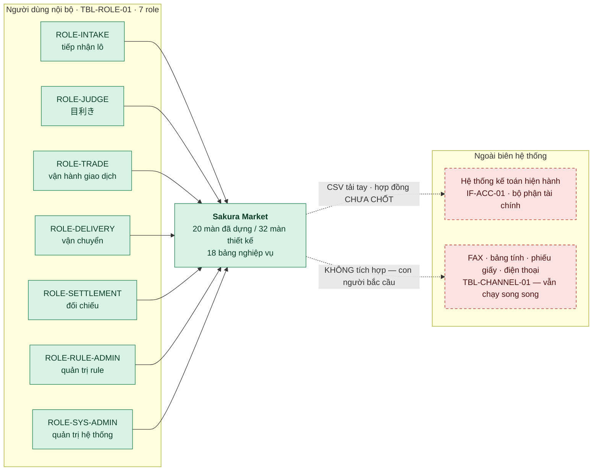
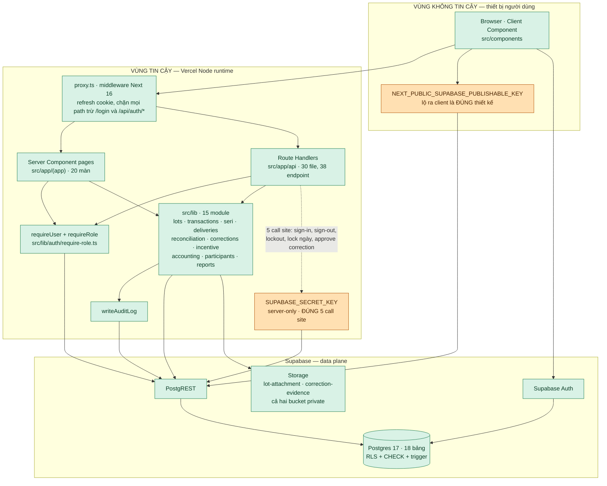
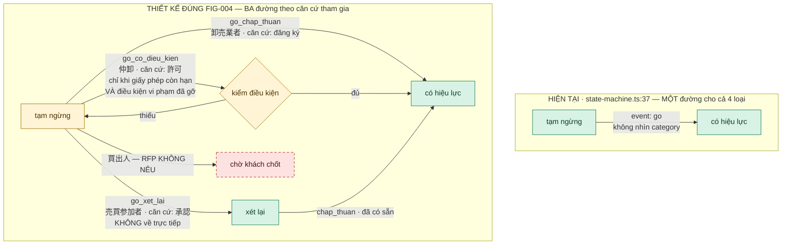
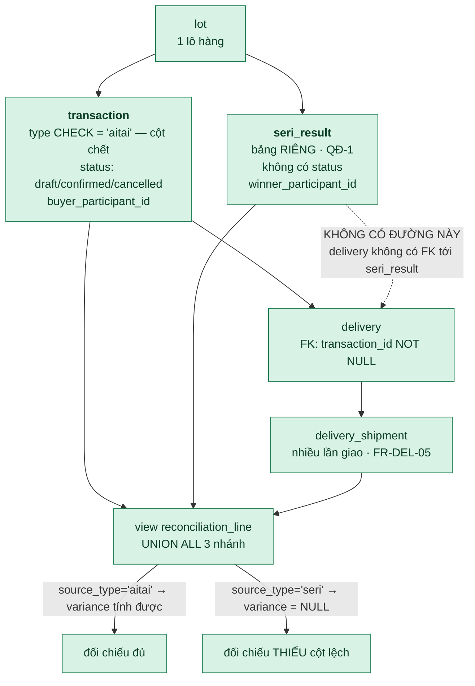
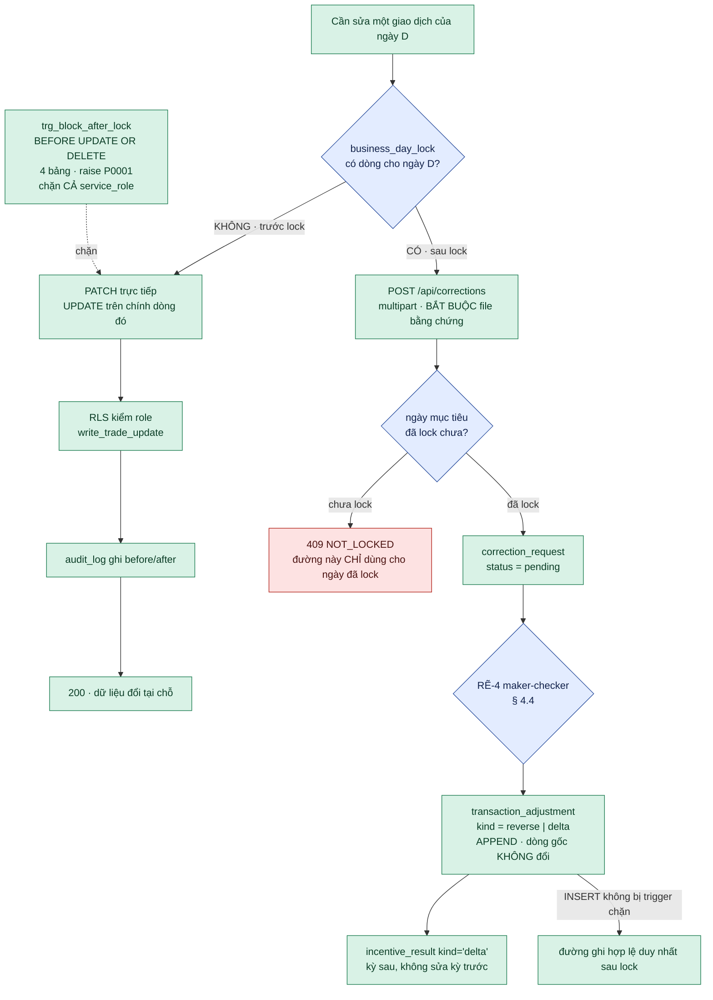
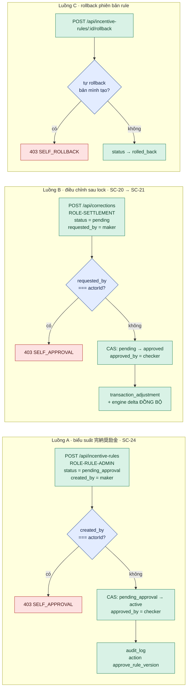
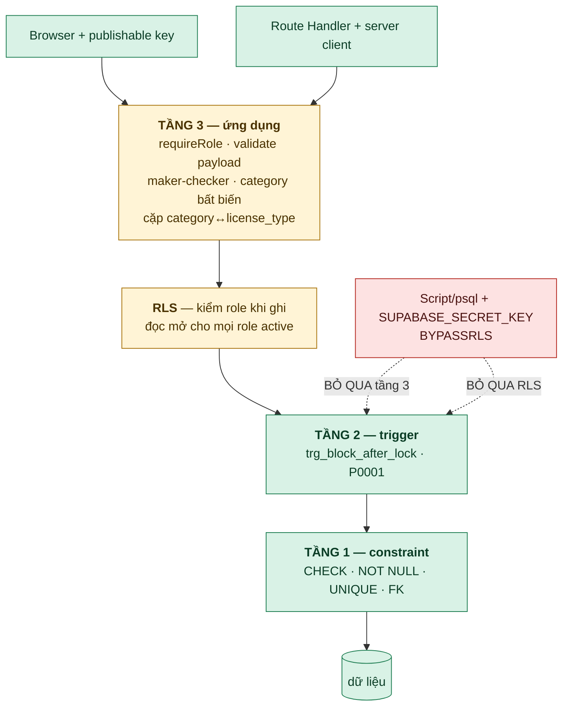
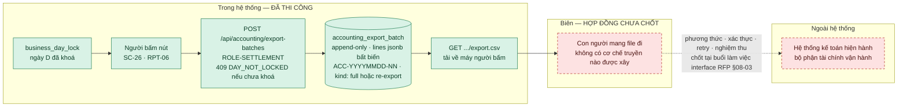

# Thiết kế kiến trúc — LAB-4

Sản phẩm nộp "Architecture design" của LAB-4.

**Quan hệ với `docs/system/architecture.md`:** file đó là bản **mô tả hiện trạng** do rebuild-spec
sinh ra, đối chiếu 1-1 được với code — nó trả lời *"hệ thống có những gì"*. File này trả lời câu
khác: ***"hệ thống rẽ ở đâu, và ràng buộc bị chặn ở tầng nào"***. Hai file không ghi đè nhau; chỗ
nào cần cấu trúc thì file này dẫn sang file kia thay vì chép lại.

**Vì sao tách như vậy:** đề LAB-4 chấm đúng chỗ rẽ — *"kiến trúc phải phản ánh đúng ràng buộc
nghiệp vụ đặc thù của đề, không tổng quát hoá thành thiết kế chung chung"*. Một bản "Next.js +
Supabase, dữ liệu chảy từ UI xuống DB" đúng về cấu trúc nhưng không nói được gì về đề này.

---

## 0. Quy ước đọc

Mọi sơ đồ và mọi bảng trong tài liệu này gắn một trong ba nhãn. Không có ô nào để trống nhãn.

| Nhãn | Nghĩa | Cách xác minh |
|---|---|---|
| **`[ĐÃ THI CÔNG]`** | Có trong repo hôm nay | Dẫn được `file:dòng`, hoặc dẫn `docs/generated/api-map.md` |
| **`[LAB-5]`** | Thiết kế, chưa có code | Đọc được ra task; không được hiểu là "đã có" |
| **`[CHƯA CHỐT]`** | Giả định chờ khách xác nhận | Dẫn `docs/gia-dinh-tich-hop-ke-toan.md` hoặc chỗ RFP để ngỏ |

Trong sơ đồ Mermaid: xanh = `[ĐÃ THI CÔNG]`, vàng = `[LAB-5]`, đỏ nét đứt = `[CHƯA CHỐT]`.

**Ba hệ mã dùng trong tài liệu này:**

- `SC-01..SC-32` — mã màn, khoá chính của LAB-4 (`docs/lab4/00-roster-va-gap.md` § 1).
- `FE-001..FE-045` — mã feature của **Screen List LAB-1**. Cần khai rõ: **`FE-` không phải mã
  trong RFP** — grep toàn bộ RFP không có một chuỗi `FE-0xx` nào. Cột "RFP" trong các bảng dưới
  đây là ánh xạ do LAB-4 lập theo nội dung nghiệp vụ, không phải mã có sẵn.
- `FR-*`, `BR-*`, `FIG-*`, `NFR-*`, `GOV-RULE-01`, `IF-ACC-01` — mã thật trong RFP, dẫn kèm số dòng.

---

## 1. Lớp 1 — Bối cảnh



Ba điều bản bối cảnh này khai mà một sơ đồ chung chung sẽ bỏ:

1. **Không có actor bên ngoài nào gọi vào hệ thống.** 買出人 và 売買参加者 là *dữ liệu* trong bảng
   `participant`, không phải người dùng có tài khoản — cả 7 role đều là người dùng nội bộ
   (`src/lib/auth/role-landing.ts:3-10`). Cổng người tham gia tự tra trạng thái (RFP §02-05 persona 買出人: *"cần thấy rõ trạng thái được phép tham gia"*) nằm ngoài phạm vi vòng này. `[LAB-5]`
2. **IF-ACC-01 là mũi nét đứt, một chiều, đi ra.** Không có webhook, không có callback, không có
   retry. Chi tiết ở § 6.
3. **Kênh cũ chưa tắt.** RFP §02-06 TBL-CHANNEL-01 (dòng 278-286) liệt 5 kênh hiện hành; hệ thống này không tích
   hợp kênh nào trong đó. Nghĩa là trong giai đoạn chạy song song, mọi lệch dữ liệu giữa FAX và hệ
   thống đều do con người phát hiện. Đó là giả định vận hành, không phải chi tiết kỹ thuật.

---

## 2. Lớp 2 — Container và biên tin cậy



Toàn bộ sơ đồ này là `[ĐÃ THI CÔNG]`.

### 2.1 Biên tin cậy — chỗ dễ vẽ sai nhất

Ba khoá, ba vai trò khác nhau. Vẽ lẫn ba khoá này là dạy người đọc sai:

| Biến môi trường | Ở đâu | Bỏ qua RLS? | Ghi chú |
|---|---|---|---|
| `NEXT_PUBLIC_SUPABASE_URL` | client + server | — | Lộ ra là bình thường |
| `NEXT_PUBLIC_SUPABASE_PUBLISHABLE_KEY` | client + server | Không | Lộ ra client là **an toàn và đúng thiết kế** — cái bảo vệ dữ liệu là RLS, không phải sự bí mật của khoá này (`.env.example` ghi đúng lý do đó) |
| `SUPABASE_SECRET_KEY` | **chỉ** server | **Có** — `BYPASSRLS` | `src/lib/supabase/admin.ts` gắn `import "server-only"`; một Client Component import vào là **build fail**, không phải lỗi runtime |

`SUPABASE_SECRET_KEY` không bao giờ xuống client. Cơ chế chặn không phải quy ước code review mà là
compile-time: `server-only` (`package.json:20`) làm bundler báo lỗi khi module bị kéo vào graph của
client. Đúng 5 call site dùng nó (`docs/system/architecture.md:191-196`).

Điểm quan trọng cho § 5: `service_role` bỏ qua RLS, nên **RLS một mình không phải là bảo đảm**. Mọi
ràng buộc nghiệp vụ phải chịu được một Route Handler viết sai đang cầm khoá bí mật.

### 2.2 Chặn vào trang trả 404, không phải 403 — CÓ CHỦ ĐÍCH

`requireRole()` gọi `notFound()`, không render trang forbidden — `src/lib/auth/require-role.ts:72-78`.
Ba tầng chặn, ba mã khác nhau:

| Tình huống | Mã trả | Nơi |
|---|---|---|
| Không có session | `307 → /login?reason=unauthenticated` | `src/proxy.ts` + `src/lib/supabase/proxy.ts` |
| Có session, `app_user` thiếu hoặc `is_active = false` | `307 → /login?reason=inactive` | `require-role.ts:61` |
| Có session, đúng `app_user`, **sai role** | **404** | `require-role.ts:75` |

**Đây không phải bug và LAB-5 không được sinh task "sửa 404 thành 403".** Lý do: 403 nói với người
gọi sai role rằng *"tài nguyên này tồn tại, bạn chỉ không được vào"* — đúng thứ không nên tiết lộ.
Cùng nguyên tắc đã áp cho `POST /api/auth/sign-in`: mật khẩu sai và tài khoản bị vô hiệu hoá trả
**cùng một** `401 invalid_credentials` để không cho dò sự tồn tại tài khoản
(`docs/generated/api-map.md` § Auth).

Một lệch đã ghi vết, không làm mượt: `POST /api/locale` không gọi `requireUser()` — nó vẫn nằm sau
tầng session của `proxy.ts`, nhưng một `app_user` đã bị vô hiệu hoá mà còn session sống thì gọi
được. Tác động thấp (chỉ đặt cookie ngôn ngữ, giá trị bị kiểm chặt `vi`/`ja`), giữ lại như một
quan sát trong `docs/generated/api-map.md` § Locale. `[LAB-5]` thêm `requireUser()` cho endpoint này.

---

## 3. Luồng dữ liệu chính và bốn chỗ rẽ

```mermaid
flowchart LR
  A["Tiếp nhận lô<br/>SC-08 · FR-LOT-01"] --> B["目利き<br/>SC-09 · FR-LOT-02<br/>NGƯỜI quyết định — FIG-008"]
  B --> R1{"RẼ-1<br/>người tham gia<br/>có 許可/承認<br/>còn hiệu lực?"}
  R1 -->|"không"| X1["422 INELIGIBLE_PARTY<br/>FR-PARTY-02"]
  R1 -->|"có"| R2{"RẼ-2<br/>相対取引<br/>hay せり?"}

  R2 -->|"相対取引 · 90%"| C1["transaction<br/>SC-11 SC-12 · FR-AITAI-01"]
  R2 -->|"せり · 10%"| C2["seri_result<br/>bảng RIÊNG<br/>SC-13 SC-14 · FR-SERI-01"]

  C1 --> D["Giao nhận<br/>delivery + delivery_shipment<br/>SC-15 SC-16 · FR-DEL-01 FR-DEL-05"]
  C2 -.->|"KHÔNG có đường giao nhận<br/>xem § 4.2"| D

  D --> E["Đối chiếu ngày<br/>view reconciliation_line<br/>SC-18 · FR-SETTLE-01"]
  C2 --> E
  E --> F["<b>LOCK ngày nghiệp vụ</b><br/>một chiều, không có unlock<br/>FR-SETTLE-02"]

  F --> R3{"RẼ-3<br/>ngày đã lock?"}
  R3 -->|"chưa"| G1["Sửa trực tiếp<br/>PATCH lot / seri_result"]
  R3 -->|"rồi"| G2["correction_request<br/>SC-20 SC-21 · FR-INC-03"]

  G2 --> R4{"RẼ-4<br/>người duyệt<br/>≠ người tạo?"}
  R4 -->|"không"| X2["403 SELF_APPROVAL<br/>GOV-RULE-01"]
  R4 -->|"có"| H["transaction_adjustment<br/>append-only"]

  F --> I["完納奨励金<br/>ĐỒNG BỘ trong request lock<br/>SC-22 · BR-INC-01"]
  H --> I
  I --> J["Báo cáo RPT-01..08<br/>SC-25 SC-26"]
  J --> K["accounting_export_batch<br/>IF-ACC-01 · § 6"]

  classDef built fill:#d9f2e6,stroke:#1e7d52,color:#0b3d26
  classDef fork fill:#e3ecff,stroke:#2f52a0,color:#12224a
  classDef err fill:#fde2e2,stroke:#b3261e,color:#4a1210
  class A,B,C1,C2,D,E,F,G1,G2,H,I,J,K built
  class R1,R2,R3,R4 fork
  class X1,X2 err
```



Toàn bộ hộp vuông là `[ĐÃ THI CÔNG]`. Bốn hình thoi là bốn chỗ rẽ, khai chi tiết ở § 4.

### 3.1 Ràng buộc trung tâm: không có transaction database xuyên bảng

Đây không phải một dòng ghi chú — nó định hình mọi mũi trong sơ đồ trên.

PostgREST không cấp `BEGIN`/`COMMIT` xuyên nhiều lệnh cho client, và stack này không có driver `pg`
thô, không có stored procedure. Hệ quả: **mọi thao tác ghi nhiều bảng đều không nguyên tử.**

| Chỗ | Cách bù | Dẫn chứng |
|---|---|---|
| Trừ `available_qty` khi chốt giao dịch | Compare-and-swap, vòng lặp 25 lần | `src/lib/lots/availability-service.ts:48-110` |
| Ghi `participant.status` + `participant_status_history` + `audit_log` | Ba lệnh tuần tự, không rollback | `src/app/api/participants/[id]/transition/route.ts:63-93`, comment dòng 14-17 nói thẳng |
| `audit_log` sau khi nghiệp vụ đã commit | Không rollback được — mất audit row là mất, nghiệp vụ vẫn xong | `src/lib/audit/write-audit-log.ts:30-51` |
| Engine 完納奨励金 lỗi sau khi lock đã commit | Ghi `audit_log` action `incentive_engine_error`, KHÔNG làm lock thất bại | `src/app/api/reconciliation/[businessDate]/lock/route.ts:17-37` |

Hệ quả thật, không phải lý thuyết: server crash đúng giữa hai lệnh ghi (đã trừ `available_qty`
nhưng chưa ghi được dòng `transaction`) làm cặp dữ liệu lệch tạm thời và **phải dọn bằng tay**
(`docs/pham-vi-va-phan-mock.md:152-160`).

`[LAB-5]` Đưa các cặp ghi này vào một function PL/pgSQL `SECURITY DEFINER` chạy trong một
transaction Postgres thật, gọi qua `.rpc()`. Ưu tiên theo thiệt hại nếu lệch: (1) confirm giao dịch,
(2) transition người tham gia, (3) approve correction.

---

## 4. Điểm phân nhánh logic

Bốn chỗ rẽ. Mỗi tiểu mục có: sơ đồ nhánh · bảng điều kiện rẽ · dẫn chứng RFP · trạng thái thi công.

### 4.1 許可 (giấy phép) vs 承認 (chấp thuận)

**Dẫn chứng RFP.** §02-06 FIG-004 (dòng 288-294) và §02-08 (dòng 309). §02-08 viết nguyên văn:

> *"Đơn vị dự thầu phải tôn trọng sự khác biệt giữa **許可 (giấy phép)** và **承認 (chấp thuận)**.
> **Không được gộp hai căn cứ tham gia này thành một quy tắc chung duy nhất.**"*

FIG-004 tách **ba** cột, không phải một:

| Vai trò | Điều kiện tham gia | Thực hiện giao dịch | Gỡ tạm ngừng |
|---|---|---|---|
| 卸売業者 | Đăng ký chợ | Chấp thuận | **Chấp thuận** |
| 仲卸 | **Giấy phép (許可)** | Chấp thuận | **Có điều kiện** |
| 売買参加者 | **Chấp thuận (承認)** | Chấp thuận | **Xét lại** |
| Đơn vị vận hành chợ | Quản lý | Quản lý | Quản lý |

Cột thứ ba là **ba đường khác nhau**. Đó là chỗ rẽ, và đó là chỗ kiến trúc hiện tại gộp sai.

#### Phần code làm ĐÚNG

`src/lib/participants/category-rules.ts:20-25` ánh xạ category → license_type đúng FIG-004:

| Category | `license_type` | Khớp FIG-004 |
|---|---|---|
| 卸売業者 | `đăng ký` | ✅ "Đăng ký chợ" |
| 仲卸 | `giấy phép` (許可) | ✅ "Giấy phép" |
| 売買参加者 | `chấp thuận` (承認) | ✅ "Chấp thuận" |
| 買出人 | `đăng ký` | ⚠️ FIG-004 **không có dòng** cho 買出人 |

Cặp `(category, license_type)` bị kiểm ở cả API tạo và API sửa
(`isValidCategoryLicensePair()`, `category-rules.ts:32-34`; gọi ở
`src/app/api/participants/[id]/route.ts:7`), và `category` là bất biến — request chỉ cần **có mặt**
key `category` là bị từ chối `422 category_immutable`
(`src/app/api/participants/[id]/route.ts:34-36`). Phần này đạt FR-PARTY-01 (RFP dòng 629:
*"Không được gộp sai các role có bản chất khác nhau"*).

#### Phần code làm SAI — state machine gộp một đường cho cả 4 loại

`src/lib/participants/state-machine.ts:35-41` có đúng 5 cạnh, và cạnh gỡ tạm ngừng là **một cạnh duy
nhất, không nhìn category**:

```ts
// src/lib/participants/state-machine.ts:37
{ from: "tạm ngừng", event: "go", to: "có hiệu lực" },
```

`resolveTarget(from, event)` (dòng 65-71) nhận đúng hai tham số — **không có `category` trong
signature**. Route transition (`src/app/api/participants/[id]/transition/route.ts:45-66`) đọc
`participant` chỉ `select("status")`, không đọc `category`, không đọc `license_type`. Nghĩa là:

> Một 売買参加者 đang tạm ngừng gỡ được về "có hiệu lực" bằng đúng một lời gọi API, y như một
> 卸売業者 — trong khi FIG-004 đòi nó phải qua trạng thái **"xét lại"** trước.

Đây là gộp hai căn cứ tham gia thành một quy tắc chung duy nhất — đúng điều §02-08 cấm. Không phải
"cân nhắc thêm", là **trái nguyên tắc đã ghi trong RFP**.

Thêm một tầng nữa bị hụt: `participant.license_type` khai `text not null` **không có CHECK**
(`supabase/migrations/20260904090100_participant.sql:6`), và comment của bảng tự khai
`"category is immutable after create (enforced by the app layer, not a DB constraint)"`
(cùng file, dòng 14-16). Cả hai ràng buộc đang ở tầng 3 — xem § 5.

#### Thiết kế ĐÚNG theo FIG-004



**Bảng điều kiện rẽ — đây là bảng LAB-5 code trực tiếp từ:**

| Category | Căn cứ tham gia | Event gỡ tạm ngừng | Đích | Điều kiện phải đúng | Trạng thái |
|---|---|---|---|---|---|
| 卸売業者 | đăng ký | `go_chap_thuan` | có hiệu lực | Có bản ghi chấp thuận của đơn vị vận hành | `[LAB-5]` |
| 仲卸 | 許可 giấy phép | `go_co_dieu_kien` | có hiệu lực **hoặc** ở lại tạm ngừng | `valid_to >= todayJst()` **và** điều kiện vi phạm đã gỡ | `[LAB-5]` |
| 売買参加者 | 承認 chấp thuận | `go_xet_lai` | **xét lại** (không phải có hiệu lực) | Không có; bắt buộc đi qua `xét lại` rồi mới `chap_thuan` | `[LAB-5]` |
| 買出人 | đăng ký | **RFP không nêu** | — | — | `[CHƯA CHỐT]` |

**Câu hỏi phải mang ra hỏi khách:** FIG-004 có 4 dòng, nhưng dòng thứ tư là **"Đơn vị vận hành
chợ"** — không phải một trong 4 category người tham gia của FR-PARTY-01 (RFP dòng 629: 卸売業者,
仲卸, 売買参加者, 買出人). Nên FIG-004 phủ 3/4 category, và **買出人 không có đường gỡ tạm ngừng nào
trong RFP**. Code hiện gán 買出人 → `đăng ký`, cùng căn cứ với 卸売業者
(`category-rules.ts:24`), nên đường gỡ *hợp lý nhất* là theo 卸売業者. Nhưng đó là **suy luận của
LAB-4, không phải văn bản RFP** — phải chốt ở buổi làm việc với khách, không code theo suy luận.
`[CHƯA CHỐT]`

**Ba task kiến trúc cho LAB-5:**

1. Thêm `category` vào signature `resolveTarget()`, tách `event: "go"` thành ba event. `TRANSITIONS`
   đổi từ 5 cạnh phẳng sang bảng có chiều category — đây là **thay đổi kiểu dữ liệu**, không phải
   thêm `if`, vì cả UI (`allowedEvents()`, dòng 56-58) và API cùng đọc bảng này.
2. Đưa `license_type` và cặp `(category, license_type)` xuống tầng 1 (§ 5).
3. Đưa tính bất biến của `category` xuống tầng 2 — `CHECK` không tham chiếu được `old`, nên phải là
   trigger `BEFORE UPDATE` raise khi `new.category <> old.category`.

---

### 4.2 相対取引 (aitai) vs せり (seri)

**Dẫn chứng RFP.** Dòng 29: *"**相対取引 là luồng nghiệp vụ chính; せり chỉ là luồng phụ trợ**"*.
Dòng 153-154 cấm coi hệ thống là "auction-only". FIG-009 (dòng 363) và Phụ lục C.5 chốt tỷ trọng
**90/10**; FIG-027 (dòng 1418-1423) cho số ngày mẫu: 706 giao dịch = 636 相対 + 70 せり.
FR-AITAI-01 (dòng 650), FR-SERI-01..03 (dòng 653-655).

**Chỗ rẽ nằm ở tầng dữ liệu, không ở một cột discriminator.** Đây là điểm dễ vẽ sai nhất: hai luồng
này **không phải hai giá trị của `transaction.type`** mà là **hai bảng**.



**Bảng điều kiện rẽ:**

| Chiều so sánh | 相対取引 | せり | Dẫn chứng |
|---|---|---|---|
| Bảng lưu | `transaction` | `seri_result` — bảng riêng | `supabase/migrations/20260904090300_transaction.sql:7,31` |
| Có vòng đời trạng thái? | Có: `draft → confirmed → cancelled` | **Không** — ghi một lần là xong | cùng file, dòng 16 vs 31-41 |
| Cột người mua | `buyer_participant_id` | `winner_participant_id` | dòng 12 vs 34 |
| Role tạo | `ROLE-TRADE` | `ROLE-TRADE` | `docs/generated/api-map.md` § Transactions, § Seri Results |
| Role sửa | `ROLE-TRADE` | **`ROLE-TRADE` + `ROLE-SETTLEMENT`** — endpoint duy nhất trong repo mở cho hai role | `api-map.md` § Seri Results, `PATCH /api/seri-results/:id` |
| Kiểm hiệu lực người tham gia | Có, tại thời điểm confirm | **Không** | `src/lib/transactions/confirm-transaction.ts:72` — không có đối ứng ở `seri-results` |
| Trừ `available_qty` của lô | Có, CAS | **Không** | `confirm-transaction.ts:78` |
| Đường giao nhận | `delivery` → `delivery_shipment` | **KHÔNG CÓ** | `20260904090400_delivery.sql:9` — FK chỉ tới `transaction` |
| `variance` trong bảng đối chiếu | Tính được: `qty - Σ shipment` | `NULL` | `20260904090800_reconciliation_view.sql:15-20` vs `33` |
| Trigger khoá ngày | Có | Có | `20260904090500_business_day_lock.sql:61-67` |

**Hai ràng buộc P0 không được áp cho nhánh せり.** Grep xác nhận: `src/app/api/seri-results/route.ts`
và `src/lib/seri/seri-queries.ts` **không gọi** `checkParticipantEligibility()`, **không gọi**
`reserveLotQty()`. Nghĩa là:

- **FR-PARTY-02** (RFP dòng 630: *"kiểm tra hiệu lực 許可 hoặc 承認 của người tham gia **tại thời
  điểm chốt giao dịch**"*, P0) — một người thắng phiên せり đã **mất hiệu lực** vẫn ghi được kết quả.
- **FR-LOT-03** (RFP dòng 634: *"kiểm tra số lượng khả dụng của lô hàng trước khi cho phép giao dịch
  hoặc giao hàng"*, P0, tiêu chí *"ngăn bán vượt"*) — せり **không trừ `available_qty`**, nên cùng
  một lô bán qua せり rồi bán tiếp qua 相対取引 sẽ **vượt tồn**, và CAS ở nhánh 相対取引 không nhìn
  thấy phần đã bán qua せり.

Đây không phải hệ quả của việc tách bảng — tách bảng vẫn gọi được hai hàm đó. Đây là hai lời gọi bị
bỏ sót. `[LAB-5]` Gọi cả hai trong `POST /api/seri-results`, và đưa "không âm tồn" xuống tầng 1 hoặc
2 (§ 5.1) để không phải nhớ gọi ở mỗi đường bán mới.

**Vì sao tách bảng — và cột chết.** `transaction.type` khai
`type text not null default 'aitai' check (type = 'aitai')` — CHECK ghim **đúng một literal**
(`20260904090300_transaction.sql:10`). Nghĩa là cột đó không bao giờ nhận giá trị khác `'aitai'`:
nó là **cột chết**, giữ lại như dấu vết của thiết kế gốc. Comment của migration nói thẳng lý do
(dòng 1-6): spec gốc của F004 mô tả một discriminator `DISC-001` dùng chung với seri, nhưng
F005/F007/F010 đều coi seri là bảng riêng — 3 phiếu so 1, LAB-3 theo đa số.

Bàn về đúng/sai: **tách bảng là quyết định đúng** cho đề này. `seri_result` không có `status`, không
có `buyer`, không trừ tồn, không kiểm hiệu lực — nhồi nó vào `transaction` với một discriminator sẽ
sinh ra một bảng mà một nửa số cột luôn NULL cho một nửa số dòng, rồi mọi query đều phải nhớ lọc
`type`. Cái giá phải trả là `reconciliation_line` phải `UNION ALL` (`..._view.sql:24,36`) và mọi báo
cáo phải xử lý hai nguồn — giá đó rẻ hơn.

**Nhưng có một lệch thật, và nó không nhỏ.** RFP Phụ lục (dòng 1312) mô tả luồng せり:

> *"Luồng せり: tiếp nhận lô hàng → tổ chức đấu giá → người vận hành xác nhận kết quả cuối cùng
> theo FORM-SERI-01 → ghi nhận người thắng → **cập nhật giao nhận hàng** và đối chiếu theo cùng
> chu kỳ đối chiếu như 相対取引."*

`delivery.transaction_id uuid not null references public.transaction (id)`
(`20260904090400_delivery.sql:9`) — **không có FK tới `seri_result`, và cột là `not null`**. Nên
một người thắng phiên せり **không thể có bản ghi giao nhận nào trong hệ thống**. Kéo theo:
`reconciliation_line` trả `variance = NULL` cho mọi dòng `source_type='seri'`
(`..._view.sql:33`) — không phải vì せり không có lệch, mà vì hệ thống không có dữ liệu để tính.
FR-DEL-01 và FR-DEL-04 (RFP dòng 681, 684) không được đáp ứng cho 10% khối lượng đó.

`[LAB-5]` Hai lựa chọn, phải chốt bằng ADR chứ không chọn im lặng:

- **(a)** `delivery` mang hai FK nullable (`transaction_id`, `seri_result_id`) + CHECK đúng một cái
  khác NULL. Rẻ, nhưng mọi join tới `delivery` phải xử lý hai nhánh.
- **(b)** Bảng `trade_record` làm cha chung, `transaction` và `seri_result` cùng trỏ vào, `delivery`
  trỏ vào cha. Đúng về mô hình, đắt về migration và viết lại query.

Khuyến nghị (a) cho LAB-5: tỷ trọng 10% không nuôi được chi phí của (b), và `reconciliation_line`
vốn đã `UNION ALL` nên đã quen sống với hai nguồn.

---

### 4.3 Trước lock vs sau lock

**Dẫn chứng RFP.** FR-SETTLE-02 (dòng 660): *"Hệ thống phải lock ngày nghiệp vụ và **ngăn sửa trực
tiếp sau khi lock**"* — tiêu chí đạt: *"Sau khi lock, **chỉ còn lại đường điều chỉnh có kiểm
soát**"*. FR-INC-03 (dòng 680): *"**Thay vì âm thầm sửa kết quả đã chốt**, hệ thống phải tạo phần
chênh lệch tiền thưởng ở kỳ tiếp theo"*. FR-LOT-04 (dòng 635) đòi mọi điều chỉnh có
`reason` + chủ thể + before/after. §02-08 (dòng 310) xếp "mở lại kỳ đã chốt" vào nhóm thao tác độ
nhạy cao bắt buộc có dấu vết kiểm toán.

**Cùng một nghiệp vụ, hai đường hoàn toàn khác:**



**Bảng điều kiện rẽ:**

| Chiều | Trước lock | Sau lock |
|---|---|---|
| Cách sửa | `UPDATE` tại chỗ | `INSERT` vào `correction_request` + `transaction_adjustment` |
| Dòng gốc | Bị ghi đè | **Không bao giờ bị chạm** — `20260904090600_correction.sql:16-17` |
| Bằng chứng file | Không bắt buộc | **Bắt buộc** — `422 missing_evidence`, upload vào bucket private `correction-evidence` |
| Người duyệt | Không cần | **Bắt buộc khác người tạo** — § 4.4 |
| Role | Theo bảng: `ROLE-TRADE`, `ROLE-JUDGE`, `ROLE-DELIVERY`, `ROLE-SETTLEMENT` | **Chỉ `ROLE-SETTLEMENT`** |
| Ảnh hưởng 完納奨励金 | Tính lại bình thường ở kỳ đó | `incentive_result` dòng `kind='delta'` ở kỳ sau, `origin_period` trỏ về kỳ cũ |
| Mã lỗi khi đi sai đường | — | Sửa trực tiếp → **423** `LOCKED_BUSINESS_DATE`; tạo correction cho ngày chưa lock → **409** `NOT_LOCKED` |

Cả cột đều `[ĐÃ THI CÔNG]`.

**Cơ chế tách hai đường là trigger, không phải RLS.** Đây là chỗ kiến trúc dễ vẽ sai nhất trong cả
tài liệu:

`trg_block_after_lock` là `BEFORE UPDATE OR DELETE`, trên **đúng 4 bảng** —
`transaction`, `seri_result`, `mekiki_record`, `delivery_shipment`
(`20260904090500_business_day_lock.sql:61-75`), raise `P0001`
(cùng file, dòng 42-46). Route Handler dịch `P0001` thành **HTTP 423** và ghi một
`audit_log` action `locked_write_attempt` (`src/lib/reconciliation/handle-locked-write.ts:25-41`).

Ba điều phải khai kèm, vì thiếu điều nào cũng làm người đọc hiểu sai:

1. **Không có `INSERT` trong trigger.** Cố ý: đường sau-lock hoạt động bằng cách INSERT vào
   `correction_request`/`transaction_adjustment` — nếu trigger chặn cả INSERT thì không còn đường
   nào sau lock (`20260904090600_correction.sql:2-3`).
2. **Đúng 4 bảng, không phải `lot` hay `delivery`.** Hai bảng đó hợp lệ bắc qua nhiều ngày nghiệp
   vụ: một lô nhận ngày đã lock vẫn bán hôm sau; một `delivery` của giao dịch ngày đã lock vẫn
   giao hôm sau. Khoá chúng là đóng băng nghiệp vụ đang chạy, không phải bảo vệ dữ liệu lịch sử
   (`20260904090500_business_day_lock.sql:56-59`). Cái mang `business_date` và bị khoá là
   `delivery_shipment` — từng **lần giao**, thứ thật sự thuộc về một ngày
   (`20260904090400_delivery.sql:33-36`).
3. **Trigger, không phải RLS — và đã có một bug thật đã sửa.** RLS lọc dòng ra khỏi tập ứng viên
   `UPDATE` **trước khi** trigger `BEFORE ROW` chạy, nên bản đầu (điều kiện lock nằm trong `USING`
   của RLS) trả `200 []` — không phân biệt được "đã khoá" với "không có dòng" hay "sai role".
   Fix: bỏ điều kiện lock khỏi RLS hoàn toàn, RLS chỉ giữ kiểm role, lock là việc riêng của trigger
   (`20260904091100_lock_enforcement_fix.sql:12-22`). Cùng migration, fix thứ hai: `BYPASSRLS` của
   `service_role` không kèm quyền schema, nên trigger gọi `private.is_business_day_locked()` bằng
   khoá bí mật trả `42501` thay vì `P0001` — phải `grant usage on schema private to service_role`
   (dòng 9-10). Cả hai bug tìm ra bằng thử thật, không phải đọc code.

**Lock là một chiều.** Không có endpoint unlock ở bất kỳ đâu trong repo
(`docs/generated/api-map.md` § Reconciliation). Sự tồn tại của một dòng trong `business_day_lock`
**chính là** trạng thái "đã khoá"; primary key trên `business_date` chặn race lock đôi bằng một
unique violation (`20260904090500_business_day_lock.sql:18-20`).

---

### 4.4 maker-checker — GOV-RULE-01

**Dẫn chứng RFP.** §11-04 GOV-RULE-01 (dòng 998-1006) và bảng dòng 601:

> *"Thay đổi quy tắc/biểu suất **tối đa 4 lần/năm**, phải có **tách biệt người lập – người phê
> duyệt (maker-checker)**, có **ngày hiệu lực** và **rollback**"* — và *"Thay đổi **không được làm
> biến dạng** dữ liệu đã chốt trước ngày hiệu lực."*

FR-INC-02 (dòng 679) và FR-RULE-01 (dòng 689) cùng trỏ về GOV-RULE-01. FR-AUDIT-01 (dòng 710) đòi
audit cho hành vi phê duyệt.

**Đây là ràng buộc kiến trúc, không phải quy tắc UI.** Ẩn nút "Duyệt" khi người xem là người tạo là
soft guard — gọi thẳng API vẫn qua. Cả hai luồng đều kiểm ở **tầng service**, trước cả CAS:



**Bảng điều kiện rẽ:**

| Luồng | Màn | Bảng | Cột maker | Cột checker | Từ chối | Nơi kiểm |
|---|---|---|---|---|---|---|
| A — biểu suất | SC-24 | `incentive_rule_version` | `created_by` | `approved_by` | `403 SELF_APPROVAL` | `src/lib/incentive/approve-rule-version.ts:30-32` |
| B — điều chỉnh sau lock | SC-20 → SC-21 | `correction_request` | `requested_by` | `approved_by` | `403 SELF_APPROVAL` | `src/lib/corrections/approve-correction.ts:51-52` |
| C — rollback rule | SC-24 | `incentive_rule_version` | `created_by` | — | `403 SELF_ROLLBACK` | `docs/generated/api-map.md` § Incentive Rules |

Ba luồng, cùng một khuôn: **đọc → so người → CAS → audit**. CAS vừa là điểm serialize vừa là chốt
chặn duyệt đôi — `.eq("status", "pending_approval")` trong chính lệnh `UPDATE`
(`approve-rule-version.ts:35-45`), nên hai checker bấm cùng lúc thì người thứ hai nhận
`409 ALREADY_DECIDED`, không phải ghi đè. `[ĐÃ THI CÔNG]`

**Ba khoảng hở phải khai:**

1. **maker-checker ở tầng 3, không phải tầng 1.** Migration tự khai:
   `"maker-checker (BR-003, enforced in the app layer, not a DB constraint -- it compares created_by
   to the caller)"` (`20260904090700_incentive.sql:14-17`). Một script cầm `SUPABASE_SECRET_KEY` gọi
   thẳng PostgREST **tự duyệt được bản mình tạo**. `[LAB-5]` Đưa xuống tầng 1:
   `check (approved_by is null or approved_by <> created_by)` trên cả
   `incentive_rule_version` và `correction_request`. Đây là CHECK trên hai cột cùng dòng, không cần
   trigger — rẻ, và §02-08 xếp "thay đổi quy định" vào nhóm nhạy cảm nhất.
2. **"Tối đa 4 lần/năm" chưa được thực thi ở đâu.** GOV-RULE-01 nói rõ con số; repo không có ràng
   buộc nào đếm số phiên bản trong một năm. `[LAB-5]` Ràng buộc này cần biết "năm" là năm dương
   lịch hay năm tài chính Nhật (bắt đầu 01/04) — RFP không nêu, nên phần "năm" là
   `[CHƯA CHỐT]` còn phần đếm là task LAB-5.
3. **Biểu suất là hằng số trong code, không đọc từ `rate_table`.** `calculateIncentive()` ghim
   `110/100` (`src/lib/incentive/calculate-incentive.ts:15`); `rate_table` được ghi khi tạo phiên
   bản nhưng **engine không bao giờ đọc** — comment của chính nó nói vậy
   (`src/lib/incentive/create-rule-version.ts:24-26`).
   Điều này **đúng theo BR-INC-01** (RFP dòng 598 và §B.5 dòng 1276): hệ số 110/100 do RFP cố định,
   không phải tham số người dùng đổi. Nhưng nó nghĩa là: cái maker-checker đang bảo vệ là **ngày
   hiệu lực và danh tính phiên bản**, không phải con số. Nếu khách muốn đúng CAP-06 (dòng 546:
   *"Quản lý được công thức, biểu suất và ngày áp dụng"*) và FR-INC-02 (*"Quản lý thay đổi mà không
   cần deploy"*), engine phải đọc `rate_table`. Hai điều khoản này căng nhau — BR-INC-01 cố định
   con số, CAP-06 muốn đổi được nó — và LAB-4 **không tự chọn**. `[CHƯA CHỐT]`

Điểm đúng của thiết kế hiện tại: `incentive_result.rule_version_id` là `not null`
(`20260904090700_incentive.sql:26`), nên mọi số tiền đã tính đều truy được về phiên bản đã dùng, và
dòng `kind='delta'` chỉnh kỳ đã chốt bằng cách **thêm dòng ở kỳ sau** với `origin_period` trỏ về kỳ
cũ (dòng 27-35) — đúng yêu cầu *"không được làm biến dạng dữ liệu đã chốt"* của GOV-RULE-01 và
đúng FR-INC-03.

---

## 5. Điểm thực thi ràng buộc — ba tầng

Ba tầng, ánh xạ thẳng lên thành phần của § 2. Câu hỏi duy nhất cho mỗi ràng buộc: **đi thẳng
PostgREST bằng `SUPABASE_SECRET_KEY` có vượt được không?**

```
Tầng 1 — Postgres constraint  -> KHÔNG vượt được, kể cả service_role
Tầng 2 — Trigger              -> KHÔNG vượt được; chặn cả service_role, trả P0001
Tầng 3 — Tầng ứng dụng        -> VƯỢT ĐƯỢC bằng cách gọi thẳng PostgREST
```



### 5.1 Ràng buộc nào đang ở tầng nào

| Ràng buộc | Nguồn RFP | Tầng hiện tại | Dẫn chứng | Nên ở tầng |
|---|---|---|---|---|
| Ngày đã lock không sửa/xoá được | FR-SETTLE-02 | **2** ✅ | `20260904090500_business_day_lock.sql:61-75` | 2 |
| 4 category cố định | FR-PARTY-01 | **1** ✅ | `20260904090100_participant.sql:4` | 1 |
| 4 trạng thái hiệu lực cố định | FIG-010 | **1** ✅ | cùng file, dòng 7-8 | 1 |
| 7 role cố định | TBL-ROLE-01 | **1** ✅ | `core_identity.sql` CHECK, `role-landing.ts:1` | 1 |
| `qty > 0`, `unit_price > 0` | FR-LOT-03 | **1** ✅ | `20260904090300_transaction.sql:13-14` | 1 |
| Một `seri_result` không trùng, `txn_code` duy nhất | §08-05 | **1** ✅ | dòng 9; `unique (delivery_id, seq)` ở delivery | 1 |
| Lock đôi cùng ngày | FR-SETTLE-02 | **1** ✅ | PK trên `business_date` | 1 |
| Không bán vượt tồn lô | FR-LOT-03 | **3** ⚠️ | CAS ở `availability-service.ts:48-110` | 1 hoặc 2 |
| `participant.license_type` chỉ 3 giá trị | FIG-004 | **3** ❌ | `participant.sql:6` — `text not null`, KHÔNG CHECK | **1** |
| Cặp `(category, license_type)` đúng FIG-004 | FIG-004, FR-PARTY-01 | **3** ❌ | `category-rules.ts:32-34` | **1** |
| `category` bất biến sau khi tạo | FR-PARTY-01 | **3** ❌ | `participants/[id]/route.ts:34-36`; comment `participant.sql:14-16` tự khai | **2** (CHECK không thấy `old`) |
| maker-checker ≠ tự duyệt | GOV-RULE-01 | **3** ❌ | `approve-rule-version.ts:30-32` | **1** |
| Tối đa 4 phiên bản rule/năm | GOV-RULE-01 | **không có** ❌ | — | 2 |
| Người tham gia phải còn hiệu lực khi chốt | FR-PARTY-02 | **3** | `confirm-transaction.ts:72` | 3 — chấp nhận được: cần so `business_date` với `valid_from/valid_to`, và `eligibility.ts:19-22` giải thích đúng vì sao không được tin `status` một mình (không có cron flip trạng thái ở `valid_to`) |
| Gỡ tạm ngừng theo 3 đường FIG-004 | FIG-004, §02-08 | **gộp sai** ❌ | `state-machine.ts:37` | 1 (bảng cạnh có chiều category) + 3 |

**Kết luận có thể ra task ngay:** bốn ràng buộc quan trọng nhất của FIG-004 và GOV-RULE-01 —
`license_type`, cặp `(category, license_type)`, `category` bất biến, và maker-checker — **đều đang ở
tầng 3**, tầng duy nhất vượt được. RFP đòi tầng 1 cho mấy điều này: §02-08 xếp chúng vào nhóm không
được gộp và nhóm phải có dấu vết. `[LAB-5]`

### 5.2 Một điều dễ hiểu sai về RLS

RLS trong hệ thống này **chỉ kiểm role khi ghi**; **đọc mở cho mọi `app_user` active** — policy
`read_all_active_users` lặp trên cả 18 bảng (`docs/system/architecture.md:167-170`). Nghĩa là:
phân quyền *xem* nằm ở tầng ứng dụng (`requireRole` → 404), không ở tầng dữ liệu. Một Route Handler
quên gọi `requireRole` sẽ để lộ dữ liệu của bảng đó cho bất kỳ role nào — không có lưới an toàn ở
tầng dưới. Đây là lý do `requireRole` phải gọi ở **cả** Server Component **và** Route Handler, và
repo làm đúng vậy: không có middleware API dùng chung, mỗi handler tự gọi
(`src/app/api/transactions/route.ts:124,134`).

`[LAB-5]` Nếu phạm vi mở rộng ra cổng người tham gia bên ngoài, mô hình "đọc mở" phải đổi thành RLS
theo `participant_id` — đó là thay đổi kiến trúc, không phải thêm một policy.

---

## 6. Điểm tích hợp — IF-ACC-01

**IF-ACC-01 là điểm tích hợp DUY NHẤT của hệ thống này.** Không webhook, không SFTP, không email,
không SMS, không cổng thanh toán, không realtime channel. Xác nhận bằng grep, không phải bằng suy
luận: `docs/generated/api-map.md` § Webhooks / External Calls. Hai lời gọi "trông như bên ngoài"
duy nhất là upload lên Supabase Storage — cùng project Supabase đang chứa Postgres, tức là datastore
của chính ứng dụng, không phải bên thứ ba.



**Cái đã chốt.** RFP §08-03 (dòng 759-767) và §D.2 (dòng 1391-1400) chốt đúng ba điều: dữ liệu là
bảng đối chiếu ngày **sau khi đã lock**; bên nhận là hệ thống kế toán hiện hành; trường tối thiểu là
**ngày nghiệp vụ · người tham gia · tổng tiền · thuế · trạng thái · batch code**. Sáu trường đó đã
có trong `accounting_export_batch` (`20260908090000_accounting_export.sql`). `[ĐÃ THI CÔNG]`

**Cái chưa chốt.** Cũng §08-03: *"Phương thức kết nối, cơ chế xác thực và thủ tục nghiệm thu
interface sẽ được chốt tại **buổi làm việc về interface**"*, và *"Đơn vị dự thầu phải nêu rõ các
giả định và phạm vi đưa vào báo giá baseline"*. Năm giả định đó ở
`docs/gia-dinh-tich-hop-ke-toan.md`; đây là ảnh hưởng **kiến trúc** của từng cái:

| # | Giả định | Ảnh hưởng kiến trúc nếu sai | Nơi sửa |
|---|---|---|---|
| 1 | Thuế 8% (軽減税率), giá 税抜, làm tròn **xuống**, gộp theo **người tham gia/ngày** — không theo dòng | Không đổi kiến trúc, đổi **mọi số** trong mọi bản xuất. RFP không nêu thuế suất, không nêu 税込/税抜, không nêu gộp theo dòng hay theo người | `src/lib/accounting/tax.ts` — `TAX_RATE_BPS`, `TAX_BASIS` |
| 2 | Mỗi lần xuất sinh mã mới; batch cũ bất biến | Câu hỏi thật: bên nhận **thay thế** hay **cộng dồn**? Một ngày có thể xuất lại sau điều chỉnh hậu-lock hợp lệ — với bên nhận cộng dồn, xuất lại đúng nghĩa là **nhân đôi tiền phía kế toán**, và phía này **không có cách nào tự phát hiện**. Cột `kind` (`full`/`re-export`) đã có đúng để bên nhận phân biệt; phần còn lại là **quyết định vận hành**, không phải code | `20260908090000_accounting_export.sql` nếu cần ép 1 batch/ngày |
| 3 | Khoá định danh người tham gia là `uuid` nội bộ + `name` | `participant` **không có cột mã ngoài** nào. Nếu tài chính có mã ERP riêng, họ phải ánh xạ **tay** mỗi lần nhận batch | Thêm cột `external_code` bằng migration MỚI + `build-accounting-lines.ts` |
| 4 | Tải CSV **thủ công** qua UI | Đây là điểm kiến trúc lớn nhất còn để ngỏ: **không có gì chạy không người trực** trong repo (`docs/generated/behavior-logic.md` Headline Finding). Nếu tài chính cần nhận tự động (SFTP/API/lịch chạy) thì phần "tự động hoá xuất dữ liệu" — chính phần **OBJ-01/OBJ-04** kỳ vọng — **chưa có gì được xây** | Chưa có gì để trỏ tới; xây mới sau khi chốt phương thức |
| 5 | Ngưỡng "sắp mất hiệu lực" của RPT-03 = 30 ngày | Không thuộc IF-ACC-01, cùng loại giả định. `SC-07` (FR-PARTY-03) ngoài phạm vi vòng này | `src/lib/reports/queries/rpt-03-participant-eligibility.ts:11` |

**Hệ quả cho OBJ-04.** RFP dòng 337 đặt OBJ-04: thời gian lập báo cáo ngày 90 phút → **≤ 15 phút**.
Không có gì trong repo chạy không người trực, nên OBJ-04 **không được đáp ứng bằng cơ chế tự động
nào** — nó phụ thuộc hoàn toàn vào một người bấm nút rồi tải CSV. Khai như vậy, không khai là "đã
đạt vì xuất nhanh". `[CHƯA CHỐT]`

**Cái không được vẽ.** Không vẽ IF-ACC-01 như một service đã tồn tại, không vẽ mũi hai chiều, không
vẽ retry queue. Chỗ đó là một **khoảng trống có tên**, và tên nó là buổi làm việc interface §08-03.

---

## 7. Ràng buộc phi chức năng theo khung giờ

RFP §02-07 (dòng 297-305) chia ngày làm 5 khung JST. Đây không phải màu sắc bối cảnh — mỗi khung ép
một quyết định kiến trúc khác nhau.

| Khung giờ JST | Hoạt động (RFP §02-07) | **Hệ quả thiết kế** |
|---|---|---|
| **02:00–02:30** | Tiếp nhận lô sáng sớm, mở ngày nghiệp vụ, phân bổ nhân sự | **`business_date` phải tính ở server theo JST, không lấy giờ máy.** 02:00 JST = 17:00 UTC **hôm trước**, nên `new Date().toISOString().slice(0,10)` ghi sai ngày cho **mọi** lô nhận trong khung này. Đó là toàn bộ lý do `todayJst()` tồn tại (`src/lib/db/business-date.ts:1-5,28-30`), không phải cẩn thận thừa. **NFR-USE-01** (dòng 816) đòi luồng nhập lô dùng được **bằng bàn phím** — persona "Nhân viên tiếp nhận" (§02-05, dòng 271-275) thao tác lúc 02:00 sáng, môi trường ẩm ồn, **đang đeo găng tay**. Nên SC-08/SC-09 là màn phải đi hết được bằng Tab + Enter, không phụ thuộc chuột: đó là ràng buộc kiến trúc form, không phải gợi ý UX |
| **02:30–05:00** | **Cao điểm** giao dịch và ghi nhận kết quả | **Không job nền nặng, không maintenance window, không `db push` migration, không rotate khoá trong khung này.** Hôm nay điều này miễn phí vì repo không có job nền nào (`behavior-logic.md` Headline Finding) — nhưng khi LAB-5 thêm queue cho engine 完納奨励金 (§ 8), cửa sổ chạy phải nằm **ngoài** khung này. Đường ghi nóng nhất rơi đúng đây: CAS `reserveLotQty` vòng lặp 25 lần (`availability-service.ts:48-110`) — 25 là hằng số **chưa đo bằng tải thật**, giữ vì đã chạy được ở demo. Với 706 giao dịch/ngày (FIG-027, dòng 1418-1423) dồn vào 2,5 giờ ≈ 4-5 giao dịch/phút trung bình, nhưng contention là chuyện đỉnh, không phải trung bình |
| **05:00–08:00** | Cập nhật giao nhận, **đối chiếu tạm**, xử lý ngoại lệ | Ghi `delivery_shipment` của hôm nay chạy **song song** với đọc bảng đối chiếu cùng ngày. Vì `reconciliation_line` là **view tính on-demand**, không phải bảng vật lý (`20260904090800_reconciliation_view.sql:1-7`), nên không có bước "refresh" nào cần đặt lịch, và không có cửa sổ dữ liệu cũ. Đổi sang materialized view để tối ưu ở LAB-5 sẽ **kéo lại đúng vấn đề refresh window** mà thiết kế hiện tại đang tránh được — nếu làm, phải nêu lý do trong ADR |
| **08:00–10:00** | Chốt giao dịch buổi sáng, tổng hợp báo cáo ngày, xuất dữ liệu đối chiếu | **Đây là khung giờ duy nhất chịu được một request dài — và là lý do engine 完納奨励金 đồng bộ chưa vỡ.** `POST /api/reconciliation/:date/lock` khoá ngày rồi chạy engine **ngay trong cùng request** (`lock/route.ts:57`). Với khối lượng baseline thì request này vẫn trong giới hạn Vercel; nhưng đó là số của một ngày mẫu, không phải trần. Chi tiết ở § 8 |
| **Sau 10:00** | Chỉnh sửa **có phê duyệt**, xác nhận thanh toán, hành chính | Đúng khung giờ của đường sau-lock (§ 4.3). Điểm mạnh của thiết kế: **kiến trúc không cần biết mấy giờ** — thứ tách hai đường là `trg_block_after_lock`, tức là **trạng thái**, không phải đồng hồ. Ràng buộc thời gian đã được dịch thành ràng buộc trạng thái, nên không có bug lệch múi giờ nào ở đây. Nếu LAB-5 thêm "chỉ cho sửa sau 10:00", đó là thêm một nguồn sự thật thứ hai về thời gian — đừng làm |

**Một lệch trong chính RFP, phải khai.** §02-07 và Phụ lục A.1 (dòng 1208-1213) chia khung **không
khớp nhau**: A.1 ghi giao dịch **02:15**–05:00 (không phải 02:30) và đối soát **06:30**–10:00 (không
phải 08:00). Chênh 15-90 phút. Với thiết kế hiện tại chênh đó vô hại — hệ thống không dùng đồng hồ
để phân nhánh (xem dòng "Sau 10:00"). Nhưng nếu LAB-5 đặt bất kỳ cửa sổ theo giờ nào — job nền,
maintenance window, cảnh báo SLA — thì **phải hỏi khách dùng bảng nào**, đừng chọn im lặng.
`[CHƯA CHỐT]`

---

## 8. Quality gate hiện tại

Khai đúng, không tô hồng.

| Cổng | Có? | Lệnh | Ghi chú |
|---|---|---|---|
| Lint | ✅ | `npm run lint` — ESLint 9 + `eslint-config-next` (`package.json:9,27-28`) | |
| Typecheck | ✅ | Đi kèm `npm run build` — TypeScript strict (`tsconfig.json:7`) | Kiểu `Database` sinh từ schema thật: `npm run db:types` (`package.json:12`) |
| Build | ✅ | `npm run build` | Cũng là cổng chặn `server-only`: Client Component import `admin.ts` là **build fail** |
| Script kiểm chạy thật vào DB sống | ✅ | 5 script `scripts/verify-*.mjs` | Chạy vào database đang sống, không mock |
| **Test suite tự động** | ❌ **KHÔNG CÓ** | — | Xem dưới |

**Không có một test tự động nào trong repo.** Không Vitest, không Jest, không Playwright, không
`*.test.ts` — `package.json:22-31` không có test runner nào trong `devDependencies`.

**Đây là miễn trừ có ghi vết, không phải sót.** `docs/pham-vi-va-phan-mock.md:138-147` ghi ba lý do:
đề không chấm test; ngân sách 10h đã căng ở 11h thật; và — lý do kỹ thuật thật —
**phần lõi cần chứng minh nằm ở tầng Postgres**, nên unit test với mock client sẽ không bắt được.
Cụ thể: trigger khoá ngày chặn cả `service_role` và CAS chặn bán vượt tồn đều là hành vi của
database, một mock `SupabaseClient` sẽ trả đúng những gì test giả định và **pass trong khi hệ thống
thật vỡ**. Hai bug ở `20260904091100_lock_enforcement_fix.sql` là bằng chứng: cả hai chỉ lộ ra khi
chạy thật (`P0001` vs `42501`, và `200 []` vs lỗi), không mock nào sinh ra được chúng.

Thay vào đó, mỗi phase LAB-3 chứng minh bằng script chạy vào database đang sống.

**Đề xuất cho LAB-5** — phân theo *thứ mock bắt được* và *thứ chỉ chạy thật mới bắt được*:

| Loại | Phạm vi | Vì sao đúng loại đó |
|---|---|---|
| **Vitest** — unit, không cần DB | `src/lib/**` hàm thuần: `calculate-incentive.ts` (có test vector sẵn trong RFP Phụ lục C, tái hiện đúng ở comment dòng 10-12), `tax.ts`, `qty-math.ts`, `txn-code.ts`, `business-date.ts`, `state-machine.ts`, `category-rules.ts` | Không chạm DB, mock không làm hỏng được ý nghĩa test. `state-machine.ts` và `category-rules.ts` là chỗ § 4.1 sẽ sửa — có test trước thì sửa an toàn |
| **Playwright** — E2E | Luồng đăng nhập (gồm lockout 5 lần/15 phút) + luồng `transaction-confirm` | Hai luồng có nhiều tầng nhất: proxy → gate → eligibility → CAS → audit |
| **Script chạy thật vào DB** — giữ nguyên, mở rộng | Trigger khoá ngày chặn `service_role`; CAS chặn oversell; maker-checker chặn tự duyệt; **và mọi CHECK mới thêm ở § 5** | Không thay bằng unit test được. Đây là loại kiểm phải chạy thật, và LAB-5 nên chạy nó trong CI với một Supabase branch riêng, không phải project demo |

`[LAB-5]` Thứ tự: Vitest trước (rẻ nhất, chặn hồi quy khi sửa § 4.1), rồi mở rộng script kiểm vào
CI, rồi Playwright.

### 8.1 Engine 完納奨励金 chạy ĐỒNG BỘ — divergence kiến trúc

Spec mô tả engine 完納奨励金 như một bước xử lý theo kỳ. Thực tế nó chạy **đồng bộ ngay trong
request khoá/duyệt**, ở hai chỗ:

| Điểm gọi | Trong request nào | Dẫn chứng |
|---|---|---|
| `runIncentiveForPeriod()` | `POST /api/reconciliation/:businessDate/lock` — chạy ngay sau khi lock commit | `src/app/api/reconciliation/[businessDate]/lock/route.ts:17-37,57` |
| `runIncentiveDelta()` | `POST /api/corrections/:id/approve` — chạy ngay sau khi adjustment commit | `src/app/api/corrections/[id]/approve/route.ts:19-30,92` |

**Lý do:** Vercel không có hạ tầng queue trong phạm vi LAB-3
(`docs/pham-vi-va-phan-mock.md:148-151`). Không có cron, không có worker, không có queue ở bất kỳ
đâu trong repo — `behavior-logic.md` Headline Finding xác nhận bằng grep.

**Cách xử lý lỗi đã được thiết kế cẩn thận, không phải bỏ qua:** engine lỗi **không bao giờ** làm
lock hay approve thất bại. Lock là hành động chính và phải xong; engine lỗi chỉ ghi một `audit_log`
action `incentive_engine_error` (`lock/route.ts:23-35`). Đúng lựa chọn — nhưng phải khai hệ quả:
**một khoảng hở audit-visible**, không phải một lần chạy được rollback. Ai đọc `audit_log` mới biết
kỳ đó chưa có kết quả tính.

`[LAB-5]` Ba việc, theo thứ tự:

1. Đo thời gian thật của `POST .../lock` với khối lượng của FIG-027 (706 giao dịch, 352 lô). Ở khung
   08:00–10:00 hiện tại chưa vỡ, nhưng con số đó phải đo, không phải đoán.
2. Nếu vượt ngưỡng: tách engine ra job nền. Cửa sổ chạy **không được** trùng 02:30–05:00 (§ 7).
3. Bổ sung một cơ chế đối soát: báo cáo "kỳ đã lock mà chưa có `incentive_result`" — hôm nay khoảng
   hở này chỉ thấy được nếu có người đi đọc `audit_log`.

**Hai điều nữa cần biết về engine, vì nó ảnh hưởng cách đọc số:**

- Engine đọc từ bảng `payment_record` (`run-incentive-for-period.ts:53-57`) — bảng này **được khai
  là MOCK**: nó do plan LAB-3 thêm, không định nghĩa trong spec F00x nào, vì ALG-002 cần
  `eligible_amount_jpy` và `paid_on_time` mà không spec nào cấp nguồn
  (`20260904090700_incentive.sql:39-42`). Nên số 完納奨励金 hôm nay tính đúng **công thức**
  BR-INC-01, nhưng từ **đầu vào mock**. `[CHƯA CHỐT]`
- Không có phiên bản rule nào phủ kỳ → engine **dừng, không đoán**, ghi `audit_log` action
  `incentive_skipped_no_rule` (`run-incentive-for-period.ts:47-58`). Đúng nguyên tắc FIG-008
  (dòng 323-329): không tự động hoá phần cần phán đoán con người.

---

## 9. Task kiến trúc cho LAB-5 — bảng tổng hợp

Người đọc LAB-5 ra task từ đây mà không cần hỏi lại. Ưu tiên theo thiệt hại nếu để nguyên.

| # | Task | Loại | Từ mục | Vì sao |
|---|---|---|---|---|
| 1 | Tách `event: "go"` thành 3 event theo category; thêm `category` vào `resolveTarget()` | Sửa gộp sai | § 4.1 | §02-08 **cấm** gộp 許可 và 承認 thành một quy tắc chung |
| 2 | CHECK `license_type` + CHECK cặp `(category, license_type)` xuống tầng 1 | Hạ tầng ràng buộc | § 5.1 | Đang ở tầng 3 — vượt được bằng khoá bí mật |
| 3 | Trigger `BEFORE UPDATE` chặn đổi `category` | Hạ tầng ràng buộc | § 5.1 | CHECK không tham chiếu được `old` |
| 4 | CHECK `approved_by <> created_by` trên `incentive_rule_version` và `correction_request` | Hạ tầng ràng buộc | § 4.4 | GOV-RULE-01; hiện chỉ ở tầng ứng dụng |
| 5 | Đường giao nhận cho せり — chọn (a) hai FK nullable hoặc (b) bảng `trade_record` cha, bằng ADR | Sửa thiếu | § 4.2 | RFP dòng 1312 đòi せり cập nhật giao nhận; FR-DEL-01/04 chưa đạt cho 10% khối lượng |
| 5b | Gọi `checkParticipantEligibility()` và `reserveLotQty()` trong `POST /api/seri-results` | Sửa thiếu | § 4.2 | FR-PARTY-02 và FR-LOT-03 (cả hai P0) hiện không được áp cho nhánh せり — せり bán được cho người mất hiệu lực và bán vượt tồn |
| 6 | Function PL/pgSQL cho các cặp ghi nhiều bảng; gọi qua `.rpc()` | Nguyên tử | § 3.1 | Không có transaction xuyên bảng; đang dọn tay khi crash giữa hai lệnh |
| 7 | Đo thời gian `POST .../lock`; nếu vượt, tách engine 完納奨励金 ra job nền — cửa sổ NGOÀI 02:30–05:00 | Hiệu năng | § 7, § 8.1 | Engine đang chạy đồng bộ; ngưỡng chưa đo |
| 8 | Báo cáo đối soát "kỳ đã lock mà chưa có `incentive_result`" | Quan sát | § 8.1 | Khoảng hở engine hiện chỉ thấy qua `audit_log` |
| 9 | Vitest cho `src/lib/**` hàm thuần; Playwright cho login + transaction-confirm; đưa script kiểm DB vào CI | Test | § 8 | Không có test suite nào; task 1-4 sửa vào chỗ nóng, cần lưới trước |
| 10 | Đếm "tối đa 4 phiên bản rule/năm" | Ràng buộc thiếu | § 4.4 | GOV-RULE-01 nêu rõ con số; chưa thực thi ở đâu. Cần chốt "năm" là gì trước |
| 11 | Thêm `requireUser()` cho `POST /api/locale` | Vệ sinh | § 2.2 | Tác động thấp nhưng là lệch đã ghi vết |
| 12 | Nếu mở cổng người tham gia bên ngoài: đổi mô hình "đọc mở" sang RLS theo `participant_id` | Kiến trúc | § 5.2 | Không phải thêm một policy — là thay đổi mô hình đọc |

**Task LAB-5 KHÔNG được sinh:**

- ❌ "Sửa 404 thành 403" — 404 là có chủ đích, § 2.2.
- ❌ "Gộp `transaction` và `seri_result` bằng discriminator" — tách bảng là quyết định đúng, § 4.2.
- ❌ "Cho engine 完納奨励金 đọc `rate_table`" — 110/100 do BR-INC-01 cố định; đổi chỉ khi khách chốt
  CAP-06 thắng BR-INC-01, § 4.4 khoảng hở 3.
- ❌ "Thêm trigger khoá ngày cho `lot` / `delivery` / `accounting_export_batch`" — cả ba đều cố ý
  không có, § 4.3 điểm 2 và `docs/pham-vi-va-phan-mock.md:125-137`.
- ❌ "Materialized view cho `reconciliation_line`" — chỉ khi đo được là cần, và phải nêu trong ADR
  rằng nó kéo lại vấn đề refresh window, § 7.

---

## 10. Danh mục điều khoản RFP đã dẫn

Kiểm tiêu chí "tối thiểu 6 điều khoản/ID yêu cầu RFP". Đếm thật: **40 mục RFP** (42 ID, vì ba
dòng gộp nhiều mã cùng họ). Mỗi dòng dẫn kèm số dòng trong file RFP để đối chiếu được.

| ID / mục RFP | Dòng | Dẫn ở mục |
|---|---|---|
| §02-06 FIG-004 — 許可 vs 承認 | 288-294 | § 4.1 |
| §02-06 TBL-CHANNEL-01 — 5 kênh hiện hành | 278-286 | § 1 |
| §02-07 — 5 khung giờ vận hành JST | 297-305 | § 7 |
| §02-08 — nguyên tắc phân tách trách nhiệm | 307-311 | § 4.1, § 4.3, § 4.4, § 5.1 |
| §02-05 — persona nhân viên tiếp nhận | 269-276 | § 7 |
| §08-03 IF-ACC-01 / DR-SETTLE-01 | 759-767 | § 6 |
| §08-05 — quy tắc chất lượng dữ liệu | 777-782 | § 5.1 |
| §11-04 GOV-RULE-01 | 998-1006 | § 4.4 |
| GOV-RULE-01 (bảng) | 601 | § 4.4 |
| BR-INC-01 | 598, 1276-1287 | § 4.4, § 8.1 |
| FR-PARTY-01 | 629 | § 4.1, § 5.1 |
| FR-PARTY-02 | 630 | § 3, § 5.1 |
| FR-PARTY-03 | 631 | § 6 |
| FR-LOT-01 | 632 | § 3 |
| FR-LOT-02 | 633 | § 3 |
| FR-LOT-03 | 634 | § 3, § 5.1 |
| FR-LOT-04 | 635 | § 4.3 |
| FR-AITAI-01 | 650 | § 4.2 |
| FR-SERI-01 | 653 | § 4.2 |
| FR-SERI-02 | 654 | § 4.2 |
| FR-SERI-03 | 655 | § 4.2 |
| FR-SETTLE-01 | 659 | § 3 |
| FR-SETTLE-02 | 660 | § 4.3, § 5.1 |
| FR-SETTLE-03 | 661 | § 6 (SC-19 ngoài phạm vi) |
| FR-DEL-01 | 681 | § 4.2 |
| FR-DEL-04 | 684 | § 4.2 |
| FR-DEL-05 | 685 | § 4.3 |
| FR-INC-01 / FR-INC-02 / FR-INC-03 | 678-680 | § 4.4 |
| FR-RULE-01 | 689 | § 4.4 |
| FR-AUDIT-01 | 710 | § 4.4, § 3.1 |
| NFR-USE-01 | 816 | § 7 |
| OBJ-01 / OBJ-04 | 334, 337 | § 6 |
| CAP-06 | 546 | § 4.4 |
| FIG-008 — ranh giới phán đoán con người | 323-329 | § 3, § 8.1 |
| FIG-009 / Phụ lục C.5 — tỷ trọng 90/10 | 363, 1360 | § 4.2 |
| FIG-027 — số liệu ngày mẫu 706 giao dịch | 1414-1423 | § 4.2, § 7, § 8.1 |
| §D.2 IF-ACC-01 — trường tối thiểu | 1391-1400 | § 6 |
| Phụ lục A.1 — timeline vận hành | 1206-1213 | § 7 |
| Phụ lục — luồng chuẩn 相対取引 và せり | 1311-1312 | § 4.2 |
| Dòng 29, 153-154 — 相対取引 là luồng chính | 29, 153 | § 4.2 |

---

## Nguồn

**Trong repo (đọc, không sửa):**
`docs/system/architecture.md` · `docs/generated/api-map.md` · `docs/generated/route-list.md` ·
`docs/generated/behavior-logic.md` · `docs/generated/entities.md` ·
`docs/lab4/00-roster-va-gap.md` · `docs/gia-dinh-tich-hop-ke-toan.md` ·
`docs/pham-vi-va-phan-mock.md` · `supabase/migrations/*.sql` (14 file) ·
`src/lib/**` · `src/app/api/**`

**Ngoài repo:**
`RFP_He-thong-ho-tro-nghiep-vu-cho-ban-buon-thuy-san_VI_v1.0.md`

**Không dẫn trong tài liệu này:** giá trị khoá, project ref Supabase, tài khoản/mật khẩu demo —
repo public.
