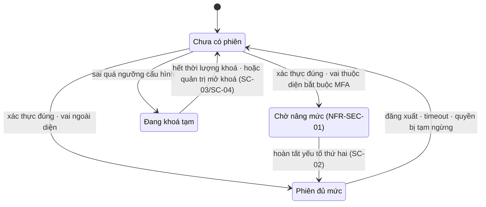

# SC-01 — Đăng nhập · Spec BE

| | |
|---|---|
| FE liên quan | FE-001 (Đăng nhập và gán vai trò) |
| FN | FN-01 (Quản lý danh tính và phân quyền nội bộ) |
| Ưu tiên | P0 |
| Yêu cầu khách | FR-IAM-01, FR-AUDIT-01, NFR-SEC-01, NFR-SEC-03, NFR-SEC-04, NFR-AVL-01, TBL-ROLE-01 |
| Miền dữ liệu | D-PARTY |
| State machine | không có `FIG-*` cho vòng đời phiên — xem §4 |
| Đã thi công | Có |

## 1. Phạm vi backend của màn này

Xác thực người dùng nội bộ, **gán vai trò tại thời điểm đăng nhập**, quyết định khu vực làm việc
đích theo vai trò, và sinh bản ghi log cho 5 sự kiện quanh cổng vào. Là điểm duy nhất đứng **trước**
mọi tầng kiểm quyền, nên cũng là nơi đếm số lần xác thực sai và đặt khoá tạm theo `NFR-SEC-03`.

**Không** làm: cấp/tạm ngừng/mở lại quyền tài khoản (`FR-IAM-02` → SC-03, SC-04); yếu tố xác thực
thứ hai và chính sách timeout (`NFR-SEC-01`/`NFR-SEC-03` → SC-02); tra cứu log (`FR-AUDIT-02` →
SC-30). Màn này **sinh** log, không đọc log.

## 2. Hợp đồng API

### `POST /api/auth/sign-in`

| | |
|---|---|
| Thoả yêu cầu | FE-001 · FR-IAM-01 (RFP:627) · NFR-SEC-03 (RFP:811) |
| Xác thực | không — endpoint công khai, là cổng vào duy nhất |
| Vai trò được gọi | mọi khách, kể cả chưa có phiên |
| Idempotent | không — mỗi lần gọi là một lần thử xác thực và phải được đếm; chống gửi trùng bằng khoá phía client trong một lần mở form, **không** bằng khoá phía server (khoá server sẽ triệt tiêu việc đếm) |

**Request**

| Tham số | Vị trí | Kiểu | Bắt buộc | Ràng buộc | Nguồn yêu cầu |
|---|---|---|---|---|---|
| `identifier` | body | string | có | không rỗng; định danh duy nhất trong danh bạ người dùng nội bộ | FR-IAM-01 |
| `secret` | body | string | có | không rỗng; **không** đi qua đường dẫn, query hay Referer | FR-IAM-01, NFR-SEC-04 |
| `locale` | body | enum | không | `VI` hoặc `JA`; giá trị lạ rơi về mặc định, không sinh lỗi | — (khối 1 wireframe) |

**Server tự quyết — không nhận từ client:** vai trò được gán (đọc từ D-PARTY, **không** nhận từ
body), khu vực làm việc đích, thời điểm sự kiện log, nguồn truy cập, mọi giá trị đếm sai và mốc hết
khoá tạm.

**Response 200:** `landingArea` (string — khu vực làm việc của vai trò được gán) · `role` (enum 7
giá trị `TBL-ROLE-01`) · `stepUpRequired` (boolean — true khi vai trò thuộc diện bắt buộc MFA,
`NFR-SEC-01`; xem §9 Q1). **Không** trả định danh, không trả trạng thái tài khoản.

**Mã lỗi**

| HTTP | Mã nghiệp vụ | Điều kiện phát sinh | Yêu cầu |
|---|---|---|---|
| 400 | `invalid_json` | body không phải JSON hợp lệ | — |
| 400 | `invalid_request` | thiếu `identifier` hoặc thiếu `secret` | FR-IAM-01 |
| 401 | `auth_rejected` | định danh không tồn tại **hoặc** bí mật không đúng **hoặc** quyền tài khoản đã bị tạm ngừng **hoặc** đang trong thời gian khoá tạm | FR-IAM-01 (RFP:627) |
| 500 | `internal_error` | lỗi hạ tầng khi đọc D-PARTY hoặc khi ghi bản ghi log | NFR-AVL-01 |

**Một mã cho bốn điều kiện là có chủ đích** — ngoại lệ duy nhất của quy tắc "mỗi mã một điều kiện":
thiết kế đòi mọi nhánh từ chối không phân biệt được từ bên ngoài, **kể cả qua mã trả về**. Bốn điều
kiện vẫn phải phân biệt **trong bản ghi log** (§7). Câu thông báo cho người dùng thì lệch ở hai ca
*đã tạm ngừng* và *đang khoá tạm* → §9 Q3.

**Tác dụng phụ:** cập nhật giá trị đếm sai và mốc hết khoá tạm trên D-PARTY (đặt lại khi thành
công, tăng khi sai — chỉ khi định danh tồn tại, §5); ghi 1 bản ghi log theo §7.

### `POST /api/auth/sign-out`

| | |
|---|---|
| Thoả yêu cầu | FE-001 · sự kiện log thứ 5 của khối 3 wireframe · NFR-SEC-03 |
| Xác thực | bắt buộc |
| Vai trò được gọi | cả 7 vai trò |
| Idempotent | có — gọi lại khi đã không còn phiên trả 200, không ghi thêm bản ghi log |

**Request:** không có body. **Response 200:** `landingArea` = cổng vào.
**Mã lỗi:** `500 internal_error` — không kết thúc được phiên ở nhà cung cấp xác thực (`NFR-AVL-01`).

**Tác dụng phụ:** kết thúc phiên; ghi bản ghi log **trước** khi kết thúc phiên vì sau đó không còn
biết chủ thể là ai. Phiên kết thúc do timeout (`NFR-SEC-03`) đi cùng `action` này với nguyên nhân
kết thúc khác — xem §7.

## 3. Mô hình dữ liệu màn này chạm

| Thực thể | Cột dùng | Ràng buộc thiết kế đòi | Tầng thực thi | Đã có? |
|---|---|---|---|---|
| Tài khoản nội bộ (D-PARTY, RFP:602) | định danh | duy nhất — FR-IAM-01 | 1 (UNIQUE) | có |
| Tài khoản nội bộ | vai trò | đúng 7 giá trị `TBL-ROLE-01` (RFP:245) | 1 (CHECK) | có |
| Tài khoản nội bộ | trạng thái quyền | chỉ tài khoản đang hoạt động vào được | 3 (tầng ứng dụng) + 2 | có |
| Tài khoản nội bộ | số lần sai liên tiếp, mốc hết khoá tạm | khoá tạm theo ngưỡng **cấu hình** — NFR-SEC-03 | 3 (tầng ứng dụng) | có |
| Tài khoản nội bộ | — | mốc thời gian **từng lần** sai, để đếm theo cửa sổ trượt | 1 (cột mới) | **chưa** — §9 Q2 |
| Vết thao tác (D-PARTY) | chủ thể, loại thao tác, thời điểm | chỉ ghi thêm — FR-AUDIT-01 (RFP:710) | 1 + 3 | có |
| Vết thao tác | nguồn truy cập | sự kiện *xác thực bị từ chối* đòi nguồn truy cập | 1 (cột mới) | **chưa** — §9 Q4 |
| Bí mật xác thực | — | không lưu ở D-PARTY; do nhà cung cấp xác thực giữ | — | có |

Ràng buộc P0 **"chỉ tài khoản đang hoạt động vào được"** dựa vào tầng ứng dụng cộng hàm suy vai trò
ở tầng 2 — chấp nhận được vì đây là cổng công khai, chưa có phiên nào để tầng 2 dựa vào lúc kiểm.

## 4. Vòng đời trạng thái

RFP **không** có `FIG-*` cho vòng đời phiên đăng nhập. Sơ đồ dưới là đề xuất thiết kế theo
RFP §02-08 (RFP:311), dựng từ khối trạng thái của wireframe.

| Từ | Sự kiện | Đến | Guard | Ai được phép | Mã lỗi khi vi phạm |
|---|---|---|---|---|---|
| Chưa có phiên | xác thực | Chờ nâng mức | định danh tồn tại · bí mật đúng · quyền đang hoạt động · không đang khoá tạm · **vai thuộc diện bắt buộc MFA** (§9 Q1) | mọi khách | 401 `auth_rejected` |
| Chưa có phiên | xác thực | Phiên đủ mức | cùng bốn guard trên · vai **ngoài** diện bắt buộc | mọi khách | 401 `auth_rejected` |
| Chưa có phiên | xác thực sai | Đang khoá tạm | số lần sai liên tiếp đạt ngưỡng cấu hình · **và định danh tồn tại** | mọi khách | 401 `auth_rejected` |
| Đang khoá tạm | hết thời lượng | Chưa có phiên | mốc hết khoá đã qua — tự động, không cần thao tác | — | — |
| Đang khoá tạm | mở khoá | Chưa có phiên | thao tác của SC-03/SC-04 | ROLE-SYS-ADMIN | — |
| Chờ nâng mức | hoàn tất yếu tố thứ hai | Phiên đủ mức | thuộc SC-02 | chủ tài khoản | — |
| Phiên đủ mức | đăng xuất / timeout / quyền bị tạm ngừng | Chưa có phiên | ba nguyên nhân khác nhau, cùng một cạnh | chủ tài khoản / hệ thống / ROLE-SYS-ADMIN | — |

Guard dễ mất nhất: **cạnh tới "Đang khoá tạm" có thêm điều kiện "định danh tồn tại"**. Bỏ điều kiện
đó thì người ngoài dò định danh lạ vẫn làm hệ thống tạo trạng thái khoá; giữ nó thì hệ thống **không
có** lớp chặn nào cho việc dò định danh — xem §9 Q5.

## 5. Quy tắc nghiệp vụ

| Mã | Quy tắc (nguyên văn nguồn) | Thực thi ở đâu | Kiểm bằng gì |
|---|---|---|---|
| `FR-IAM-01` (RFP:627) | "Hệ thống phải xác thực người dùng nội bộ và gán vai trò **tại thời điểm đăng nhập**." | vai trò đọc từ D-PARTY trong cùng lượt xử lý xác thực; **không** nhận từ client và **không** suy lúc dựng menu | test: đổi vai trò ở SC-04 giữa hai lần đăng nhập → lần sau vào đúng khu vực mới |
| `FR-IAM-01` nghiệm thu | "Người dùng hợp lệ vào được **đúng** khu vực làm việc, người dùng không hợp lệ bị từ chối, và **có log**" | ánh xạ vai trò → khu vực là hàm thuần ở server, phủ đủ 7 vai `TBL-ROLE-01`; **không** có trang trung gian chọn khu vực | test: 7 vai đăng nhập → 7 khu vực khác nhau; mỗi lần thử sinh đúng 1 bản ghi log |
| `NFR-SEC-03` (RFP:811) | "Session đăng nhập phải có timeout, **khóa tạm khi nhập sai nhiều lần**, và log các hành vi bất thường." | ngưỡng và thời lượng là **giá trị cấu hình**, không cứng trong mã; số cụ thể chưa có nguồn → §9 Q2 | test: sai đúng ngưỡng cấu hình → 401 và trạng thái khoá; đổi cấu hình không cần sửa mã |
| `FR-AUDIT-01` (RFP:710) | "ghi logical audit cho các hành vi: tạo, sửa, phê duyệt, lock và **thay đổi quyền**" | 5 sự kiện của §7; ghi trong cùng biên với thao tác — audit lỗi thì thao tác không được coi là đã xảy ra | test: chặn đường ghi log → xác thực trả 500 và không cấp phiên |
| RFP §02-08 (RFP:310) | "Các thao tác độ nhạy cao như … **lock/unlock tài khoản** … đều cần dấu vết kiểm toán" | sự kiện *tài khoản bị khoá tạm* là bản ghi log bắt buộc, không phải tuỳ chọn | test: đạt ngưỡng sai → có bản ghi log riêng cho lần khoá |
| `NFR-SEC-04` (RFP:812) | "Dữ liệu truyền phải dùng **TLS**." | bí mật xác thực chỉ đi trong body của một phương thức không đặt dữ liệu lên đường dẫn | test: không có giá trị bí mật nào trong log truy cập của tầng vào |

Không có con số nghiệp vụ nào của màn này có nguồn trong RFP → §9 Q2.

## 6. Ma trận phân quyền theo thao tác

| Vai trò | `POST sign-in` | `POST sign-out` | Đọc bảng tài khoản nội bộ |
|---|---|---|---|
| Chưa có phiên | cho phép | 401 (không có phiên) | từ chối |
| Cả 7 vai — ROLE-INTAKE · ROLE-JUDGE · ROLE-TRADE · ROLE-DELIVERY · ROLE-SETTLEMENT · ROLE-RULE-ADMIN · ROLE-SYS-ADMIN | cho phép (đăng nhập lại) | cho phép | **chưa chốt — §9 Q6** |

- **Đọc và ghi khác nhau.** Hai endpoint của màn này không đọc dữ liệu của ai khác, nên chặn ở đây
  là chặn **xác thực**, không phải chặn theo vai trò. Nhưng **phạm vi đọc bảng tài khoản nội bộ**
  vẫn liên quan: định danh và trạng thái khoá của mọi tài khoản là thông tin cá nhân theo RFP §09-06
  (RFP:883). Phạm vi đó là một **đề xuất thiết kế** của bên dự thầu — RFP §02-08 (RFP:311) giao cho
  bên dự thầu "đề xuất cơ chế phân tách quyền và truy vết"; RFP **không** đòi đọc mở. Đề xuất hiện
  hành (đọc rộng cho mọi vai đang hoạt động) đá với RFP §09-06 (RFP:886) → §9 Q6.
- **Chặn vào trang trả 404, không phải 403** — có chủ đích. Quy tắc đó **không áp cho màn này**: cổng
  vào là công khai và phải trả 401 để người dùng biết mình chưa xác thực được.
- Không cần maker-checker. `GOV-RULE-01` (RFP:601) chỉ áp cho thay đổi quy tắc/biểu suất.

## 7. Audit và truy vết

| Thao tác | `action` | Ghi gì (before/after/reason) | Yêu cầu RFP |
|---|---|---|---|
| Xác thực thành công | `login_success` | chủ thể · thời điểm · **vai trò được gán**; before/after = null | FR-IAM-01 (RFP:627), FR-AUDIT-01 (RFP:710) |
| Xác thực bị từ chối | `login_rejected` | **định danh đã dùng** · thời điểm · **nguồn truy cập** · `reason` = nhánh từ chối cụ thể (không tồn tại / sai bí mật / đã tạm ngừng) | NFR-SEC-03 (RFP:811) |
| Tài khoản bị khoá tạm | `login_locked` | chủ thể · thời điểm · **thời điểm hết khoá**; `reason` = đạt ngưỡng cấu hình | RFP §02-08 (RFP:310), NFR-SEC-03 |
| Đăng nhập vào tài khoản đã tạm ngừng | `login_suspended` | chủ thể · thời điểm | FR-IAM-02 (RFP:628) — hệ quả của trạng thái do SC-03 đặt |
| Đăng xuất hoặc phiên kết thúc do timeout | `logout` | chủ thể · thời điểm · **nguyên nhân kết thúc** trong `reason` | NFR-SEC-03 |

Vết thao tác là **chỉ ghi thêm**. Bốn nhánh từ chối trả **cùng một** mã HTTP cho người dùng nhưng
phải phân biệt được **trong `reason`** — nếu không thì `NFR-SEC-03` mất phần "log các hành vi bất
thường" và điều tra sự cố không còn đường vào.

## 8. Phi chức năng áp cho màn này

| Mã | Yêu cầu | Ảnh hưởng thiết kế BE |
|---|---|---|
| `NFR-SEC-03` (RFP:811) | timeout · khoá tạm khi sai nhiều lần · log hành vi bất thường | ba việc, hai nằm ở SC-02 (timeout) và một ở đây (khoá tạm); phần log thì cả hai màn ghi vào cùng một vết |
| `NFR-SEC-01` (RFP:809) | MFA cho tài khoản quản trị và role phê duyệt nội bộ | endpoint phải trả cờ `stepUpRequired`; nếu không thì bước nâng mức của SC-02 bị bỏ qua được từ phía client |
| `NFR-SEC-04` (RFP:812) | TLS cho dữ liệu truyền | áp cho cả hai endpoint; bí mật xác thực không đi qua đường dẫn hay query |
| `NFR-AVL-01` (RFP:804) | 99,5%/tháng trong khung giờ 02:00–10:00 JST | cổng vào là điểm chết đơn nhất của cả hệ thống — mất nó là mất toàn bộ khung giờ nghiệp vụ; đường ghi log không được làm xác thực chậm hơn ngưỡng |
| `NFR-PERF-01` (RFP:807) | tìm kiếm thông thường p95 ≤ 2 giây | áp cho lượt đọc D-PARTY theo định danh — cần chỉ mục trên cột định danh |

## 9. Câu hỏi cho chủ đầu tư

- **Q1 — Vai nào thuộc diện bắt buộc MFA?** `NFR-SEC-01` (RFP:809) nói "tài khoản quản trị và các
  role phê duyệt nội bộ" nhưng **RFP không liệt vai nào có quyền phê duyệt** — `TBL-ROLE-01`
  (RFP:245) chỉ giao *trách nhiệm*, không giao *quyền phê duyệt*. Cần trước khi code vì cờ
  `stepUpRequired` của response phụ thuộc diện này. Chọn hẹp thì `NFR-SEC-01` không thoả; chọn rộng
  thì thao tác hiện trường trong khung giờ 02:00–10:00 JST nặng thêm một bước. **`[CHƯA CHỐT]`** —
  đề xuất của bên dự thầu là ROLE-SYS-ADMIN, ROLE-RULE-ADMIN (checker của `GOV-RULE-01`, RFP:601)
  và ROLE-SETTLEMENT (lock kỳ, `BR-CLOSE-01`), nhưng đây là **suy luận**, không phải điều RFP nói.
- **Q2 — Ngưỡng số lần sai và thời lượng khoá tạm là bao nhiêu, và đếm theo cách nào?**
  `NFR-SEC-03` (RFP:811) đòi "khóa tạm khi nhập sai nhiều lần" nhưng **không định lượng**. Cần
  trước khi code vì hai cách đếm cho hai lược đồ dữ liệu khác nhau: đếm *số lần sai liên tiếp* thì
  đủ hai cột hiện có; đếm theo *cửa sổ thời gian trượt* thì phải thêm nơi lưu mốc từng lần sai
  (§3). Chọn liên tiếp thì người sai rải rác nhiều ngày không bao giờ bị khoá.
- **Q3 — Thông báo từ chối được nói rõ đến đâu?** Khối trạng thái của wireframe đòi hai điều xung
  đột: mọi nhánh từ chối **không phân biệt được từ bên ngoài**, nhưng ca *đã tạm ngừng* phải "nói rõ
  phải liên hệ quản trị" và ca *đang khoá tạm* phải "nêu rõ phải chờ đến khi nào". Nói rõ là thừa
  nhận tài khoản tồn tại. Cần chốt phía nào thắng, và nếu chọn nói rõ thì chọn cho ca nào.
- **Q4 — "Nguồn truy cập" thu thập ở mức nào?** Sự kiện *xác thực bị từ chối* đòi nguồn truy cập
  (§7); địa chỉ mạng là thông tin cá nhân trong phạm vi RFP §09-06 (RFP:883). Phải chốt thu gì, giữ
  bao lâu, ai đọc được — không chốt thì hoặc mất đường điều tra, hoặc thu quá mức so với APPI.
- **Q5 — Có cần lớp chặn theo nguồn truy cập, ngoài lớp chặn theo tài khoản?** Guard ở §4 cố ý không
  đếm lần sai cho định danh không tồn tại, để người ngoài không khoá được tài khoản thật; hệ quả là
  **không có** lớp chặn nào cho việc dò định danh. `NFR-SEC-03` chỉ đòi khoá tạm theo tài khoản, nên
  nếu chủ đầu tư đòi chặn dò thì đây là hạng mục thêm.
- **Q6 — Vai nào được ĐỌC bảng tài khoản nội bộ?** RFP §02-08 (RFP:311) giao cho bên dự thầu **đề
  xuất** cơ chế phân tách quyền; đề xuất hiện hành là đọc rộng cho mọi vai đang hoạt động. RFP
  §09-06 (RFP:886) đòi "kiểm soát truy cập theo vai trò (RBAC) … áp dụng cho thông tin cá nhân"
  **bằng chữ**. Đây **không** phải hai yêu cầu khách chống nhau — đây là **đề xuất của bên dự thầu
  chống một yêu cầu khách**, nên là việc bên dự thầu phải sửa, không phải việc khách phải chọn. Cần
  chốt vai được đọc trước khi SC-03/SC-04 dựng. **`[CHƯA CHỐT]`**.
- **Q7 — Ngôn ngữ chọn ở cổng vào có được ghi nhớ vào tài khoản không?** Nếu có thì cần một cột trên
  D-PARTY và một đường ghi mà cổng công khai được phép gọi; nếu không thì người dùng phải chọn lại ở
  mỗi thiết bị.

## 10. Prototype hiện làm khác gì

| Hạng mục | Thiết kế đòi | Prototype làm | Dẫn chứng | Mức |
|---|---|---|---|---|
| Bước nâng mức phiên | vai thuộc diện bắt buộc MFA phải qua SC-02 trước khi chạm dữ liệu nghiệp vụ — NFR-SEC-01 (RFP:809) | xác thực xong bí mật là vào thẳng khu vực làm việc; không có cờ `stepUpRequired` | `src/app/api/auth/sign-in/route.ts:134`; `src/lib/auth/role-landing.ts:24-32` | khác có chủ đích — hoãn cùng SC-02 |
| Mã trả về của các nhánh từ chối | mọi nhánh không phân biệt được, **kể cả qua mã** | body giống nhau nhưng nhánh *đang khoá* trả 403 còn hai nhánh còn lại trả 401 → suy ra được | `src/app/api/auth/sign-in/route.ts:67,90,105` | khác không chủ đích — **P0** |
| Lý do bị đưa về cổng vào | người bị đẩy về phải biết vì sao (hết phiên / quyền đã tạm ngừng) | chỉ hiện lý do cho ca quyền bị tạm ngừng; ca hết phiên về màn im lặng | `src/lib/supabase/proxy.ts:44` so với `src/components/auth/login-form.tsx:24` | khác không chủ đích |
| Cách đếm lần sai | ngưỡng và thời lượng là **giá trị cấu hình** (§9 Q2) | đếm số lần sai liên tiếp; hai hằng số cố định trong mã, không có cột mốc từng lần sai | `src/lib/auth/lockout.ts:10-19` | cần khách chốt — NFR-SEC-03 không định lượng |
| Log hành vi bất thường | 5 sự kiện của §7, có `reason` phân biệt nhánh và có nguồn truy cập | có 4 `action` quanh cổng vào; **không** có nguồn truy cập và không có dấu hiệu bất thường theo tần suất | `src/app/api/auth/sign-in/route.ts:63,85,101,126` | khác không chủ đích |
| Audit trong cùng biên | audit lỗi thì thao tác không được coi là đã xảy ra — FR-AUDIT-01 (RFP:710) | vết thao tác ghi sau khi nghiệp vụ đã commit và không rollback được | `src/lib/audit/write-audit-log.ts:44-50` | khác không chủ đích |
| Ngôn ngữ ở cổng vào | chọn được VI/JA trước khi đăng nhập (§9 Q7) | không có trường chọn ngôn ngữ trên màn đăng nhập | `src/components/auth/login-form.tsx:61-93` | khác không chủ đích |
| Phạm vi đọc bảng tài khoản | RBAC cho thông tin cá nhân — RFP §09-06 (RFP:886); §9 Q6 | đọc rộng cho mọi vai đang hoạt động; lý do ghi trong migration là `FR-601` — **mã nội bộ của LAB-3, không phải mã yêu cầu của khách** (grep RFP: 0 hit) | `supabase/migrations/20260904090900_rls_core.sql:28-32` | cần khách chốt — ADR-014, trạng thái Đề xuất |
| Gán vai trò tại thời điểm đăng nhập | FR-IAM-01 (RFP:627) | **khớp** — vai trò đọc từ bảng trong cùng lượt xử lý; 7 vai có 7 khu vực đích | `src/lib/auth/role-landing.ts:3-20` | khớp |

## 11. Dẫn chứng

- RFP:245 — `TBL-ROLE-01`, 7 vai trò nội bộ và trách nhiệm · RFP:255 — ROLE-SYS-ADMIN giữ lock/unlock tài khoản
- RFP:310, 311 — §02-08: thao tác độ nhạy cao cần dấu vết; **bên dự thầu đề xuất cơ chế phân tách quyền**
- RFP:602 — `D-PARTY` · RFP:627 — `FR-IAM-01` · RFP:628 — `FR-IAM-02` · RFP:710 — `FR-AUDIT-01`
- RFP:601 — `GOV-RULE-01` (maker-checker, chỉ cho thay đổi rule) · RFP:711 — `FR-AUDIT-02`
- RFP:804, 807, 809, 810, 811, 812 — `NFR-AVL-01`, `NFR-PERF-01`, `NFR-SEC-01`, `SEC-IAM-02`, `NFR-SEC-03`, `NFR-SEC-04`
- RFP:881-888 — §09-06 APPI; **RFP:883** phạm vi thông tin cá nhân; **RFP:886** đòi RBAC bằng chữ
- Feature List `FE-001` · `docs/lab4/wireframes/screens/SC-01-dang-nhap.html` (3 khối thiết kế + 8 thẻ trạng thái)
- `.momorph/specs/SC-01-dang-nhap-scr001-login.csv` — đặc tả UI/FE cặp với bản này
- `docs/lab4/adr/ADR-014-siet-quyen-doc-du-lieu-nhay.md` — §9 Q6, trạng thái **Đề xuất** · `docs/lab4/spec/SC-01-dang-nhap.md` — as-built dùng cho §10
