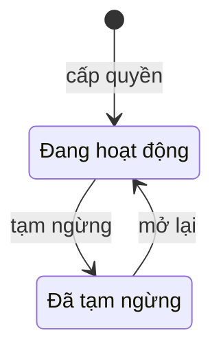

# SC-03 — Danh sách tài khoản · Spec BE

| | |
|---|---|
| FE liên quan | FE-003 (Quản lý tài khoản và quyền) — nửa "cấp · tạm ngừng · mở lại" |
| FN | FN-01 (Quản lý danh tính và phân quyền nội bộ) |
| Ưu tiên | P0 |
| Yêu cầu khách | FR-IAM-02, FR-AUDIT-01, NFR-SEC-01, NFR-SEC-03, NFR-PERF-01, TBL-ROLE-01 |
| Miền dữ liệu | D-PARTY |
| State machine | không có `FIG-*` cho vòng đời quyền tài khoản — xem §4 |
| Đã thi công | Không |

## 1. Phạm vi backend của màn này

Ba chuyển tiếp quyền mà `FR-IAM-02` (RFP:628) đòi — **cấp · tạm ngừng · mở lại** — cộng một danh
sách lọc được để quản trị biết ai đang hoạt động, ai giữ vai trò nào, tài khoản nào đang bị khoá tạm.
Thêm **mở khoá tạm**, thuộc `NFR-SEC-03` (RFP:811) chứ không phải chuyển tiếp quyền, nhưng đặt ở đây
vì cùng actor và cùng dấu vết. Mỗi chuyển tiếp sinh một dòng lịch sử quyền mà SC-04 hiển thị.
**Không** làm: đổi vai trò và hiển thị before/after (→ SC-04, cần trang chi tiết); diện bắt buộc MFA
(→ SC-02); tra cứu vết thao tác (→ SC-30). Là màn bảo mật trong repo công khai nên bản này chỉ đặc tả
yêu cầu và luồng — không cấu hình khoá, không bí mật tài khoản.

## 2. Hợp đồng API

Cả bốn endpoint: **xác thực bắt buộc, phiên đủ mức theo SC-02, vai trò ROLE-SYS-ADMIN**. Sáu vai còn
lại nhận `404 not_found` ở mọi endpoint (`TBL-ROLE-01`, RFP:245); phiên chưa đủ mức nhận
`409 step_up_required` (`NFR-SEC-01`, RFP:809). Hai mã đó không nhắc lại ở từng mục dưới.

### `GET /api/admin/accounts`

| | |
|---|---|
| Thoả yêu cầu | FE-003 · FR-IAM-02 (RFP:628) · NFR-PERF-01 (RFP:807) |
| Idempotent | có — chỉ đọc |

**Request** — bốn bộ lọc tuỳ chọn cộng phân trang.

| Tham số | Vị trí | Kiểu | Bắt buộc | Ràng buộc | Nguồn |
|---|---|---|---|---|---|
| `role` | query | enum | không | một trong 7 vai `TBL-ROLE-01` (RFP:245); **giá trị lạ thì bỏ qua bộ lọc**, không sinh lỗi | FE-003 |
| `permission` | query | enum | không | `đang hoạt động` / `đã tạm ngừng` | FR-IAM-02 |
| `locked` | query | enum | không | `đang khoá` / `không khoá` — **trục độc lập** với `permission` | NFR-SEC-03 |
| `keyword` | query | string | không | khớp một phần trên tên hiển thị và định danh; ký tự cú pháp tìm kiếm phải được xử lý trước khi ghép truy vấn | FE-003 |
| `limit`, `cursor` | query | integer, string | không | ngưỡng `limit` chưa có nguồn — §9 Q5 | NFR-PERF-01 |

**Response 200:** `items[]` gồm `accountId` · `displayName` · `identifier` · `role` · `permission` ·
`lockState` · `factorStatus` (§9 Q2) · `grantedAt` · `lastPermissionChange` (thời điểm + chủ thể của
dòng lịch sử mới nhất) · `availableActions[]`; kèm `nextCursor`.
**Mã lỗi riêng:** `500 internal_error` — không đọc được D-PARTY. **Tác dụng phụ:** không ghi gì;
`lastPermissionChange` đọc từ bảng lịch sử quyền, mà bảng đó **chưa tồn tại** (§3).

### `POST /api/admin/accounts`

| | |
|---|---|
| Thoả yêu cầu | FE-003 · FR-IAM-02 (RFP:628) chuyển tiếp *Cấp quyền* |
| Idempotent | không — chống gửi trùng bằng ràng buộc **duy nhất** trên định danh, không bằng khoá phía client |

**Request:** `identifier` (body, string, **có** — chưa tồn tại trong danh bạ) · `displayName` (body,
string, không) · `role` (body, enum 7 giá trị `TBL-ROLE-01`, **có**) · `reason` (body, string,
**có** — mức bắt buộc này **suy từ `FR-AUDIT-01`** (RFP:710); `FR-IAM-02` không đòi lý do, §9 Q1).
**Server tự quyết — không nhận từ client:** `accountId`, trạng thái quyền ban đầu (`đang hoạt động`),
`grantedAt`, chủ thể và thời điểm của dòng lịch sử, mọi giá trị đếm sai.
**Response 201:** `accountId` · `role` · `permission` · `grantedAt`.

| HTTP | Mã nghiệp vụ | Điều kiện phát sinh | Yêu cầu |
|---|---|---|---|
| 409 | `identifier_taken` | định danh đã có tài khoản | FR-IAM-01 (RFP:627) |
| 422 | `role_invalid` | `role` không thuộc 7 giá trị `TBL-ROLE-01` | TBL-ROLE-01 (RFP:245) |
| 422 | `reason_required` | `reason` rỗng sau khi bỏ khoảng trắng | FR-AUDIT-01 (RFP:710) |
| 500 | `identity_provisioning_failed` | ghi được một trong ba nơi nhưng không ghi được nơi còn lại | FR-IAM-01 |

**Tác dụng phụ:** 1 bản ghi D-PARTY + 1 mục trong danh bạ xác thực + 1 dòng lịch sử quyền loại
`cấp quyền` + 1 vết thao tác (§7). **Ba nơi ghi phải cùng thành công hoặc cùng không** — §9 Q3.

### `PATCH /api/admin/accounts/{accountId}/permission`

| | |
|---|---|
| Thoả yêu cầu | FE-003 · FR-IAM-02 chuyển tiếp *Tạm ngừng* và *Mở lại* |
| Idempotent | không — gọi lại khi đã ở trạng thái đích trả 409, không ghi thêm dòng lịch sử |

**Request:** `accountId` (path) · `permission` (body, enum `đang hoạt động` / `đã tạm ngừng`, có) ·
`expectedPermission` (body, enum, có — giá trị màn đã đọc, dùng để so trước khi ghi) · `reason`
(body, string, có). **Response 200:** `accountId` · `permission` mới · `historyEntryId`.

| HTTP | Mã nghiệp vụ | Điều kiện phát sinh | Yêu cầu |
|---|---|---|---|
| 404 | `not_found` | `accountId` không tồn tại — **cùng mã** với ca thiếu quyền, có chủ đích | TBL-ROLE-01 |
| 409 | `permission_conflict` | trạng thái hiện tại khác `expectedPermission` — người khác đã đổi sau khi màn đọc | FR-IAM-02 (RFP:628) |
| 409 | `already_in_state` | `permission` yêu cầu trùng trạng thái hiện tại — không có chuyển tiếp nào để ghi | FR-IAM-02 |
| 409 | `self_suspend_blocked` | chủ thể tự tạm ngừng chính mình | RFP §02-08 (RFP:310) |
| 409 | `last_admin_blocked` | tạm ngừng tài khoản ROLE-SYS-ADMIN **đang hoạt động cuối cùng** | RFP §02-08 (RFP:310) |
| 422 | `reason_required` | `reason` rỗng sau khi bỏ khoảng trắng | FR-AUDIT-01 |

**Tác dụng phụ:** đổi trạng thái quyền trên D-PARTY + 1 dòng lịch sử loại `tạm ngừng` hoặc `mở lại` +
1 vết thao tác. Tài khoản bị tạm ngừng đang có phiên sống thì phiên mất hiệu lực ở lần điều hướng kế tiếp và người dùng bị đẩy về SC-01 kèm lý do — §9 Q6.

### `POST /api/admin/accounts/{accountId}/unlock`

| | |
|---|---|
| Thoả yêu cầu | FE-003 · NFR-SEC-03 (RFP:811) · RFP §02-08 (RFP:310) |
| Idempotent | không — gọi lại khi tài khoản không còn bị khoá trả 409 |

**Request:** `accountId` (path) · `reason` (body, string — bắt buộc hay không là §9 Q1).
**Response 200:** `accountId` · `lockState` = không khoá. **Mã lỗi riêng:** `404 not_found` —
`accountId` không tồn tại · `409 not_locked` — tài khoản không đang trong thời gian khoá tạm.
**Tác dụng phụ:** đặt lại giá trị đếm sai và mốc hết khoá + 1 dòng lịch sử loại `mở khoá tạm` + 1 vết
thao tác. **Không** đổi trạng thái quyền — hai trục độc lập (§4).

## 3. Mô hình dữ liệu màn này chạm

| Thực thể | Cột dùng | Ràng buộc thiết kế đòi | Tầng thực thi | Đã có? |
|---|---|---|---|---|
| Tài khoản nội bộ (D-PARTY, RFP:602) | định danh | duy nhất — nền của `identifier_taken` | 1 (UNIQUE) | có |
| Tài khoản nội bộ | vai trò | đúng 7 giá trị `TBL-ROLE-01` (RFP:245) | 1 (CHECK) | có |
| Tài khoản nội bộ | trạng thái quyền, tên hiển thị, thời điểm cấp | trạng thái quyền chỉ đổi qua ba chuyển tiếp §4 | 1 + 3 | có |
| Tài khoản nội bộ | số lần sai, mốc hết khoá tạm | trục **độc lập** với trạng thái quyền | 3 | có |
| Tài khoản nội bộ | — | **không** cho phép 0 tài khoản ROLE-SYS-ADMIN đang hoạt động | 2 (trigger) | **chưa** |
| Bảng lịch sử quyền (D-PARTY) | vai trò từ/đến, quyền từ/đến, loại thay đổi, lý do, chủ thể, thời điểm | 1 dòng cho mỗi chuyển tiếp; **chỉ ghi thêm** — FR-IAM-02 (RFP:628) | 1 (bảng mới) + 2 | **chưa** — DDL đề xuất ở SC-04 §3 |
| Vết thao tác (D-PARTY) | chủ thể, loại thao tác, before/after, lý do, thời điểm | chỉ ghi thêm — FR-AUDIT-01 (RFP:710) | 1 + 3 | có |

Ràng buộc P0 **"không được còn 0 tài khoản quản trị đang hoạt động"** thiết kế đòi ở **tầng 2** — tầng 3 không chặn được hai quản trị tạm ngừng nhau **đồng thời**.

## 4. Vòng đời trạng thái

RFP không có `FIG-*` cho vòng đời quyền tài khoản; sơ đồ dưới dựng từ ba chuyển tiếp `FR-IAM-02`
(RFP:628) theo RFP §02-08 (RFP:311).

| Từ | Sự kiện | Đến | Guard | Ai được phép | Mã lỗi khi vi phạm |
|---|---|---|---|---|---|
| — | cấp quyền | Đang hoạt động | định danh chưa có tài khoản · `role` thuộc 7 giá trị · có lý do | ROLE-SYS-ADMIN | 409 `identifier_taken` · 422 `role_invalid` · 422 `reason_required` |
| Đang hoạt động | tạm ngừng | Đã tạm ngừng | không phải chính mình · **không phải quản trị đang hoạt động cuối cùng** · trạng thái chưa bị người khác đổi · có lý do | ROLE-SYS-ADMIN | 409 `self_suspend_blocked` · 409 `last_admin_blocked` · 409 `permission_conflict` · 422 `reason_required` |
| Đã tạm ngừng | mở lại | Đang hoạt động | trạng thái chưa bị người khác đổi · có lý do | ROLE-SYS-ADMIN | 409 `permission_conflict` · 422 `reason_required` |
| (mọi trạng thái) | khoá tạm / mở khoá tạm | *không đổi trạng thái quyền* | khoá: số lần sai đạt ngưỡng cấu hình, sinh ở SC-01/SC-02 · mở khoá: đang trong thời gian khoá tạm | hệ thống / ROLE-SYS-ADMIN | 409 `not_locked` |

**Guard dễ mất nhất không nằm trên cạnh.** Khoá tạm **không** phải một trạng thái của vòng đời trên:
nó do `NFR-SEC-03` sinh và tự hết theo thời gian, nên một tài khoản *đang hoạt động* vẫn có thể *đang
bị khoá tạm* — gộp hai trục vào một cột là mất khả năng đọc đúng tình trạng và làm bộ lọc `locked`
vô nghĩa. Guard thứ hai: hai cạnh *tạm ngừng* và *mở lại* đòi so trạng thái cũ trước khi ghi, và
không có cột phiên bản nên `expectedPermission` là cách duy nhất chặn ghi đè mù.

## 5. Quy tắc nghiệp vụ

| Mã | Quy tắc (nguyên văn nguồn) | Thực thi ở đâu | Kiểm bằng gì |
|---|---|---|---|
| `FR-IAM-02` (RFP:628) | "cho phép **cấp, tạm ngừng, mở lại** quyền tài khoản và ghi nhận lịch sử thay đổi" | ba endpoint ghi của §2, mỗi cái đúng một cạnh §4 | test: ba chuyển tiếp chạy được; cạnh không tồn tại trả 409 |
| `FR-IAM-02` nghiệm thu | "Mọi thay đổi quyền đều có **before/after**, chủ thể thực hiện và **timestamp**" | mỗi endpoint ghi sinh đúng 1 dòng lịch sử mang cặp trước/sau; đọc giá trị cũ **trước** khi ghi | test: sau mỗi chuyển tiếp SC-04 hiển thị đủ 3 thứ; không có ca đổi mà thiếu dòng |
| `FR-AUDIT-01` (RFP:710) | "truy được chủ thể thực hiện, timestamp, before/after và **lý do**" | `reason` bắt buộc cho ba chuyển tiếp — **mức này suy từ `FR-AUDIT-01`, không phải từ `FR-IAM-02`** (§9 Q1) | test: `reason` rỗng → 422 và không ghi gì |
| `TBL-ROLE-01` (RFP:255) · RFP §02-08 (RFP:310) | ROLE-SYS-ADMIN "Quản lý **tài khoản, quyền**, log vận hành"; nhạy "Cấp quyền đặc biệt, **lock/unlock tài khoản**" · "lock/unlock tài khoản … đều cần dấu vết kiểm toán" | cả bốn endpoint chỉ mở cho ROLE-SYS-ADMIN; mở khoá tạm sinh dòng lịch sử **cùng bảng** với thay đổi quyền để người kiểm chỉ đọc một dòng thời gian | test: 6 vai gọi từng endpoint → 404; mở khoá tạm → có dòng loại `mở khoá tạm` |

Không có con số nghiệp vụ nào của màn này có nguồn trong RFP — ngưỡng `limit`, độ dài `keyword` và `reason` → §9 Q5.

## 6. Ma trận phân quyền theo thao tác

| Vai trò | `GET accounts` | `POST accounts` | `PATCH permission` | `POST unlock` | **Đọc** bảng tài khoản qua tầng dữ liệu |
|---|---|---|---|---|---|
| ROLE-SYS-ADMIN | cho phép | cho phép | cho phép | cho phép | cho phép |
| 6 vai còn lại — ROLE-INTAKE · ROLE-JUDGE · ROLE-TRADE · ROLE-DELIVERY · ROLE-SETTLEMENT · ROLE-RULE-ADMIN | 404 | 404 | 404 | 404 | **`[CHƯA CHỐT]`** — §9 Q7 |

- **Đọc và ghi khác nhau, và ở màn này đó là chỗ nguy hiểm nhất.** Cột cuối là **đề xuất thiết kế**
  của bên dự thầu, không phải yêu cầu khách — RFP §02-08 (RFP:311) giao cho bên dự thầu "đề xuất cơ
  chế phân tách quyền và truy vết". Đề xuất hiện hành cho **mọi vai đang hoạt động đọc** bảng tài
  khoản, nên **404 ở tầng route là toàn bộ lớp chắn của màn này**: một vai bất kỳ đã đăng nhập gọi
  thẳng tầng dữ liệu vẫn đọc được định danh, vai trò và trạng thái khoá của mọi tài khoản — thông tin
  cá nhân theo RFP §09-06 (RFP:883), mà RFP:886 đòi RBAC **bằng chữ**. Đây **không** phải hai yêu cầu
  khách chống nhau mà là **đề xuất của bên dự thầu chống một yêu cầu khách**: việc ta phải sửa.
- **Chặn vào trang trả 404, không phải 403** — có chủ đích, không lộ sự tồn tại của màn quản trị tài
  khoản. Áp cả cho endpoint ghi, và ca `accountId` không tồn tại dùng cùng mã.
- **Không** cần maker-checker (`GOV-RULE-01`, RFP:601, chỉ áp cho rule). Nhưng hai guard
  `self_suspend_blocked` và `last_admin_blocked` là ràng buộc **riêng**: chúng so *chủ thể* với *đối
  tượng* và so *số lượng còn lại*, không suy ra được từ vai trò, nên phải thực thi ở đường ghi.

## 7. Audit và truy vết

| Thao tác | `action` | Ghi gì (before/after/reason) | Yêu cầu RFP |
|---|---|---|---|
| Cấp quyền | `account_granted` | `before` = null · `after` = vai trò + trạng thái quyền · `reason` · chủ thể · thời điểm | FR-IAM-02 (RFP:628), FR-AUDIT-01 (RFP:710) |
| Tạm ngừng / Mở lại | `account_suspended` / `account_reactivated` | cặp trước/sau của **vai trò + trạng thái quyền** · `reason` · chủ thể · thời điểm | FR-IAM-02 |
| Mở khoá tạm | `account_unlocked` | `before` = mốc hết khoá cũ · `after` = không khoá · `reason` nếu có | RFP §02-08 (RFP:310) |
| Bị chặn vì thiếu quyền | `denied_write_attempt` | chủ thể · vai · endpoint — lần gọi bị 404 vì thiếu quyền vẫn phải vào log | NFR-SEC-03 (RFP:811) |

**Hai vết ghi, không thay nhau.** Bảng lịch sử quyền (§3) là nơi SC-04 đọc để hiển thị before/after;
vết thao tác chung là nơi SC-30 tra cứu. Một thao tác ghi vào **cả hai**, cả hai chỉ ghi thêm, và
ghi phải nằm cùng biên với thao tác nghiệp vụ — nếu không thì sinh đúng ca `FR-IAM-02` cấm.

## 8. Phi chức năng áp cho màn này

| Mã | Yêu cầu | Ảnh hưởng thiết kế BE |
|---|---|---|
| `NFR-PERF-01` (RFP:807) | tìm kiếm thông thường **p95 ≤ 2 giây** với tải baseline | `keyword` khớp một phần trên hai cột → cần chỉ mục phù hợp và ngưỡng `limit`; `lastPermissionChange` phải lấy bằng một lượt đọc, không phải một truy vấn cho mỗi dòng |
| `NFR-SEC-01` (RFP:809) · `NFR-SEC-03` (RFP:811) | MFA cho tài khoản quản trị · khoá tạm và log hành vi bất thường | ROLE-SYS-ADMIN thuộc diện bắt buộc → mọi endpoint đòi phiên đủ mức, và `factorStatus` từng dòng phụ thuộc SC-02 (§9 Q2); trục khoá tạm cùng endpoint `unlock`; lần gọi bị 404 vì thiếu quyền phải vào log (§7) |
| `DR-RET-01` (RFP:813) · `NFR-AVL-01` (RFP:804) | dữ liệu nghiệp vụ tra cứu online lưu **7 năm** · 99,5%/tháng trong khung giờ 02:00–10:00 JST | không nói rõ vết phân quyền thuộc diện 7 năm (§9 Q8); màn quản trị không nằm trên đường nóng nhưng `unlock` thì có — tài khoản hiện trường bị khoá lúc 02:30 phải mở được ngay |

## 9. Câu hỏi cho chủ đầu tư

- **Q1 — `reason` có bắt buộc cho mọi thay đổi quyền, và cho `unlock` thì sao?** `FR-IAM-02` (RFP:628)
  chỉ đòi before/after, chủ thể và timestamp — **không đòi lý do**; mức "bắt buộc" ở §2 suy từ
  `FR-AUDIT-01` (RFP:710). Cần trước khi code vì nó là ràng buộc **không rỗng** trên bảng lịch sử:
  không bắt buộc thì lịch sử mất phần "vì sao"; bắt buộc thì `unlock` thường ngày thành nặng tay.
- **Q2 — Cột `factorStatus` lấy nguồn ở đâu trước khi SC-02 dựng?** Ba giá trị cần **diện bắt buộc MFA
  đã chốt**, mà diện đó còn `[CHƯA CHỐT]` vì RFP không liệt vai nào có quyền phê duyệt (SC-02 §9 Q1).
  Bỏ cột thì mất đường kiểm tuân thủ `NFR-SEC-01`; giữ cột rỗng thì danh sách nói dối.
- **Q3 — Cấp tài khoản chạm ba nơi ghi; chấp nhận cơ chế nào để cả ba cùng thành công?** Không có cơ
  chế thì tồn tại ca tài khoản đăng nhập được mà không có bản ghi quyền — vào được hệ thống nhưng
  không đọc được gì. **Q4 kèm theo: bí mật xác thực ban đầu phát qua kênh nào?** Thiết kế cố ý không
  vẽ, và không có kênh thì không cấp được tài khoản — cùng khoảng trống hạ tầng thông báo SC-28/29.
- **Q5 — Ba con số chưa có nguồn:** số dòng mỗi trang (`limit`), độ dài tối đa của `keyword`, độ dài
  tối đa của `reason`. `NFR-PERF-01` (RFP:807) chỉ đặt ngưỡng **thời gian**; và `reason` vào bảng chỉ
  ghi thêm nên một dòng lý do dài vô hạn không sửa được về sau.
- **Q6 — Tạm ngừng một tài khoản đang có phiên sống thì phiên chấm dứt ngay hay ở lần điều hướng kế
  tiếp?** Chấm dứt ngay thì cần đường thu hồi phiên ở nhà cung cấp xác thực — hạng mục thêm.
- **Q7 — Vai nào được ĐỌC bảng tài khoản nội bộ? `[CHƯA CHỐT]`** Đề xuất hiện hành (đọc rộng cho mọi
  vai đang hoạt động) là **quyết định thiết kế của bên dự thầu** theo RFP §02-08 (RFP:311), và nó đá
  với RFP §09-06 (RFP:886) đòi RBAC cho thông tin cá nhân bằng chữ. Cần chốt **trước** khi màn này
  dựng, vì 404 ở tầng route không che được dữ liệu (§6). **Q8 kèm theo: thời hạn lưu vết phân quyền?**
  `DR-RET-01` (RFP:813) nêu 7 năm cho "dữ liệu nghiệp vụ tra cứu online", không nói rõ vết phân quyền
  thuộc diện đó.

## 10. Prototype hiện làm khác gì

| Hạng mục | Thiết kế đòi | Prototype làm | Dẫn chứng | Mức |
|---|---|---|---|---|
| Toàn bộ màn | ba chuyển tiếp quyền qua màn quản trị — FR-IAM-02 (RFP:628) | không có màn và không có endpoint nào; tài khoản cấp một lần bằng script nạp dữ liệu mẫu | `docs/pham-vi-va-phan-mock.md:76` | khác có chủ đích — hoãn cùng quyết định với MFA (SC-02), lý do là **phạm vi prototype** |
| Bảng lịch sử quyền | 1 dòng cho mỗi chuyển tiếp, chỉ ghi thêm (§3) | chưa có bảng nào lưu lịch sử quyền tài khoản nội bộ | `supabase/migrations/20260904090000_core_identity.sql:7-21` | khác có chủ đích — xem SC-04 |
| Chặn 0 quản trị đang hoạt động · mở khoá tạm | tầng 2 (trigger) — §3 · endpoint riêng có dấu vết (§2) | không có ràng buộc nào ở tầng nào; và chỉ có đường đặt lại bộ đếm chạy tự động khi đăng nhập thành công, không có đường quản trị và không có vết riêng | `supabase/migrations/20260904090000_core_identity.sql:11-17`; `src/lib/auth/lockout.ts:45-52` | khác không chủ đích |
| Cột `factorStatus` | ba giá trị (§2) | không có nguồn — phụ thuộc SC-02 đang hoãn | `supabase/config.toml:295-303` | khác có chủ đích |
| Phạm vi đọc bảng tài khoản | RBAC cho thông tin cá nhân — RFP §09-06 (RFP:886); §9 Q7 | policy đọc rộng cho mọi vai đang hoạt động; lý do ghi trong migration là `FR-601` — **mã nội bộ của LAB-3, không phải mã yêu cầu của khách** (grep RFP: 0 hit) | `supabase/migrations/20260904090900_rls_core.sql:28-32` | cần khách chốt — ADR-014, trạng thái **Đề xuất** |
| Trục khoá tạm tách khỏi trạng thái quyền | hai trục độc lập (§4) | **khớp** — hai cột riêng, không gộp | `supabase/migrations/20260904090000_core_identity.sql:7-21` | khớp |

## 11. Dẫn chứng

- RFP:245, 255 — `TBL-ROLE-01`; ROLE-SYS-ADMIN giữ "quản lý tài khoản, quyền" và "lock/unlock tài khoản"
- RFP:310, 311 — §02-08: thao tác độ nhạy cao cần dấu vết; **bên dự thầu đề xuất cơ chế phân tách quyền**
- RFP:601 — `GOV-RULE-01` (chỉ cho rule) · RFP:602 — `D-PARTY` · RFP:627, 628 — `FR-IAM-01/02` · RFP:710, 711 — `FR-AUDIT-01/02`
- RFP:804, 807, 809, 811, 813 — `NFR-AVL-01`, `NFR-PERF-01`, `NFR-SEC-01`, `NFR-SEC-03`, `DR-RET-01`
- RFP:881-888 — §09-06 APPI; **RFP:883** phạm vi thông tin cá nhân; **RFP:886** đòi RBAC bằng chữ
- Feature List `FE-003` · `docs/lab4/wireframes/screens/SC-03-danh-sach-tai-khoan.html` · `.momorph/specs/SC-03-danh-sach-tai-khoan-admin-accounts.csv`
- `docs/lab4/spec-be/SC-04-chi-tiet-tai-khoan-va-lich-su-quyen.md` §3 (DDL đề xuất) · `docs/lab4/adr/ADR-014-siet-quyen-doc-du-lieu-nhay.md` (§9 Q7) · `docs/lab4/spec/SC-03-danh-sach-tai-khoan.md` (as-built cho §10)
