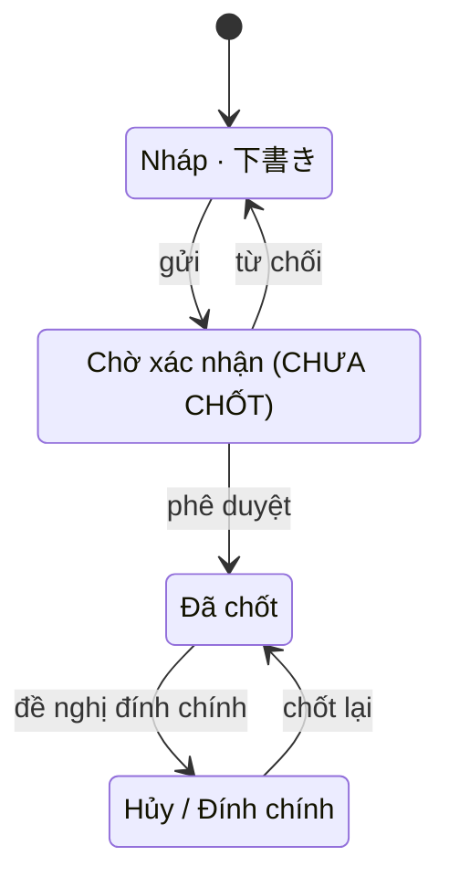

# SC-11 — Tạo giao dịch 相対取引 · Spec BE

| | |
|---|---|
| FE liên quan | FE-014 (Tạo giao dịch 相対取引), FE-015 (Từ chối chốt giao dịch không hợp lệ), FE-007 (Chặn giao dịch khi hiệu lực đã hết) |
| FN | FN-04 (Giao dịch thỏa thuận trực tiếp 相対取引), FN-02 |
| Ưu tiên | P0 |
| Yêu cầu khách | FR-AITAI-01, FR-AITAI-02, FR-PARTY-01, FR-PARTY-02, FR-LOT-01, FR-LOT-03, BR-PERM-01, BR-LOT-02, BR-CLOSE-01, FR-CORR-03, FR-AUDIT-01, NFR-PERF-02, NFR-USE-01 |
| Miền dữ liệu | D-TRADE (chính) · D-LOT · D-PARTY |
| State machine | FIG-012 (RFP:637) — tiêu đề hình phủ **cả** 相対取引 **và** せり |
| Đã thi công | Một phần |

## 1. Phạm vi backend của màn này

Ghi một bản ghi giao dịch kênh 相対取引 vào chặng đầu của FIG-012, cấp mã giao dịch duy nhất, gán
ngày nghiệp vụ ở server, và cấp hai danh sách tham chiếu cho form (lô đang ở chặng bán được của
FIG-011; người tham gia phân loại 買出人). Nếu chủ đầu tư chốt là vòng đời có chặng **Chờ xác nhận**
(§9 Q1) thì màn cũng phát được sự kiện `gửi`.

**Không** làm: chốt và hủy giao dịch — hai thao tác đó thuộc SC-12 dù hai **cửa kiểm** của FE-015
được đặc tả ở đây vì FE-015 gắn với màn này; điều chỉnh sau lock (FR-CORR-01/02 → SC-20, SC-21); ghi
kết quả せり (FN-05 → SC-13); nhận dạng tự động 手やり (`SCOPE-OUT-02`, RFP:405 — ràng buộc của FN-05).

## 2. Hợp đồng API

### `POST /api/transactions`

| | |
|---|---|
| Thoả yêu cầu | FE-014 · FR-AITAI-01 (RFP:650) · FR-CORR-03 (RFP:658) |
| Xác thực | bắt buộc |
| Vai trò được gọi | ROLE-TRADE |
| Idempotent | **không** — chống gửi trùng bằng `Idempotency-Key` do client sinh cho mỗi lần mở form; key trùng trả lại chính bản ghi đã tạo thay vì tạo bản ghi thứ hai |

**Request**

| Tham số | Vị trí | Kiểu | Bắt buộc | Ràng buộc | Nguồn |
|---|---|---|---|---|---|
| `lotId` | body | uuid | có | lô tồn tại và ở chặng bán được của FIG-011 | FR-AITAI-01, FR-LOT-01 |
| `buyerParticipantId` | body | uuid | có | người tham gia tồn tại và phân loại đúng `買出人` | FR-AITAI-01, FR-PARTY-01 |
| `qty` | body | decimal(12,2) | có | `> 0` | FR-AITAI-01, BR-LOT-02 |
| `unitPrice` | body | integer | có | `> 0`; JPY không có phần thập phân | FR-AITAI-01 |
| `Idempotency-Key` | header | string | có | duy nhất theo lần mở form | — (chống gửi trùng) |

**Server tự quyết — không nhận từ client:** `txnCode` (duy nhất, FR-AITAI-01), `businessDate` (ngày
nghiệp vụ đang mở theo JST — xem §9 Q2), `status` = `Nháp`, kênh = `相対取引`, `createdBy`, `createdAt`.

**Response 201:** `id` (uuid, khoá nội bộ) · `txnCode` (string, mã duy nhất mà màn hiển thị) ·
`businessDate` (date đã gán) · `status` (enum, luôn `Nháp` ở bước này) · `lot` và `buyer` (object —
mã lô và tên người tham gia dạng người đọc được).

**Mã lỗi**

| HTTP | Mã nghiệp vụ | Điều kiện phát sinh | Yêu cầu |
|---|---|---|---|
| 400 | `invalid_json` | body không phải JSON hợp lệ | — |
| 422 | `lot_required` | thiếu `lotId` hoặc rỗng | FR-AITAI-01 |
| 422 | `buyer_required` | thiếu `buyerParticipantId` hoặc rỗng | FR-AITAI-01 |
| 422 | `qty_invalid` | `qty` không phải số hữu hạn `> 0` | FR-AITAI-01, BR-LOT-02 |
| 422 | `unit_price_invalid` | `unitPrice` không phải số nguyên `> 0` | FR-AITAI-01 |
| 422 | `lot_not_sellable` | lô không ở chặng bán được của FIG-011 | FR-LOT-01, FIG-011 (RFP:616) |
| 422 | `buyer_category_invalid` | người mua không thuộc phân loại `買出人` | FR-PARTY-01 (RFP:629) |
| 423 | `business_day_locked` | ngày nghiệp vụ được gán đã bị lock | FR-CORR-03, BR-CLOSE-01 (RFP:597) |
| 404 | `not_found` | vai gọi không phải ROLE-TRADE — **404 có chủ đích**, không 403 | TBL-ROLE-01 (RFP:245) |
| 500 | `txn_code_unavailable` | không cấp được mã duy nhất sau chuỗi thử | FR-AITAI-01 |

**Tác dụng phụ:** INSERT một dòng `D-TRADE`; **không** trừ `available_qty` và **không** kiểm hiệu lực
người mua (hai cửa đó thuộc sự kiện `chốt`, §4); ghi audit `action='create'` (§7). Không phát thông báo.

### `POST /api/transactions/{id}/submit`

| | |
|---|---|
| Thoả yêu cầu | FIG-012 cạnh `Nháp --gửi--> Chờ xác nhận` · **phụ thuộc §9 Q1** |
| Xác thực | bắt buộc · Vai trò: ROLE-TRADE |
| Idempotent | có — gửi lại trên bản ghi đã ở `Chờ xác nhận` trả 200 không đổi gì |

**Request:** `id` (path, uuid). Không có body.
**Response 200:** `id`, `status` = `Chờ xác nhận`, `submittedBy`, `submittedAt`.

| HTTP | Mã nghiệp vụ | Điều kiện phát sinh | Yêu cầu |
|---|---|---|---|
| 409 | `illegal_transition` | bản ghi không ở chặng `Nháp` | FIG-012 (RFP:637) |
| 423 | `business_day_locked` | ngày nghiệp vụ của bản ghi đã lock | FR-CORR-03, BR-CLOSE-01 |
| 404 | `not_found` | bản ghi không tồn tại **hoặc** vai gọi không phải ROLE-TRADE | TBL-ROLE-01 |

**Tác dụng phụ:** UPDATE trạng thái `D-TRADE`; audit `action='submit'` với `before`/`after`.
**Nếu §9 Q1 = "không có bước duyệt" thì endpoint này KHÔNG tồn tại** và nút thứ hai trên màn bị bỏ.

### `GET /api/transactions/form-refs`

| | |
|---|---|
| Thoả yêu cầu | FE-014 (dữ liệu tham chiếu cho form) · NFR-PERF-01 (RFP:807) |
| Xác thực | bắt buộc · Vai trò: ROLE-TRADE |
| Idempotent | có (đọc) |

**Response 200:** `lots[]` (`id`, `lotCode`, `item`, `availableQty`) — chỉ lô ở chặng bán được của
FIG-011 còn `availableQty > 0`; `buyers[]` (`id`, `name`) — chỉ phân loại `買出人`, **không lọc theo
hiệu lực** vì `BR-PERM-01` (RFP:595) đặt cửa hiệu lực ở thời điểm chốt. **Mã lỗi:** 404 `not_found`
khi vai gọi không phải ROLE-TRADE.

## 3. Mô hình dữ liệu màn này chạm

| Thực thể | Cột dùng | Ràng buộc thiết kế đòi | Tầng thực thi | Đã có? |
|---|---|---|---|---|
| `transaction` (D-TRADE) | `txn_code` | duy nhất toàn hệ thống — FR-AITAI-01 | 1 (UNIQUE) | có |
| `transaction` | `status` | thuộc đúng tập 4 chặng FIG-012 kể cả `Chờ xác nhận` | 1 (CHECK) | **thiếu giá trị `Chờ xác nhận`** |
| `transaction` | `qty`, `unit_price` | `qty > 0`; `unit_price > 0` và là số nguyên | 1 (CHECK) | có |
| `transaction` | `lot_id`, `buyer_participant_id` | khoá ngoại tới D-LOT và D-PARTY | 1 (FK) | có |
| `transaction` | `business_date` | không ghi/sửa được khi ngày đã lock, **kể cả INSERT** | 2 (trigger) | **chỉ chặn UPDATE/DELETE** |
| `participant` (D-PARTY) | `category` | đúng 4 phân loại; không gộp — FR-PARTY-01 | 1 (CHECK) | có |
| `lot` (D-LOT) | `status`, `available_qty` | `available_qty >= 0` — BR-LOT-02 | 1 (CHECK) | có |
| `audit_log` | `actor_id`, `action`, `before`, `after`, `reason` | append-only — FR-AUDIT-01 | 1 + 3 | có |
| — | khoá chống gửi trùng (`Idempotency-Key`) | một key ↔ một bản ghi | 1 (UNIQUE) | **chưa tồn tại** |

Ràng buộc P0 **"ngày đã lock thì không ghi được bản ghi mới"** hiện chỉ phủ UPDATE/DELETE ở tầng 2;
thiết kế đòi phủ cả INSERT ở tầng 2 (§10).

## 4. Vòng đời trạng thái

| Từ | Sự kiện | Đến | Guard | Ai được phép | Mã lỗi khi vi phạm |
|---|---|---|---|---|---|
| — | tạo | Nháp | ngày nghiệp vụ chưa lock; lô ở chặng bán được; người mua đúng `買出人` | ROLE-TRADE | 423 `business_day_locked` · 422 `lot_not_sellable` · 422 `buyer_category_invalid` |
| Nháp | gửi | Chờ xác nhận | ngày chưa lock · **cạnh phụ thuộc §9 Q1** | ROLE-TRADE | 409 `illegal_transition` · 423 `business_day_locked` |
| Chờ xác nhận | phê duyệt | Đã chốt | **hai cửa FE-015** (§5 BR-PERM-01 + BR-LOT-02); vai duyệt **chưa được định nghĩa** (§9 Q1) | chưa xác định | 422 `ineligible_party` · 422 `insufficient_qty` |
| Chờ xác nhận | từ chối | Nháp | ngày chưa lock | chưa xác định | 409 `illegal_transition` |
| Nháp | chốt | Đã chốt | **chỉ tồn tại nếu §9 Q1 = "không có bước duyệt"**; hai cửa FE-015 | ROLE-TRADE (SC-12) | 422 `ineligible_party` · 422 `insufficient_qty` · 423 `business_day_locked` |
| Đã chốt | đề nghị đính chính | Hủy / Đính chính | có yêu cầu điều chỉnh đã duyệt — FR-CORR-01/02 | ROLE-SETTLEMENT (SC-20/21) | 409 `illegal_transition` |
| Hủy / Đính chính | chốt lại | Đã chốt | reverse/delta đã sinh — FR-CORR-02 | ROLE-SETTLEMENT (SC-21) | 409 `illegal_transition` |

Guard là chỗ dễ mất nhất ở đây: **hai cửa FE-015 gắn với sự kiện đưa bản ghi tới `Đã chốt`**, không
gắn với sự kiện tạo. Sự kiện đó nằm ở cạnh nào lại phụ thuộc §9 Q1 — nên hai cửa phải viết thành một
**hàm guard dùng chung**, không nhúng vào một endpoint.

## 5. Quy tắc nghiệp vụ

| Mã | Quy tắc (nguyên văn nguồn) | Thực thi ở đâu | Kiểm bằng gì |
|---|---|---|---|
| `BR-PERM-01` (RFP:595) · `FR-PARTY-02` (RFP:630) | "Phải kiểm tra hiệu lực của 許可/承認 tại thời điểm giao dịch" · "…tại thời điểm **chốt** giao dịch" | guard của sự kiện tới `Đã chốt` — so `valid_from`/`valid_to` và trạng thái FIG-010 với **thời điểm chốt**, không với `business_date`; mốc do chính điều khoản tự giới hạn | test: người mua hết hiệu lực giữa lúc tạo nháp và lúc chốt → 422 `ineligible_party`; không trừ số lượng |
| `BR-LOT-02` (RFP:596) · `FR-LOT-03` (RFP:634) | "Số lượng khả dụng của lô hàng không được âm, và phải truy vết được tới lịch sử điều chỉnh" · "kiểm tra số lượng khả dụng … trước khi cho phép giao dịch hoặc giao hàng" | tầng 1 CHECK `available_qty >= 0` + guard trừ số lượng cùng chỗ với cửa hiệu lực + audit | test: `qty` vượt `available_qty` → 422 `insufficient_qty`; chốt đồng thời vượt tồn → chỉ số request vừa tồn thành công |
| `FR-AITAI-02` (RFP:651) | "phải từ chối chốt nếu người tham gia đã mất hiệu lực, hoặc số lượng lô hàng không đủ" | hai mã lỗi **riêng biệt**, mỗi mã một câu lý do đọc được | test: hai kịch bản cho hai mã khác nhau — một message chung là **không thoả** |
| `BR-CLOSE-01` (RFP:597) | "Không được chỉnh sửa trực tiếp ngày nghiệp vụ đã bị lock" | tầng 2 trigger, phủ **INSERT/UPDATE/DELETE** | test: INSERT vào ngày đã lock → 423 và có audit |
| `FR-PARTY-01` (RFP:629) | profile phân loại thành `卸売業者`, `仲卸`, `売買参加者`, `買出人`; "Không được gộp sai các role" | tầng 1 CHECK + guard `buyer_category_invalid` | test: chọn người mua khác `買出人` → 422 |

Không có con số nghiệp vụ nào riêng của màn này. Ngưỡng tải lấy từ `FIG-LOAD-01` (RFP:829) — §8.

## 6. Ma trận phân quyền theo thao tác

| Vai trò | Vào trang | `GET form-refs` | `POST` tạo | `POST submit` | Đọc bản ghi |
|---|---|---|---|---|---|
| ROLE-TRADE | cho phép | cho phép | cho phép | cho phép | cho phép |
| 6 vai còn lại — ROLE-INTAKE · ROLE-JUDGE · ROLE-DELIVERY · ROLE-SETTLEMENT · ROLE-RULE-ADMIN · ROLE-SYS-ADMIN | **404** | 404 `not_found` | 404 `not_found` | 404 `not_found` | cho phép |

- **Đọc và ghi khác nhau.** Mọi vai đang hoạt động **đọc** được bản ghi giao dịch để đối chiếu chéo;
  chặn nằm ở **ghi** và ở **vào trang**.
- **Chặn vào trang trả 404, không phải 403** — có chủ đích, không lộ sự tồn tại tài nguyên.
- Màn này **không** cần maker-checker. Nếu §9 Q1 = "có bước duyệt" thì điều kiện "người duyệt khác
  người tạo" là một ràng buộc **riêng**, không suy ra được từ vai — phải hỏi cùng lúc (`GOV-RULE-01`
  chỉ áp cho thay đổi rule, không áp cho giao dịch).

## 7. Audit và truy vết

| Thao tác | `action` | Ghi gì | Yêu cầu |
|---|---|---|---|
| Tạo bản ghi | `create` | `after` = toàn bộ dòng vừa ghi; `actor_id`; `created_at`; `before` = null | FR-AUDIT-01 (RFP:710) |
| Phát sự kiện `gửi` | `submit` | `before`/`after` của cột trạng thái; `actor_id`; timestamp | FR-AUDIT-01 |
| Bị chặn vì ngày đã lock | `locked_write_attempt` | `after` = payload bị từ chối; `reason` = ngày nghiệp vụ bị lock | FR-CORR-03 (RFP:658) — "Mọi lần thử sửa trực tiếp đều bị chặn **và có log**" |
| Bị chặn vì thiếu quyền | `denied_write_attempt` | `actor_id`; vai; endpoint | FR-AUDIT-01, NFR-SEC-03 (RFP:811) |

Audit là **append-only**. Việc ghi audit phải nằm cùng biên giao dịch với thao tác nghiệp vụ: audit
lỗi thì nghiệp vụ không được coi là đã xảy ra (§10).

## 8. Phi chức năng áp cho màn này

| Mã | Yêu cầu | Ảnh hưởng thiết kế BE |
|---|---|---|
| `NFR-PERF-02` (RFP:808) | xử lý được `FIG-LOAD-01` mà không làm chậm tác vụ giao dịch cốt lõi — ngày cao điểm **1.200 giao dịch / 600 lô / 60 người dùng đồng thời** (RFP:829) | `POST /api/transactions` nằm trên đường nóng nhất: cấp `txn_code` không được dùng đường đếm-rồi-cộng có thể đua; `form-refs` phải có chỉ mục theo `status` và `business_date` |
| `NFR-PERF-01` (RFP:807) | tìm kiếm thông thường p95 ≤ 2 giây | áp cho `GET form-refs` khi số lô/ngày đạt 600 |
| `NFR-USE-01` (RFP:816) | luồng chốt giao dịch phải dùng được bằng bàn phím và có thông báo lỗi dễ hiểu | BE phải trả **mã nghiệp vụ riêng cho từng nhánh** để FE gắn lỗi vào đúng trường; một mã gộp làm FE không định vị được trường |
| `NFR-SEC-03` (RFP:811) | log hành vi bất thường | lần gọi bị 404 vì thiếu quyền phải vào audit (§7) |
| `NFR-SEC-04` (RFP:812) | TLS cho dữ liệu truyền | áp cho toàn bộ endpoint của màn |

## 9. Câu hỏi cho chủ đầu tư

- **Q1 — Vòng đời có chặng "Chờ xác nhận" hay không? Tài liệu khách tự chống nhau.**
  - Phía **có**: `FIG-012` (RFP:637) vẽ `Nháp → (gửi) → Chờ xác nhận → (phê duyệt) → Đã chốt` cùng
    cạnh `(từ chối)` quay về `Nháp`; hình còn ghi "Đây là các trạng thái thuộc đối tượng kiểm toán".
  - Phía **không**: `FR-AITAI-01` (RFP:650) nghiệm thu chỉ nói "Sau khi chốt, giao dịch có mã duy
    nhất và trừ đúng số lượng khả dụng"; `FR-AITAI-02` (RFP:651) chỉ đòi "**từ chối chốt**" theo điều
    kiện — tức từ chối tự động, không phải người phê duyệt; `FE-014` và `FE-015` không nhắc bước duyệt.
  - Vì sao cần trước khi code: quyết định này đổi tập giá trị của cột trạng thái, đổi số endpoint, và
    **thêm một màn hàng đợi chờ duyệt chưa có mã `SC-` nào** — tức thêm phạm vi, không chỉ thêm cột.
    Chọn sai thì luồng gánh ~90% giá trị giao dịch của chợ (RFP:29) phải làm lại vòng đời.
  - Kèm theo nếu chọn "có": ai duyệt (`TBL-ROLE-01`, RFP:245 chưa giao trách nhiệm này cho vai nào),
    SLA duyệt, và có đòi người duyệt khác người tạo hay không.
- **Q2 — Ngày nghiệp vụ có được nhập bù cho một ngày khác không?** Thiết kế chỉ nói server gán ngày
  đang mở. Cần trước khi code vì câu trả lời đổi kỳ đối chiếu (`FR-SETTLE-01`, RFP:659) và đổi cách
  lock ứng xử (`FR-CORR-03`, RFP:658). Nếu cho nhập bù thì `businessDate` thành tham số request và
  cửa lock phải kiểm trên giá trị client gửi.
- **Q3 — Hai cửa kiểm của FE-015 đánh giá lúc `gửi`, lúc `phê duyệt`, hay cả hai lần?**
  `FR-PARTY-02` tự giới hạn "tại thời điểm **chốt** giao dịch" nên tối thiểu phải kiểm ở cạnh tới
  `Đã chốt`. Nếu chỉ kiểm ở đó thì hàng đợi chờ duyệt có thể đầy bản ghi chắc chắn bị từ chối.
- **Q4 — `Idempotency-Key` có được chấp nhận là cách chống gửi trùng không?** Thiết kế chỉ đòi "chặn
  gửi trùng" ở tầng UI. Nếu khách không muốn thêm khoá này thì phải chốt hành vi khi người dùng bấm
  hai lần: hai bản ghi nháp hay một bản ghi.

## 10. Prototype hiện làm khác gì

| Hạng mục | Thiết kế đòi | Prototype làm | Dẫn chứng | Mức |
|---|---|---|---|---|
| Chặng `Chờ xác nhận` | 4 chặng FIG-012 (RFP:637) | tập trạng thái chỉ có `draft`/`confirmed`/`cancelled`; đi thẳng `draft → confirmed` | `supabase/migrations/20260904090300_transaction.sql:16`; `src/app/api/transactions/[id]/confirm/route.ts:13-18` | cần khách chốt |
| Lock chặn INSERT | BR-CLOSE-01 (RFP:597) — không ghi được bản ghi mới vào ngày đã lock | trigger chỉ `before update or delete`; route không tra bảng lock → vẫn tạo được nháp trên ngày đã lock rồi chốt mới 423 | `supabase/migrations/20260904090500_business_day_lock.sql:61-63`; `src/app/api/transactions/route.ts:65` | khác không chủ đích — **P0** |
| Lý do từ chối phân biệt được | FR-AITAI-02 (RFP:651) — hiển thị lý do; hai lý do riêng biệt | server trả `lot_not_available`/`invalid_request`/`invalid_json`/500 nhưng client gộp về một câu chung | `src/components/transactions/aitai-create-form.tsx:49-53` | khác không chủ đích — **P0** |
| Phân loại người mua | FR-PARTY-01 (RFP:629) — chỉ `買出人` | không kiểm `category`; danh sách lấy thẳng mọi người tham gia | `src/app/(app)/transactions/new/page.tsx:28`; `src/app/api/transactions/route.ts:25` | khác không chủ đích |
| Audit trong cùng biên | FR-AUDIT-01 (RFP:710) | audit ghi **sau** khi nghiệp vụ đã commit và không rollback được | `src/lib/audit/write-audit-log.ts:44-50` | khác không chủ đích |
| Audit cho lần ghi bị lock | FR-CORR-03 (RFP:658) — mọi lần thử bị chặn **và có log** | nhánh hủy ghi `locked_write_attempt`; nhánh chốt trả 423 trần không ghi log | `src/app/api/transactions/[id]/cancel/route.ts:46-48` so với `.../confirm/route.ts:34-37` | khác không chủ đích |
| Cấp `txn_code` | FR-AITAI-01 — mã duy nhất | đếm số bản ghi trong ngày rồi cộng 1; UNIQUE bắt trùng và retry đúng một lần → người thứ ba có thể nhận 500 | `src/lib/transactions/txn-code.ts:9-27`; `src/app/api/transactions/route.ts:95-105` | khác không chủ đích |
| Chống gửi trùng ở server | §9 Q4 | chỉ khoá nút ở UI; không có khoá phía server | `src/components/transactions/aitai-create-form.tsx:28,33` | cần khách chốt |
| Hai cửa kiểm FE-015 | FR-PARTY-02 + FR-LOT-03 | **khớp** — nhánh 相対取引 kiểm đủ cả hai tại thời điểm chốt | `src/lib/transactions/confirm-transaction.ts:72,78` | khớp |

## 11. Dẫn chứng

- RFP:29 — 相対取引 là luồng chính; せり là luồng phụ trợ · RFP:245 — `TBL-ROLE-01`
- RFP:595, 596, 597 — `BR-PERM-01`, `BR-LOT-02`, `BR-CLOSE-01` · RFP:602-604 — `D-PARTY`, `D-LOT`, `D-TRADE`
- RFP:616 — `FIG-011` · RFP:637 — `FIG-012`, phủ cả 相対取引 và せり
- RFP:629, 630, 632, 634 — `FR-PARTY-01/02`, `FR-LOT-01/03` · RFP:650, 651 — `FR-AITAI-01/02`
- RFP:658, 659, 710 — `FR-CORR-03`, `FR-SETTLE-01`, `FR-AUDIT-01`
- RFP:807, 808, 811, 812, 816, 829 — `NFR-PERF-01/02`, `NFR-SEC-03/04`, `NFR-USE-01`, `FIG-LOAD-01`
- Feature List `FE-007`, `FE-014`, `FE-015`, `FE-041`
- `docs/lab4/20-architecture-design.md` § 4.3 — hai kịch bản của §9 Q1
- `docs/lab4/spec/SC-11-tao-giao-dich-aitai.md` — bản as-built dùng cho §10
