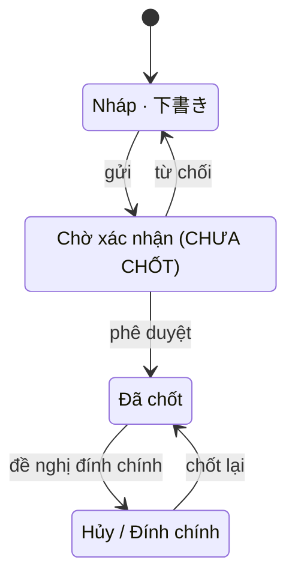

# SC-12 — Danh sách và chi tiết giao dịch · Spec BE

| | |
|---|---|
| FE liên quan | FE-017 (Tra cứu và theo dõi giao dịch, P0), FE-016 (Hủy giao dịch chưa lock, P1), FE-014 (Tạo giao dịch 相対取引, P0) |
| FN | FN-04 (Giao dịch thỏa thuận trực tiếp 相対取引) |
| Ưu tiên | P0 · P1 |
| Yêu cầu khách | FR-AITAI-01, FR-AITAI-02, FR-AITAI-03, FR-PARTY-02, FR-LOT-03, BR-PERM-01, BR-LOT-02, BR-CLOSE-01, FR-CORR-01, FR-CORR-03, FR-AUDIT-01, NFR-PERF-01, NFR-PERF-02 |
| Miền dữ liệu | D-TRADE (chính) · D-LOT · D-PARTY |
| State machine | FIG-012 (RFP:637) |
| Đã thi công | Một phần |

## 1. Phạm vi backend của màn này

Đọc danh sách giao dịch theo ngày nghiệp vụ, trạng thái và người mua với phân trang; đọc chi tiết một
bản ghi kèm lịch sử thao tác; và thực thi **hai sự kiện ghi nặng nhất của FN-04**: `chốt` (hai cửa
kiểm của FE-015) và `hủy` (lý do bắt buộc, hoàn lại số lượng khả dụng của lô).

**Không** làm: tạo bản ghi (SC-11); điều chỉnh sau khi ngày đã lock — đường duy nhất là FR-CORR-01
(RFP:656) và FR-CORR-02 (RFP:657) qua SC-20/SC-21; bảng đối chiếu ngày và lock kỳ (SC-18); sinh báo
cáo (SC-25/SC-26 — màn này chỉ cấp dữ liệu nguồn cho RPT-01 và RPT-10).

## 2. Hợp đồng API

### `GET /api/transactions`

Thoả FE-017 · FR-AITAI-01 (RFP:650) · NFR-PERF-01 (RFP:807) · NFR-PERF-02 (RFP:808). Xác thực bắt
buộc; **mọi vai đang hoạt động** gọi được (đọc mở để đối chiếu chéo); idempotent (đọc).

**Request**

| Tham số | Vị trí | Kiểu | Bắt buộc | Ràng buộc | Nguồn |
|---|---|---|---|---|---|
| `businessDate` | query | date | không | đúng `YYYY-MM-DD` | FR-SETTLE-01 (RFP:659) |
| `status` | query | enum | không | thuộc tập chặng FIG-012; giá trị lạ **phải báo lỗi** | FIG-012 (RFP:637) |
| `buyerName` | query | string | không | khớp tên người tham gia — xem §9 Q3 | FR-AITAI-01, RPT-10 |
| `page`, `pageSize` | query | integer | không | `pageSize` mặc định 50, tối đa 200 | NFR-PERF-02 |

**Response 200:** `items[]` (`id`, `txnCode`, `lotCode`, `buyerName`, `qty`, `unitPrice`,
`businessDate`, `status`) · `page`, `pageSize`, `totalCount`. `totalCount` là **bắt buộc**: thiết kế
cấm cắt kết quả trong im lặng nên client phải biết mình đang xem phần nào.

| HTTP | Mã nghiệp vụ | Điều kiện phát sinh | Yêu cầu |
|---|---|---|---|
| 422 | `business_date_invalid` | `businessDate` không đúng định dạng ngày | FR-SETTLE-01 |
| 422 | `status_invalid` | `status` không thuộc tập chặng FIG-012 | FIG-012 |
| 422 | `page_size_invalid` | `pageSize` không phải số nguyên trong `[1, 200]` | NFR-PERF-02 |

**Tác dụng phụ:** không có. Không ghi audit cho việc đọc.

### `GET /api/transactions/{id}`

Thoả FE-017 · FR-AITAI-01 · FR-AUDIT-01 (RFP:710). Xác thực bắt buộc; mọi vai đang hoạt động gọi
được; idempotent (đọc).

**Response 200:** toàn bộ trường của bản ghi cộng `confirmedBy` / `confirmedAt` (cặp "ai chốt, chốt
lúc nào" mà FR-AITAI-01 và FR-AUDIT-01 đều dựa vào), `cancelReason`, `lotAvailableQty` (số khả dụng
hiện tại của lô — để màn hiện được số trước và sau khi hủy), `businessDayLocked` (boolean — để màn
render mục thao tác ở dạng chỉ đọc **trước** khi người dùng bấm), và `history[]`
(`occurredAt`, `actorName`, `action`, `reason`, `before`, `after`) mới nhất trước.

| HTTP | Mã nghiệp vụ | Điều kiện phát sinh | Yêu cầu |
|---|---|---|---|
| 404 | `not_found` | không có bản ghi với `id` đó | FE-017 |

### `POST /api/transactions/{id}/confirm`

Thoả FE-014 · FE-015 · FE-007 · FR-AITAI-01 · FR-AITAI-02 (RFP:651) · FR-PARTY-02 (RFP:630) ·
FR-LOT-03 (RFP:634). Xác thực bắt buộc; vai được gọi: **ROLE-TRADE**. **Không** idempotent — gọi lại
trên bản ghi đã `Đã chốt` trả 409 thay vì trừ số lượng lần hai.

**Request:** `id` (path, uuid); không có body — mọi giá trị nghiệp vụ đã nằm trên bản ghi.
**Response 200:** `id` · `status` = `Đã chốt` · `confirmedBy` · `confirmedAt` · `lotAvailableQty` (sau khi trừ).

| HTTP | Mã nghiệp vụ | Điều kiện phát sinh | Yêu cầu |
|---|---|---|---|
| 409 | `illegal_transition` | bản ghi không ở chặng cho phép chốt (§4) | FIG-012 (RFP:637) |
| 422 | `ineligible_party` | 買出人 không còn hiệu lực 許可/承認 **tại thời điểm chốt** | FR-PARTY-02, BR-PERM-01 (RFP:595) |
| 422 | `insufficient_qty` | `available_qty` của lô nhỏ hơn `qty` của giao dịch | FR-LOT-03, BR-LOT-02 (RFP:596) |
| 423 | `business_day_locked` | ngày nghiệp vụ của bản ghi đã bị lock | FR-CORR-03 (RFP:658), BR-CLOSE-01 (RFP:597) |
| 404 | `not_found` | bản ghi không tồn tại **hoặc** vai gọi không phải ROLE-TRADE | TBL-ROLE-01 (RFP:245) |

Hai mã 422 **phải riêng biệt** và mỗi mã mang đủ dữ liệu để màn dựng câu lý do bằng tiếng người:
`ineligible_party` kèm `participantName` và `invalidSince`; `insufficient_qty` kèm `availableQty` và
`requestedQty`. Nghiệm thu FR-AITAI-02 là "Hệ thống hiển thị lý do từ chối".

**Tác dụng phụ:** UPDATE trạng thái `D-TRADE` + trừ `available_qty` của `D-LOT`; audit
`transaction_confirm`; nhánh 423 ghi audit `locked_write_attempt` (§7).

### `POST /api/transactions/{id}/cancel`

Thoả FE-016 · FR-AITAI-03 (RFP:652) · BR-LOT-02 · BR-CLOSE-01. Xác thực bắt buộc; vai được gọi:
**ROLE-TRADE**. **Không** idempotent — gọi lại trên bản ghi đã hủy trả 409; số lượng chỉ hoàn **đúng
một lần**.

**Request:** `id` (path, uuid) · `reason` (body, string, **bắt buộc**, trim còn `> 0` ký tự).
**Response 200:** `id`, `status` = `Hủy / Đính chính`, `cancelReason`, `cancelledBy`, `cancelledAt`,
`lotAvailableQtyBefore`, `lotAvailableQtyAfter` — hai trường cuối để màn hiện đúng số đã hoàn, là
nghiệm thu "số lượng khả dụng được hồi phục chính xác" của FR-AITAI-03.

| HTTP | Mã nghiệp vụ | Điều kiện phát sinh | Yêu cầu |
|---|---|---|---|
| 400 | `invalid_json` | body không phải JSON hợp lệ | — |
| 422 | `reason_required` | `reason` thiếu hoặc trim còn rỗng | FR-AITAI-03 |
| 409 | `illegal_transition` | bản ghi không ở chặng cho phép hủy (§4, §9 Q2) | FIG-012 |
| 423 | `business_day_locked` | ngày nghiệp vụ của bản ghi đã bị lock | FR-AITAI-03 ("hủy trước khi lock"), BR-CLOSE-01 |
| 404 | `not_found` | bản ghi không tồn tại **hoặc** vai gọi không phải ROLE-TRADE | TBL-ROLE-01 |

**Tác dụng phụ:** UPDATE trạng thái và `cancel_reason` trên `D-TRADE`; hoàn `available_qty` của
`D-LOT` **chỉ khi** bản ghi đã từng trừ số lượng (§9 Q1); audit `transaction_cancel` kèm `reason`;
nhánh 423 ghi audit `locked_write_attempt`.

## 3. Mô hình dữ liệu màn này chạm

| Thực thể | Cột dùng | Ràng buộc thiết kế đòi | Tầng thực thi | Đã có? |
|---|---|---|---|---|
| `transaction` (D-TRADE) | `status` | chỉ đổi theo cạnh hợp lệ của FIG-012; hai request đồng thời chỉ một thắng | 2 (trigger) hoặc 3 (so sánh-và-đổi) | 3 |
| `transaction` | `confirmed_by`/`confirmed_at`, `cancel_reason`/`cancelled_by`/`cancelled_at` | ghi cùng lúc với chặng tương ứng; không rỗng khi bản ghi đã ở chặng đó — FR-AITAI-01, FR-AITAI-03 | 1 (CHECK điều kiện) | **cột có; chưa có ràng buộc** |
| `transaction` | `business_date` | không sửa được khi ngày đã lock | 2 (trigger) | có |
| `lot` (D-LOT) | `available_qty` | `>= 0` sau mọi lần trừ và hoàn — BR-LOT-02 | 1 (CHECK) | có |
| `lot` | `available_qty` | không bán vượt tồn khi nhiều request chốt đồng thời | **1 hoặc 2** theo thiết kế | 3 (so sánh-và-đổi ở tầng ứng dụng) |
| `participant` (D-PARTY) | `status`, `valid_from`, `valid_to` | đủ dữ liệu để đánh giá hiệu lực tại một thời điểm | 1 (CHECK trạng thái FIG-010) | có |
| `audit_log` | `actor_id`, `action`, `before`, `after`, `reason` | append-only; có dòng cho **cả lần thử bị chặn** | 1 + 3 | có |

Ràng buộc P0 **"không bán vượt tồn"** (FR-LOT-03) đang ở tầng 3 — tầng duy nhất vượt được bằng cách
gọi thẳng tầng dữ liệu. Thiết kế đòi đưa xuống tầng 1 hoặc 2 để không phải nhớ gọi ở mỗi đường bán mới.

## 4. Vòng đời trạng thái

| Từ | Sự kiện | Đến | Guard | Ai được phép | Mã lỗi khi vi phạm |
|---|---|---|---|---|---|
| Nháp | chốt | Đã chốt | **chỉ tồn tại nếu §9 Q4 = "không có bước duyệt"**; hai cửa FE-015; ngày chưa lock | ROLE-TRADE | 409 `illegal_transition` · 422 `ineligible_party` · 422 `insufficient_qty` · 423 `business_day_locked` |
| Chờ xác nhận | phê duyệt | Đã chốt | hai cửa FE-015; ngày chưa lock; vai duyệt **chưa được định nghĩa** (§9 Q4) | chưa xác định | như trên |
| Chờ xác nhận | từ chối | Nháp | ngày chưa lock | chưa xác định | 409 `illegal_transition` |
| Đã chốt | hủy | Hủy / Đính chính | `reason` không rỗng; ngày chưa lock; hoàn đúng số lượng đã trừ | ROLE-TRADE | 422 `reason_required` · 423 `business_day_locked` |
| Nháp / Chờ xác nhận | hủy | Hủy / Đính chính | `reason` không rỗng; ngày chưa lock; **FIG-012 không vẽ cạnh này** — §9 Q2 | ROLE-TRADE | 409 `illegal_transition` nếu khách chốt là cạnh không tồn tại |
| Đã chốt | đề nghị đính chính | Hủy / Đính chính | có yêu cầu điều chỉnh **đã được duyệt** — FR-CORR-01/02 | ROLE-SETTLEMENT (SC-20/21) | 409 `illegal_transition` |
| Hủy / Đính chính | chốt lại | Đã chốt | reverse/delta đã sinh — FR-CORR-02 | ROLE-SETTLEMENT (SC-21) | 409 `illegal_transition` |

Guard dễ mất nhất là **thứ tự**: cửa chống đua trên `status` phải đứng **trước** hai cửa FE-015 —
chạy hai cửa trước rồi mới đổi trạng thái thì hai request đồng thời cùng qua cửa, đúng lỗi trừ số
lượng hai lần mà BR-LOT-02 cấm.

## 5. Quy tắc nghiệp vụ

| Mã | Quy tắc (nguyên văn nguồn) | Thực thi ở đâu | Kiểm bằng gì |
|---|---|---|---|
| `BR-PERM-01` (RFP:595) · `FR-PARTY-02` (RFP:630) | "Phải kiểm tra hiệu lực của 許可/承認 tại thời điểm giao dịch" · "…tại thời điểm **chốt** giao dịch" | guard của `confirm`, đánh giá theo thời điểm chốt chứ không theo `business_date` | test: hiệu lực hết giữa lúc tạo và lúc chốt → 422 `ineligible_party`; số lượng không bị trừ |
| `BR-LOT-02` (RFP:596) · `FR-LOT-03` (RFP:634) | "Số lượng khả dụng của lô hàng không được âm, và phải truy vết được tới lịch sử điều chỉnh" | tầng 1 CHECK + guard trừ/hoàn + audit từng lần đổi | test: N request chốt đồng thời trên cùng lô → tổng trừ không vượt tồn ban đầu; `available_qty` không bao giờ âm |
| `FR-AITAI-02` (RFP:651) | "phải từ chối chốt nếu người tham gia đã mất hiệu lực, hoặc số lượng lô hàng không đủ" | hai mã lỗi riêng, mỗi mã mang dữ liệu để dựng câu lý do | test: hai kịch bản → hai mã khác nhau; một message gộp là **không thoả** |
| `FR-AITAI-03` (RFP:652) | "cho phép hủy giao dịch chưa lock kèm lý do, và hoàn lại số lượng khả dụng" | guard `reason_required` + hoàn số lượng đúng một lần | test: hủy hai lần → lần hai 409 và số lượng chỉ hoàn một lần |
| `BR-CLOSE-01` (RFP:597) · `FR-CORR-03` (RFP:658) | "Không được chỉnh sửa trực tiếp ngày nghiệp vụ đã bị lock" · "Mọi lần thử sửa trực tiếp đều bị chặn và có log" | tầng 2 trigger + audit `locked_write_attempt` ở **cả** nhánh chốt và nhánh hủy | test: lock ngày rồi gọi cả hai endpoint → 423 và có đúng hai dòng audit |
| `FR-AUDIT-01` (RFP:710) | audit cho "tạo, sửa, phê duyệt, lock và thay đổi quyền" kèm "chủ thể thực hiện, timestamp, before/after và lý do" | ghi trong cùng biên với thao tác nghiệp vụ | test: audit lỗi → thao tác nghiệp vụ không được coi là đã xảy ra |

Không có con số nghiệp vụ riêng của màn. Ngưỡng `pageSize` (mặc định 50; tối đa 200) là **quyết định
thiết kế** dẫn từ `FIG-LOAD-01` (RFP:829 — cao điểm 1.200 giao dịch/ngày), không phải số của khách.

## 6. Ma trận phân quyền theo thao tác

| Vai trò | Vào trang | `GET` danh sách | `GET` chi tiết | `POST confirm` | `POST cancel` |
|---|---|---|---|---|---|
| ROLE-TRADE | cho phép | cho phép | cho phép | cho phép | cho phép |
| 6 vai còn lại — ROLE-INTAKE · ROLE-JUDGE · ROLE-DELIVERY · ROLE-SETTLEMENT · ROLE-RULE-ADMIN · ROLE-SYS-ADMIN | cho phép | cho phép | cho phép | **404** `not_found` | **404** `not_found` |

- **Đọc và ghi khác nhau.** Màn này **không** chặn vào trang theo vai — mọi vai đang hoạt động đọc
  được đủ dữ liệu để đối chiếu chéo; chặn chỉ nằm ở **hai endpoint ghi**, và trả **404 chứ không
  403** — có chủ đích, không lộ sự tồn tại tài nguyên.
- Không cần maker-checker. Nếu §9 Q4 = "có bước duyệt" thì điều kiện "người duyệt khác người tạo" là
  một ràng buộc riêng, không suy ra được từ vai.

## 7. Audit và truy vết

| Thao tác | `action` | Ghi gì (before/after/reason) | Yêu cầu RFP |
|---|---|---|---|
| Chốt | `transaction_confirm` | `before` = trạng thái cũ; `after` = trạng thái mới cộng `confirmed_by`/`confirmed_at` và `available_qty` trước/sau của lô | FR-AUDIT-01, BR-LOT-02 |
| Hủy | `transaction_cancel` | `before`/`after` trạng thái và `available_qty`; `reason` = lý do hủy **bắt buộc** | FR-AUDIT-01, FR-AITAI-03 |
| Bị chặn vì ngày đã lock | `locked_write_attempt` | `after` = thao tác bị từ chối; `reason` = ngày nghiệp vụ bị lock | FR-CORR-03 |
| Bị chặn vì thiếu quyền | `denied_write_attempt` | chủ thể, vai, endpoint | FR-AUDIT-01, NFR-SEC-03 (RFP:811) |

`GET` không ghi audit. Audit là append-only và phải nằm cùng biên với thao tác nghiệp vụ.

## 8. Phi chức năng áp cho màn này

| Mã | Yêu cầu | Ảnh hưởng thiết kế BE |
|---|---|---|
| `NFR-PERF-02` (RFP:808) | `FIG-LOAD-01`: cao điểm **1.200 giao dịch/ngày · 600 lô/ngày · 60 người dùng đồng thời** (RFP:829) | `GET` danh sách **phải** phân trang có `totalCount`; cần chỉ mục theo `business_date` và `status`; hai endpoint ghi nằm trên đường nóng nhất nên guard phải làm bằng một phép đổi có điều kiện chứ không đọc-rồi-ghi |
| `NFR-PERF-01` (RFP:807) | tìm kiếm thông thường p95 ≤ 2 giây | áp cho `GET` danh sách ở kích cỡ 1.200 bản ghi/ngày; `buyerName` cần chỉ mục hỗ trợ kiểu khớp đã chốt ở §9 Q3 |
| `NFR-USE-01` (RFP:816) | luồng chốt giao dịch dùng được bằng bàn phím; thông báo lỗi dễ hiểu | mỗi nhánh từ chối một mã nghiệp vụ riêng kèm dữ liệu để dựng câu lý do; một mã gộp làm màn không định vị được trường |

## 9. Câu hỏi cho chủ đầu tư

- **Q1 — Hủy một bản ghi chưa từng trừ số lượng thì "hoàn lại số lượng khả dụng" nghĩa là gì?**
  `FR-AITAI-03` (RFP:652) đòi hủy "kèm lý do, và hoàn lại số lượng khả dụng", nghiệm thu là "Số lượng
  khả dụng được hồi phục chính xác". Với bản ghi còn ở `Nháp` thì chưa có gì bị trừ. Cần trước khi
  code vì nó quyết định hoàn là "không đổi gì" hay là một phép cộng — chọn sai thì tồn lô bị cộng khống.
- **Q2 — Phạm vi hủy gồm những chặng nào? Tài liệu khách chưa đủ để suy.**
  - `FR-AITAI-03` (RFP:652) đặt điều kiện theo **lock**: "hủy giao dịch chưa lock" — nghĩa là mọi
    chặng trước lock đều hủy được, kể cả `Nháp`.
  - `FIG-012` (RFP:637) chỉ vẽ **một** cạnh vào `Hủy / Đính chính`, và cạnh đó đi từ `Đã chốt` qua
    sự kiện `đề nghị đính chính`. **Không có cạnh nào từ `Nháp`.**
  - Vì sao cần trước khi code: nếu hủy `Nháp` là hợp lệ thì FIG-012 thiếu một cạnh và tập trạng thái
    phải mở rộng; nếu không hợp lệ thì bản ghi `Nháp` sai chỉ còn cách nằm lại vô thời hạn — và ngày
    nghiệp vụ vẫn lock được với nháp mồ côi bên trong, làm lệch bảng đối chiếu của FR-SETTLE-01.
- **Q3 — `buyerName` khớp chính xác hay khớp một phần?** Thiết kế chỉ nói lọc theo người mua. Khớp
  chính xác thì nhập thiếu một ký tự ra rỗng; khớp một phần thì cần chốt cách xử lý ký tự đại diện.
  Ảnh hưởng cả chỉ mục và ngưỡng p95 của `NFR-PERF-01`.
- **Q4 — Vòng đời có chặng "Chờ xác nhận" hay không?** Câu hỏi này dùng chung với SC-11 §9 Q1: phía
  **có** là `FIG-012` (RFP:637) vẽ đủ bước `gửi → phê duyệt` cùng cạnh `từ chối`; phía **không** là
  `FR-AITAI-01` (RFP:650) và `FR-AITAI-03` (RFP:652) cùng `FE-014`/`FE-016`/`FE-017` không nhắc bước
  phê duyệt nào — `FR-AITAI-02` (RFP:651) chỉ đòi từ chối tự động theo điều kiện. Quyết định này đổi
  tập option của bộ lọc trạng thái, đổi số cạnh của §4, và thêm một màn hàng đợi chưa có mã `SC-`.

## 10. Prototype hiện làm khác gì

| Hạng mục | Thiết kế đòi | Prototype làm | Dẫn chứng | Mức |
|---|---|---|---|---|
| Phân trang | NFR-PERF-02 (RFP:808) — theo dõi được tới 1.200 giao dịch/ngày, không cắt âm thầm | danh sách cắt cứng 100 dòng, không phân trang, không `totalCount` | `src/app/(app)/transactions/page.tsx:29`; `src/app/api/transactions/route.ts:108-121` | khác không chủ đích — **P0** ở ngày cao điểm |
| Bộ lọc sai giá trị | 422 `status_invalid` và 422 `business_date_invalid` | `status` lạ bị **bỏ im lặng** rồi trả về tất cả; `businessDate` rác truyền thẳng xuống tầng dữ liệu → trang lỗi 500 | `src/app/(app)/transactions/page.tsx:13,26,30` | khác không chủ đích |
| Cặp "ai chốt / chốt lúc nào" | FR-AITAI-01 + FR-AUDIT-01 — đọc được trên chi tiết | cột có trong dữ liệu nhưng không màn nào hiển thị; chỉ suy lại qua lịch sử | `supabase/migrations/20260904090300_transaction.sql:17-21`; `src/components/transactions/transaction-detail-fields.tsx:26-44` | thiếu, mức nhỏ |
| Hủy: lý do và số hoàn lại | FR-AITAI-03 — chặn tại trường và cho người vận hành **thấy** số hoàn lại | server trả 422 `reason_required` nhưng client hiện một câu chung; `available_qty` trước/sau không trả và không hiện ở đâu | `src/components/transactions/confirm-cancel-button-group.tsx:67-75`; `src/lib/transactions/cancel-transaction.ts:68-73` | khác không chủ đích |
| Audit lần thử bị lock | FR-CORR-03 — mọi lần thử bị chặn **và có log** | nhánh hủy ghi `locked_write_attempt`; nhánh chốt trả 423 trần | `src/app/api/transactions/[id]/cancel/route.ts:46-48` so với `.../confirm/route.ts:34-37` | khác không chủ đích |
| Cờ ngày đã lock cho UI | `businessDayLocked` trong response chi tiết | không đọc bảng lock ở server; nút vẫn bật và lock chỉ lộ ra sau khi bấm | `src/app/(app)/transactions/[id]/page.tsx:26-41` | khác không chủ đích |
| Không bán vượt tồn | tầng 1 hoặc 2 | so sánh-và-đổi ở tầng ứng dụng, tối đa 25 lần thử rồi 500 | `src/lib/lots/availability-service.ts:31,57-77` | khác có chủ đích (ràng buộc kiến trúc) |
| Audit cùng biên | FR-AUDIT-01 | audit ghi **sau** khi nghiệp vụ đã commit và không rollback được | `src/lib/audit/write-audit-log.ts:44-50` | khác không chủ đích |
| Thứ tự guard khi chốt | cửa chống đua đứng trước hai cửa FE-015 | **khớp** — trạng thái đổi trước rồi mới chạy hai cửa | `src/lib/transactions/confirm-transaction.ts:47-53,72-83` | khớp |

## 11. Dẫn chứng

- RFP:245 — `TBL-ROLE-01` · RFP:595-597 — `BR-PERM-01`, `BR-LOT-02`, `BR-CLOSE-01` · RFP:602-604 — `D-PARTY`, `D-LOT`, `D-TRADE`
- RFP:630, 634 — `FR-PARTY-02`, `FR-LOT-03` · RFP:637 — `FIG-012` (chỉ một cạnh vào `Hủy / Đính chính`) · RFP:650-652 — `FR-AITAI-01/02/03`
- RFP:656-659 — `FR-CORR-01/02/03`, `FR-SETTLE-01` · RFP:710 — `FR-AUDIT-01`
- RFP:807, 808, 811, 816, 829 — `NFR-PERF-01/02`, `NFR-SEC-03`, `NFR-USE-01`, `FIG-LOAD-01`
- Feature List `FE-014`, `FE-015`, `FE-016`, `FE-017`, `FE-041`
- `docs/lab4/20-architecture-design.md` § 4.3 và § 6.1 — FIG-012 và tầng thực thi của ràng buộc tồn lô
- `docs/lab4/spec/SC-12-danh-sach-va-chi-tiet-giao-dich.md` — bản as-built dùng cho §10
