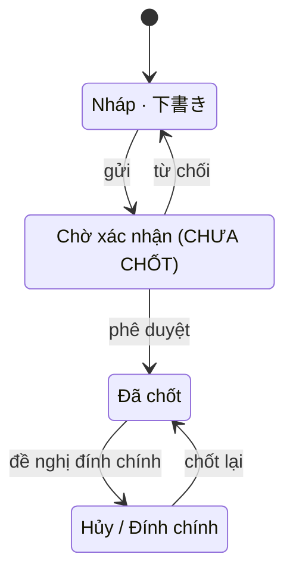

# SC-13 — Nhập kết quả せり · Spec BE

| | |
|---|---|
| FE liên quan | FE-018 (Nhập kết quả せり) |
| FN | FN-05 (Ghi nhận kết quả đấu giá せり) |
| Ưu tiên | P0 |
| Yêu cầu khách | FR-SERI-01, FR-SERI-02, SCOPE-OUT-02 · kế thừa FR-PARTY-02, BR-PERM-01, FR-LOT-03, BR-LOT-02, BR-CLOSE-01, FR-CORR-03, FR-AUDIT-01 |
| Miền dữ liệu | D-TRADE (chính) · D-LOT · D-PARTY |
| State machine | FIG-012 (RFP:637) — tiêu đề hình phủ **cả** 相対取引 **và** せり |
| Đã thi công | Một phần |

## 1. Phạm vi backend của màn này

Ghi **một** kết quả đấu giá cuối cùng cho một lô hàng: người thắng, số lượng, đơn giá, thời điểm
quyết định, người xác nhận — đúng năm trường `FR-SERI-02` (RFP:654) đòi lưu — cộng lô hàng làm định
danh. Gán ngày nghiệp vụ ở server. Cấp danh sách tham chiếu cho form.

Bốn yêu cầu **kế thừa** áp vào màn này vì chúng viết ở tầng quy tắc nghiệp vụ và **trung tính về
kênh**: `BR-PERM-01` (RFP:595) và `FR-PARTY-02` (RFP:630) — ghi kết quả せり đúng là một lần chốt
giao dịch; `FR-LOT-03` (RFP:634) và `BR-LOT-02` (RFP:596) — tồn của lô là tồn dùng chung cho cả hai
kênh bán.

**Không** làm: nhận ảnh, OCR, hay nhận dạng ký hiệu tay 手やり — `SCOPE-OUT-02` (RFP:405) và
`FR-SERI-01` (RFP:653) cấm bằng chữ; tra cứu và sửa bản ghi (SC-14); điều chỉnh sau lock (SC-20,
SC-21); giao nhận hàng (§9 Q4).

## 2. Hợp đồng API

### `POST /api/seri-results`

Thoả FE-018 · FR-SERI-01 (RFP:653) · FR-SERI-02 (RFP:654). Xác thực bắt buộc; vai được gọi:
**ROLE-TRADE**. **Không** idempotent theo payload — chống ghi trùng bằng **ràng buộc duy nhất theo
lô** (§3), không bằng một lần đọc trước khi ghi.

**Request**

| Tham số | Vị trí | Kiểu | Bắt buộc | Ràng buộc | Nguồn yêu cầu |
|---|---|---|---|---|---|
| `lotId` | body | uuid | có | lô tồn tại; ở chặng bán được của FIG-011; **chưa có** kết quả せり | FR-SERI-01, FR-LOT-01 |
| `winnerParticipantId` | body | uuid | có | tồn tại; còn hiệu lực 許可/承認 tại thời điểm chốt kết quả | FR-SERI-02, FR-PARTY-02 |
| `qty` | body | decimal(12,2) | có | `> 0`; không vượt `available_qty` của lô | FR-SERI-02, FR-LOT-03 |
| `unitPrice` | body | integer | có | `> 0`; JPY không có phần thập phân | FR-SERI-02 |
| `decidedAt` | body | timestamp | có | không ở tương lai; do người vận hành nhập | FR-SERI-02 |
| `confirmedBy` | body | uuid | có | tài khoản nội bộ **đang hoạt động**; không phải chữ tự do | FR-SERI-02 |

**Server tự quyết — không nhận từ client:** `businessDate` (§9 Q1), `createdBy`, `createdAt`. Kênh
`せり` suy ra từ chính thực thể, không phải một trường nhận từ client.

**Response 201:** `id` · `lot` (`lotCode`, `item`) · `winnerName` · `qty` · `unitPrice` ·
`decidedAt` · `confirmedByName` · `businessDate` · `lotAvailableQty` (sau khi trừ).

**Mã lỗi**

| HTTP | Mã nghiệp vụ | Điều kiện phát sinh | Yêu cầu |
|---|---|---|---|
| 400 | `invalid_json` | body không phải JSON hợp lệ | — |
| 422 | `lot_required` | thiếu `lotId` hoặc rỗng | FR-SERI-02 |
| 422 | `winner_required` | thiếu `winnerParticipantId` hoặc rỗng | FR-SERI-02 |
| 422 | `qty_invalid` | `qty` không phải số hữu hạn `> 0` | FR-SERI-02, BR-LOT-02 |
| 422 | `unit_price_invalid` | `unitPrice` không phải số nguyên `> 0` | FR-SERI-02 |
| 422 | `decided_at_invalid` | `decidedAt` không phải thời điểm hợp lệ | FR-SERI-02 |
| 422 | `decided_at_in_future` | `decidedAt` ở tương lai — phiên chưa diễn ra thì không có kết quả cuối cùng | FR-SERI-01 |
| 422 | `confirmer_required` | thiếu `confirmedBy` hoặc tài khoản không còn hoạt động | FR-SERI-02 |
| 422 | `lot_not_sellable` | lô không ở chặng bán được của FIG-011 | FR-LOT-01, FIG-011 (RFP:616) |
| 422 | `ineligible_party` | người thắng không còn hiệu lực 許可/承認 tại thời điểm chốt kết quả | FR-PARTY-02, BR-PERM-01 |
| 422 | `insufficient_qty` | `available_qty` của lô nhỏ hơn `qty` | FR-LOT-03, BR-LOT-02 |
| 409 | `already_recorded` | lô đã có một kết quả せり | FR-SERI-01 |
| 423 | `business_day_locked` | ngày nghiệp vụ được gán đã bị lock | FR-CORR-03 (RFP:658), BR-CLOSE-01 (RFP:597) |
| 404 | `not_found` | vai gọi không phải ROLE-TRADE — **404 có chủ đích**, không 403 | TBL-ROLE-01 (RFP:245) |

Ba mã 422 `ineligible_party` · `insufficient_qty` và 409 `already_recorded` **phải riêng biệt** và
mang đủ dữ liệu để màn dựng câu lý do: tên người tham gia kèm ngày mất hiệu lực; `availableQty` kèm
`requestedQty`; mã lô đã có kết quả kèm `id` bản ghi hiện có để chỉ đường sang SC-14.

**Tác dụng phụ:** INSERT một dòng `D-TRADE` (thực thể kết quả đấu giá) + **trừ `available_qty` của
`D-LOT`**; audit `action='create'`; nhánh 423 ghi audit `locked_write_attempt` (§7). Không phát thông báo.

### `GET /api/seri-results/form-refs`

Thoả FE-018 · NFR-PERF-01 (RFP:807). Xác thực bắt buộc; vai được gọi: **ROLE-TRADE**; idempotent (đọc).

**Response 200:** `lots[]` (`id`, `lotCode`, `item`, `availableQty`) — chỉ lô ở chặng bán được của
FIG-011, còn `availableQty > 0`, và **chưa có** kết quả せり; `participants[]` (`id`, `name`) —
không lọc theo hiệu lực vì `BR-PERM-01` đặt cửa ở thời điểm chốt; `internalUsers[]` (`id`, `name`)
— chỉ tài khoản đang hoạt động.
**Mã lỗi:** 404 `not_found` khi vai gọi không phải ROLE-TRADE.

## 3. Mô hình dữ liệu màn này chạm

| Thực thể | Cột dùng | Ràng buộc thiết kế đòi | Tầng thực thi | Đã có? |
|---|---|---|---|---|
| `seri_result` (D-TRADE) | `lot_id` | **duy nhất theo lô** — FR-SERI-01 chỉ cho một kết quả cuối cùng | 1 (UNIQUE) | **chưa tồn tại** |
| `seri_result` | `winner_participant_id`, `confirmed_by` | khoá ngoại tới D-PARTY; `confirmed_by` **không rỗng** — FR-SERI-02 | 1 (FK + NOT NULL) | FK có; **`confirmed_by` cho phép rỗng** |
| `seri_result` | `qty`, `unit_price` | `qty > 0`; `unit_price > 0` và là số nguyên | 1 (CHECK) | có |
| `seri_result` | `decided_at` | không ở tương lai | 1 (CHECK) hoặc 3 | **chưa có** |
| `seri_result` | `business_date` | không ghi/sửa được khi ngày đã lock, **kể cả INSERT** | 2 (trigger) | **chỉ chặn UPDATE/DELETE** |
| `seri_result` | trạng thái vòng đời | một trục trạng thái theo FIG-012 — §9 Q2 | 1 (CHECK) | **KHÔNG CÓ cột trạng thái nào** |
| `lot` (D-LOT) | `available_qty` | `>= 0` sau khi trừ cho kênh せり — BR-LOT-02, FR-LOT-03 | 1 (CHECK) + 1 hoặc 2 cho phép trừ | CHECK có; **kênh せり không trừ** |
| `participant` (D-PARTY) | `status`, `valid_from`, `valid_to` | đủ dữ liệu để đánh giá hiệu lực tại một thời điểm | 1 (CHECK trạng thái FIG-010) | có |
| `audit_log` | `actor_id`, `action`, `before`, `after`, `reason` | append-only; có dòng cho cả lần thử bị chặn | 1 + 3 | có |

Hai ràng buộc **P0** đang không được áp cho kênh này: hiệu lực người tham gia (`FR-PARTY-02`) và
không bán vượt tồn (`FR-LOT-03`). Cả hai phải nằm ở tầng 1 hoặc 2 để không phải nhớ gọi lại ở mỗi
đường bán mới — nếu để tầng 3 thì mỗi kênh bán mới lại là một chỗ bỏ sót.

## 4. Vòng đời trạng thái

`FIG-012` (RFP:637) ghi rõ trong tiêu đề: *"trạng thái của bản ghi **相対取引 và せり**"* — một vòng
đời **dùng chung** cho hai kênh, và *"Đây là các trạng thái thuộc đối tượng kiểm toán"*.

| Từ | Sự kiện | Đến | Guard | Ai được phép | Mã lỗi khi vi phạm |
|---|---|---|---|---|---|
| — | ghi kết quả | **Nháp hoặc Đã chốt — §9 Q2** | lô chưa có kết quả; người thắng còn hiệu lực; lô đủ số lượng; `decidedAt` không ở tương lai; ngày chưa lock | ROLE-TRADE | 409 `already_recorded` · 422 `ineligible_party` · 422 `insufficient_qty` · 422 `decided_at_in_future` · 423 `business_day_locked` |
| Nháp | gửi | Chờ xác nhận | **cạnh phụ thuộc §9 Q2** — không yêu cầu nào của FN-05 nhắc bước duyệt | chưa xác định | 409 `illegal_transition` |
| Chờ xác nhận | phê duyệt / từ chối | Đã chốt / Nháp | vai duyệt và SLA duyệt cho kênh せり **chưa được định nghĩa** | chưa xác định | 409 `illegal_transition` |
| Đã chốt | sửa trực tiếp | Đã chốt | ngày chưa lock; lý do chỉnh sửa bắt buộc — **thao tác thuộc SC-14** | ROLE-TRADE, ROLE-SETTLEMENT | 422 `reason_required` · 423 `business_day_locked` |
| Đã chốt | đề nghị đính chính | Hủy / Đính chính | có yêu cầu điều chỉnh đã duyệt — FR-CORR-01 (RFP:656) | ROLE-SETTLEMENT (SC-20/21) | 409 `illegal_transition` |
| Hủy / Đính chính | chốt lại | Đã chốt | reverse/delta đã sinh — FR-CORR-02 (RFP:657) | ROLE-SETTLEMENT (SC-21) | 409 `illegal_transition` |

Guard dễ mất nhất: **thứ tự** giữa ràng buộc duy nhất theo lô và ba cửa nghiệp vụ. Cửa duy nhất phải
là ràng buộc dữ liệu chứ không phải một lần đọc trước khi ghi — hai người nhập cùng lô cùng lúc thì
đúng một người ghi được, và người thua nhận 409 `already_recorded` chứ không tạo bản ghi thứ hai.

## 5. Quy tắc nghiệp vụ

| Mã | Quy tắc (nguyên văn nguồn) | Thực thi ở đâu | Kiểm bằng gì |
|---|---|---|---|
| `FR-SERI-01` (RFP:653) | Hệ thống **chỉ** ghi nhận kết quả せり cuối cùng do người vận hành nhập, và **không được nhận dạng tự động ký hiệu tay (手やり)** | ràng buộc duy nhất theo lô ở tầng 1; **không có** endpoint nhận ảnh nào trong toàn hệ thống | test: ghi hai lần cho một lô → lần hai 409; soát bề mặt API xác nhận không có đường nhận ảnh |
| `FR-SERI-02` (RFP:654) | "phải lưu người thắng, số lượng, đơn giá, thời điểm và người xác nhận của kết quả せり" | năm trường bắt buộc ở tầng 1 (NOT NULL) + validate request | test: bỏ từng trường → 422 với mã riêng cho từng trường |
| `SCOPE-OUT-02` (RFP:405) | "Hệ thống không dùng OCR/AI cho các ký hiệu giao dịch" | ranh giới phạm vi — không có thành phần OCR nào | nghiệm thu FR-SERI-01: "Không tồn tại chức năng OCR hay suy luận kết quả từ hình ảnh/ký hiệu" |
| `BR-PERM-01` (RFP:595) · `FR-PARTY-02` (RFP:630) | "Phải kiểm tra hiệu lực của 許可/承認 tại thời điểm giao dịch" · "…tại thời điểm **chốt** giao dịch" | guard trước khi ghi, đánh giá theo `decidedAt`/thời điểm chốt kết quả | test: người thắng mất hiệu lực trước thời điểm chốt → 422 `ineligible_party`; không ghi bản ghi |
| `BR-LOT-02` (RFP:596) · `FR-LOT-03` (RFP:634) | "Số lượng khả dụng của lô hàng không được âm, và phải truy vết được tới lịch sử điều chỉnh" · "kiểm tra số lượng khả dụng … trước khi cho phép giao dịch hoặc giao hàng" | tầng 1 CHECK `>= 0` + trừ số lượng khi ghi + audit | test: bán một lô qua せり rồi bán tiếp qua 相対取引 → tổng không vượt tồn ban đầu |
| `BR-CLOSE-01` (RFP:597) · `FR-CORR-03` (RFP:658) | "Không được chỉnh sửa trực tiếp ngày nghiệp vụ đã bị lock" · "Mọi lần thử sửa trực tiếp đều bị chặn và có log" | tầng 2 trigger phủ **INSERT/UPDATE/DELETE** + audit `locked_write_attempt` | test: lock ngày rồi ghi kết quả mới → 423 và có một dòng audit |
| `FR-AUDIT-01` (RFP:710) | audit cho "tạo, sửa, phê duyệt, lock và thay đổi quyền" kèm chủ thể, timestamp, before/after và lý do | ghi trong cùng biên với thao tác nghiệp vụ | test: audit lỗi → bản ghi kết quả không được coi là đã tồn tại |

Không có con số nghiệp vụ nào riêng của màn này.

## 6. Ma trận phân quyền theo thao tác

| Vai trò | Vào trang | `GET form-refs` | `POST` ghi kết quả | Đọc bản ghi せり | Sửa bản ghi (SC-14) |
|---|---|---|---|---|---|
| ROLE-TRADE | cho phép | cho phép | cho phép | cho phép | cho phép |
| ROLE-SETTLEMENT | **404** | 404 `not_found` | 404 `not_found` | cho phép | cho phép |
| 5 vai còn lại — ROLE-INTAKE · ROLE-JUDGE · ROLE-DELIVERY · ROLE-RULE-ADMIN · ROLE-SYS-ADMIN | **404** | 404 | 404 | cho phép | 404 |

- **Đọc và ghi khác nhau.** Mọi vai đang hoạt động **đọc** được bản ghi せり để đối chiếu chéo; chặn
  nằm ở **ghi** và ở **vào trang**, và trả **404 chứ không 403** — có chủ đích, không lộ sự tồn tại
  tài nguyên.
- **Quyền ghi mới và quyền sửa là hai danh sách vai khác nhau, có chủ đích.** ROLE-SETTLEMENT sửa
  được bản ghi đã có (SC-14) nhưng **không tạo mới** được — `TBL-ROLE-01` (RFP:245) giao vai đó việc
  đối chiếu và điều chỉnh quyết toán, không giao việc ghi nhận kết quả đấu giá.
- Màn này **không** cần maker-checker. Nếu §9 Q2 cho ra vòng đời có bước duyệt thì điều kiện "người
  duyệt khác người nhập" là một ràng buộc riêng, không suy ra được từ vai.

## 7. Audit và truy vết

| Thao tác | `action` | Ghi gì (before/after/reason) | Yêu cầu RFP |
|---|---|---|---|
| Ghi kết quả せり | `create` | `before` = null; `after` = toàn bộ dòng vừa ghi cộng `available_qty` trước/sau của lô; chủ thể; timestamp | FR-AUDIT-01, BR-LOT-02 |
| Bị chặn vì ngày đã lock | `locked_write_attempt` | `after` = payload bị từ chối; `reason` = ngày nghiệp vụ bị lock | FR-CORR-03 |
| Bị chặn vì thiếu quyền | `denied_write_attempt` | chủ thể; vai; endpoint | FR-AUDIT-01, NFR-SEC-03 (RFP:811) |

Vì thực thể kết quả đấu giá **không có trục trạng thái** (§3), dấu vết kiểm toán là nguồn **duy nhất**
đáp ứng `FR-SERI-03` (RFP:655) ở màn SC-14 — nên audit ở đây không phải phần phụ, nó là phần chịu lực.

## 8. Phi chức năng áp cho màn này

| Mã | Yêu cầu | Ảnh hưởng thiết kế BE |
|---|---|---|
| `NFR-AVL-01` (RFP:804) | 99,5%/tháng trong khung giờ **02:00–10:00 JST** | `FIG-002` (RFP:220) đặt việc ghi nhận kết quả đấu giá ở **06:30** và quyết toán ngày ở **10:00** — cửa sổ ghi kết quả せり rất hẹp; endpoint không được phụ thuộc một tác vụ nền nào có thể trễ qua 10:00 |
| `NFR-PERF-02` (RFP:808) | `FIG-LOAD-01` (RFP:829): cao điểm 600 lô/ngày · 60 người dùng đồng thời | `form-refs` phải lọc "lô chưa có kết quả せり" bằng một phép nối có chỉ mục, không bằng cách tải cả hai tập rồi trừ ở tầng ứng dụng |
| `NFR-PERF-01` (RFP:807) | tìm kiếm thông thường p95 ≤ 2 giây | áp cho `form-refs` ở kích cỡ 600 lô/ngày |
| `NFR-USE-01` (RFP:816) | thông báo lỗi dễ hiểu | mỗi nhánh từ chối một mã nghiệp vụ riêng kèm dữ liệu để dựng câu lý do; một mã gộp làm màn không định vị được trường |

## 9. Câu hỏi cho chủ đầu tư

- **Q1 — Ngày nghiệp vụ của bản ghi せり bám `decidedAt` hay bám lúc nhập liệu?** Thiết kế không nói.
  Cần trước khi code vì `FIG-002` (RFP:220) đặt đấu giá ở 06:30 và quyết toán ngày ở 10:00: nhập bù
  một kết quả của hôm qua vào hôm nay thì hai cách cho **hai kỳ đối chiếu khác nhau** (`FR-SETTLE-01`,
  RFP:659) và hai cách ứng xử khác nhau với lock (`FR-CORR-03`, RFP:658). Chọn sai thì bảng đối chiếu
  ngày lệch mà không ai thấy.
- **Q2 — FIG-012 ánh xạ lên bản ghi せり thế nào? Tài liệu khách tự chống nhau.**
  - Phía **có trạng thái**: `FIG-012` (RFP:637) ghi trong tiêu đề rằng đây là "trạng thái của bản ghi
    相対取引 **và** せり", và ghi thêm "Đây là các trạng thái thuộc đối tượng kiểm toán".
  - Phía **không có trạng thái**: `FR-SERI-01` (RFP:653) nói hệ thống "**chỉ** ghi nhận kết quả せり
    **cuối cùng**" — kết quả cuối cùng thì không còn gì để duyệt; `FR-SERI-02` (RFP:654) và
    `FR-SERI-03` (RFP:655) cùng `FE-018`/`FE-019` **không nhắc trạng thái nào**.
  - Vì sao cần trước khi code: quyết định này quyết định bản ghi vào hệ thống ở chặng `Nháp` hay vào
    thẳng `Đã chốt`, có cần thêm cả một trục trạng thái cho thực thể hay không, và cột `Trạng thái`
    trên màn tra cứu SC-14 có tồn tại hay không. **Phải hỏi cùng lúc với SC-11 §9 Q1** vì FIG-012 là
    một vòng đời dùng chung — hai kênh không thể chốt hai đáp án khác nhau.
- **Q3 — Một lô có được bán một phần qua せり rồi bán phần còn lại qua 相対取引 không?** Thiết kế nói
  tồn của lô là tồn dùng chung, nhưng không nói có được chia lô theo kênh. Cần trước khi code vì nếu
  không được thì `qty` của kết quả せり phải bằng đúng `available_qty` của lô, và đó là một cửa kiểm
  khác hẳn cửa "không vượt tồn".
- **Q4 — Người thắng phiên せり có bản ghi giao nhận hàng không?** Phụ lục B.8 (RFP:1312) mô tả luồng
  せり là "ghi nhận người thắng → **cập nhật giao nhận hàng** và đối chiếu theo cùng chu kỳ đối chiếu
  như 相対取引", nhưng bảng yêu cầu `FR-DEL-01` (RFP:681) và `FR-DEL-04` (RFP:684) không nhắc kênh nào.
  Câu trả lời quyết định bản ghi kết quả đấu giá có phải là một nguồn hợp lệ của đường giao nhận hàng
  hay không — tức có phải mở rộng mô hình dữ liệu của D-DELIVERY hay không.

## 10. Prototype hiện làm khác gì

| Hạng mục | Thiết kế đòi | Prototype làm | Dẫn chứng | Mức |
|---|---|---|---|---|
| Trục trạng thái | FIG-012 (RFP:637) phủ cả bản ghi せり; trạng thái thuộc đối tượng kiểm toán | thực thể **không có cột trạng thái nào**; ghi xong là xong | `supabase/migrations/20260904090300_transaction.sql:31-41` | cần khách chốt (§9 Q2) **+ khác không chủ đích** |
| Cửa hiệu lực người thắng | FR-PARTY-02 (RFP:630) · BR-PERM-01 (RFP:595) — trung tính về kênh | nhánh せり **không có cửa hiệu lực nào**; kiểm duy nhất là khoá ngoại nên chỉ chứng minh người tham gia tồn tại | `src/app/api/seri-results/route.ts:23-41,55-66` | khác không chủ đích — **P0** |
| Trừ tồn lô | FR-LOT-03 (RFP:634) · BR-LOT-02 (RFP:596) | nhánh せり **không chạm `available_qty`** → cùng một lô bán được hai lần qua hai kênh | `src/app/api/seri-results/route.ts:75`; `src/lib/seri/seri-queries.ts:45-59` | khác không chủ đích — **P0** |
| Duy nhất theo lô | FR-SERI-01 — mỗi lô đúng một kết quả cuối cùng | không có ràng buộc duy nhất ở tầng dữ liệu; chống trùng chỉ là đọc-rồi-ghi ở tầng ứng dụng | `src/lib/seri/seri-queries.ts:45-59` (tự khai "app-level rule, not a DB unique constraint") | khác không chủ đích — **P0** |
| Lock chặn INSERT | BR-CLOSE-01 (RFP:597) | trigger chỉ `before update or delete` → vẫn ghi được kết quả mới vào ngày đã lock, và bản ghi vừa tạo lập tức thành chỉ đọc | `supabase/migrations/20260904090500_business_day_lock.sql:65-67` | khác không chủ đích — **P0** |
| `decidedAt` ở tương lai | 422 `decided_at_in_future` | không chặn; cũng không ràng buộc cùng ngày nghiệp vụ | `src/app/api/seri-results/route.ts:37-38` | khác không chủ đích |
| Lọc lô theo chặng bán được | FR-LOT-01 · FIG-011 (RFP:616) | không kiểm `lot.status`; danh sách lấy mọi lô chưa có kết quả | `src/app/(app)/seri/new/page.tsx:22-31` | khác không chủ đích |
| Lý do từ chối phân biệt được | mỗi nhánh một mã nghiệp vụ riêng | 404 `lot_not_found`, 422, 500 đều hiện cùng một câu chung ở client | `src/components/seri/seri-entry-form.tsx:89-93` | khác không chủ đích |
| Ngày nghiệp vụ | §9 Q1 | bám **lúc gửi form**, không bám `decidedAt` | `src/app/api/seri-results/route.ts:75` | cần khách chốt |
| Audit cùng biên | FR-AUDIT-01 (RFP:710) | audit ghi **sau** khi INSERT đã commit và không rollback được | `src/lib/audit/write-audit-log.ts:44-50` | khác không chủ đích |
| Không OCR, không nhận dạng 手やり | SCOPE-OUT-02 (RFP:405) · FR-SERI-01 | **khớp** — không có đường nhận ảnh nào trên màn hay trong API | `src/app/api/seri-results/route.ts:10-13`; `src/components/seri/seri-entry-form.tsx:40-43` | khớp |

## 11. Dẫn chứng

- RFP:220 — `FIG-002` timeline ngày làm việc, kết quả đấu giá ở 06:30 · RFP:245 — `TBL-ROLE-01`
- RFP:405 — `SCOPE-OUT-02` · RFP:595-597 — `BR-PERM-01`, `BR-LOT-02`, `BR-CLOSE-01`
- RFP:602-604 — `D-PARTY`, `D-LOT`, `D-TRADE` · RFP:616 — `FIG-011` · RFP:637 — `FIG-012`
- RFP:630, 632, 634 — `FR-PARTY-02`, `FR-LOT-01`, `FR-LOT-03`
- RFP:653-655 — `FR-SERI-01/02/03` · RFP:656-659 — `FR-CORR-01/02/03`, `FR-SETTLE-01`
- RFP:681, 684 — `FR-DEL-01`, `FR-DEL-04` · RFP:710 — `FR-AUDIT-01`
- RFP:804, 807, 808, 811, 816, 829 — `NFR-AVL-01`, `NFR-PERF-01/02`, `NFR-SEC-03`, `NFR-USE-01`, `FIG-LOAD-01`
- RFP:1312 — Phụ lục B.8, luồng せり "cập nhật giao nhận hàng"
- Feature List `FE-018`, `FE-019`, `FE-041`
- `docs/lab4/20-architecture-design.md` § 4.3 và § 5.2 — FIG-012 cho せり và hai lời gọi bị bỏ sót
- `docs/lab4/spec/SC-13-nhap-ket-qua-seri.md` — bản as-built dùng cho §10
