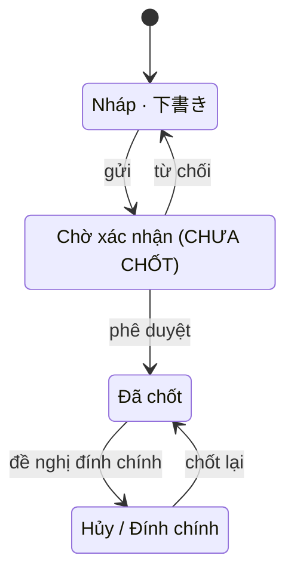

# SC-14 — Tra cứu bản ghi せり · Spec BE

| | |
|---|---|
| FE liên quan | FE-019 (Tra cứu bản ghi せり và lịch sử sửa) |
| FN | FN-05 (Ghi nhận kết quả đấu giá せり) |
| Ưu tiên | P1 |
| Yêu cầu khách | FR-SERI-03 · kế thừa FR-SERI-01, FR-SERI-02, FR-AUDIT-01, FR-CORR-01, FR-CORR-03, BR-CLOSE-01, FR-PARTY-02, BR-PERM-01, FR-LOT-03, BR-LOT-02, NFR-PERF-01 |
| Miền dữ liệu | D-TRADE (chính) · D-LOT · D-PARTY |
| State machine | FIG-012 (RFP:637) — cách ánh xạ lên bản ghi せり còn `[CHƯA CHỐT]` (§9 Q1) |
| Đã thi công | Một phần |

## 1. Phạm vi backend của màn này

Thoả trọn `FR-SERI-03` (RFP:655): *"cho phép tra cứu lại bản ghi せり và lịch sử chỉnh sửa"*, nghiệm
thu *"Tra cứu lại được before/after và lý do chỉnh sửa"*. Ba việc: tìm bản ghi theo mã lô / ngày
nghiệp vụ / người thắng; đọc chi tiết kèm toàn bộ lịch sử before/after; và **sửa có kiểm soát** năm
trường của `FR-SERI-02` (RFP:654) với lý do bắt buộc.

**Không** làm: ghi bản ghi mới (SC-13); hủy bản ghi hoặc đổi lô — ghi sai lô thì đi đường `FR-CORR-01`
(RFP:656) qua SC-20; điều chỉnh sau khi ngày đã lock (SC-20, SC-21); bảng đối chiếu ngày (SC-18);
sinh báo cáo (SC-25, SC-26 — màn này chỉ cấp dữ liệu nguồn cho RPT-10 và RPT-11).

## 2. Hợp đồng API

### `GET /api/seri-results`

Thoả FE-019 · FR-SERI-03 · NFR-PERF-01 (RFP:807). Xác thực bắt buộc; **mọi vai đang hoạt động** gọi được (đọc mở để đối chiếu chéo); idempotent (đọc).

**Request**

| Tham số | Vị trí | Kiểu | Bắt buộc | Ràng buộc | Nguồn yêu cầu |
|---|---|---|---|---|---|
| `lotCode` | query | string | không | khớp **một phần** mã lô — thiếu một ký tự không được ra rỗng | FR-SERI-03 |
| `businessDate` | query | date | không | đúng `YYYY-MM-DD` | FR-SETTLE-01 (RFP:659) |
| `winnerName` | query | string | không | khớp một phần tên; ký tự đại diện phải được vô hiệu hoá | RPT-10, RPT-11 |
| `page`, `pageSize` | query | integer | không | `pageSize` mặc định 50, tối đa 200 | NFR-PERF-02 (RFP:808) |

**Response 200:** `items[]` (`id`, `lotCode`, `winnerName`, `qty`, `unitPrice`, `decidedAt`,
`businessDate`, `editCount`) · `page`, `pageSize`, `totalCount`. `businessDate` bắt buộc có mặt vì nó
là **tiêu chí lọc** — lọc theo một trường mà không thấy trường đó thì người dùng không tự kiểm được;
`editCount` là đường vào tự nhiên của `FR-SERI-03`; `totalCount` bắt buộc vì cấm cắt kết quả im lặng.

| HTTP | Mã nghiệp vụ | Điều kiện phát sinh | Yêu cầu |
|---|---|---|---|
| 422 | `business_date_invalid` | `businessDate` không đúng định dạng ngày | FR-SETTLE-01 |
| 422 | `page_size_invalid` | `pageSize` không phải số nguyên trong `[1, 200]` | NFR-PERF-02 |

### `GET /api/seri-results/{id}`

Thoả FE-019 · FR-SERI-02 · FR-SERI-03 · FR-AUDIT-01 (RFP:710). Xác thực bắt buộc; mọi vai đang hoạt động gọi được; idempotent (đọc).

**Response 200:** năm trường của FR-SERI-02 cộng `lot` (`lotCode`, `item`) · `businessDate` ·
`version` (dùng cho `PATCH`, §9 Q4) · `businessDayLocked` (boolean — để màn render form ở dạng chỉ
đọc **trước** khi người dùng bấm) · `history[]` (`occurredAt`, `actorName`, `fieldLabel`,
`valueBefore`, `valueAfter`, `reason`) mới nhất trước, **một phần tử cho mỗi trường đã đổi**.

`fieldLabel` là **nhãn nghiệp vụ**, không phải tên cột kỹ thuật — nghiệm thu `FR-SERI-03` là người
kiểm toán đọc lại được, nên dịch tên trường thuộc hợp đồng API chứ không thuộc màn.

| HTTP | Mã nghiệp vụ | Điều kiện phát sinh | Yêu cầu |
|---|---|---|---|
| 404 | `not_found` | không có bản ghi với `id` đó | FE-019 |

### `PATCH /api/seri-results/{id}`

Thoả FE-019 · FR-SERI-03 (RFP:655) · FR-AUDIT-01. Xác thực bắt buộc; vai được gọi: **ROLE-TRADE và
ROLE-SETTLEMENT** (allowlist 2 vai, §6). **Không** idempotent — mỗi lần gọi có đổi giá trị là một dòng lịch sử mới.

**Request**

| Tham số | Vị trí | Kiểu | Bắt buộc | Ràng buộc | Nguồn yêu cầu |
|---|---|---|---|---|---|
| `winnerParticipantId` | body | uuid | không | tồn tại; **còn hiệu lực** 許可/承認 | FR-SERI-02, FR-PARTY-02 (RFP:630) |
| `qty` | body | decimal(12,2) | không | `> 0`; không làm `available_qty` của lô âm | FR-SERI-02, FR-LOT-03 (RFP:634) |
| `unitPrice` | body | integer | không | `> 0`; JPY không có phần thập phân | FR-SERI-02 |
| `decidedAt` | body | timestamp | không | không ở tương lai | FR-SERI-02 |
| `confirmedBy` | body | uuid | không | tài khoản nội bộ đang hoạt động | FR-SERI-02 |
| `reason` | body | string | **có** | trim còn `> 0` ký tự — không có lý do thì **không ghi gì** | FR-SERI-03, FR-AUDIT-01 |
| `version` | body | integer | **có** | phải khớp `version` hiện tại của bản ghi | §9 Q4 |

**Server không nhận:** `lotId` (lô là định danh bản ghi — đổi lô đi đường FR-CORR-01) và `businessDate` (§9 Q3). Năm trường dữ liệu đều **tuỳ chọn**; ít nhất một trường phải khác giá trị hiện tại.

**Response 200:** bản ghi sau khi sửa · `version` mới · `changedFields[]` (nhãn nghiệp vụ đã đổi) · `lotAvailableQty` (sau khi điều chỉnh).

| HTTP | Mã nghiệp vụ | Điều kiện phát sinh | Yêu cầu |
|---|---|---|---|
| 400 | `invalid_json` | body không phải JSON hợp lệ | — |
| 422 | `reason_required` | `reason` thiếu hoặc trim còn rỗng | FR-SERI-03, FR-AUDIT-01 |
| 422 | `no_change` | không trường nào khác giá trị hiện tại | FR-SERI-03 (không được báo đã ghi lịch sử khi không ghi gì) |
| 422 | `qty_invalid` · `unit_price_invalid` · `decided_at_in_future` · `confirmer_invalid` | một mã riêng cho từng trường: `qty` không phải số `> 0`; `unitPrice` không phải số nguyên `> 0`; `decidedAt` ở tương lai; `confirmedBy` không phải tài khoản đang hoạt động | FR-SERI-02 |
| 422 | `ineligible_party` | người thắng mới không còn hiệu lực 許可/承認 | FR-PARTY-02, BR-PERM-01 (RFP:595) |
| 422 | `insufficient_qty` | `qty` mới làm `available_qty` của lô bị âm | FR-LOT-03, BR-LOT-02 (RFP:596) |
| 409 | `version_conflict` | `version` không khớp — bản ghi đã bị người khác sửa | §9 Q4 |
| 423 | `business_day_locked` | ngày nghiệp vụ của bản ghi đã bị lock | FR-CORR-03 (RFP:658), BR-CLOSE-01 (RFP:597) |
| 404 | `not_found` | bản ghi không tồn tại **hoặc** vai gọi ngoài allowlist 2 vai | TBL-ROLE-01 (RFP:245) |

Mã 423 **phải mang đúng nguyên nhân** — "ngày nghiệp vụ đã lock" cùng đường ra SC-20/SC-21; một câu
nói sai nguyên nhân làm người dùng thử lại vô hạn (§10). **Tác dụng phụ:** UPDATE **chỉ những cột
thật sự đổi** trên `D-TRADE`; điều chỉnh `available_qty` của `D-LOT` theo phần chênh lệch của `qty`;
ghi **một dòng audit cho mỗi trường đã đổi** kèm `before`/`after`/`reason`; nhánh 423 ghi audit
`locked_write_attempt` (§7).

## 3. Mô hình dữ liệu màn này chạm

| Thực thể | Cột dùng | Ràng buộc thiết kế đòi | Tầng thực thi | Đã có? |
|---|---|---|---|---|
| `seri_result` (D-TRADE) | `winner_participant_id`, `qty`, `unit_price`, `decided_at`, `confirmed_by` | năm trường FR-SERI-02 đều sửa được và mỗi lần đổi để lại một dòng lịch sử | 1 (NOT NULL, CHECK) + 3 (ghi lịch sử) | cột có; `confirmed_by` **cho phép rỗng** |
| `seri_result` | `lot_id` | **bất biến sau khi tạo** — lô là định danh bản ghi | 2 (trigger — CHECK không thấy giá trị cũ) | **chưa có** |
| `seri_result` | `version` (hoặc `updated_at`) | phát hiện bản ghi đã bị người khác sửa — §9 Q4 | 1 + 3 (so sánh khi ghi) | **chưa tồn tại** |
| `seri_result` | `business_date` · trạng thái vòng đời | không sửa được khi ngày đã lock; một trục trạng thái theo FIG-012 (§9 Q1) | 2 (trigger) · 1 (CHECK) | lock: có · trạng thái: **KHÔNG CÓ cột nào** |
| `lot` (D-LOT) | `available_qty` | `>= 0` sau khi điều chỉnh phần chênh lệch của `qty` — BR-LOT-02 | 1 (CHECK) + 1 hoặc 2 cho phép điều chỉnh | CHECK có; **kênh せり không chạm** |
| `participant` (D-PARTY) | `status`, `valid_from`, `valid_to` | đủ dữ liệu để đánh giá hiệu lực tại một thời điểm | 1 (CHECK trạng thái FIG-010) | có |
| `audit_log` | `actor_id`, `before`, `after`, `reason`, `created_at` | append-only; **một dòng cho mỗi trường đã đổi**; `reason` không rỗng | 1 (NOT NULL trên `reason` cho `action='update'`) + 3 | bảng có; **`reason` không bắt buộc ở tầng dữ liệu** |

Vì thực thể không có trục trạng thái, `audit_log` là nguồn **duy nhất** đáp ứng `FR-SERI-03` — nên
ràng buộc "`reason` không rỗng cho thao tác sửa" là ràng buộc **P0 của màn này**, đang ở tầng 3 trong
khi thiết kế đòi tầng 1.

## 4. Vòng đời trạng thái

`FIG-012` (RFP:637) phủ cả bản ghi せり (xem SC-13 §4). Màn này chạm **một** sự kiện: `sửa trực tiếp`
— sự kiện không đổi chặng, nhưng đổi dữ liệu của một bản ghi thuộc đối tượng kiểm toán.

| Từ | Sự kiện | Đến | Guard | Ai được phép | Mã lỗi khi vi phạm |
|---|---|---|---|---|---|
| chặng hiện tại | sửa trực tiếp | **chặng không đổi** | `reason` không rỗng; có ít nhất một trường đổi; `version` khớp; người thắng mới còn hiệu lực; `qty` mới không làm tồn lô âm; **ngày chưa lock** — và §9 Q2 | ROLE-TRADE, ROLE-SETTLEMENT | 422 `reason_required` · 422 `no_change` · 409 `version_conflict` · 422 `ineligible_party` · 422 `insufficient_qty` · 423 `business_day_locked` |
| Đã chốt | đề nghị đính chính | Hủy / Đính chính | có yêu cầu điều chỉnh **đã được duyệt** — FR-CORR-01 (RFP:656), FR-CORR-02 (RFP:657) | ROLE-SETTLEMENT (SC-20/21) | 409 `illegal_transition` |
| Hủy / Đính chính | chốt lại | Đã chốt | reverse/delta đã sinh — FR-CORR-02 | ROLE-SETTLEMENT (SC-21) | 409 `illegal_transition` |

Guard dễ mất nhất: **`version` phải được kiểm cùng lúc với phép ghi**, không kiểm rồi mới ghi. Đọc-
kiểm-rồi-ghi thì hai người sửa đồng thời vẫn ghi đè nhau và `before` trong lịch sử của người sau là
giá trị *người đó đã đọc* — đúng chỗ chuỗi before/after mà `FR-SERI-03` dựa vào bị lệch.

## 5. Quy tắc nghiệp vụ

| Mã | Quy tắc (nguyên văn nguồn) | Thực thi ở đâu | Kiểm bằng gì |
|---|---|---|---|
| `FR-SERI-03` (RFP:655) | "phải cho phép tra cứu lại bản ghi せり và lịch sử chỉnh sửa" · nghiệm thu "Tra cứu lại được before/after **và lý do** chỉnh sửa" | `reason` bắt buộc ở tầng 1; một dòng audit cho mỗi trường đã đổi; `GET` chi tiết trả `history[]` với nhãn nghiệp vụ | test: sửa hai trường trong một lần gọi → đúng hai dòng lịch sử; đọc lại thấy đủ before/after/lý do |
| `FR-SERI-02` (RFP:654) | "phải lưu người thắng, số lượng, đơn giá, thời điểm và người xác nhận" | cả năm trường **đều** nằm trong `PATCH`; trường nào form cho sửa thì server phải đọc | test: sửa từng trường trong năm trường → mỗi lần có đúng một dòng lịch sử; **không trường nào bị bỏ im lặng** |
| `BR-PERM-01` (RFP:595) · `FR-PARTY-02` (RFP:630) | "kiểm tra hiệu lực 許可/承認 tại thời điểm giao dịch / chốt giao dịch" | guard trước khi ghi người thắng mới | test: đổi sang người tham gia đã mất hiệu lực → 422 `ineligible_party`; không ghi gì |
| `BR-LOT-02` (RFP:596) · `FR-LOT-03` (RFP:634) | "Số lượng khả dụng của lô hàng không được âm, và phải truy vết được tới lịch sử điều chỉnh" | tầng 1 CHECK + điều chỉnh phần chênh lệch + audit | test: tăng `qty` vượt tồn còn lại → 422 `insufficient_qty`; giảm `qty` → tồn được hoàn đúng phần chênh |
| `BR-CLOSE-01` (RFP:597) · `FR-CORR-03` (RFP:658) | "Không được chỉnh sửa trực tiếp ngày nghiệp vụ đã bị lock" · "Mọi lần thử sửa trực tiếp đều bị chặn **và có log**" | tầng 2 trigger + audit `locked_write_attempt` + thông báo mang **đúng nguyên nhân** | test: lock ngày rồi `PATCH` → 423 với mã `business_day_locked` và có một dòng audit |
| `FR-AUDIT-01` (RFP:710) | audit cho tạo, sửa, phê duyệt, lock, đổi quyền kèm chủ thể, timestamp, before/after và lý do | ghi trong cùng biên với phép sửa | test: audit lỗi → thay đổi không được coi là đã ghi |

Không có con số nghiệp vụ nào riêng của màn này. Ngưỡng `pageSize` (mặc định 50; tối đa 200) là
**quyết định thiết kế** dẫn từ `FIG-LOAD-01` (RFP:829), không phải số của khách.

## 6. Ma trận phân quyền theo thao tác

| Vai trò | Vào trang | `GET` danh sách | `GET` chi tiết | `PATCH` sửa | Tạo mới (SC-13) |
|---|---|---|---|---|---|
| ROLE-TRADE | cho phép | cho phép | cho phép | cho phép | cho phép |
| ROLE-SETTLEMENT | cho phép | cho phép | cho phép | cho phép | **404** `not_found` |
| 5 vai còn lại — ROLE-INTAKE · ROLE-JUDGE · ROLE-DELIVERY · ROLE-RULE-ADMIN · ROLE-SYS-ADMIN | cho phép | cho phép | cho phép | **404** `not_found` | **404** |

- **Đọc và ghi khác nhau.** Không chặn vào trang theo vai — mọi vai đang hoạt động đọc được bản ghi
  và lịch sử để đối chiếu chéo; chặn chỉ nằm ở `PATCH` và trả **404 chứ không 403**, có chủ đích.
- **Allowlist 2 vai cho việc sửa là có chủ đích**, khác danh sách vai của việc tạo mới: `TBL-ROLE-01`
  (RFP:245) giao ROLE-SETTLEMENT việc "đối chiếu, chốt kỳ" và ghi "Điều chỉnh quyết toán" là thao tác
  độ nhạy cao của vai đó — nên vai đó sửa được nhưng không ghi mới được. **Quyền theo vai, không theo
  người tạo bản ghi.** Không cần maker-checker: `GOV-RULE-01` (RFP:601) chỉ áp cho thay đổi biểu suất.

## 7. Audit và truy vết

| Thao tác | `action` | Ghi gì (before/after/reason) | Yêu cầu RFP |
|---|---|---|---|
| Sửa một trường | `update` | **một dòng cho mỗi trường đã đổi**: `before`, `after`, `reason` bắt buộc, chủ thể, timestamp; riêng `qty` thêm `available_qty` trước/sau của lô | FR-SERI-03, FR-AUDIT-01, BR-LOT-02 |
| Bị chặn vì ngày đã lock | `locked_write_attempt` | `after` = payload bị từ chối; `reason` = ngày nghiệp vụ bị lock | FR-CORR-03 |
| Bị chặn vì thiếu quyền hoặc xung đột phiên bản | `denied_write_attempt` | chủ thể; vai; endpoint; mã từ chối | FR-AUDIT-01, NFR-SEC-03 (RFP:811) |
| Sửa mà không đổi gì | **không ghi** | trả 422 `no_change` — không được báo đã ghi lịch sử khi không ghi gì | FR-SERI-03 |

`GET` không ghi audit. Audit phải nằm cùng biên với phép sửa — ghi audit thất bại mà thay đổi vẫn nằm
lại thì bản ghi mất dấu lý do, đúng chỗ `FR-SERI-03` quan tâm nhất.

## 8. Phi chức năng áp cho màn này

| Mã | Yêu cầu | Ảnh hưởng thiết kế BE |
|---|---|---|
| `NFR-PERF-01` (RFP:807) | tìm kiếm thông thường p95 ≤ 2 giây với tải thiết kế baseline | ba tiêu chí tìm đều cần chỉ mục hỗ trợ; `lotCode` và `winnerName` khớp một phần nên cần chỉ mục phù hợp với kiểu khớp đã chốt, không được quét toàn bảng |
| `NFR-PERF-02` (RFP:808) | `FIG-LOAD-01` (RFP:829) — dữ liệu tra cứu online **7 năm** | danh sách **phải** phân trang có `totalCount` vì tra cứu bắc qua nhiều năm; `GET` chi tiết chỉ trả `history[]` của một bản ghi nên không đụng ngưỡng |
| `NFR-SEC-03` (RFP:811) | log hành vi bất thường | `PATCH` bị 404 vì thiếu quyền và bị 409 vì xung đột phiên bản đều phải vào audit (§7) |

## 9. Câu hỏi cho chủ đầu tư

- **Q1 — FIG-012 ánh xạ lên bản ghi せり thế nào? Tài liệu khách tự chống nhau.** Phía **có trạng
  thái**: `FIG-012` (RFP:637) ghi trong tiêu đề rằng đây là "trạng thái của bản ghi 相対取引 **và**
  せり" và là "các trạng thái thuộc đối tượng kiểm toán". Phía **không**: `FR-SERI-01` (RFP:653) nói
  "**chỉ** ghi nhận kết quả **cuối cùng**"; `FR-SERI-02` (RFP:654) và `FR-SERI-03` (RFP:655) cùng
  `FE-019` không nhắc trạng thái nào. Cần trước khi code vì cột `Trạng thái` trên màn tra cứu và khả
  năng lọc theo chặng đều phụ thuộc câu trả lời. **Hỏi cùng lúc với SC-13 §9 Q2 và SC-11 §9 Q1** —
  một vòng đời dùng chung thì không thể có ba đáp án.
- **Q2 — Sửa trực tiếp một bản ghi せり đã chốt (ngày chưa lock) có hợp lệ không? Tài liệu khách tự
  chống nhau.** Phía **hợp lệ**: `FR-SERI-03` (RFP:655) nói thẳng là có "lịch sử **chỉnh sửa**" với
  before/after và lý do, bối cảnh điều khoản là "tra cứu sau khi có đính chính"; `FR-CORR-03`
  (RFP:658) chỉ chặn sửa trực tiếp với **ngày đã lock**, ngụ ý trước lock thì được. Phía **không hợp
  lệ**: `FR-CORR-01` (RFP:656) đòi "yêu cầu điều chỉnh đối với giao dịch **đã chốt**, kèm lý do, bằng
  chứng đính kèm và trạng thái phê duyệt", nghiệm thu "giao dịch gốc **không bị thay đổi trước khi
  được phê duyệt**" — không giới hạn theo lock. Nếu bản ghi せり vào hệ thống ở chặng `Đã chốt` (Q1)
  thì mọi lần sửa trực tiếp ở màn này vi phạm điều khoản đó. Cần trước khi code vì hai cách hiểu cho
  hai kiến trúc khác hẳn: một `PATCH` có lý do bắt buộc, hay một luồng yêu cầu-phê duyệt có đính kèm.
- **Q3 — Sửa `decidedAt` có kéo theo đổi ngày nghiệp vụ của bản ghi không?** Gắn với SC-13 §9 Q1:
  nếu ngày nghiệp vụ bám `decidedAt` thì một lần sửa có thể chuyển bản ghi sang kỳ đối chiếu khác —
  hoặc sang một kỳ **đã lock**, và lúc đó phép sửa phải bị chặn vì lý do khác.
- **Q4 — Thêm cột phiên bản để phát hiện sửa đồng thời có được chấp nhận không?** Thiết kế chỉ đòi
  "phát hiện được và cho người sau đọc lại giá trị mới trước khi ghi". Nếu khách không muốn thêm cột
  thì phải chốt: ai ghi sau thắng và ghi đè (làm chuỗi before/after của `FR-SERI-03` đọc lệch) hay
  bị từ chối.

## 10. Prototype hiện làm khác gì

| Hạng mục | Thiết kế đòi | Prototype làm | Dẫn chứng | Mức |
|---|---|---|---|---|
| Sửa người thắng | FR-SERI-02 + FR-SERI-03 — trường nào form cho sửa thì server phải đọc và ghi lịch sử | client gửi `winnerParticipantId` nhưng **server bỏ im lặng trường đó** → trả 200, form báo thành công, dữ liệu không đổi và lịch sử không ghi gì | `src/app/api/seri-results/[id]/route.ts:17-43`; `src/components/seri/seri-entry-form.tsx:98-118` | khác không chủ đích — **P0**, mất thay đổi im lặng ngay trên màn phục vụ kiểm toán |
| Sửa đồng thời | §9 Q4 — phát hiện được và buộc đọc lại | không có cột phiên bản và không so sánh khi ghi: ai ghi sau thắng và ghi đè im lặng | `src/app/api/seri-results/[id]/route.ts:68,99` | khác không chủ đích — **P0** |
| Trục trạng thái | FIG-012 (RFP:637) — lọc và hiện được theo chặng | thực thể **không có cột trạng thái nào** nên màn tra cứu không có gì để hiện hay lọc | `supabase/migrations/20260904090300_transaction.sql:31-41` | cần khách chốt (§9 Q1) + khác không chủ đích |
| Nguyên nhân của 423 và của mọi từ chối | mỗi nhánh một mã riêng; 423 mang **đúng** nguyên nhân là ngày đã lock | mọi mã lỗi hiện cùng một câu "Bạn phải nhập lý do trước khi lưu thay đổi." nên người dùng nhập lại lý do và thử mãi | `src/components/seri/seri-entry-form.tsx:110-113` | khác không chủ đích — **P0** |
| Audit lần thử bị lock | FR-CORR-03 (RFP:658) — mọi lần thử bị chặn **và có log** | nhánh 423 ở đây **không** ghi audit, khác với nhánh hủy của giao dịch 相対取引 | `src/app/api/seri-results/[id]/route.ts:101-103` | khác không chủ đích |
| Nhãn trường và cột ngày | FR-SERI-03 — tên trường đọc được; tiêu chí lọc phải thấy trong kết quả | thiếu nhãn cho `confirmed_by` → dòng lịch sử hiện tên cột `snake_case`; bảng danh sách **không có cột ngày nghiệp vụ** dù lọc theo ngày | `src/components/audit/audit-field-maps.ts:40-48`; `src/lib/seri/seri-queries.ts:66-99` | thiếu, mức nhỏ |
| Audit cùng biên | FR-AUDIT-01 (RFP:710) | audit ghi **sau** khi UPDATE đã commit và không rollback được → thay đổi nằm lại mà mất dấu lý do | `src/lib/audit/write-audit-log.ts:44-50` | khác không chủ đích |
| Phân trang và cách khớp tiêu chí tìm | NFR-PERF-02 (dữ liệu online 7 năm); `lotCode` khớp một phần; ký tự đại diện bị vô hiệu hoá | cắt cứng 100 dòng không phân trang và không `totalCount`; `lotCode` khớp **chính xác** nên thiếu một ký tự là ra rỗng; `winnerName` khớp một phần nhưng không vô hiệu hoá ký tự đại diện | `src/lib/seri/seri-queries.ts:70,75-94` | khác không chủ đích |
| Sửa mà không đổi gì | 422 `no_change` | trả 200 với bản ghi cũ; không ghi audit nhưng UI báo "Đã lưu thay đổi và ghi audit log." | `src/app/api/seri-results/[id]/route.ts:95-97`; `src/components/seri/seri-entry-form.tsx:115` | khác không chủ đích |
| Cửa hiệu lực và cửa tồn lô khi sửa | FR-PARTY-02 · FR-LOT-03 | nhánh せり **không có cả hai cửa**; sửa `qty` không chạm `available_qty` của lô | `src/app/api/seri-results/[id]/route.ts:71-99` | khác không chủ đích — **P0** |
| Allowlist 2 vai cho việc sửa | ROLE-TRADE + ROLE-SETTLEMENT | **khớp** — đúng hai vai, và tạo mới chỉ ROLE-TRADE | `src/app/api/seri-results/[id]/route.ts:137` | khớp |

## 11. Dẫn chứng

- RFP:245 — `TBL-ROLE-01`, thao tác "Điều chỉnh quyết toán" của ROLE-SETTLEMENT · RFP:595-597, 601 — `BR-PERM-01`, `BR-LOT-02`, `BR-CLOSE-01`, `GOV-RULE-01`
- RFP:602-604 — `D-PARTY`, `D-LOT`, `D-TRADE` · RFP:630, 634 — `FR-PARTY-02`, `FR-LOT-03` · RFP:637 — `FIG-012` phủ cả bản ghi せり
- RFP:653-659 — `FR-SERI-01/02/03`, `FR-CORR-01/02/03`, `FR-SETTLE-01` · RFP:710 — `FR-AUDIT-01`
- RFP:807, 808, 811, 829 — `NFR-PERF-01/02`, `NFR-SEC-03`, `FIG-LOAD-01`
- Feature List `FE-018`, `FE-019`, `FE-041`
- `docs/lab4/20-architecture-design.md` § 4.3 và § 5.2 — FIG-012 cho せり; hai cửa bị bỏ sót
- `docs/lab4/spec/SC-14-tra-cuu-ban-ghi-seri.md` — bản as-built dùng cho §10
