# SC-15 — Danh sách giao hàng · Spec BE

| | |
|---|---|
| FE liên quan | FE-020 (Theo dõi trạng thái giao hàng) |
| FN | FN-06 (Quản lý giao nhận hàng) |
| Ưu tiên | P0 |
| Yêu cầu khách | FR-DEL-01, FR-DEL-05, FR-AUDIT-01, NFR-PERF-01, NFR-PERF-02, NFR-USE-01, NFR-COMP-01 |
| Miền dữ liệu | D-DELIVERY (chính) · D-TRADE |
| State machine | FIG-014 (RFP:693) — màn **quan sát** trạng thái, không tạo chuyển trạng thái nào |
| Đã thi công | Một phần |

## 1. Phạm vi backend của màn này

BE phải trả một tập dòng **một dòng cho một giao dịch có chỉ thị giao hàng**, mỗi dòng mang đủ bốn trạng thái của `FR-DEL-01` (RFP:681:
*"Tối thiểu có các trạng thái: chờ, đang giao, hoàn tất, ngoại lệ"*) cùng **lũy kế đã giao và số lượng còn lại** theo nghiệm thu
`FR-DEL-05` (RFP:685), và phải **lọc + phân trang ở tầng truy vấn**. **Không** thuộc phạm vi: mọi đường ghi — ghi lần giao và chốt hoàn
tất thuộc SC-16, ghi ngoại lệ thuộc SC-17; sinh `RPT-04` thuộc SC-26; ngưỡng "ùn tắc" để phát thông báo `FR-NOTIFY-01` (RFP:686) chưa có
con số nên nằm ở mục 9.

## 2. Hợp đồng API

### `GET /api/deliveries`

| | |
|---|---|
| Thoả yêu cầu | FE-020 · FR-DEL-01 · FR-DEL-05 |
| Xác thực | bắt buộc |
| Vai trò được gọi | mọi vai trò đang hoạt động — xem mục 6 |
| Idempotent | có — chỉ đọc |

**Request**

| Tham số | Vị trí · Kiểu | Bắt buộc | Ràng buộc | Nguồn yêu cầu |
|---|---|---|---|---|
| `businessDate` | query · date | không | `YYYY-MM-DD`, ngày thật, **không nhận ngày tương lai** (neo JST) | FR-DEL-01 · §02-07 RFP:301-305 |
| `status` | query · enum | không | đúng **4** giá trị `FR-DEL-01`; nhiều giá trị thì lặp tham số | FR-DEL-01 RFP:681 |
| `txnCode` | query · string | không | ≤ 32 ký tự sau khi trim; cách khớp (đúng cả mã hay một phần) ở mục 9 câu 3 | FR-DEL-01 |
| `participantId` | query · uuid | không | phải là người tham gia tồn tại | FR-PARTY-01 RFP:629 |
| `page` · `pageSize` | query · integer | không | `page ≥ 1`; `pageSize` thuộc tập cố định do server công bố — mục 9 câu 2 | NFR-PERF-01 RFP:807 |

**Server tự quyết, không nhận từ client:** thứ tự sắp (ngày nghiệp vụ giảm dần, trong cùng ngày thì dòng **còn hàng chưa giao** lên
trước), trần `pageSize`, và tập trạng thái hợp lệ.

**Response 2xx**

| Trường | Kiểu | Ý nghĩa |
|---|---|---|
| `rows[].txnCode` | string | mã giao dịch — cửa vào SC-16 |
| `rows[].participantName` | string | **tên hiển thị** người tham gia; không trả thông tin liên hệ (§09-06 RFP:883) |
| `rows[].businessDate` | date | ngày nghiệp vụ **của giao dịch** |
| `rows[].orderedQty` · `deliveredQty` · `remainingQty` | numeric(12,2) | số lượng đặt · lũy kế đã giao · còn lại (`FR-DEL-05`) |
| `rows[].shipmentCount` | integer | số lần giao đã xác nhận (`FR-DEL-05`) |
| `rows[].status` | enum 4 | một trong bốn trạng thái `FR-DEL-01` |
| `rows[].openExceptionCount` | integer | số ngoại lệ đang mở — nguồn của trạng thái `ngoại lệ` (`FR-DEL-03`) |
| `page.total` · `page.number` · `page.size` | integer | dữ liệu phân trang |

`remainingQty` luôn `max(0, orderedQty - deliveredQty)` làm tròn hai chữ số thập phân — chốt một chỗ ở server để client và báo cáo không
tự tính khác nhau.

**Mã lỗi**

| HTTP | Mã nghiệp vụ | Điều kiện phát sinh | Yêu cầu RFP |
|---|---|---|---|
| 400 | `INVALID_BUSINESS_DATE` | `businessDate` sai định dạng, không phải ngày thật, hoặc là ngày tương lai | FR-DEL-01 |
| 400 | `INVALID_STATUS` | `status` ngoài 4 giá trị của `FR-DEL-01` | FR-DEL-01 RFP:681 |
| 400 | `INVALID_PAGE` | `page < 1` hoặc `pageSize` ngoài tập server công bố | NFR-PERF-01 |
| 404 | — | vai trò không được vào tài nguyên (404 thay 403, xem mục 6) | §02-08 RFP:311 |
| 500 | `INTERNAL_ERROR` | lỗi tầng dữ liệu khi tổng hợp danh sách | NFR-OPS-01 RFP:814 |

**Tác dụng phụ** — không ghi bảng nào; **không** ghi audit (đọc không nằm trong tập hành vi của `FR-AUDIT-01` RFP:710); không phát thông
báo.

> Ba mã 400 phải **phân biệt được** với kết quả rỗng hợp lệ (`200` + `rows: []`). Trả rỗng cho một
> tham số sai là làm người dùng không phân biệt *"nhập sai"* với *"ngày đó không có hàng"*.

## 3. Mô hình dữ liệu màn này chạm

| Thực thể | Cột dùng | Ràng buộc thiết kế đòi | Tầng thực thi | Đã có? |
|---|---|---|---|---|
| `delivery` | `id`, `transaction_id`, `status`, `delivered_qty` | `status` thuộc đúng 4 giá trị `FR-DEL-01`; `delivered_qty ≥ 0` | tầng 1 | có |
| `delivery` | `delivered_qty` | không vượt `transaction.qty` trừ khi có ngoại lệ giao thừa | tầng 3 (vòng so-rồi-ghi) | một phần — mục 10 |
| `transaction` | `txn_code`, `business_date`, `qty`, `buyer_participant_id`, `status` | `qty > 0`; `business_date` không rỗng; chỉ giao dịch **đã chốt** vào danh sách | tầng 1 (hai đầu) + tầng 3 (lọc trạng thái) | có |
| `participant` | `name` | chỉ trả tên hiển thị ra ngoài | tầng 3 | có |
| `delivery_shipment` | `delivery_id`, `seq`, `qty` | đếm số lần giao theo phiếu; `unique (delivery_id, seq)` | tầng 1 | có |
| Ngoại lệ giao hàng | `delivery_id`, `kind`, `resolved_at` | đếm ngoại lệ đang mở để suy ra trạng thái `ngoại lệ` | tầng 1 (khoá ngoại) + tầng 3 (đếm) | **chưa** — thực thể chưa tồn tại, xem SC-17 |
| Chỉ mục theo ngày | `transaction.business_date`, `delivery.status` | truy vấn một ngày cao điểm trong ngưỡng `NFR-PERF-01` | tầng 1 | một phần — mục 10 |

Ràng buộc P0 của màn (`status` 4 giá trị, `delivered_qty ≥ 0`) nằm ở **tầng 1** — đúng chỗ. Chỗ còn ở **tầng 3** là quan hệ giữa
`delivered_qty` và `transaction.qty`: không ràng buộc dữ liệu nào nối hai bảng được nên nó phải là cửa kiểm ở tầng ứng dụng, và mục 9 câu
1 mới quyết định được cửa đó chặn ở đâu.

## 4. Vòng đời trạng thái

Màn này **chỉ quan sát**. Bốn trạng thái là của `FR-DEL-01` (RFP:681); các cạnh chuyển đến từ `FIG-029` (RFP:714) và nhánh *"có chênh
lệch"* của `FIG-014` (RFP:693) và **được thi hành ở màn khác**.

```mermaid
stateDiagram-v2
  [*] --> Cho: giao dịch chốt xong; lập phiếu giao hàng
  Cho --> DangGiao: ghi lần giao đầu (SC-16)
  DangGiao --> DangGiao: ghi lần giao tiếp theo; còn lại lớn hơn 0
  DangGiao --> HoanTat: chốt hoàn tất qua cổng kiểm (SC-16)
  Cho --> NgoaiLe: ghi ngoại lệ (SC-17)
  DangGiao --> NgoaiLe: ghi ngoại lệ (SC-17)
  NgoaiLe --> DangGiao: ngoại lệ được xử lý xong (SC-17)
```

| Từ | Sự kiện | Đến | Điều kiện tiền đề (guard) | Ai được phép | Mã lỗi khi vi phạm |
|---|---|---|---|---|---|
| — | mở danh sách | — | phiên đăng nhập còn hiệu lực | mọi vai đang hoạt động | 404 sai vai (mục 6) |
| Chờ · Đang giao · Hoàn tất · Ngoại lệ | **không có cạnh nào từ màn này** | — | màn không có đường ghi | không ai | không phát sinh |
| Đã lock | đọc dòng của ngày đã lock | — | lock chặn **ghi**, không chặn **đọc** | mọi vai đang hoạt động | không phát sinh |

Guard dễ mất nhất ở màn này không nằm trên cạnh mà nằm trên **cách suy ra trạng thái**: `ngoại lệ` không phải một trạng thái do người dùng
đặt mà là **hệ quả** của việc còn ngoại lệ đang mở. Nếu BE lưu nó như một giá trị tự do thì hai nguồn (`status` và số ngoại lệ đang mở) sẽ
lệch nhau mà không ai phát hiện — xem mục 9 câu 4.

## 5. Quy tắc nghiệp vụ

| Mã | Quy tắc (nguyên văn nguồn) | Thực thi ở đâu | Kiểm bằng gì |
|---|---|---|---|
| FR-DEL-01 (RFP:681) | *"Hệ thống phải theo dõi trạng thái giao hàng của từng giao dịch, theo từng lần thực hiện."*; nghiệm thu *"Tối thiểu có các trạng thái: chờ, đang giao, hoàn tất, ngoại lệ"* | tầng 1 (tập giá trị) + tầng 3 (lọc và hiển thị đủ 4) | lọc lần lượt 4 trạng thái, mỗi lần trả đúng tập dòng của trạng thái đó |
| FR-DEL-05 (RFP:685) | nghiệm thu *"Với mỗi giao dịch, tính được số lượng đã giao lũy kế và số lượng còn lại"* | tầng 3 — server tính và trả cả hai số | so `deliveredQty` với tổng số lượng các lần giao của cùng phiếu |
| BR-LOT-02 (RFP:596) | *"Số lượng khả dụng của lô hàng không được âm, và phải truy vết được tới lịch sử điều chỉnh"* | tầng 1 (chặn âm) — màn chỉ đọc kết quả | `remainingQty` không bao giờ âm |
| FR-AUDIT-01 (RFP:710) | audit cho *"tạo, sửa, phê duyệt, lock và thay đổi quyền"* | không áp — màn không có hành vi nào trong tập đó | mục 7 |

Màn này **không có con số nghiệp vụ nào**. Hai con số bị đòi mà RFP không cho — `pageSize` và ngưỡng "ùn tắc" — nằm ở mục 9.

## 6. Ma trận phân quyền theo thao tác

| Vai trò | Xem danh sách | Lọc theo 4 tiêu chí | Mở chi tiết (SC-16) | Ghi bất kỳ |
|---|---|---|---|---|
| ROLE-DELIVERY | cho phép (điểm vào chung của khâu) | cho phép | cho phép | không có ở màn này |
| ROLE-SETTLEMENT | cho phép | cho phép | cho phép | không có ở màn này |
| ROLE-INTAKE · ROLE-JUDGE · ROLE-TRADE · ROLE-RULE-ADMIN · ROLE-SYS-ADMIN | **đề xuất** cho phép — xem dưới | cho phép | cho phép | không có ở màn này |

- **Đọc mở cho mọi vai là ĐỀ XUẤT của bên dự thầu, không phải yêu cầu khách.** Căn cứ duy nhất là §02-08 (RFP:311): *"Đơn vị dự thầu phải
  **đề xuất** cơ chế phân tách quyền và truy vết tương ứng với các vai trò nêu trên."* — RFP **giao cho bên dự thầu đề xuất**, không hề
  bắt đọc mở. Lý do đề xuất: đây là điểm vào chung của khâu giao nhận và cả bốn nhóm người dùng của **Hình 25** (RFP:313) đều cần thấy
  tiến độ trước khi chốt. Căng thẳng với §09-06 (APPI, RFP:886) nằm ở **mục 9 câu 5**.
- **Đọc và ghi là hai trục khác nhau.** Trục **ghi**: màn này không có thao tác ghi nào nên không có gì để chặn. Trục **đọc**: chặn theo
  vai trò hay không là câu hỏi mở ở mục 9 câu 5; hiện đề xuất không chặn. Lock kỳ (`BR-CLOSE-01` RFP:597) chặn **ghi**, không chặn **đọc**
  — dòng của ngày đã lock vẫn hiện đủ.
- **Chặn vào trang trả 404, không phải 403** — có chủ đích, không lộ sự tồn tại tài nguyên.
- **Không có maker-checker ở màn này**: `GOV-RULE-01` (RFP:601) áp cho thay đổi quy tắc và biểu suất, không áp cho một màn chỉ đọc.

## 7. Audit và truy vết

| Thao tác | `action` | Ghi gì (before/after/reason) | Yêu cầu RFP |
|---|---|---|---|
| Xem danh sách | **không ghi** | — | `FR-AUDIT-01` (RFP:710) liệt tạo · sửa · phê duyệt · lock · đổi quyền; **đọc không nằm trong tập đó** |
| Lần thử vào của vai trò không được phép | `delivery_list_access_denied` | chủ thể · thời điểm · đường vào · kết quả bị chặn | §02-08 RFP:310-311 — chỉ phát sinh nếu chốt chặn đọc theo vai (mục 9 câu 5) |

Đây là màn hiếm hoi **không** sinh audit nghiệp vụ. Điểm phải khai đúng: nếu chủ đầu tư chọn siết đọc theo vai trò, thì mỗi lần thử vào bị
chặn phải sinh **đúng một** dòng audit; và §09-06 (RFP:886) đòi *"log truy cập áp dụng cho thông tin cá nhân"* — nghĩa là danh sách này,
vì nó mang tên người tham gia, có thể lại **cần** log đọc. Hai hướng nằm ở mục 9 câu 5.

## 8. Phi chức năng áp cho màn này

| Mã | Yêu cầu | Ảnh hưởng thiết kế BE |
|---|---|---|
| NFR-PERF-01 (RFP:807) | tìm kiếm thông thường p95 ≤ 2 giây | lọc và phân trang **phải ở tầng truy vấn**; cần chỉ mục theo `transaction.business_date` và `delivery.status` |
| NFR-PERF-02 (RFP:808) | xử lý được profile tải `FIG-LOAD-01` mà không làm chậm tác vụ giao dịch cốt lõi | đây là truy vấn đọc nhiều bảng chạy đúng đoạn 05:00–08:00 (RFP:303); không đặt nó trong cùng đường ghi của giao dịch |
| NFR-USE-01 (RFP:816) | luồng ghi nhận giao hàng phải dùng được bằng bàn phím và có thông báo lỗi dễ hiểu | ba mã 400 ở mục 2 phải phân biệt được để client dịch ra ba câu lỗi khác nhau, không dùng một câu chung |
| NFR-COMP-01 (RFP:817) | thao tác được trên tablet tại hiện trường | trả `page.total` để client dựng phân trang không cần gọi thêm; không dựa vào cuộn vô hạn |
| NFR-AVL-01 (RFP:804) | 99,5% trong khung 02:00–10:00 JST | màn nằm giữa khung giờ dịch vụ; mất dịch vụ ở đây là mất khả năng theo dõi giao nhận của cả ngày |

## 9. Câu hỏi cho chủ đầu tư

1. **`BR-DEL-03` (RFP:599) treo lửng, và nó quyết định cả cột `remainingQty` của màn này.** Nguyên văn: *"Chỉ coi việc giao hàng là hoàn
   tất khi số lượng đã xác nhận khớp với **quy tắc quyết toán hiện hành**"* — RFP **không định nghĩa** "quy tắc quyết toán" ở bất kỳ đâu:
   không dung sai, không quy tắc làm tròn, không phiên bản theo ngày hiệu lực. *Vì sao cần trước khi code:* không có định nghĩa thì không
   biết `remainingQty` bằng `0` đã là "khớp" hay còn phải qua một biên dung sai. *Ảnh hưởng nếu chọn sai:* dòng hiện "còn lại 0" mà vẫn
   không chốt được — hoặc ngược lại.
2. **`pageSize` là bao nhiêu?** RFP không cho con số nào. `FIG-021` đặt ngày cao điểm ở khoảng một nghìn hai trăm giao dịch. *Ảnh hưởng
   nếu chọn sai:* quá lớn thì vỡ ngưỡng `NFR-PERF-01` (RFP:807), quá nhỏ thì hiện trường phải lật quá nhiều trang trong đoạn 05:00–08:00.
3. **`txnCode` khớp đúng cả mã hay khớp một phần?** RFP không nói, và không cho **định dạng** mã giao dịch. *Vì sao cần trước khi code:*
   khớp một phần là truy vấn khác hẳn về chỉ mục và về ngưỡng hiệu năng. *Ảnh hưởng nếu chọn sai:* hiện trường chỉ đọc được vài ký tự trên
   phiếu mà phải nhập đủ mã.
4. **Trạng thái `ngoại lệ` là giá trị lưu hay giá trị suy ra?** `FR-DEL-01` (RFP:681) liệt nó ngang hàng ba trạng thái kia; `FR-DEL-03`
   (RFP:683) thì đòi lưu **bản ghi** ngoại lệ. *Ảnh hưởng nếu chọn sai:* lưu như giá trị tự do thì `status` và số ngoại lệ đang mở lệch
   nhau; suy ra hoàn toàn thì mất khả năng đánh dấu một phiếu là ngoại lệ khi chưa có bản ghi nào.
5. **Ai được đọc danh sách này?** RFP không nói. §02-08 (RFP:311) giao Chủ đầu tư quyết người phụ trách mỗi cổng nghiệm thu và yêu cầu bên
   dự thầu **đề xuất** cơ chế phân tách quyền. Đề xuất của chúng tôi: mở đọc cho mọi vai đang hoạt động (mục 6). **Nhưng đây là đề xuất
   của bên dự thầu chống lại một yêu cầu của khách**: §09-06 (RFP:883-886) đòi tuân thủ APPI cho thông tin cá nhân người tham gia, nêu rõ
   *"kiểm soát truy cập theo vai trò (RBAC) và log truy cập"* — mà danh sách này mang tên người tham gia. Chúng tôi **không chọn hộ**: nếu
   Chủ đầu tư ưu tiên §09-06 thì phải siết đọc theo vai và bật log đọc, và khi đó mục 6, mục 7 của file này đổi theo.
6. **Ngưỡng "giao hàng ùn tắc" là gì?** `RPT-04` (RFP:747) và `FR-NOTIFY-01` (RFP:686) đều dùng chữ *"giao hàng bị ùn tắc"* nhưng RFP
   **không cho con số** — bao nhiêu ngày quá hạn, hay bao nhiêu phần trăm còn lại thì coi là ùn tắc. *Ảnh hưởng nếu chọn sai:* thông báo
   `Critical` bắn sai ngưỡng, và cột lọc của `RPT-04` không dựng được.
7. **Ngày nghiệp vụ của danh sách là ngày của giao dịch hay của từng lần giao?** `FR-DEL-01` (RFP:681) nói *"theo từng lần thực hiện"*;
   `FR-DEL-05` (RFP:685) nói *"cùng một giao dịch"* — hai chữ này cho hai tập dòng khác nhau khi một giao dịch trải nhiều ngày. *Ảnh hưởng
   nếu chọn sai:* một lần giao muộn hoặc mất khỏi danh sách của ngày, hoặc bị đếm hai lần.

## 10. Prototype hiện làm khác gì

| Hạng mục | Thiết kế đòi | Prototype làm | Dẫn chứng | Mức |
|---|---|---|---|---|
| Lọc đủ 4 trạng thái | lọc và hiện cả `ngoại lệ` (RFP:681) | danh sách chọn chỉ có **3** option; giá trị `'ngoại lệ'` tồn tại ở tầng CHECK nhưng **không đường ghi nào** đặt được nên badge có mà dữ liệu không bao giờ có | `src/app/(app)/deliveries/page.tsx:12-17`, `supabase/migrations/20260904090400_delivery.sql:10-11` | **Khác có chủ đích** — hệ quả của việc SC-17 chưa dựng; bỏ filter luôn-rỗng là xử lý đúng |
| Lọc và phân trang ở tầng truy vấn | mục 2 và mục 8 | `select` toàn bộ bảng rồi `.filter()` trong bộ nhớ; **không** `LIMIT`, không phân trang, không cursor | `src/lib/deliveries/delivery-queries.ts:16-19,37-38`, `src/app/api/deliveries/route.ts:11-24`; thiết kế RFP:807 | **Khác có chủ đích ở mức prototype** — trở thành nợ hiệu năng cho bản thật |
| 3 mã 400 phân biệt được | `INVALID_BUSINESS_DATE` · `INVALID_STATUS` · `INVALID_PAGE` | không kiểm định dạng ngày; trạng thái lạ bị **bỏ lọc im lặng** rồi trả cả bảng; chuỗi ngày sai chỉ cho danh sách rỗng | `src/app/(app)/deliveries/page.tsx:28`, `src/app/api/deliveries/route.ts:11-24` | **Khác không chủ đích** — người dùng không phân biệt "nhập sai" với "không có hàng" |
| Không nhận ngày tương lai | mục 2 | ô lọc **không có chặn trên**, khác SC-18 vốn có; ngày tương lai cho ra danh sách rỗng | `src/app/(app)/deliveries/page.tsx:39-70` | Khác không chủ đích |
| 8 cột theo mục 2 | có `participantName`, `remainingQty`, `shipmentCount`, `openExceptionCount` | bảng chỉ **5** cột; không có người tham gia, không có còn lại, không có số lần giao, không có đếm ngoại lệ | `src/components/deliveries/delivery-table.tsx:24-28,34-44` | Khác không chủ đích |
| Dòng thiếu giao dịch | báo lỗi hoặc khai rõ | hàng có `transaction` null bị **loại im lặng**; danh sách tự rút ngắn nếu sau này siết quyền đọc | `src/lib/deliveries/delivery-queries.ts:30` | Khác không chủ đích |
| Trạng thái theo **từng lần giao** | mỗi lần giao có trạng thái riêng (RFP:681) | chỉ **một** cột trạng thái ở cấp phiếu giao hàng; danh sách không thể hiện lần giao gần nhất | `supabase/migrations/20260904090400_delivery.sql:10-11`; thiết kế RFP:681 | Khác không chủ đích |
| Đọc mở cho mọi vai | mục 6 là **đề xuất** dẫn RFP:311 | prototype mở đọc cho mọi vai ở tầng dữ liệu, ghi vết bằng mã nội bộ LAB-3 **`FR-601`** (**mã nội bộ, không phải mã yêu cầu của khách**) | `supabase/migrations/20260904090900_rls_core.sql:29` | **Cần khách chốt** — mục 9 câu 5 |
| Ngưỡng ùn tắc cho `RPT-04` | mục 9 câu 6 | không có ngưỡng nào; `RPT-04` để dữ liệu mẫu | `src/lib/reports/registry.ts:89-96` | **Cần khách chốt** |

## 11. Dẫn chứng

- RFP:681 `FR-DEL-01` (nghiệm thu 4 trạng thái) · RFP:685 `FR-DEL-05` (lũy kế và còn lại) · RFP:683 `FR-DEL-03` (nguồn ngoại lệ)
- RFP:599 `BR-DEL-03` (*"quy tắc quyết toán hiện hành"* — **không định nghĩa ở đâu**) · RFP:596 `BR-LOT-02` · RFP:597 `BR-CLOSE-01`
- RFP:693 `FIG-014` · RFP:714 `FIG-029` · RFP:301-305 §02-07 khung giờ vận hành · RFP:313 Hình 25 bốn nhóm người dùng
- RFP:310-311 §02-08 (Chủ đầu tư quyết phân quyền; bên dự thầu **đề xuất**) · RFP:883-886 §09-06 APPI
- RFP:686 `FR-NOTIFY-01` (*"giao hàng bị ùn tắc"*, không cho ngưỡng) · RFP:747 `RPT-04` · RFP:710 `FR-AUDIT-01`
- RFP:804/807/808/814/816/817 `NFR-AVL-01`, `NFR-PERF-01/02`, `NFR-OPS-01`, `NFR-USE-01`, `NFR-COMP-01`
- Feature List `FE-020` (FN-06, P0) — `plans/260909-1355-lab4-thiet-ke-chi-tiet/nguon-function-list-va-feature-list.md`
- `docs/lab4/20-architecture-design.md` § 4.4 (`FIG-014`) · § 4.5 (`FIG-029`)
- `src/app/(app)/deliveries/page.tsx:12-17,28,39-70` · `src/lib/deliveries/delivery-queries.ts:16-19,30,37-38` ·
  `src/app/api/deliveries/route.ts:11-24`
- `src/components/deliveries/delivery-table.tsx:24-28,34-44` · `supabase/migrations/20260904090400_delivery.sql:10-11`
- `supabase/migrations/20260904090900_rls_core.sql:29` — đọc mở cho mọi vai, ghi vết bằng mã nội bộ LAB-3 `FR-601`
- `src/lib/reports/registry.ts:89-96` — `RPT-04` để dữ liệu mẫu
