# SC-16 — Chi tiết giao hàng và các lần giao · Spec BE

| | |
|---|---|
| FE liên quan | FE-020 (Theo dõi trạng thái), FE-021 (Giao hàng nhiều lần), FE-022 (Chốt hoàn tất), FE-024 (Liên kết giao hàng ↔ quyết toán) |
| FN | FN-06 (Quản lý giao nhận hàng) |
| Ưu tiên | P0 (FE-020, FE-022) · P1 (FE-021, FE-024) |
| Yêu cầu khách | FR-DEL-01, FR-DEL-02, FR-DEL-04, FR-DEL-05, BR-DEL-03, BR-CLOSE-01, FR-AUDIT-01, NFR-USE-01 |
| Miền dữ liệu | D-DELIVERY (chính) · D-TRADE · D-SETTLE |
| State machine | FIG-029 (RFP:714) vòng đời giao hàng một phần · nhánh *"có chênh lệch"* của FIG-014 (RFP:693) |
| Đã thi công | Một phần |

## 1. Phạm vi backend của màn này

BE phải: (a) trả chi tiết một phiếu giao hàng kèm **lũy kế đã giao và số lượng còn lại** (`FR-DEL-05` RFP:685) và sổ **từng lần giao**
(`FR-DEL-01` RFP:681); (b) nhận **một lần giao mới** với vòng lặp mở, không trần số lần (`FIG-029` RFP:714); (c) **chốt hoàn tất** chỉ khi
số lượng đã xác nhận khớp quy tắc quyết toán hiện hành (`FR-DEL-02` RFP:682 · `BR-DEL-03` RFP:599); (d) mở được quan hệ **hai chiều** sang
giao dịch và bản quyết toán (`FR-DEL-04` RFP:684). **Không** thuộc phạm vi: ghi ngoại lệ (SC-17), lập bảng đối chiếu và lock kỳ (SC-18),
đường sửa sau lock (SC-20 · SC-21), tính 完納奨励金 (SC-22).

## 2. Hợp đồng API

### `GET /api/deliveries/{id}`

Thoả `FE-020` · `FE-021` · `FE-024` · `FR-DEL-01` · `FR-DEL-04` · `FR-DEL-05`. Xác thực **bắt buộc**; vai trò xem mục 6; **idempotent** vì
chỉ đọc.

**Request** — `id` (path, uuid, bắt buộc): phiếu giao hàng tồn tại **và** đọc được giao dịch cha.

**Response 2xx** — `txnCode` · `participantName` (**tên hiển thị**, không trả thông tin liên hệ, §09-06 RFP:883) ·
`transactionBusinessDate` · `status` (enum 4 của `FR-DEL-01`) · `orderedQty` · `deliveredQty` · `remainingQty` · `shipments[]` (`seq`,
`shipmentCode`, `qty`, `shippedAt`, `businessDate` **của chính lần giao**, `confirmedByName`, `exception` = `{kind, qty}` hoặc `null`) ·
`links` (`lot`, `reconciliation`, `exceptions` — cả ba **luôn có**, không phụ thuộc ngày đã lock) · `gates[]` (bốn cổng kiểm ở mục 4, mỗi
cổng `{code, passed, reason}`).

`gates[]` là câu trả lời của **server** cho *"nút chốt có bật không"* — client không tự suy từ hai con số, vì `BR-DEL-03` nói *"khớp quy
tắc quyết toán hiện hành"* chứ không nói "bằng nhau".

**Mã lỗi** — 404 `NOT_FOUND` (phiếu không tồn tại hoặc giao dịch cha không đọc được) · 404 (vai trò không được vào, mục 6) · 500
`INTERNAL_ERROR`. **Tác dụng phụ** — không ghi bảng nào; không ghi audit (đọc không nằm trong tập `FR-AUDIT-01` RFP:710).

### `POST /api/deliveries/{id}/shipments`

Thoả `FE-021` · `FR-DEL-05` · `FR-DEL-01`. Xác thực **bắt buộc**; chỉ `ROLE-DELIVERY`. **Không idempotent** — chống gửi trùng bằng
`requestKey` cộng khoá duy nhất `(phiếu, seq)`.

**Request**

| Tham số | Vị trí · Kiểu | Bắt buộc | Ràng buộc | Nguồn |
|---|---|---|---|---|
| `id` | path · uuid | có | phiếu tồn tại và **chưa** `hoàn tất` | FR-DEL-05 |
| `qty` | body · numeric(12,2) | có | `> 0`; **không vượt** `remainingQty` **đọc lại trong cùng lần ghi** | FR-DEL-05 · BR-LOT-02 RFP:596 |
| `shippedAt` | body · timestamptz | có | không nhận thời điểm tương lai; mốc JST | FR-DEL-01 (*"theo từng lần thực hiện"*) |
| `requestKey` | body · string | có | khoá chống gửi trùng do client sinh | **suy luận** — mục 9 câu 6 |

**Server tự quyết, không nhận từ client:** `seq` (liên tục, không trùng, cấp nguyên tử) · `confirmedBy` (chủ thể từ phiên đăng nhập) ·
`businessDate` **của lần giao** (mục 9 câu 2) · `shipmentCode` — client gửi bốn trường này thì bị **bỏ qua**.

**Response 2xx** — `201` với `seq` · `shipmentCode` · `deliveredQty` · `remainingQty` · `status` mới · `gates[]` cập nhật.

**Mã lỗi** — mỗi mã một điều kiện: 400 `INVALID_JSON` (thân yêu cầu không phải JSON, `NFR-USE-01` RFP:816) · 422 `QTY_NOT_POSITIVE` (`qty`
không phải số hoặc `≤ 0`) · 422 `OVER_DELIVERY` (`qty` vượt `remainingQty`, trả kèm `remaining` — `BR-LOT-02` RFP:596; đường ra là ngoại
lệ *giao thừa*, `FR-DEL-03` RFP:683) · 422 `SHIPPED_AT_IN_FUTURE` · 404 `NOT_FOUND` (phiếu không tồn tại) · 404 (vai trò không được ghi —
§02-08 RFP:311) · 409 `ALREADY_COMPLETED` (`FR-DEL-02` RFP:682) · 409 `CONCURRENT_WRITE` (thua tranh chấp ghi sau khi thử lại hết vòng) ·
**423** `LOCKED_BUSINESS_DATE` (ngày của lần giao đã lock — chặn **cả đường tạo mới**, `BR-CLOSE-01` RFP:597 · `FR-CORR-03` RFP:658, mục 9
câu 3) · 500 `INTERNAL_ERROR` (`NFR-OPS-01` RFP:814).

**Tác dụng phụ** — ghi sổ lần giao; cập nhật lũy kế và chuyển `status` sang `đang giao`; ghi audit `delivery_shipment_record` (mục 7). Hai
lần ghi phải **cùng đứng cùng đổ**: cơ chế ở mục 3.

### `POST /api/deliveries/{id}/complete`

Thoả `FE-022` · `FR-DEL-02` · `BR-DEL-03`. Xác thực **bắt buộc**; chỉ `ROLE-SETTLEMENT`. **Không idempotent** — lần hai trả 409.

**Request** — `id` (path, uuid) · `acknowledgeGates` (body, boolean, bắt buộc): phải `true`, đây là *"xác nhận rõ ràng của người có
quyền"* mà `FE-022` đòi. **Server tự quyết:** `completedAt`, `completedBy`.

**Response 2xx** — `status: "hoàn tất"` · `deliveredQty` · `orderedQty` · `completedAt` · `downstream.reconciliationEligible` (phiếu đã
thành đầu vào đủ điều kiện của bảng đối chiếu ngày, `FE-025`).

**Mã lỗi** — 422 `QTY_MISMATCH` (không khớp quy tắc quyết toán; trả kèm `deliveredQty`/`orderedQty` — `BR-DEL-03` RFP:599) · 422
`SHIPMENT_INCOMPLETE` (còn lần giao thiếu trường bắt buộc — nghiệm thu `FR-DEL-02` RFP:682) · 422 `OPEN_EXCEPTION` (còn ngoại lệ đang mở —
`FR-DEL-03` RFP:683 · `FIG-014`) · 422 `GATES_NOT_ACKNOWLEDGED` · 409 `ALREADY_COMPLETED` · 404 `NOT_FOUND` · 404 sai vai · 500
`INTERNAL_ERROR`. **Tác dụng phụ** — chuyển `status` sang `hoàn tất`; ghi audit `delivery_complete`; **không** tự chuyển trạng thái lô
hàng khi lô đỡ nhiều giao dịch (mục 9 câu 5).

## 3. Mô hình dữ liệu màn này chạm

| Thực thể | Cột dùng | Ràng buộc thiết kế đòi | Tầng thực thi | Đã có? |
|---|---|---|---|---|
| `delivery` | `status`, `delivered_qty`, `transaction_id` | `status` đúng 4 giá trị; `delivered_qty ≥ 0`; **`delivered_qty` = tổng sổ lần giao** | tầng 1 (hai đầu) · **tầng 2 nên có** cho đẳng thức thứ ba | một phần — mục 10 |
| `delivery_shipment` | `seq`, `qty`, `shipped_at`, `confirmed_by`, `business_date` | `seq > 0` và `unique (phiếu, seq)`; `qty > 0`; `business_date` không rỗng; **append-only** | tầng 1 + tầng 2 (khoá kỳ) | có |
| `delivery_shipment` | `shipment_code` | mã lần giao duy nhất để bản quyết toán trích dẫn được | tầng 1 | **chưa** |
| `transaction` | `qty`, `txn_code`, `business_date`, `buyer_participant_id` | `qty > 0`; chỉ giao dịch **đã chốt** mới có phiếu giao hàng | tầng 1 + tầng 3 | có |
| Ngoại lệ giao hàng | `delivery_id`, `shipment_id`, `kind`, `resolved_at` | đếm ngoại lệ đang mở cho cổng kiểm `OPEN_EXCEPTION` | tầng 1 (khoá ngoại) + tầng 3 | **chưa** — SC-17 |
| Khoá kỳ | `business_date` | chặn sửa · xoá **và tạo mới** bản ghi mang ngày đã lock | tầng 2 | một phần — mục 10 |

**Không có transaction dữ liệu xuyên bảng** (`20-architecture-design.md` § 3.1), nên thiết kế đòi ghi sổ lần giao **trước** (nó là bằng
chứng) rồi cập nhật lũy kế bằng một vòng so-rồi-ghi; bước sau thất bại thì lũy kế **tự tính lại được** từ sổ — đẳng thức `delivered_qty` =
tổng sổ là ràng buộc **tầng 2**, không phải phép cộng dồn ở tầng 3.

## 4. Vòng đời trạng thái

`FIG-029` (RFP:714) là vòng lặp mở; nhánh *"có chênh lệch"* của `FIG-014` (RFP:693) rẽ sang SC-17.

```mermaid
stateDiagram-v2
  [*] --> Cho: lập phiếu khi giao dịch chốt
  Cho --> DangGiao: ghi lần giao; con lai lon hon 0
  DangGiao --> DangGiao: lần giao tiếp theo (vòng lặp mở)
  DangGiao --> HoanTat: chốt hoàn tất; qua 4 cổng kiểm
  Cho --> NgoaiLe: ghi ngoại lệ (SC-17)
  DangGiao --> NgoaiLe: ghi ngoại lệ (SC-17)
  NgoaiLe --> DangGiao: ngoại lệ xử lý xong (SC-17)
  note right of HoanTat: trạng thái cuối; không có cạnh trở về
```

| Từ | Sự kiện | Đến | Điều kiện tiền đề (guard) | Ai được phép | Mã lỗi khi vi phạm |
|---|---|---|---|---|---|
| Chờ · Đang giao | ghi lần giao | Đang giao | `qty > 0` · không vượt còn lại · `shippedAt` không tương lai · ngày của lần giao chưa lock | `ROLE-DELIVERY` | 422 `QTY_NOT_POSITIVE` · 422 `OVER_DELIVERY` · 422 `SHIPPED_AT_IN_FUTURE` · 423 |
| Chờ · Đang giao | ghi lần giao (đua đồng thời) | Đang giao | chỉ một lệnh thắng mỗi vòng; lệnh thua **đọc lại còn lại** rồi kiểm lại | `ROLE-DELIVERY` | 409 `CONCURRENT_WRITE` |
| Đang giao | chốt hoàn tất | Hoàn tất | **4 cổng kiểm**: khớp quy tắc quyết toán (`BR-DEL-03`) · không lần giao thiếu trường (`FR-DEL-02`) · không ngoại lệ đang mở (`FR-DEL-03` · `FIG-014`) · xác nhận rõ ràng (`FE-022`) | `ROLE-SETTLEMENT` | 422 `QTY_MISMATCH` · `SHIPMENT_INCOMPLETE` · `OPEN_EXCEPTION` · `GATES_NOT_ACKNOWLEDGED` |
| Ngoại lệ | chốt hoàn tất | — | **luôn bị chặn** khi còn ngoại lệ đang mở | không ai | 422 `OPEN_EXCEPTION` |
| Hoàn tất | ghi lần giao · chốt lại | — | không có cạnh nào; đường ra là SC-20 · SC-21 | không ai | 409 `ALREADY_COMPLETED` |
| bất kỳ | sửa · xoá **hoặc tạo mới** lần giao của ngày đã lock | — | luôn bị chặn **và** ghi log | không ai | 423 `LOCKED_BUSINESS_DATE` |

Guard dễ mất nhất: `còn lại = 0` **không** tự chuyển sang `hoàn tất`. `FIG-029` vẽ nhánh đó như **kết luận về số lượng**, còn `FE-022` đòi
*"xác nhận rõ ràng của người có quyền"* — một cổng kiểm riêng, không suy ra từ hai con số.

## 5. Quy tắc nghiệp vụ

| Mã | Quy tắc (nguyên văn nguồn) | Thực thi ở đâu | Kiểm bằng gì |
|---|---|---|---|
| BR-DEL-03 (RFP:599) | *"Chỉ coi việc giao hàng là hoàn tất khi số lượng đã xác nhận khớp với **quy tắc quyết toán hiện hành**"* | tầng 3 — cổng kiểm trước khi chốt | chốt khi lũy kế lệch số lượng đặt → 422; **định nghĩa "khớp" chưa có**, mục 9 câu 1 |
| FR-DEL-02 (RFP:682) | nghiệm thu *"Không thể chốt hoàn tất nếu thiếu trường bắt buộc hoặc số lượng không hợp lệ"* | tầng 3 — hai cổng kiểm riêng, hai mã lỗi riêng | thiếu trường → `SHIPMENT_INCOMPLETE`; số lệch → `QTY_MISMATCH` |
| FR-DEL-05 (RFP:685) | *"cho phép ghi nhận nhiều lần giao hàng cho cùng một giao dịch, và hiển thị phần đã giao và phần còn lại"* | tầng 1 (sổ lần giao) + tầng 2 (đẳng thức lũy kế) | ghi n lần giao rồi so lũy kế với tổng sổ |
| FR-DEL-04 (RFP:684) | nghiệm thu *"Mở một bản quyết toán là truy được các lần giao hàng liên quan"* | tầng 3 — `links` có ở **mọi** trạng thái | mở phiếu trước và sau khi ngày lock, liên kết đều có |
| FR-DEL-01 (RFP:681) | *"theo dõi trạng thái giao hàng của từng giao dịch, **theo từng lần thực hiện**"* | tầng 1 — mỗi lần giao một dòng có người xác nhận và thời điểm | mỗi lần giao truy được ai ghi, lúc nào |
| BR-CLOSE-01 (RFP:597) | *"Không được chỉnh sửa trực tiếp ngày nghiệp vụ đã bị lock"* | tầng 2 — trigger trên bảng mang ngày nghiệp vụ | thử sửa · xoá · tạo mới đều nhận 423 |
| BR-LOT-02 (RFP:596) | *"Số lượng khả dụng của lô hàng không được âm, và phải truy vết được tới lịch sử điều chỉnh"* | tầng 1 (chặn âm) + tầng 3 (kiểm lại trong vòng ghi) | hai lệnh ghi đồng thời không cho tổng vượt số lượng đặt |

Con số nghiệp vụ duy nhất màn này cần — **trần số lần chia giao hàng** — RFP **không cho**: lưu ý trên `FIG-014` (RFP:691) nói thẳng *"đề
xuất phải làm rõ: giới hạn số lần chia, quyền xác nhận, và thời điểm phản ánh vào quyết toán và 完納奨励金"*. Cả ba ở mục 9.

## 6. Ma trận phân quyền theo thao tác

| Vai trò | Xem chi tiết | Ghi lần giao | Chốt hoàn tất | Mở liên kết quyết toán |
|---|---|---|---|---|
| ROLE-DELIVERY | cho phép | **cho phép** | từ chối · **404** | cho phép |
| ROLE-SETTLEMENT | cho phép | từ chối · **404** | **cho phép** | cho phép |
| 5 vai còn lại: ROLE-INTAKE · ROLE-JUDGE · ROLE-TRADE · ROLE-RULE-ADMIN · ROLE-SYS-ADMIN | **đề xuất** cho phép | từ chối · **404** | từ chối · **404** | cho phép |

- **Đọc mở cho mọi vai là ĐỀ XUẤT của bên dự thầu, không phải yêu cầu khách.** Căn cứ duy nhất: §02-08 (RFP:311) *"Đơn vị dự thầu phải
  **đề xuất** cơ chế phân tách quyền và truy vết tương ứng với các vai trò nêu trên."* — RFP **giao cho bên dự thầu đề xuất**, không bắt
  đọc mở. Lý do: phía đối chiếu phải đọc sổ lần giao để lập bảng đối chiếu, và **Hình 25** (RFP:313) khai 買出人 *"coi trọng việc xác nhận
  khi giao hàng"*. Căng thẳng với §09-06 (APPI, RFP:886): **mục 9 câu 7**.
- **Đọc và ghi là hai trục khác nhau.** Trục **ghi** chặn theo vai trò và chặn **theo từng thao tác** chứ không theo màn — cùng một màn có
  hai nút thuộc hai vai. Trục **đọc** hiện đề xuất không chặn (mục 9 câu 7). Lock kỳ chặn **ghi**, không chặn **đọc**. **Chặn vào trang
  trả 404, không phải 403** — có chủ đích, không lộ sự tồn tại tài nguyên.
- **Tách ghi khỏi chốt là suy luận**, và **không có maker-checker** ở màn này: `FE-022` không nói ai chốt, RFP:691 liệt *"quyền xác nhận"*
  vào danh sách **phải làm rõ** (mục 9 câu 4), còn `GOV-RULE-01` (RFP:601) chỉ áp cho thay đổi quy tắc và biểu suất.

## 7. Audit và truy vết

| Thao tác | `action` | Ghi gì (before/after/reason) | Yêu cầu RFP |
|---|---|---|---|
| Ghi lần giao | `delivery_shipment_record` | before `{deliveredQty, status}` · after `{deliveredQty, status, seq, shipmentCode}` · reason: không đòi | FR-AUDIT-01 RFP:710 (*"tạo"*) · FR-DEL-01 |
| Chốt hoàn tất | `delivery_complete` | before `{status, deliveredQty}` · after `{status, completedAt, completedBy}` · reason: không đòi | FR-AUDIT-01 (*"phê duyệt"*) · FR-DEL-02 |
| Lần thử ghi bị chặn vì ngày đã lock | `locked_write_attempt` | chủ thể · thời điểm · đối tượng bị nhắm · **đường vào** · `attemptKind` (tạo mới / sửa / xoá) | FR-CORR-03 RFP:658 |
| Lần thử ghi bị chặn vì sai vai trò | `delivery_write_denied` | chủ thể · thời điểm · thao tác bị từ chối | §02-08 RFP:310 |
| Chốt bị chặn vì còn ngoại lệ | `delivery_complete_blocked` | chủ thể · thời điểm · số ngoại lệ đang mở | FR-DEL-03 RFP:683 · FIG-014 |
| Xem chi tiết | **không ghi** | — | đọc không nằm trong tập `FR-AUDIT-01`; nhưng xem mục 9 câu 7 |

`FR-AUDIT-01` (RFP:710) đòi truy được **chủ thể · timestamp · before/after · lý do**. Hai thao tác ghi của màn này **không có ô lý do** —
chủ ý: lý do thuộc đường ngoại lệ (SC-17) và đường điều chỉnh (SC-20), không thuộc một lần giao bình thường.

## 8. Phi chức năng áp cho màn này

| Mã | Yêu cầu | Ảnh hưởng thiết kế BE |
|---|---|---|
| NFR-USE-01 (RFP:816) | luồng *"ghi nhận giao hàng"* phải dùng được bằng bàn phím và có **thông báo lỗi dễ hiểu** | mỗi mã lỗi ở mục 2 phải truy về đúng một điều kiện; client dịch ra một câu riêng, không gộp thành "có lỗi xảy ra" |
| NFR-PERF-02 (RFP:808) | không làm chậm tác vụ giao dịch cốt lõi ở cao điểm | vòng so-rồi-ghi trên lũy kế là điểm tuần tự hoá theo **từng phiếu**, không khoá toàn bảng |
| NFR-AVL-01 · NFR-AVL-02 (RFP:804-805) | 99,5% trong khung 02:00–10:00 JST; tiếp tục tối thiểu tác vụ khi mất kết nối hiện trường và đồng bộ lại khi có mạng | ghi lần giao rơi đúng đoạn 05:00–08:00 (RFP:303) nên mất dịch vụ ở đây là mất dữ liệu giao nhận của cả ngày; `requestKey` ở mục 2 là điều kiện để gửi lại an toàn |
| NFR-OPS-01 (RFP:814) · NFR-COMP-01 (RFP:817) | giám sát lỗi; thao tác được trên tablet tại hiện trường | 409 `CONCURRENT_WRITE` và 500 vào **hai** alert khác nhau — một là tranh chấp bình thường, một là lỗi thật; thân yêu cầu ghi lần giao gọn, không đính kèm tệp (bằng chứng đi đường SC-17) |

## 9. Câu hỏi cho chủ đầu tư

1. **`BR-DEL-03` (RFP:599) treo lửng — mà đây là cổng kiểm chính của `FE-022`.** Nguyên văn *"khớp với **quy tắc quyết toán hiện hành**"*,
   và RFP **không định nghĩa "quy tắc quyết toán" ở bất kỳ đâu**: không dung sai, không quy tắc làm tròn, không phiên bản theo ngày hiệu
   lực — BE **không dựng nổi** cổng kiểm từ chữ đó. *Chọn sai:* dung sai 0 thì mọi chênh lệch nhỏ cũng phải đi đường ngoại lệ; biên đặt
   sai thì chênh lệch thật bắc qua kỳ, đúng điều `FR-DEL-02` (RFP:682) muốn ngăn.
2. **Một lần giao thuộc ngày nghiệp vụ nào — ngày của chính nó, hay ngày của giao dịch cha?** RFP:691 liệt *"thời điểm phản ánh vào quyết
   toán và 完納奨励金"* vào danh sách **phải làm rõ**. *Chọn sai:* theo ngày lần giao thì giao dịch của ngày đã chốt vẫn giao được hôm sau;
   theo ngày giao dịch thì phần giao muộn ghi vào một ngày **đã lock**. Hai mô hình dữ liệu, không phải hai câu truy vấn.
3. **Tạo mới một lần giao vào ngày đã lock có bị chặn không?** `FR-CORR-03` (RFP:658) và `BR-CLOSE-01` (RFP:597) chỉ nói *"chỉnh sửa trực
   tiếp"*; **tạo mới** không nằm trong chữ đó, nên 423 ở mục 2 là **suy luận từ mục đích của lock, không phải chữ RFP**. *Chọn sai:* bảng
   đối chiếu của ngày đã lock vẫn đổi sau lock.
4. **Ai được chốt hoàn tất, và có cần người thứ hai?** RFP:691 liệt *"quyền xác nhận"* vào danh sách phải làm rõ; `FE-022` không gọi tên
   vai trò nào. *Chọn sai:* giao cho vai vận chuyển thì mất tách trách nhiệm §02-08 (RFP:309-310); giữ ở vai đối chiếu thì hiện trường
   giao xong phải chờ.
5. **Chốt hoàn tất có kéo trạng thái lô hàng theo không?** RFP không nói, và một lô đỡ được nhiều giao dịch. *Chọn sai:* kéo theo thì
   trạng thái lô sai khi lô còn giao dịch chưa giao; không kéo thì lô không bao giờ tự đóng.
6. **`requestKey` chống gửi trùng là suy luận, không phải chữ RFP.** `NFR-AVL-02` (RFP:805) đòi *"tiếp tục thực hiện tác vụ"* khi mất kết
   nối và *"đồng bộ lại"* sau đó nhưng không đòi khoá chống trùng. *Chọn sai:* một lần gửi lại sau mất mạng sinh **hai** lần giao, lũy kế
   gấp đôi.
7. **Ai được đọc sổ lần giao?** RFP không nói; §02-08 (RFP:311) **giao cho bên dự thầu đề xuất**, và chúng tôi đề xuất mở đọc cho mọi vai
   đang hoạt động (mục 6). **Đây là đề xuất của bên dự thầu chống lại một yêu cầu của khách**: §09-06 (RFP:883-886) đòi tuân thủ APPI cho
   *"lịch sử giao dịch gắn với cá nhân"* kèm *"kiểm soát truy cập theo vai trò (RBAC) và log truy cập"*, mà sổ lần giao mang tên người
   tham gia và tên người xác nhận. **Không chọn hộ**: chọn §09-06 thì mục 6 phải siết đọc và mục 7 phải bật `action` log đọc.
8. **Trần số lần chia giao hàng là bao nhiêu?** RFP:691 đòi làm rõ *"giới hạn số lần chia"* nhưng **không cho con số**, còn `FIG-029`
   (RFP:714) vẽ vòng lặp **mở**. *Chọn sai:* không có trần thì bảng đối chiếu ngày không đóng được trong đoạn 08:00–10:00 (RFP:304).
9. **Cổng kiểm "không còn ngoại lệ đang mở" cần định nghĩa "đang mở".** `FR-DEL-03` (RFP:683) chỉ đòi *"lưu lý do"* và *"người xác nhận
   ngoại lệ"*; RFP **không có** khái niệm ngoại lệ đã xử lý. *Chọn sai:* không có trạng thái đóng thì phiếu có ngoại lệ **không bao giờ**
   chốt được.

## 10. Prototype hiện làm khác gì

| Hạng mục | Thiết kế đòi | Prototype làm | Dẫn chứng | Mức |
|---|---|---|---|---|
| Hai chế độ khoá kỳ | ngày của lần giao đã lock thì chặn cả sửa · xoá · **tạo mới** | phiếu giao hàng được **miễn** trigger khoá ngày (QĐ-3, cố ý vì nó trải nhiều ngày), còn sổ lần giao **thì bị**; nhưng trigger chỉ `before update or delete` nên **tạo mới vẫn vào được** ngày đã lock, và số của ngày đã chốt đổi sau lock | `supabase/migrations/20260904090400_delivery.sql:1-6,33-36`, `20260904090500_business_day_lock.sql:56-59,61-75`; thiết kế RFP:597 | **Khác có chủ đích** ở việc miễn khoá cho phiếu; **khác không chủ đích** ở khe tạo mới |
| `BR-DEL-03` | cổng kiểm theo *"quy tắc quyết toán hiện hành"* | so **bằng đúng** số lượng đặt; không tham chiếu phiên bản quy tắc quyết toán nào; không dung sai, không làm tròn theo quy tắc | `src/lib/deliveries/complete-delivery.ts:55-62`, `src/lib/deliveries/qty-math.ts:7-13` | **Cần khách chốt** — mục 9 câu 1 |
| Đẳng thức lũy kế = tổng sổ | ràng buộc tầng 2 | lũy kế lưu **tách khỏi** sổ lần giao; ghi bù khi bước sau thất bại là **cố hết sức** — thất bại thì lũy kế cao hơn tổng thật và **không có cơ chế phát hiện lệch** | `src/lib/deliveries/record-shipment.ts:19-35,96-131` | Khác không chủ đích |
| Bốn cổng kiểm trước khi chốt | 4 cổng, 4 mã lỗi (mục 4) | chỉ **một** cổng số lượng (`QTY_MISMATCH`); không cổng "thiếu trường bắt buộc"; không cổng ngoại lệ; không `acknowledgeGates` | `src/app/api/deliveries/[id]/complete/route.ts:9-13,22`; thiết kế RFP:682 | Khác không chủ đích (ba cổng thiếu) |
| Ngoại lệ khoá đường chốt | 422 `OPEN_EXCEPTION` | **không có dữ liệu ngoại lệ nào**; cột "ngoại lệ liên quan" và cổng kiểm thứ ba chưa tồn tại — hệ quả trực tiếp của SC-17 chưa dựng | `src/lib/reports/registry.ts:89-96`, `supabase/migrations/20260904090400_delivery.sql:10-11` | Khác không chủ đích |
| `links` có ở mọi lúc (`FR-DEL-04`) | ba liên kết luôn có | nút sang bảng đối chiếu **chỉ hiện khi ngày đã lock** — đúng lúc đối chiếu tạm (05:00–08:00) thì không có đường nhảy; không có liên kết sang lô hàng, không có liên kết ngoại lệ | `src/app/(app)/deliveries/[id]/page.tsx:33-37,64-71`; thiết kế RFP:684 | Khác không chủ đích |
| `shippedAt` do người nhập | mục 2 | tầng dữ liệu tự đặt bằng thời điểm ghi; form không có ô — một lần giao ghi muộn mang thời điểm ghi, không phải thời điểm giao thật | `supabase/migrations/20260904090400_delivery.sql:21-31`, `src/components/deliveries/shipment-form.tsx:52-54` | Khác không chủ đích |
| `seq` cấp nguyên tử · `shipmentCode` | mục 2 và mục 3 | `seq` cấp bằng đếm rồi cộng một (**không nguyên tử**), trùng thì thử lại 5 lần rồi ghi bù và báo lỗi; **không có** cột mã lần giao | `src/lib/deliveries/record-shipment.ts:116-131,151-160` | Khác không chủ đích |
| Chống gửi trùng | `requestKey` (mục 9 câu 6) | không có; gửi lại sau khi mất mạng sinh thêm một lần giao | `src/app/api/deliveries/[id]/shipments/route.ts:15-19,36` | **Cần khách chốt** |
| Trạng thái lô hàng kéo theo | mục 9 câu 5 | chốt hoàn tất kéo lô sang trạng thái đã giao — chỉ phản ánh **một** giao dịch dù lô có thể đỡ nhiều giao dịch | `src/lib/deliveries/complete-delivery.ts:76-84` | **Cần khách chốt** |
| Thông báo lỗi phân biệt được | `NFR-USE-01` | mọi mã lỗi ngoài bốn mã đã map đều rơi về một câu chung *"Có lỗi xảy ra"* — kể cả 404 do mất quyền giữa phiên | `src/lib/deliveries/delivery-reject-reasons.ts:7-17` | Khác không chủ đích |
| Vai trò chốt hoàn tất | mục 9 câu 4 | code chỉ cho `ROLE-SETTLEMENT`, còn tài liệu nội bộ LAB-3 nói "cả 2 role" — lệch tài liệu, code là bản có hiệu lực; đọc mở cho mọi vai ghi vết bằng mã nội bộ LAB-3 **`FR-601`** (**mã nội bộ, không phải mã yêu cầu của khách**) | `src/lib/deliveries/complete-delivery.ts:18-27`, `supabase/migrations/20260904090900_rls_core.sql:29` | **Cần khách chốt** — mục 9 câu 4 và câu 7 |

## 11. Dẫn chứng

- RFP:681 `FR-DEL-01` · RFP:682 `FR-DEL-02` · RFP:683 `FR-DEL-03` · RFP:684 `FR-DEL-04` · RFP:685 `FR-DEL-05`
- RFP:599 `BR-DEL-03` (*"quy tắc quyết toán hiện hành"* — **không định nghĩa ở đâu**) · RFP:596 `BR-LOT-02` · RFP:597 `BR-CLOSE-01` ·
  RFP:601 `GOV-RULE-01` · RFP:658 `FR-CORR-03` · RFP:710 `FR-AUDIT-01`
- RFP:691 lưu ý trên `FIG-014`: *"giới hạn số lần chia · quyền xác nhận · thời điểm phản ánh vào quyết toán và 完納奨励金"* — **ba điều kiện để
  chốt estimate** · RFP:693 `FIG-014` · RFP:714 `FIG-029`
- RFP:303-304 §02-07 · RFP:309-311 §02-08 · RFP:313 Hình 25 · RFP:883-886 §09-06 APPI · RFP:804/805/808/814/816/817 các NFR
- Feature List `FE-020`, `FE-021`, `FE-022`, `FE-024` — `plans/260909-1355-lab4-thiet-ke-chi-tiet/nguon-function-list-va-feature-list.md`
- `docs/lab4/20-architecture-design.md` § 3.1 (không có transaction xuyên bảng) · § 4.4 · § 4.5
- `supabase/migrations/20260904090400_delivery.sql:1-6,10-11,21-31,33-36` · `20260904090500_business_day_lock.sql:56-59,61-75` ·
  `20260904090900_rls_core.sql:29` (mã nội bộ LAB-3 `FR-601`)
- `src/lib/deliveries/record-shipment.ts:19-35,96-131,151-160` · `complete-delivery.ts:18-27,55-62,76-84` · `qty-math.ts:7-13` ·
  `delivery-reject-reasons.ts:7-17` · `src/lib/reports/registry.ts:89-96` (`RPT-04` để dữ liệu mẫu)
- `src/app/(app)/deliveries/[id]/page.tsx:33-37,64-71` · `src/components/deliveries/shipment-form.tsx:52-54` ·
  `src/app/api/deliveries/[id]/shipments/route.ts:15-19,36` · `[id]/complete/route.ts:9-13,22`
