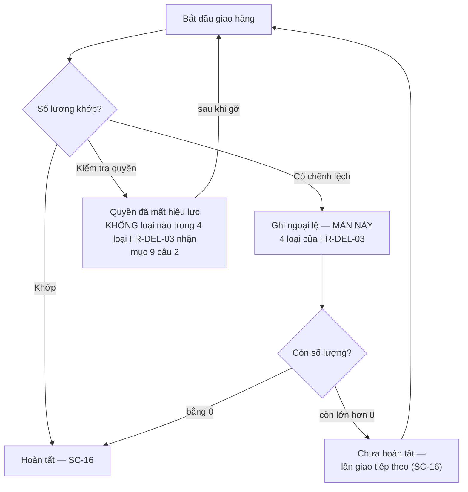

# SC-17 — Ghi nhận ngoại lệ giao hàng · Spec BE

| | |
|---|---|
| FE liên quan | FE-023 (Ghi nhận ngoại lệ giao hàng) |
| FN | FN-06 (Quản lý giao nhận hàng) |
| Ưu tiên | P1 |
| Yêu cầu khách | FR-DEL-03, FR-DEL-01, FR-CORR-02, FR-SETTLE-01, FR-AUDIT-01, BR-CLOSE-01, TBL-ATTACH-01, DR-IMAGE-01, RPT-04 |
| Miền dữ liệu | D-DELIVERY (chính) · D-SETTLE (tiêu thụ) |
| State machine | FIG-014 (RFP:693) — luồng ngoại lệ khi giao hàng, **ba nhánh** |
| Đã thi công | Không |

## 1. Phạm vi backend của màn này

BE phải lưu **lý do** của bốn loại ngoại lệ mà `FR-DEL-03` (RFP:683) gọi tên — *"giao thiếu, giao thừa, hoàn trả, hoặc hủy một phần"* — kèm
**người xác nhận ngoại lệ** (nghiệm thu RFP:683), rồi phát dữ liệu đó ra hai chỗ tiêu thụ: phần *"ngoại lệ đủ điều kiện"* của bảng đối chiếu ngày
(`FR-SETTLE-01` RFP:659) và báo cáo `RPT-04` (RFP:747). Đây là **nguồn duy nhất** của dữ liệu ngoại lệ giao hàng trong toàn hệ thống. **Không**
thuộc phạm vi: ghi lần giao và chốt hoàn tất (SC-16); lập bảng đối chiếu và lock kỳ (SC-18); sửa hay xoá một ngoại lệ đã ghi — `FR-CORR-02`
(RFP:657) đòi điều chỉnh phải sinh bản ghi mới thay vì ghi đè lịch sử, nên đường sửa là SC-20 · SC-21; kiểm hiệu lực người tham gia (nhánh thứ ba
của `FIG-014`, xem mục 4 và mục 9 câu 2).

## 2. Hợp đồng API

### `POST /api/deliveries/{id}/exceptions`

Thoả `FE-023` · `FR-DEL-03`. Xác thực **bắt buộc**; đề xuất chỉ `ROLE-DELIVERY` (mục 6). **Không idempotent** — chống gửi trùng bằng `requestKey`.
Thân yêu cầu là `multipart` khi có tệp bằng chứng.

**Request**

| Tham số | Vị trí · Kiểu | Bắt buộc | Ràng buộc | Nguồn yêu cầu |
|---|---|---|---|---|
| `id` | path · uuid | có | phiếu giao hàng tồn tại và **chưa** `hoàn tất` | FR-DEL-03 · FR-DEL-02 RFP:682 |
| `shipmentId` | body · uuid | không | phải là một lần giao **của chính phiếu này**; để trống nghĩa là ngoại lệ ở cấp phiếu | mục 9 câu 1 |
| `kind` | body · enum | có | **đúng 4 giá trị** `FR-DEL-03`: giao thiếu · giao thừa · hoàn trả · hủy một phần | FR-DEL-03 RFP:683 |
| `qty` | body · numeric(12,2) | tuỳ `kind` | `> 0`; giao thiếu và hoàn trả không vượt phần đã giao; hủy một phần không vượt số còn lại | FR-DEL-03 · BR-LOT-02 RFP:596 |
| `reason` | body · text | **có** | không rỗng sau khi trim | FR-DEL-03 (*"phải lưu lý do"*) |
| `evidence` | body · file[] | không | loại tệp và trần kích thước ở mục 9 câu 6 | TBL-ATTACH-01 · DR-IMAGE-01 RFP:794 |
| `requestKey` | body · string | có | khoá chống gửi trùng do client sinh | **suy luận** — cùng lý do như SC-16 |

**Server tự quyết, không nhận từ client:** `confirmedBy` (chủ thể từ phiên đăng nhập — điều kiện truy vết của nghiệm thu RFP:683) · `businessDate`
(ngày nghiệp vụ hiện tại theo JST, mục 9 câu 3) · `recordedAt`. Client gửi ba trường này thì bị **bỏ qua**.

**Response 2xx** — `201` với `exceptionId` · `kind` · `qty` · `businessDate` · `confirmedByName` (**tên hiển thị**, không trả thông tin liên hệ) ·
`deliveryStatus` mới (`ngoại lệ`) · `evidence[]` (`fileName`, `size`).

**Mã lỗi** — mỗi mã một điều kiện: 400 `INVALID_BODY` (thân yêu cầu không đọc được) · 422 `KIND_INVALID` (`kind` ngoài 4 giá trị `FR-DEL-03`) ·
422 `REASON_REQUIRED` (`reason` rỗng sau trim) · 422 `QTY_NOT_POSITIVE` (`qty ≤ 0`) · 422 `QTY_EXCEEDS_DELIVERED` (giao thiếu hoặc hoàn trả vượt
phần đã giao) · 422 `QTY_EXCEEDS_REMAINING` (hủy một phần vượt số còn lại) · 422 `SHIPMENT_NOT_IN_DELIVERY` (`shipmentId` không thuộc phiếu này) ·
422 `EVIDENCE_INVALID_TYPE` / `EVIDENCE_TOO_LARGE` (`TBL-ATTACH-01`) · 404 `NOT_FOUND` (phiếu không tồn tại) · 404 (vai trò không được ghi — 404
thay 403, mục 6) · 409 `ALREADY_COMPLETED` (phiếu đã `hoàn tất`; đường ra là SC-20) · **423** `LOCKED_BUSINESS_DATE` (ngày nghiệp vụ của ngoại lệ
đã bị lock — `BR-CLOSE-01` RFP:597, mục 9 câu 3) · 500 `INTERNAL_ERROR`.

**Tác dụng phụ** — ghi bản ghi ngoại lệ; chuyển `delivery.status` sang `ngoại lệ`; **khoá đường chốt hoàn tất** ở SC-16 cho tới khi ngoại lệ được
xử lý; ghi audit `delivery_exception_record` (mục 7); đưa dòng vào tập *"ngoại lệ đủ điều kiện"* của bảng đối chiếu ngày (`FR-SETTLE-01`). Không
phát thông báo ở màn này — `FR-NOTIFY-01` (RFP:686) nói *"giao hàng bị ùn tắc"*, không nói ngoại lệ.

### `GET /api/deliveries/{id}/exceptions` · `GET /api/delivery-exceptions`

Thoả nghiệm thu `FR-DEL-03` (*"có danh sách lý do và người xác nhận"*) và là nguồn của `RPT-04`. Xác thực **bắt buộc**; vai trò xem mục 6;
**idempotent**.

**Request** — dạng theo phiếu: `id` (path, uuid). Dạng theo ngày: `businessDate` (query, date, **bắt buộc** — bộ lọc bắt buộc của `RPT-04`,
RFP:747) · `kind` (query, enum 4, không bắt buộc — bộ lọc bắt buộc thứ hai của `RPT-04`) · `page` · `pageSize`.

**Response 2xx** — `rows[]`: `businessDate` · `txnCode` · `shipmentSeq` (hoặc `null` khi ngoại lệ ở cấp phiếu) · `kind` · `qty` · `reason` ·
`confirmedByName` · `evidenceCount`; kèm `page.total`.

**Mã lỗi** — 400 `INVALID_BUSINESS_DATE` (sai định dạng, không phải ngày thật, hoặc ngày tương lai) · 400 `INVALID_KIND` · 404 `NOT_FOUND` (phiếu
không tồn tại) · 500 `INTERNAL_ERROR`. **Tác dụng phụ** — không ghi; không ghi audit (đọc không nằm trong tập `FR-AUDIT-01` RFP:710).

## 3. Mô hình dữ liệu màn này chạm

| Thực thể | Cột dùng | Ràng buộc thiết kế đòi | Tầng thực thi | Đã có? |
|---|---|---|---|---|
| Ngoại lệ giao hàng | `id`, `delivery_id` | `delivery_id` không rỗng, khoá ngoại sang phiếu giao hàng | tầng 1 | **chưa** |
| Ngoại lệ giao hàng | `shipment_id` | cho phép rỗng; khi có thì phải cùng phiếu với `delivery_id` | tầng 1 (khoá ngoại) + tầng 2 (đẳng thức cùng phiếu) | **chưa** |
| Ngoại lệ giao hàng | `kind`, `qty` | `kind` đúng **4** giá trị `FR-DEL-03`, không giá trị thứ năm; `qty` cho phép rỗng nhưng khi có thì `> 0` | tầng 1 | **chưa** |
| Ngoại lệ giao hàng | `reason` | **không rỗng** — `FR-DEL-03` đòi lưu lý do | tầng 1 | **chưa** |
| Ngoại lệ giao hàng | `confirmed_by` | không rỗng, khoá ngoại sang người dùng nội bộ | tầng 1 | **chưa** |
| Ngoại lệ giao hàng | `business_date` | không rỗng; quyết định ngoại lệ vào bảng đối chiếu của ngày nào | tầng 1 + tầng 2 (khoá kỳ) | **chưa** |
| Ngoại lệ giao hàng | `resolved_at`, `resolved_by`, và toàn bảng | rỗng nghĩa là ngoại lệ **đang mở** và khoá đường chốt của SC-16 (mục 9 câu 7); toàn bảng **append-only** — không đường sửa, không đường xoá (`FR-CORR-02` RFP:657) | tầng 1 (không cấp quyền sửa/xoá) | **chưa** |
| Bằng chứng đính kèm | `exception_id`, `file_name`, `mime_type`, `file_size` | theo `TBL-ATTACH-01`; nhóm bằng chứng ngoại lệ thuộc diện lưu 3 năm rồi chuyển lưu trữ lạnh (`DR-IMAGE-01` RFP:794) | tầng 1 + tầng 3 | **chưa** |
| `delivery` | `status` | đặt được giá trị `ngoại lệ` bằng một vòng so-rồi-ghi | tầng 1 (tập giá trị) + tầng 3 (đường ghi) | tập giá trị **có**, đường ghi **chưa** — mục 10 |
| `delivery_shipment` | `id`, `seq` | nguồn của danh sách chọn lần giao liên quan | tầng 1 | có |

Ràng buộc P0 quan trọng nhất ở đây nằm **tầng 1**: `reason` không rỗng và `kind` đúng bốn giá trị. Nếu để hai thứ này ở tầng 3 thì một bản ghi
ngoại lệ rỗng lý do vẫn vào được dữ liệu, và nghiệm thu `FR-DEL-03` mất chỗ dựa. Chỗ **phải** ở tầng 2 là đẳng thức `shipment_id` cùng phiếu với
`delivery_id` — khoá ngoại đơn lẻ không kiểm được quan hệ này.

## 4. Vòng đời trạng thái

`FIG-014` (RFP:693) có **ba** nhánh rẽ từ cùng một cổng hỏi *"Số lượng khớp?"*. Vẽ đủ cả ba, kèm khai rõ nhánh nào thuộc màn này.

| Từ | Sự kiện | Đến | Điều kiện tiền đề (guard) | Ai được phép | Mã lỗi khi vi phạm |
|---|---|---|---|---|---|
| Chờ · Đang giao · Ngoại lệ | ghi ngoại lệ (một phiếu ghi được **nhiều** ngoại lệ — trần ở mục 9 câu 8) | Ngoại lệ | `kind` thuộc 4 giá trị · `reason` không rỗng · `qty` trong biên theo `kind` · `shipmentId` cùng phiếu · ngày chưa lock | `ROLE-DELIVERY` (đề xuất) | 422 `KIND_INVALID` · `REASON_REQUIRED` · `QTY_EXCEEDS_DELIVERED` · `QTY_EXCEEDS_REMAINING` · `SHIPMENT_NOT_IN_DELIVERY` · 423 |
| Ngoại lệ | chốt hoàn tất ở SC-16 | — | **luôn bị chặn** khi còn ngoại lệ `resolved_at` rỗng | không ai | 422 `OPEN_EXCEPTION` (xem SC-16) |
| Ngoại lệ | đánh dấu ngoại lệ đã xử lý | Đang giao | định nghĩa *"đã xử lý"* chưa có ở RFP — mục 9 câu 7 | mục 9 câu 7 | mục 9 câu 7 |
| Hoàn tất | ghi ngoại lệ | — | không có cạnh này; đường ra là SC-20 · SC-21 | không ai | 409 `ALREADY_COMPLETED` |
| bất kỳ | sửa hoặc xoá một ngoại lệ đã ghi | — | **không có cạnh này trong thiết kế** — `FR-CORR-02` RFP:657 đòi sinh bản ghi mới | không ai | 405 · đường đúng là ghi một ngoại lệ đính chính, hoặc SC-20 |
| bất kỳ | ghi ngoại lệ vào ngày đã lock | — | luôn bị chặn **và** ghi log | không ai | 423 `LOCKED_BUSINESS_DATE` |

**Guard dễ mất nhất — và cũng là chỗ `FIG-014` rộng hơn `FR-DEL-03`.** Sơ đồ có nhánh thứ ba *"(Kiểm tra quyền) Xác nhận quyền đã mất hiệu lực →
sau khi gỡ → tiếp tục"*, nhưng **không loại nào** trong bốn loại của `FR-DEL-03` nhận được tình huống đó. Thiết kế **không tự thêm loại ngoại lệ
thứ năm**: nhánh này để nguyên trên sơ đồ và đi vào mục 9 câu 2.

## 5. Quy tắc nghiệp vụ

| Mã | Quy tắc (nguyên văn nguồn) | Thực thi ở đâu | Kiểm bằng gì |
|---|---|---|---|
| FR-DEL-03 (RFP:683) | *"Hệ thống phải lưu lý do của: giao thiếu, giao thừa, hoàn trả, hoặc hủy một phần."*; nghiệm thu *"Có danh sách lý do và người xác nhận ngoại lệ"* | tầng 1 — `kind` 4 giá trị, `reason` không rỗng, `confirmed_by` không rỗng | ghi từng loại một lần rồi đọc lại danh sách: đủ 4 loại, mỗi dòng có lý do và người xác nhận |
| FR-DEL-01 (RFP:681) | nghiệm thu *"Tối thiểu có các trạng thái: chờ, đang giao, hoàn tất, ngoại lệ"* | tầng 1 (tập giá trị) + tầng 3 (đường ghi của màn này) | ghi ngoại lệ xong thì trạng thái phiếu đọc ra là `ngoại lệ` |
| FR-CORR-02 (RFP:657) | *"sinh bản ghi reverse/delta thay vì ghi đè lịch sử"* | tầng 1 — bảng append-only, không cấp quyền sửa/xoá | thử sửa hoặc xoá một ngoại lệ đã ghi đều bị từ chối |
| FR-SETTLE-01 (RFP:659) | *"tổng hợp giao dịch, giao hàng và **ngoại lệ** để lập bảng đối chiếu ngày"* | tầng 3 — endpoint theo ngày là nguồn của SC-18 | một ngoại lệ vừa ghi xuất hiện trong bảng đối chiếu của đúng ngày đó |
| BR-CLOSE-01 (RFP:597) | *"Không được chỉnh sửa trực tiếp ngày nghiệp vụ đã bị lock"* | tầng 2 — khoá kỳ trên bảng ngoại lệ | ghi ngoại lệ vào ngày đã lock nhận 423 và sinh một dòng audit |
| BR-LOT-02 (RFP:596) · DR-IMAGE-01 (RFP:794) | *"Số lượng khả dụng của lô hàng không được âm"*; ảnh và chứng từ phụ trợ lưu online **3 năm** rồi chuyển lưu trữ lạnh | tầng 3 — biên của `qty` theo `kind`; chính sách lưu trữ của bằng chứng | giao thiếu vượt phần đã giao bị chặn; kiểm chính sách lưu trữ và diễn tập phục hồi |

Màn này **không có con số nghiệp vụ nào RFP cho**. Ba con số bị đòi mà RFP không cho — trần kích thước tệp bằng chứng, số tệp mỗi ngoại lệ, và
trần số ngoại lệ trên một phiếu — nằm ở mục 9 câu 6 và câu 8.

## 6. Ma trận phân quyền theo thao tác

| Vai trò | Đọc danh sách ngoại lệ | Ghi ngoại lệ | Đính kèm bằng chứng | Đánh dấu đã xử lý |
|---|---|---|---|---|
| ROLE-DELIVERY | cho phép | **cho phép** (đề xuất) | cho phép | mục 9 câu 7 |
| ROLE-SETTLEMENT | cho phép | mục 9 câu 4 | mục 9 câu 4 | mục 9 câu 7 |
| 5 vai còn lại: ROLE-INTAKE · ROLE-JUDGE · ROLE-TRADE · ROLE-RULE-ADMIN · ROLE-SYS-ADMIN | **đề xuất** cho phép | từ chối · **404** | từ chối · **404** | từ chối · **404** |

- **Đọc mở cho mọi vai là ĐỀ XUẤT của bên dự thầu, không phải yêu cầu khách.** Căn cứ duy nhất: §02-08 (RFP:311) *"Đơn vị dự thầu phải **đề xuất**
  cơ chế phân tách quyền và truy vết tương ứng với các vai trò nêu trên."* — RFP **giao cho bên dự thầu đề xuất**, không bắt đọc mở. Lý do đề
  xuất: bộ phận đối chiếu **phải** đọc được ngoại lệ để lập bảng đối chiếu (`FR-SETTLE-01` RFP:659). Căng thẳng với §09-06 (APPI, RFP:886) ở **mục
  9 câu 5**.
- **Đọc và ghi là hai trục khác nhau.** Trục **ghi** chặn theo vai trò: `FE-023` nêu bộ phận vận chuyển, và đó là vai duy nhất ghi được lần giao
  nên là ứng viên tự nhiên. Trục **đọc** hiện đề xuất không chặn. Lock kỳ chặn **ghi**, không chặn **đọc** — ngoại lệ của ngày đã lock vẫn đọc
  được đầy đủ.
- **Chặn vào trang trả 404, không phải 403** — có chủ đích, không lộ sự tồn tại tài nguyên.
- **Không có maker-checker ở màn này.** `GOV-RULE-01` (RFP:601) áp cho thay đổi quy tắc và biểu suất. Ghi ngoại lệ là hành động một người; điều
  kiện *"người duyệt khác người tạo"* nếu cần thì thuộc bước **đánh dấu đã xử lý** (mục 9 câu 7), và đó là một ràng buộc riêng, không suy ra được
  từ vai trò.

## 7. Audit và truy vết

| Thao tác | `action` | Ghi gì (before/after/reason) | Yêu cầu RFP |
|---|---|---|---|
| Ghi ngoại lệ | `delivery_exception_record` | before `{deliveryStatus}` · after `{exceptionId, kind, qty, deliveryStatus}` · **reason: chính `reason` người dùng nhập** | FR-AUDIT-01 RFP:710 (*"tạo"*) · FR-DEL-03 |
| Đính kèm bằng chứng | `attach_exception_evidence` | after `{exceptionId, fileName, size}` · reason: không đòi | TBL-ATTACH-01 · FR-AUDIT-01 |
| Đánh dấu ngoại lệ đã xử lý | `delivery_exception_resolve` | before `{resolvedAt: null}` · after `{resolvedAt, resolvedBy}` · reason: **bắt buộc** | FR-AUDIT-01 (*"phê duyệt"*) — mục 9 câu 7 |
| Lần thử ghi bị chặn vì ngày đã lock | `locked_write_attempt` | chủ thể · thời điểm · đối tượng bị nhắm · đường vào · kết quả bị chặn | FR-CORR-03 RFP:658 |
| Lần thử ghi bị chặn vì sai vai trò · lần thử sửa hoặc xoá một ngoại lệ đã ghi | `delivery_exception_write_denied` · `delivery_exception_mutation_denied` | chủ thể · thời điểm · thao tác bị từ chối · `exceptionId` bị nhắm | §02-08 RFP:310 · FR-CORR-02 RFP:657 |
| Đọc danh sách ngoại lệ | **không ghi** | — | đọc không nằm trong tập `FR-AUDIT-01`; nhưng xem mục 9 câu 5 |

Đây là một trong ít thao tác mà `reason` của audit **có nguồn thật**: chính ô lý do người dùng nhập. `FR-AUDIT-01` (RFP:710) đòi audit truy được
**chủ thể · timestamp · before/after · lý do** — ở màn này cả bốn đều có, không phải suy ra.

## 8. Phi chức năng áp cho màn này

| Mã | Yêu cầu | Ảnh hưởng thiết kế BE |
|---|---|---|
| NFR-USE-01 (RFP:816) | luồng *"ghi nhận giao hàng"* dùng được bằng bàn phím và **thông báo lỗi dễ hiểu** | mười mã lỗi ở mục 2 phải truy về đúng một điều kiện; đặc biệt hai mã biên số lượng phải nói rõ biên nào bị vượt |
| NFR-AVL-01 · NFR-AVL-02 (RFP:804-805) | 99,5% khung 02:00–10:00 JST; tiếp tục tối thiểu tác vụ khi mất kết nối hiện trường | ngoại lệ phát sinh đúng đoạn 05:00–08:00 *"xử lý ngoại lệ"* (RFP:303); `requestKey` là điều kiện gửi lại an toàn |
| DR-IMAGE-01 (RFP:794) · DR-RET-01 (RFP:813) | ảnh và chứng từ online **3 năm** rồi lưu trữ lạnh; dữ liệu nghiệp vụ online **7 năm** | bản ghi ngoại lệ và tệp bằng chứng có **hai** chu kỳ lưu trữ khác nhau — không lưu chung một chỗ |
| NFR-SEC-04 (RFP:812) · NFR-OPS-01 (RFP:814) | dữ liệu truyền dùng TLS, secret tách khỏi mã nguồn; giám sát lỗi | tệp bằng chứng chỉ trả qua đường dẫn có thời hạn ngắn, không trả đường dẫn lưu trữ nội bộ; thất bại của bước tải tệp vào alert riêng, không lẫn với 422 do người dùng nhập sai |

## 9. Câu hỏi cho chủ đầu tư

1. **Ngoại lệ gắn vào cấp phiếu giao hàng hay cấp một lần giao cụ thể?** `FR-DEL-03` (RFP:683) chỉ nói *"lưu lý do"* và *"người xác nhận"*,
   **không nói cấp nào**. Thiết kế đề xuất `delivery_id` bắt buộc và `shipment_id` tuỳ chọn (mục 3). *Vì sao cần trước khi code:* hai cấp có chế
   độ khoá kỳ khác nhau. *Chọn sai:* chỉ gắn cấp phiếu thì `RPT-04` mất chiều phân tích theo lần giao; gắn cấp lần giao mà không xử lý khoá kỳ thì
   một ngoại lệ phát hiện sau lock **không ghi được**.
2. **`FIG-014` rộng hơn `FR-DEL-03` — nhánh "kiểm tra quyền" là loại ngoại lệ thứ năm, hay không phải ngoại lệ?** Sơ đồ (RFP:693) vẽ nhánh *"(Kiểm
   tra quyền) Xác nhận quyền đã mất hiệu lực → sau khi gỡ → tiếp tục"*, nhưng bốn loại của `FR-DEL-03` **không có loại nào** nhận tình huống đó,
   và `FR-PARTY-02` (RFP:630) tự giới hạn phạm vi kiểm hiệu lực *"tại thời điểm **chốt giao dịch**"* — tức không có yêu cầu nào đòi kiểm hiệu lực
   ở bước giao hàng. Thiết kế **không tự thêm loại thứ năm**. *Chọn sai:* thêm loại thì báo cáo mất tác dụng phân loại theo đúng bốn loại khách
   gọi tên; bỏ hẳn thì một tình huống vận hành có thật không có chỗ ghi.
3. **Ngoại lệ phát hiện muộn thuộc ngày nghiệp vụ nào, và ngày đã lock có chặn ghi ngoại lệ không?** RFP không nói. Thiết kế đề xuất
   `businessDate` là ngày ghi (JST) và chặn ghi vào ngày đã lock (423 ở mục 2) — **suy luận từ mục đích của lock, không phải chữ `BR-CLOSE-01`**
   vốn chỉ nói *"chỉnh sửa trực tiếp"*. *Chọn sai:* nếu quy về ngày của lần giao gốc thì phần lớn ngoại lệ phát hiện muộn rơi vào ngày đã lock và
   buộc đi đường điều chỉnh cho **mọi** trường hợp.
4. **Ai được ghi ngoại lệ?** `FE-023` nêu bộ phận vận chuyển; RFP:691 liệt *"quyền xác nhận"* vào danh sách **phải làm rõ**. *Chọn sai:* mở cho cả
   bộ phận đối chiếu thì mất tách trách nhiệm §02-08 (RFP:309-310); chỉ vai vận chuyển thì bộ phận đối chiếu phát hiện chênh lệch khi rà số lại
   không tự ghi được.
5. **Ai được đọc danh sách ngoại lệ?** RFP không nói; §02-08 (RFP:311) **giao cho bên dự thầu đề xuất**, và chúng tôi đề xuất mở đọc cho mọi vai
   đang hoạt động (mục 6). **Đây là đề xuất của bên dự thầu chống lại một yêu cầu của khách**: §09-06 (RFP:883-886) đòi tuân thủ APPI cho *"lịch
   sử giao dịch gắn với cá nhân"* kèm *"kiểm soát truy cập theo vai trò (RBAC) và log truy cập"*, mà bảng ngoại lệ mang tên người tham gia, tên
   người xác nhận và cả ảnh hiện trường. Chúng tôi **không chọn hộ**: chọn §09-06 thì mục 6 phải siết đọc và mục 7 phải bật `action` log đọc.
6. **Trần kích thước tệp bằng chứng, danh sách loại tệp, và số tệp mỗi ngoại lệ là bao nhiêu?** `TBL-ATTACH-01` và `DR-IMAGE-01` (RFP:794) nói
   chính sách lưu trữ nhưng **không cho con số nào** cho một lần tải lên. *Chọn sai:* trần quá thấp thì ảnh hiện trường bị từ chối; quá cao thì
   đường tải lên thành điểm nghẽn đúng giờ cao điểm.
7. **"Ngoại lệ đã xử lý" nghĩa là gì, và ai xác nhận?** `FR-DEL-03` (RFP:683) chỉ đòi lưu lý do và người xác nhận; RFP **không có** khái niệm
   ngoại lệ đã đóng. Nhưng cổng kiểm *"không còn ngoại lệ đang mở"* của SC-16 cần nó. *Chọn sai:* không có trạng thái đóng thì phiếu có ngoại lệ
   **không bao giờ** chốt hoàn tất được; có mà không đòi người khác xác nhận thì cùng một người vừa ghi vừa đóng ngoại lệ của mình.
8. **Một phiếu giao hàng ghi được bao nhiêu ngoại lệ?** RFP:691 đòi làm rõ *"giới hạn số lần chia"* nhưng không nói gì về số ngoại lệ, và **không
   cho con số** cho cả hai. *Chọn sai:* không có trần thì bảng đối chiếu ngày không đóng được trong đoạn 08:00–10:00 (RFP:304).
9. **Ưu tiên đảo ngược: `FE-025` (P0) phụ thuộc `FE-023` (P1).** Bảng đối chiếu ngày là P0 và `FR-SETTLE-01` (RFP:659) đòi gom *"ngoại lệ đủ điều
   kiện"*, nhưng **nguồn ngoại lệ duy nhất** là `FE-023` / SC-17 — **P1** (`FR-DEL-03` RFP:683). Cùng lúc `RPT-04` (RFP:747) cũng chặn ở đây.
   *Chọn sai:* giữ nguyên hai mức ưu tiên thì `FE-025` **không thể** đạt nghiệm thu, và `RPT-04` không có nguồn dữ liệu. Khách quyết: nâng
   `FE-023` lên P0, hay hạ phạm vi `FE-025` xuống ba nguồn và hoãn `RPT-04`?
10. **Ngoại lệ ảnh hưởng thế nào tới chênh lệch của bảng đối chiếu và tới 完納奨励金?** RFP:691 nêu thẳng *"thời điểm phản ánh vào quyết toán và
    完納奨励金"* là điều kiện để chốt estimate. *Chọn sai:* cùng một chênh lệch bị giải thích **hai lần** (một lần qua chênh lệch số lượng, một lần qua
    ngoại lệ) hoặc không lần nào — và số vào kế toán qua `IF-ACC-01` lệch theo.

## 10. Prototype hiện làm khác gì

| Hạng mục | Thiết kế đòi | Prototype làm | Dẫn chứng | Mức |
|---|---|---|---|---|
| Toàn bộ `FE-023` | bảng ngoại lệ, hai endpoint, form ghi (mục 2 và mục 3) | **chưa có gì**: không bảng nào lưu loại ngoại lệ, lý do hay người xác nhận; không route; không màn | `docs/lab4/spec/SC-17-ghi-nhan-ngoai-le-giao-hang.md` (bản as-built khai *"Chưa dựng"*); thiết kế RFP:683 | **Khác không chủ đích** — hệ quả của việc `FE-023` là P1 và bị cắt khỏi vòng LAB-3 |
| Trạng thái `ngoại lệ` đặt được | đường ghi đặt `delivery.status = 'ngoại lệ'` | giá trị `'ngoại lệ'` **đã có** ở tầng CHECK nhưng **không đường ghi nào** đặt được: đường ghi lần giao chỉ đặt `'đang giao'`, đường chốt chỉ đặt `'hoàn tất'` | `supabase/migrations/20260904090400_delivery.sql:10-11`, `src/lib/deliveries/record-shipment.ts:96`, `src/lib/deliveries/complete-delivery.ts:66` | Khác không chủ đích — schema đi trước, hành vi chưa theo |
| Bộ lọc trạng thái ở SC-15 | lọc đủ 4 trạng thái | filter bỏ `'ngoại lệ'` **có chủ đích**: một filter luôn trả rỗng khiến người dùng không phân biệt *"hôm nay không có ngoại lệ"* với *"hệ thống chưa ghi được ngoại lệ"* | `src/app/(app)/deliveries/page.tsx:12-16`, `src/components/pipeline/resolve-stage-value.ts:58-60` | **Khác có chủ đích** — cách xử lý ở UI là đúng |
| `RPT-04` chạy trên dữ liệu thật | báo cáo giao hàng ùn tắc và ngoại lệ, lọc theo ngày nghiệp vụ và loại ngoại lệ | `RPT-04` để dữ liệu mẫu với bộ lọc và cột rỗng — **nguyên nhân là màn này chưa dựng**, không phải "mock vĩnh viễn" | `src/lib/reports/registry.ts:89-96`; thiết kế RFP:747 | Khác không chủ đích — hệ quả trực tiếp của hai dòng trên |
| Ngoại lệ vào bảng đối chiếu ngày | tập *"ngoại lệ đủ điều kiện"* của `FR-SETTLE-01` | chênh lệch của bảng đối chiếu tính **thuần** từ sổ lần giao, không biết gì về ngoại lệ; nên cùng một chênh lệch không phân biệt được *"chưa giao xong"* với *"có ngoại lệ đã xác nhận"* | `supabase/migrations/20260904090800_reconciliation_view.sql:15-20`; thiết kế RFP:659 | Khác không chủ đích |
| Ngoại lệ khoá đường chốt hoàn tất | cổng kiểm `OPEN_EXCEPTION` ở SC-16 | không có cổng kiểm nào; chốt hoàn tất chỉ kiểm số lượng | `src/app/api/deliveries/[id]/complete/route.ts:9-13`; thiết kế RFP:683 · RFP:693 | Khác không chủ đích |
| Đường sửa ngoại lệ | không có (append-only, `FR-CORR-02`) | không áp dụng — chưa có bảng nào để sửa | — | không lệch |
| Cấp gắn ngoại lệ và khoá kỳ | mục 9 câu 1 và câu 3 | chưa quyết. Hai chế độ khoá đang tồn tại: phiếu giao hàng được **miễn** khoá ngày còn sổ lần giao **thì bị** — nên một ngoại lệ gắn cấp phiếu vẫn ghi được cho ngày đã lock | `supabase/migrations/20260904090500_business_day_lock.sql:56-59,73-75` | **Cần khách chốt** |
| Ai được ghi, và trần số ngoại lệ | mục 9 câu 4 và câu 8 | chưa có. Ở tầng dữ liệu, vai vận chuyển là vai duy nhất ghi được sổ lần giao, còn vai đối chiếu ghi được phiếu giao hàng — nên cả hai đều là ứng viên; đọc mở cho mọi vai ghi vết bằng mã nội bộ LAB-3 **`FR-601`** (**mã nội bộ, không phải mã yêu cầu của khách**) | `supabase/migrations/20260904091000_rls_ops.sql:29-33,37-41`, `20260904090900_rls_core.sql:29` | **Cần khách chốt** |
| Bằng chứng đính kèm | bucket riêng, đường dẫn có thời hạn, chính sách 3 năm | khuôn có sẵn ở đường tải chứng từ tiếp nhận lô hàng (loại tệp và trần kích thước) nhưng **chưa** áp cho ngoại lệ | `src/lib/lots/intake-doc-upload.ts:4-12` | **Cần khách chốt** — mục 9 câu 6 |

## 11. Dẫn chứng

- RFP:683 `FR-DEL-03` (4 loại + *"người xác nhận ngoại lệ"*) · RFP:681 `FR-DEL-01` · RFP:682 `FR-DEL-02` · RFP:685 `FR-DEL-05`
- RFP:693 `FIG-014` (**ba** nhánh; nhánh thứ ba không loại nào của `FR-DEL-03` nhận) · RFP:714 `FIG-029` · RFP:691 lưu ý *"giới hạn số lần chia ·
  quyền xác nhận · thời điểm phản ánh vào quyết toán và 完納奨励金"*
- RFP:657 `FR-CORR-02` · RFP:658 `FR-CORR-03` · RFP:659 `FR-SETTLE-01` · RFP:710 `FR-AUDIT-01` · RFP:747 `RPT-04` · RFP:686 `FR-NOTIFY-01` ·
  RFP:596 `BR-LOT-02` · RFP:597 `BR-CLOSE-01` · RFP:601 `GOV-RULE-01`
- RFP:630 `FR-PARTY-02` (*"tại thời điểm chốt giao dịch"* — **không** đòi kiểm hiệu lực ở bước giao hàng) · RFP:303-304 §02-07 · RFP:309-311
  §02-08 · RFP:883-886 §09-06 APPI · RFP:794 `DR-IMAGE-01` · RFP:812-816 các NFR
- Feature List `FE-023` (FN-06, P1) và `FE-025` (FN-07, **P0**) —
  `plans/260909-1355-lab4-thiet-ke-chi-tiet/nguon-function-list-va-feature-list.md`
- `docs/lab4/20-architecture-design.md` § 4.4 (`FIG-014`, nhánh kiểm quyền là `[CHƯA CHỐT]`) · § 4.5 (`FIG-029`) ·
  `docs/lab4/spec/SC-17-ghi-nhan-ngoai-le-giao-hang.md` (bản as-built khai màn *"Chưa dựng"*)
- `supabase/migrations/20260904090400_delivery.sql:10-11` · `20260904090500_business_day_lock.sql:56-59,73-75` ·
  `20260904090800_reconciliation_view.sql:15-20` · `20260904091000_rls_ops.sql:29-33,37-41` · `20260904090900_rls_core.sql:29` (mã nội bộ LAB-3
  `FR-601`)
- `src/lib/deliveries/record-shipment.ts:96` · `complete-delivery.ts:66` · `src/lib/reports/registry.ts:89-96` ·
  `src/app/(app)/deliveries/page.tsx:12-16` · `src/components/pipeline/resolve-stage-value.ts:58-60` ·
  `src/app/api/deliveries/[id]/complete/route.ts:9-13` · `src/lib/lots/intake-doc-upload.ts:4-12`
