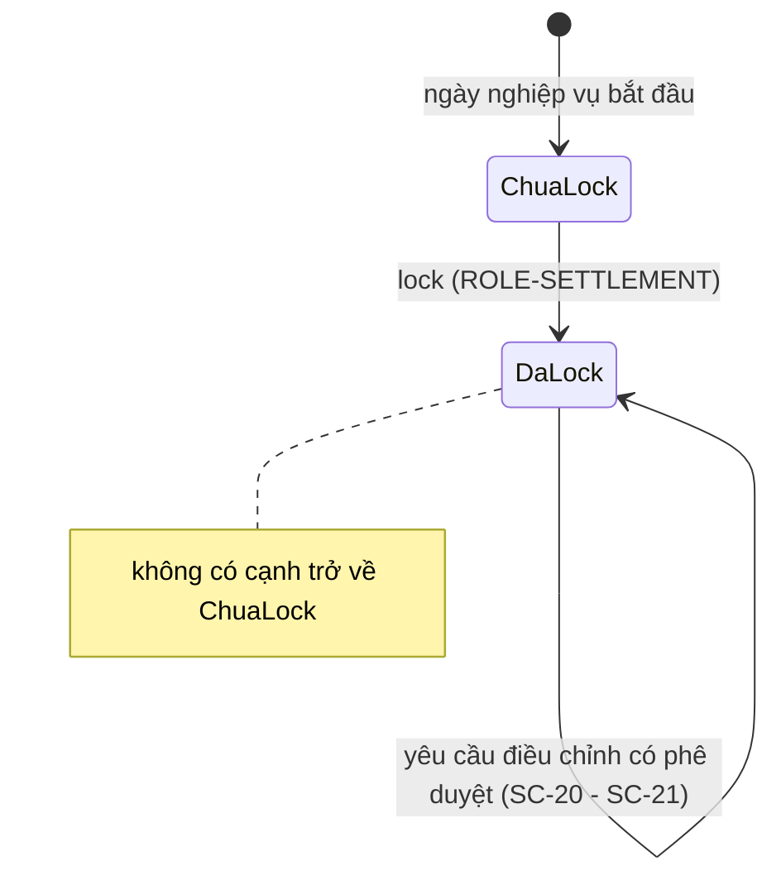

# SC-18 — Bảng đối chiếu ngày và lock kỳ · Spec BE

| | |
|---|---|
| FE liên quan | FE-025 (Bảng đối chiếu ngày), FE-026 (Lock ngày nghiệp vụ), FE-024 (Liên kết giao hàng ↔ quyết toán) |
| FN | FN-07 (Đối chiếu và chốt kỳ) · FN-06 (Quản lý giao nhận hàng) |
| Ưu tiên | P0 (FE-025, FE-026) · P1 (FE-024) |
| Yêu cầu khách | FR-SETTLE-01, FR-SETTLE-02, FR-CORR-03, FR-DEL-04, BR-CLOSE-01, FR-AUDIT-01, NFR-PERF-01 |
| Miền dữ liệu | D-SETTLE (chính) · D-TRADE · D-DELIVERY |
| State machine | RFP **không có** FIG riêng cho vòng đời kỳ; hệ quả sau lock đọc theo FIG-013 (RFP:665) |
| Đã thi công | Một phần |

## 1. Phạm vi backend của màn này

BE phải: (a) tổng hợp **giao dịch · giao hàng · ngoại lệ** đủ điều kiện của một ngày nghiệp vụ
thành tập dòng đối chiếu kèm số tổng (FR-SETTLE-01 RFP:659); (b) cho truy từ mỗi dòng sang các lần
giao liên quan (FR-DEL-04 RFP:684); (c) **lock ngày nghiệp vụ** một chiều và từ đó chặn mọi đường
sửa trực tiếp, mỗi lần thử đều bị chặn **và** ghi log (FR-SETTLE-02 RFP:660, FR-CORR-03 RFP:658,
BR-CLOSE-01 RFP:597). **Không** thuộc phạm vi: sinh RPT-05 (SC-26), xuất kế toán (SC-27 ·
IF-ACC-01 RFP:759-767), tính 完納奨励金 (SC-22) — lock chỉ là **cửa mở** cho ba việc đó. Không có
nghiệp vụ unlock: mục 9 câu 6.

## 2. Hợp đồng API

### `GET /api/reconciliation/{businessDate}`

Thoả FE-025 · FR-SETTLE-01 · FR-AUDIT-01 (hiện chủ thể lock). Xác thực **bắt buộc**; vai trò xem
mục 6; **idempotent** vì chỉ đọc.

**Request** — `businessDate` (path, date, bắt buộc): `YYYY-MM-DD`, ngày thật, **không nhận ngày
tương lai** (neo JST) — FR-SETTLE-01.

**Response 2xx** — `lock.locked` (boolean) · `lock.lockedAt` (timestamptz, trả kèm mốc JST) ·
`lock.lockedByName` (string: **tên hiển thị** người lock theo FR-AUDIT-01, không trả email) ·
`lines[]` (mỗi dòng: `sourceType` = `aitai`\|`seri`\|`delivery`\|`delivery_exception`, `sourceId`,
`documentCode`, `participantName`, `qty`, `amountJpy`, `deliveredQty`, `variance`,
`varianceApplicable`, `cancelled`, `cancelReason`) · `totals` (`qty`, `amountJpy`, `deliveredQty`,
`variance` của các dòng đủ điều kiện).

`variance` chỉ có giá trị khi `varianceApplicable = true`; ngược lại `null` và client hiện **"không áp dụng"** — không hiện `0` hay dấu gạch (FE-025).

**Mã lỗi** — 400 `INVALID_BUSINESS_DATE` (sai định dạng / không phải ngày thật / ngày tương lai,
FR-SETTLE-01) · 404 (vai trò không được vào tài nguyên, §02-08 RFP:311) · 500 `INTERNAL_ERROR`
(lỗi tầng dữ liệu khi tổng hợp, NFR-OPS-01). **Tác dụng phụ** — không ghi bảng nào; không ghi
audit (đọc không thuộc tập hành vi FR-AUDIT-01 RFP:710); không phát thông báo.

### `GET /api/reconciliation/{businessDate}/lines/{sourceType}/{sourceId}/deliveries`

Thoả FE-024 · FR-DEL-04 (RFP:684). Xác thực **bắt buộc**; vai trò xem mục 6; **idempotent**.

**Request** — `businessDate` (path, date, bắt buộc) · `sourceType` (path, enum 4 giá trị của
`lines[].sourceType`, bắt buộc) · `sourceId` (path, uuid, bắt buộc).

**Response 2xx** — `shipments[]`: `seq`, `businessDate`, `qty`, `status`, `confirmedByName`,
`exceptionKind`. Mảng **rỗng là câu trả lời hợp lệ** → client hiện "Chưa có lần giao" (FE-024).

**Mã lỗi** — 400 `INVALID_SOURCE_TYPE` (`sourceType` ngoài 4 giá trị) · 404 `LINE_NOT_FOUND` (cặp
`sourceType`+`sourceId` không thuộc ngày đó) · 500 `INTERNAL_ERROR` — cả ba theo FR-DEL-04.

**Tác dụng phụ** — không ghi. Phân biệt **lỗi truy vấn** (500) với **không có lần giao** (200 `[]`).

### `POST /api/reconciliation/{businessDate}/lock`

Thoả FE-026 · FR-SETTLE-02 (RFP:660) · BR-CLOSE-01 (RFP:597). Xác thực **bắt buộc**; chỉ
`ROLE-SETTLEMENT`. **Không idempotent** — lock lần hai trả 409; chống gửi trùng bằng khoá duy
nhất trên ngày nghiệp vụ.

**Request**

| Tham số | Vị trí · Kiểu | Bắt buộc | Ràng buộc | Nguồn |
|---|---|---|---|---|
| `businessDate` | path · date | có | như endpoint trên | FR-SETTLE-02 |
| `confirmBusinessDate` | body · string | có | trùng đúng `businessDate` sau khi trim | **suy luận** từ tính một chiều của lock — mục 9 câu 1 |
| `acknowledgeEmptyDay` | body · boolean | chỉ khi ngày trắng | phải `true` mới lock được ngày trắng | mục 9 câu 3 |

**Server tự quyết, không nhận từ client:** `lockedAt`, `lockedBy` (chủ thể từ phiên đăng nhập) — client gửi hai trường này thì bị **bỏ qua**.

**Response 2xx** — `status: "locked"`, `lockedAt`, `lockedByName`, `downstream.incentive` (`queued` \| `skipped_no_rule` \| `failed`) để client **hiện ra** cho người vận hành.

**Mã lỗi**

| HTTP | Mã nghiệp vụ | Điều kiện phát sinh | Yêu cầu RFP |
|---|---|---|---|
| 400 | `INVALID_BUSINESS_DATE` | ngày sai định dạng / không thật / tương lai | FR-SETTLE-02 |
| 404 | — | vai trò khác `ROLE-SETTLEMENT` (không lộ sự tồn tại tài nguyên) | §02-08 RFP:311 |
| 409 | `ALREADY_LOCKED` | đã có kỳ lock cho ngày đó, kể cả đua đồng thời | FR-SETTLE-02 |
| 422 | `CONFIRM_MISMATCH` | `confirmBusinessDate` không trùng `businessDate` | mục 9 câu 1 |
| 422 | `EMPTY_DAY_NOT_ACKNOWLEDGED` | ngày trắng mà thiếu `acknowledgeEmptyDay` | mục 9 câu 3 |
| 500 | `INTERNAL_ERROR` | lỗi ghi kỳ lock | NFR-OPS-01 |

Năm mã trên **phải phân biệt được ở thông báo client** (FE-026, trạng thái "Gửi lỗi").

**Tác dụng phụ** — thêm đúng một bản ghi kỳ lock; ghi audit `lock_business_day` (mục 7); mở cửa cho
SC-27 và SC-22. Bước tính thưởng kéo theo **không được** làm lock mất tác dụng nhưng thất bại của
nó phải xuất hiện ở `downstream.incentive` (FIG-013 RFP:665).

## 3. Mô hình dữ liệu màn này chạm

| Thực thể | Cột dùng | Ràng buộc thiết kế đòi | Tầng thực thi | Đã có? |
|---|---|---|---|---|
| Kỳ lock ngày nghiệp vụ | `business_date` (PK), `locked_at`, `locked_by` | một ngày đúng một kỳ; **chỉ thêm** — không sửa, không xoá | tầng 1 (PK; không có policy update/delete) | Có |
| Chặn ghi sau lock | — | sửa · xoá · **tạo mới** bản ghi mang ngày đã lock đều bị chặn | tầng 2 (trigger) | Một phần — không phủ tạo mới |
| Nguồn dòng đối chiếu | `business_date`, `source_type`, `source_id`, `participant_id`, `qty`, `amount_jpy`, `variance` | hợp **4** nhánh: 相対取引 · せり · lần giao · **ngoại lệ giao hàng** | tầng 1 (view / truy vấn) | Một phần — thiếu nhánh ngoại lệ |
| Giao dịch (D-TRADE) | `txn_code`, `qty`, `unit_price`, `business_date`, `status`, lý do hủy | dòng đã hủy **vẫn hiện** kèm lý do | tầng 3 (điều kiện truy vấn) | Không — hiện bị loại khỏi tập dòng |
| Lần giao (D-DELIVERY) | `business_date` của **từng lần giao**, `qty`, `status` | lọc theo ngày của chính lần giao, không theo ngày giao dịch mẹ | tầng 1 (cột trên bảng lần giao) | Có |
| Ngoại lệ giao hàng | `kind`, `reason`, người xác nhận | ngoại lệ **đã xác nhận** của ngày vào bảng (FR-DEL-03 RFP:683) | — | **Không** — chưa có bảng (SC-17) |
| Nhật ký kiểm toán | `action`, chủ thể, thời điểm, before/after, `reason`, đối tượng | ghi cả **lần thử bị chặn** | tầng 3 | Một phần — mục 10 |

Ràng buộc P0 "chặn mọi đường sửa trực tiếp sau lock" phải ở **tầng 2** (trigger bắn cho mọi
người gọi), **không** ở RLS: RLS lọc dòng khỏi tập ứng viên trước khi trigger chạy nên client
nhận `200 []` — không phân biệt được "đã khoá" với "không có dòng".

## 4. Vòng đời trạng thái

RFP **không định nghĩa FIG** cho vòng đời kỳ. Sơ đồ dưới suy ra từ BR-CLOSE-01 (RFP:597) và nghiệm
thu FR-SETTLE-02 (RFP:660: *"chỉ còn lại đường điều chỉnh có kiểm soát"*); hệ quả sau lock theo FIG-013 (RFP:665).

| Từ | Sự kiện | Đến | Điều kiện tiền đề (guard) | Ai được phép | Mã lỗi khi vi phạm |
|---|---|---|---|---|---|
| Chưa lock | lock | Đã lock | ngày hợp lệ · `confirmBusinessDate` trùng · ngày trắng thì có `acknowledgeEmptyDay` | `ROLE-SETTLEMENT` | 400 · 422 `CONFIRM_MISMATCH` · 422 `EMPTY_DAY_NOT_ACKNOWLEDGED` · 404 sai vai |
| Chưa lock | lock (đua đồng thời) | Đã lock | chỉ **một** lệnh thắng | `ROLE-SETTLEMENT` | 409 `ALREADY_LOCKED` cho lệnh thua |
| Đã lock | sửa / xoá bản ghi của ngày | Đã lock | **luôn bị chặn** + ghi log | không ai | 423 `LOCKED_BUSINESS_DATE` |
| Đã lock | **tạo mới** bản ghi mang ngày đã lock | Đã lock | bị chặn + ghi log — *suy luận từ mục đích của lock, không phải chữ FR-CORR-03* | không ai | 423 `LOCKED_BUSINESS_DATE` |
| Đã lock | yêu cầu điều chỉnh có phê duyệt | Đã lock | đường ghi hợp lệ **duy nhất** | `ROLE-SETTLEMENT` + maker-checker | xem SC-20 · SC-21 |
| Đã lock | mở lock | — | **không có cạnh này trong thiết kế** | — | mục 9 câu 6 |

Guard dễ mất nhất nằm trên dữ liệu: `variance` chỉ tính được ở nhánh có **cả hai phía** để so.

## 5. Quy tắc nghiệp vụ

| Mã | Quy tắc (nguyên văn nguồn) | Thực thi ở đâu | Kiểm bằng gì |
|---|---|---|---|
| BR-CLOSE-01 (RFP:597) | *"Không được chỉnh sửa trực tiếp ngày nghiệp vụ đã bị lock"* | tầng 2 — trigger trên mọi bảng mang ngày nghiệp vụ | thử sửa · xoá · tạo mới bằng cả đường ứng dụng và đường khoá hệ thống, đều nhận 423 |
| FR-SETTLE-01 (RFP:659) | *"tổng hợp giao dịch, giao hàng và ngoại lệ để lập bảng đối chiếu ngày"*; nghiệm thu *"phản ánh đầy đủ mọi giao dịch đủ điều kiện của ngày nghiệp vụ"* | tầng 1 — nguồn dòng hợp 4 nhánh | đếm dòng một ngày mẫu khớp 4 nguồn |
| FR-SETTLE-02 (RFP:660) | *"lock ngày nghiệp vụ và ngăn sửa trực tiếp sau khi lock"* | tầng 1 (PK ngày) + tầng 2 (trigger) | lock hai lần → 409; sau lock chỉ đường SC-20 ghi được |
| FR-CORR-03 (RFP:658) | *"Mọi lần thử sửa trực tiếp đều bị chặn và có log"* | tầng 2 chặn + tầng 3 ghi log | mỗi lần thử sinh đúng một dòng audit, ở **mọi** đường vào |
| FR-DEL-04 (RFP:684) | *"Mở một bản quyết toán là truy được các lần giao hàng liên quan"* | tầng 3 — endpoint truy vết cho **cả 4** nhánh | mỗi nhánh trả mảng; rỗng vẫn là câu trả lời |
| FR-AUDIT-01 (RFP:710) | audit cho *"tạo, sửa, phê duyệt, lock và thay đổi quyền"* kèm chủ thể · timestamp · before/after · lý do | tầng 3 | mục 7 |

Màn này **không có** con số nghiệp vụ nào. Ba con số bị đòi mà RFP không cho — ngưỡng "đủ điều kiện", dung sai `variance`, khung giờ chốt kỹ thuật — nằm ở mục 9.

## 6. Ma trận phân quyền theo thao tác

| Vai trò | Xem bảng đối chiếu | Truy vết lần giao | Lock ngày |
|---|---|---|---|
| ROLE-SETTLEMENT | cho phép | cho phép | **cho phép** |
| 6 vai còn lại: ROLE-INTAKE · ROLE-JUDGE · ROLE-TRADE · ROLE-DELIVERY · ROLE-RULE-ADMIN · ROLE-SYS-ADMIN | mục 9 câu 7 | mục 9 câu 7 | từ chối · **404** |

- **Đọc và ghi khác nhau.** Lock chặn **ghi**, không chặn **đọc** — bảng đối chiếu và RPT-05 vẫn xem đầy đủ sau lock.
- **Chặn vào trang trả 404, không phải 403** — có chủ đích, không lộ sự tồn tại tài nguyên.
- **Không có maker-checker ở màn này**: GOV-RULE-01 (RFP:601) áp cho SC-21 và SC-24; lock là hành động một người — mục 9 câu 8.

## 7. Audit và truy vết

| Thao tác | `action` | Ghi gì (before/after/reason) | Yêu cầu RFP |
|---|---|---|---|
| Lock ngày nghiệp vụ | `lock_business_day` | before: chưa lock · after: `{businessDate, lockedAt, lockedBy}` · reason: không đòi (lock không có ô lý do) | FR-AUDIT-01 RFP:710 · §02-08 RFP:310 |
| Lần thử sửa/xoá bị chặn | `locked_write_attempt` | chủ thể · thời điểm · **đối tượng bị nhắm** (bảng + id) · **đường vào** (endpoint) · kết quả bị chặn | FR-CORR-03 RFP:658 |
| Lần thử **tạo mới** bị chặn | `locked_write_attempt` | như trên, `attemptKind = insert` | suy luận — mục 9 câu 2 |
| Bước tính thưởng kéo theo bị bỏ qua | `incentive_skipped_no_rule` | ngày nghiệp vụ · lý do bỏ qua | FIG-013 RFP:665 |
| Bước tính thưởng kéo theo lỗi | `incentive_engine_error` | ngày nghiệp vụ · thông điệp lỗi | NFR-OPS-01 RFP:814 |

Nghiệm thu FR-CORR-03 là **hai điều kiện cùng lúc**: bị chặn **và** có log — chặn được mà không ghi log là đạt một nửa.

## 8. Phi chức năng áp cho màn này

| Mã | Yêu cầu | Ảnh hưởng thiết kế BE |
|---|---|---|
| NFR-PERF-01 (RFP:807) | tìm kiếm thông thường p95 ≤ 2 giây | bảng đối chiếu một ngày cao điểm (mẫu RFP:1414: 706 giao dịch) phải trả trong ngưỡng → cần chỉ mục theo ngày nghiệp vụ trên cả bốn nguồn |
| NFR-PERF-02 (RFP:808) | không làm chậm tác vụ giao dịch cốt lõi ở cao điểm | tổng hợp đối chiếu là truy vấn đọc nặng; không chạy trong cùng đường ghi của giao dịch |
| NFR-AVL-01 (RFP:804) | 99,5% trong khung 02:00–10:00 JST | lock nằm đúng cuối khung giờ dịch vụ; mất dịch vụ 08:00–10:00 là mất cửa chốt của cả ngày |
| NFR-OPS-01 (RFP:814) | giám sát lỗi batch/xuất dữ liệu | thất bại của bước tính thưởng kéo theo phải vào alert, không chỉ vào log |

## 9. Câu hỏi cho chủ đầu tư

1. **"Xác nhận rõ ràng" trước khi lock là suy luận, không phải chữ RFP.** FR-SETTLE-02 (RFP:660)
   nguyên văn chỉ *"lock ngày nghiệp vụ và ngăn sửa trực tiếp sau khi lock"* — **không** có cụm
   "xác nhận rõ ràng". Thiết kế đòi `confirmBusinessDate` vì lock một chiều; khách không đòi thì
   bỏ trường này. Chọn sai → hoặc lock nhầm ngày không cứu được, hoặc thêm ma sát không ai yêu cầu.
2. **Tạo mới bản ghi mang ngày đã lock có bị chặn không?** FR-CORR-03 (RFP:658) chỉ nói *"sửa
   trực tiếp"*; BR-CLOSE-01 (RFP:597) nói *"chỉnh sửa trực tiếp"* — việc **tạo mới** không nằm
   trong chữ đó. Thiết kế xếp vào diện phải chặn vì nó làm số của ngày đã chốt đổi; **đây là suy
   luận từ mục đích của lock, không phải chữ RFP**. Chọn sai → số đã chốt vẫn đổi được sau chốt.
3. **Lock một ngày không có dòng nào đủ điều kiện.** RFP không nói; lock một chiều nên khoá ngày
   trắng là khoá vĩnh viễn. Chặn hẳn, hay cho lock kèm xác nhận thêm?
4. **"Đủ điều kiện" gồm những gì?** FR-SETTLE-01 (RFP:659) dùng chữ *"đủ điều kiện"* nhưng
   **không liệt** điều kiện. Thiết kế đề xuất bốn nhóm ở mục 4 và mục 3; khách phải chốt danh
   sách. Chọn sai → bảng gom thiếu hoặc gom trùng, số chốt sai theo.
5. **BR-DEL-03 (RFP:599) treo lửng:** *"khớp với **quy tắc quyết toán hiện hành**"* — RFP **không
   định nghĩa** "quy tắc quyết toán" ở đâu: không dung sai, không quy tắc làm tròn, không phiên
   bản. Nên `variance` không có ngưỡng để nói "khớp" hay "lệch". Cần: dung sai bằng 0 hay có
   biên? Làm tròn ở đâu? Quy tắc có phiên bản theo ngày hiệu lực như biểu suất không?
6. **Tài liệu khách tự chống nhau về mở lại kỳ đã chốt.** Một phía: BR-CLOSE-01 (RFP:597) và
   nghiệm thu FR-SETTLE-02 (RFP:660) *"chỉ còn lại đường điều chỉnh có kiểm soát"* → không có
   đường unlock. Phía khác: §02-08 (RFP:310) liệt *"**mở lại kỳ đã chốt**"* vào nhóm thao tác độ
   nhạy cao **cần dấu vết kiểm toán** — hàm ý thao tác này tồn tại. Thiết kế **không chọn hộ**.
7. **Ai được đọc bảng đối chiếu?** RFP không nói; §02-08 (RFP:311) giao Chủ đầu tư quyết người
   phụ trách mỗi cổng và yêu cầu bên dự thầu **đề xuất** cơ chế phân tách quyền. Đề xuất: mở đọc
   cho mọi vai đang hoạt động (các vai khác cần xem số trước khi chốt) — nhưng §09-06
   (RFP:881-883) đòi tuân thủ APPI cho thông tin cá nhân người tham gia; hai hướng căng nhau.
8. **Lock có cần maker-checker không?** GOV-RULE-01 (RFP:601) chỉ áp cho *"thay đổi quy tắc/biểu suất"*, còn lock là hành động một chiều tác động lớn hơn nhiều.
9. **Khung giờ chốt 08:00–10:00 là ràng buộc vận hành hay kỹ thuật?** §02-07 (RFP:304) đặt việc
   chốt và xuất đối chiếu vào đoạn này; RFP:305 đặt *"Chỉnh sửa có phê duyệt"* vào sau 10:00. Chặn
   cứng nút lock ngoài giờ, hay chỉ cảnh báo?
10. **Ưu tiên đảo ngược: FE-025 (P0) phụ thuộc FE-023 (P1).** Bảng đối chiếu P0 đòi gom *"ngoại
    lệ đủ điều kiện"* (RFP:659) mà nguồn ngoại lệ duy nhất là FE-023 / SC-17 — **P1** (FR-DEL-03
    RFP:683). Không nâng FE-023 lên P0 thì FE-025 **không thể** đạt nghiệm thu. Khách quyết: nâng
    FE-023, hay hạ phạm vi FE-025 xuống 3 nguồn?

## 10. Prototype hiện làm khác gì

| Hạng mục | Thiết kế đòi | Prototype làm | Dẫn chứng | Mức |
|---|---|---|---|---|
| Chặn tạo mới sau lock | sửa · xoá · **tạo mới** đều bị chặn (mục 4) | 4 trigger đều `before update or delete` — **không chặn INSERT**; trên ngày đã lock vẫn tạo được giao dịch, bản ghi せり, lần giao, bản ghi 目利き | `20260904090500_business_day_lock.sql:61-75`; thiết kế RFP:597, 658 | **Khác không chủ đích** |
| Ghi log mỗi lần thử bị chặn | mọi đường vào đều ghi (mục 7) | đường **hủy** giao dịch bị khoá thì ghi `locked_write_attempt`; đường **chốt** giao dịch bị khoá trả 423 mà **không ghi** | `cancel-transaction.ts:57` vs `confirm-transaction.ts:56`; `handle-locked-write.ts:25-41`; RFP:658 | **Khác không chủ đích** — FR-CORR-03 đạt một nửa |
| Xác nhận trước khi lock | `confirmBusinessDate` gửi lên và kiểm ở server | bước gõ lại ngày **chỉ ở client**; server không nhận và không kiểm chuỗi đó | `lock-confirm-dialog.tsx:20`; `…/lock/route.ts:45-60` | Khác không chủ đích — nhưng xem mục 9 câu 1: yêu cầu này là suy luận |
| Nguồn dòng đối chiếu | hợp **4** nhánh kể cả ngoại lệ | view hợp **3** nhánh; không có bảng ngoại lệ để gom | `20260904090800_reconciliation_view.sql:8-46`; RFP:659 | Khác không chủ đích — hệ quả của mục 9 câu 10 |
| Dòng đã hủy · `variance` không tính được · truy vết | hủy vẫn hiện kèm lý do; hiện **"không áp dụng"**; truy vết đủ 4 nhánh | view loại `status='cancelled'` nên dòng mất hẳn; `variance` trả `null` → client hiện dấu gạch (dễ đọc thành "không lệch"); nút truy vết chỉ có ở nhánh 相対取引 | `…reconciliation_view.sql:15-22,33,45`; `reconcile-table.tsx:60-71`; RFP:684 | Khác không chủ đích (3 hạng mục) |
| Ngày sai | báo lỗi rõ, không tự đổi ngày | trang **âm thầm rơi về hôm nay**; API trả 400 — hai hành vi cho cùng một đầu vào | `reconciliation/page.tsx:26` vs `…/[businessDate]/route.ts:18-20` | Khác không chủ đích |
| Năm nhóm lỗi lock | thông báo phân biệt được lý do | client chỉ kiểm `!response.ok` rồi đặt **một** khoá i18n cho mọi mã | `lock-confirm-dialog.tsx:28-31` | Khác không chủ đích |
| Bước tính thưởng kéo theo | thất bại phải **hiện ra** (`downstream.incentive`) | engine chạy đồng bộ trong lệnh lock và lỗi **bị nuốt** — lock trả 200 trong khi ngày đó không có kết quả thưởng, mà không mở lock lại được | `…/lock/route.ts:12-37`; `run-incentive-for-period.ts:13-31` | Khác **có chủ đích** ở cách chạy đồng bộ (stack không có hàng đợi); **khác không chủ đích** ở chỗ nuốt lỗi |
| Người lock trên màn | hiện tên hiển thị (FR-AUDIT-01) | API trả `lock.lockedBy` nhưng UI **không hiển thị** | `reconciliation/page.tsx:62-66`; RFP:710 | Khác không chủ đích |
| Ngày trắng · khung giờ chốt | mục 9 câu 3 và câu 9 | lock ngày rỗng được, không cảnh báo; không có kiểm khung giờ nào | `…/lock/route.ts:45-60` | **Cần khách chốt** |

## 11. Dẫn chứng

- RFP:597 BR-CLOSE-01 · RFP:599 BR-DEL-03 (*"quy tắc quyết toán hiện hành"*, không định nghĩa ở đâu) · RFP:601 GOV-RULE-01
- RFP:658 FR-CORR-03 · RFP:659 FR-SETTLE-01 · RFP:660 FR-SETTLE-02 (nguyên văn **không** có cụm "xác nhận rõ ràng")
- RFP:683 FR-DEL-03 (nguồn ngoại lệ) · RFP:684 FR-DEL-04 · RFP:710 FR-AUDIT-01 · RFP:665 FIG-013
- RFP:304-305 §02-07 khung giờ · RFP:310-311 §02-08 (mở lại kỳ đã chốt; Chủ đầu tư quyết phân quyền) · RFP:881-883 §09-06 APPI
- RFP:804/807/808/814/817 NFR-AVL-01, NFR-PERF-01/02, NFR-OPS-01, NFR-COMP-01 · RFP:759-767 DR-SETTLE-01 · IF-ACC-01 · RFP:1414 FIG-027 mẫu báo cáo ngày
- Feature List `FE-024`, `FE-025`, `FE-026` — `plans/260909-1355-lab4-thiet-ke-chi-tiet/nguon-function-list-va-feature-list.md`
- `supabase/migrations/20260904090500_business_day_lock.sql:61-75` — 4 trigger `before update or delete`
- `supabase/migrations/20260904090800_reconciliation_view.sql:8-46` — view hợp 3 nhánh, loại `cancelled`
- `src/lib/reconciliation/handle-locked-write.ts:25-41` — dịch `P0001` → 423 + ghi audit
- `src/app/api/reconciliation/[businessDate]/lock/route.ts:12-37,45-60` — engine đồng bộ, lỗi bị nuốt
- `src/components/reconciliation/lock-confirm-dialog.tsx:20,28-31` · `reconcile-table.tsx:60-71` · `reconciliation/page.tsx:26,62-66`
- `src/lib/transactions/cancel-transaction.ts:57` vs `confirm-transaction.ts:56` — hai hành vi ghi log khác nhau
- `docs/lab4/20-architecture-design.md` § 4 · § 5.3 — 5 state machine; trước lock vs sau lock
