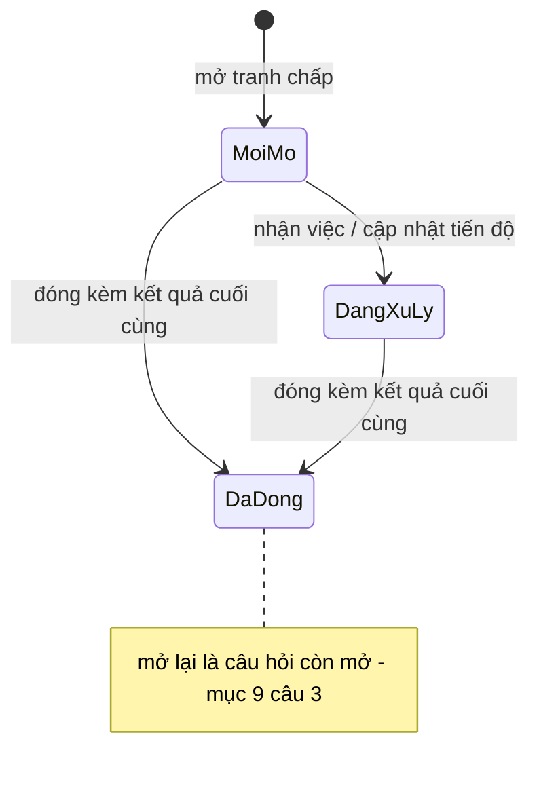

# SC-19 — Quản lý tranh chấp · Spec BE

| | |
|---|---|
| FE liên quan | FE-027 (Quản lý tranh chấp) |
| FN | FN-07 (Đối chiếu và chốt kỳ) |
| Ưu tiên | P1 |
| Yêu cầu khách | FR-SETTLE-03, RPT-09, FR-NOTIFY-01, TBL-ATTACH-01, DR-IMAGE-01, CAP-HUMAN-01, NFR-PERF-01 |
| Miền dữ liệu | D-SETTLE (RFP:734 khai *"Đối chiếu, lock kỳ, tranh chấp, output"*) |
| State machine | RFP **không có** FIG cho vòng đời tranh chấp và **không liệt** tập trạng thái — mục 4 và mục 9 câu 1 |
| Đã thi công | **Không** — chưa có bảng, chưa có endpoint, chưa có màn |

## 1. Phạm vi backend của màn này

BE phải ghi nhận và theo dõi tranh chấp phát sinh khi rà số cuối ngày với đủ sáu trường
FR-SETTLE-03 (RFP:661) và cột nghiệm thu của nó đòi: **trạng thái · nguyên nhân · người phụ trách
xử lý · kết quả cuối cùng** (thân yêu cầu) cộng **ngày dự kiến xử lý · lịch sử cập nhật** (nghiệm
thu). Mỗi tranh chấp phải neo về một dòng có thật của bảng đối chiếu ngày (SC-18 · FE-025). Dữ liệu
của màn là nguồn của RPT-09 (RFP:752) và của event *"tranh chấp đang mở"* mà FR-NOTIFY-01 (RFP:686)
liệt vào phạm vi cơ bản. **Không** thuộc phạm vi: sửa số của giao dịch — đó là đường FN-08 (SC-20 · SC-21) và vẫn phải qua
maker-checker; gửi thông báo (SC-28 · SC-29); sinh báo cáo RPT-09 (SC-26). **Không tự động đóng
tranh chấp** theo bất kỳ điều kiện dữ liệu nào: CAP-HUMAN-01 (RFP:550,557) liệt *"Xác nhận hoàn
tất giao nhận hàng khi có tranh chấp"* vào các điểm bắt buộc giữ con người trong vòng lặp.

## 2. Hợp đồng API

### `GET /api/disputes`

Thoả FE-027 · nghiệm thu FR-SETTLE-03 (*"danh sách tranh chấp đang mở"*). Xác thực **bắt buộc**;
vai trò xem mục 6; **idempotent**.

**Request** (query, đều không bắt buộc) — `status` (một giá trị trong tập chốt ở mục 9 câu 1, mặc
định **đang mở**) · `businessDate` (date `YYYY-MM-DD`) · `sourceType` (`aitai`\|`seri`\|`delivery`)
· `assigneeId` (uuid) · `limit`, `cursor` (phân trang).

**Response 2xx** — `rows[]`: `id`, `businessDate`, `sourceType`, `sourceDocumentCode`,
`participantName`, `cause`, `assigneeName`, `dueDate`, `status`, `agingDays`, `overdue`; hai trường
cuối là **giá trị dẫn xuất** theo ngày hiện tại (JST), không phải cột lưu.

**Mã lỗi** — 400 `INVALID_STATUS` / `INVALID_SOURCE_TYPE` / `INVALID_BUSINESS_DATE` (giá trị lọc
ngoài tập — **không** trả danh sách rỗng im lặng vì người dùng sẽ đọc thành "hết việc") · 404 (vai
trò không được vào tài nguyên, §02-08 RFP:311) · 500 `INTERNAL_ERROR`. **Tác dụng phụ** — không
ghi; không audit (đọc không thuộc tập hành vi FR-AUDIT-01 RFP:710).

### `POST /api/disputes`

Thoả FE-027 · FR-SETTLE-03 (RFP:661). Xác thực **bắt buộc**; chỉ vai mở tranh chấp (mục 6).
**Không idempotent** — mục 9 câu 5 quyết định có khoá duy nhất theo dòng nguồn hay không.

**Request** (body) — `businessDate` (date, **bắt buộc**, phải **khớp** ngày nghiệp vụ của dòng
nguồn) · `sourceType` (enum ba nguồn của bảng đối chiếu ngày, **bắt buộc**) · `sourceId` (uuid,
**bắt buộc**; cặp `sourceType`+`sourceId` phải tồn tại trong bảng đối chiếu) · `participantId`
(uuid, không bắt buộc, phải có trong danh mục D-PARTY) · `cause` (text, **bắt buộc**, trim rồi
phải còn nội dung) · `assigneeId` (uuid, **bắt buộc**, tài khoản **đang hoạt động**) · `dueDate`
(date, **bắt buộc**, không sớm hơn `businessDate`; **nhập tay** vì RFP không cho ngưỡng SLA —
mục 9 câu 2). Bốn trường đầu và `cause`/`assigneeId`/`dueDate` đều từ FR-SETTLE-03 (RFP:661) và
FE-025.

**Server tự quyết, không nhận từ client:** `id`, `status` (luôn là trạng thái mở đầu vòng đời),
`openedBy`, `createdAt`, và dòng lịch sử đầu tiên — client gửi thì bị **bỏ qua**.

**Response 2xx** — `id`, `status`, `createdAt` và bản ghi đầy đủ như một phần tử của `rows[]`.

**Mã lỗi**

| HTTP | Mã nghiệp vụ | Điều kiện phát sinh | Yêu cầu RFP |
|---|---|---|---|
| 404 | — | vai trò không được mở tranh chấp | §02-08 RFP:311 |
| 404 | `SOURCE_LINE_NOT_FOUND` | cặp (`sourceType`,`sourceId`) không có trong bảng đối chiếu ngày | FE-025 |
| 422 | `MISSING_CAUSE` | `cause` rỗng sau khi trim | FR-SETTLE-03 |
| 422 | `MISSING_ASSIGNEE` / `ASSIGNEE_INACTIVE` | thiếu người phụ trách, hoặc tài khoản đã vô hiệu | FR-SETTLE-03 |
| 422 | `MISSING_DUE_DATE` / `DUE_DATE_BEFORE_BUSINESS_DATE` | thiếu ngày dự kiến, hoặc sớm hơn ngày nghiệp vụ | nghiệm thu FR-SETTLE-03 |
| 422 | `BUSINESS_DATE_MISMATCH` | `businessDate` lệch ngày nghiệp vụ của dòng nguồn | FR-SETTLE-01 |
| 409 | `DUPLICATE_OPEN_DISPUTE` | *chỉ khi* khách chốt "một nguồn một tranh chấp mở" — mục 9 câu 5 | — |
| 500 | `INTERNAL_ERROR` | lỗi ghi | NFR-OPS-01 |

**Tác dụng phụ** — thêm một bản ghi tranh chấp **và** dòng lịch sử đầu tiên; ghi audit
`dispute_open` (mục 7); phát event *"tranh chấp đang mở"* cho FR-NOTIFY-01 (RFP:686). Ngày nghiệp
vụ **đã lock vẫn ghi được**: bản ghi tranh chấp nói **về** một ngày chứ không phải bản ghi **của**
ngày đó — cùng lối với bảng yêu cầu điều chỉnh; áp tầng chặn ghi sau lock lên đây là làm màn vô
dụng đúng lúc cần nhất, vì tranh chấp gần như luôn nổi lên sau khi chốt kỳ.

### `PATCH /api/disputes/{id}`

Thoả FE-027 (Lưu tiến độ). Xác thực **bắt buộc**; vai trò mục 6; **không idempotent** vì mỗi lần
đổi trạng thái sinh một dòng lịch sử.

**Request** — `id` (path, uuid, bắt buộc); body nhận `status`, `cause`, `assigneeId`, `dueDate`,
`participantId`, `note` (ghi chú cho dòng lịch sử). **Không** nhận `resolution` qua endpoint này và
**không** nhận `sourceType`/`sourceId`/`businessDate` — dòng nguồn bất biến sau khi mở (mục 9 câu
6). **Response 2xx** — bản ghi sau khi sửa cùng `history[]` mới nhất.

**Mã lỗi** — 404 `DISPUTE_NOT_FOUND` · 404 (sai vai) · 409 `ALREADY_CLOSED` (đã đóng thì không sửa
qua endpoint này — mục 9 câu 3) · 422 các mã cùng tập với `POST` · 422 `SOURCE_IMMUTABLE` (body có
mặt khoá dòng nguồn) · 500. **Tác dụng phụ** — sửa bản ghi; **thêm** một dòng lịch sử khi `status`,
`assigneeId` hoặc `dueDate` đổi; ghi audit `dispute_update`.

### `POST /api/disputes/{id}/close`

Thoả FE-027 · FR-SETTLE-03 (*"kết quả cuối cùng"*). Xác thực **bắt buộc**; chỉ vai đóng tranh chấp
(mục 6). **Không idempotent** — đóng lần hai trả 409.

**Request** — `id` (path, uuid) · `resolution` (body, text, **bắt buộc**, trim rồi phải còn nội
dung) · `note` (body, text, không bắt buộc, vào dòng lịch sử). **Response 2xx** — `status`,
`closedAt`, `resolution`, `history[]`.

**Mã lỗi** — 404 `DISPUTE_NOT_FOUND` · 404 (sai vai) · 409 `ALREADY_CLOSED` (đua đồng thời: chỉ
**một** kết quả được ghi; người sau nhận mã này chứ không ghi đè kết luận của người trước) · 422
`MISSING_RESOLUTION` · 500. **Tác dụng phụ** — đổi trạng thái sang đóng, ghi `resolution` và
`closedAt`; thêm dòng lịch sử; ghi audit `dispute_close`; tắt event *"tranh chấp đang mở"*.

### `POST /api/disputes/{id}/evidence`

Thoả TBL-ATTACH-01 (RFP:769-774) · DR-IMAGE-01 (RFP:792-794). Xác thực **bắt buộc**; vai trò mục 6.
Nhận multipart; file **không bắt buộc** với tranh chấp. **Request** — `id` (path, uuid) · `file`
(body, multipart): định dạng và dung lượng kiểm ở **phía hệ thống**, gợi ý của trình duyệt không
phải hàng rào; ngưỡng cụ thể ở mục 9 câu 7.

**Mã lỗi** — 404 `DISPUTE_NOT_FOUND` · 409 `ALREADY_CLOSED` · 422 `INVALID_TYPE` / `TOO_LARGE` ·
500. **Tác dụng phụ** — lưu tệp vào kho **riêng tư**; ghi audit `dispute_evidence_add`. Đường dẫn
tệp **không bao giờ** ra file xuất CSV; chỉ mở qua liên kết có hạn giờ.

## 3. Mô hình dữ liệu màn này chạm

| Thực thể | Cột dùng | Ràng buộc thiết kế đòi | Tầng thực thi | Đã có? |
|---|---|---|---|---|
| Tranh chấp | `id`, `business_date`, `source_type`, `source_id`, `participant_id`, `cause`, `status`, `assignee_id`, `due_date`, `resolution`, `opened_by`, `created_at`, `closed_at` | `cause` NOT NULL · `status` CHECK theo tập chốt ở mục 9 câu 1 · `source_type` CHECK 3 giá trị của bảng đối chiếu · `assignee_id` FK người dùng · `due_date` NOT NULL | tầng 1 (CHECK + FK + NOT NULL) | **Không** |
| Lịch sử cập nhật tranh chấp | `id`, `dispute_id` (FK), `from_status`, `to_status`, `note`, `changed_by`, `changed_at` | **chỉ thêm** — không sửa, không xoá; CHECK cho **cả hai** cột trạng thái | tầng 1 (CHECK + chỉ có policy insert) | **Không** |
| Nguồn dòng đối chiếu | `business_date`, `source_type`, `source_id`, `variance` | cặp (`source_type`,`source_id`) phải trỏ về dòng có thật; `variance` đọc để hiện chênh lệch liên quan | tầng 3 — tham chiếu **đa hình, không FK được** | Một phần (SC-18) |
| Người tham gia (D-PARTY) | `id`, tên hiển thị | chỉ hiện tên hiển thị, **không** hiện email | tầng 3 | Có |
| Tài khoản người dùng | `id`, tên hiển thị, cờ hoạt động | người phụ trách chỉ nhận tài khoản đang hoạt động; vẫn phải **gán lại được** khi người đang phụ trách bị vô hiệu | tầng 3 | Có |
| Tệp bằng chứng | khoá tệp, loại, dung lượng | kho **riêng tư**; lưu 3 năm rồi cold archive (RFP:774) | tầng 3 | Một phần (kho khác) |
| Nhật ký kiểm toán | `action`, chủ thể, thời điểm, before/after, `reason` | mục 7 | tầng 3 | Có |

Hai điểm bắt buộc khai: (1) **`(source_type, source_id)` là tham chiếu đa hình, không FK được** —
LAB-5 đừng đi tìm khoá ngoại ở đây; (2) khác bảng yêu cầu điều chỉnh, bảng tranh chấp **cần UPDATE**
để đổi trạng thái nên phải có policy update **hẹp theo vai trò**, còn bảng lịch sử thì chỉ thêm.

## 4. Vòng đời trạng thái

RFP **không có FIG** cho tranh chấp và **không liệt** tập trạng thái. Nghiệm thu FR-SETTLE-03
(RFP:661) chỉ đòi *"danh sách tranh chấp **đang mở**, ngày dự kiến xử lý và lịch sử cập nhật"* →
tối thiểu phải phân biệt được **đang mở** với **đã đóng**. Sơ đồ dưới là **đề xuất ba trạng
thái**; tập chính thức do khách chốt (mục 9 câu 1).

| Từ | Sự kiện | Đến | Điều kiện tiền đề (guard) | Ai được phép | Mã lỗi khi vi phạm |
|---|---|---|---|---|---|
| — | mở tranh chấp | Mới mở | dòng nguồn tồn tại · `cause`, `assigneeId`, `dueDate` hợp lệ · `dueDate` ≥ `businessDate` | vai mở (mục 6) | 404 `SOURCE_LINE_NOT_FOUND` · 422 `MISSING_*` · 422 `DUE_DATE_BEFORE_BUSINESS_DATE` |
| Mới mở | cập nhật tiến độ | Đang xử lý | bản ghi chưa đóng | vai cập nhật | 409 `ALREADY_CLOSED` |
| Mới mở / Đang xử lý | đóng | Đã đóng | **`resolution` bắt buộc có nội dung**; chỉ một kết quả được ghi | vai đóng | 422 `MISSING_RESOLUTION` · 409 `ALREADY_CLOSED` |
| Mới mở / Đang xử lý | (không đóng, quá `due_date`) | giữ nguyên | nhãn **quá hạn dự kiến** là *giá trị dẫn xuất*, **không** phải một trạng thái | — | — |
| Đã đóng | mở lại | ? | **thiết kế không tự quyết** — mục 9 câu 3 | ? | — |
| bất kỳ | ngày nghiệp vụ đã lock | giữ nguyên | **vẫn ghi được** — bản ghi nói *về* một ngày, không phải *của* ngày đó | như trên | — |

Guard dễ mất nhất: `resolution` bắt buộc **theo trạng thái đích**, không phải cố định — để trống lúc còn xử lý là hợp lệ, để trống lúc đóng thì không.

## 5. Quy tắc nghiệp vụ

| Mã | Quy tắc (nguyên văn nguồn) | Thực thi ở đâu | Kiểm bằng gì |
|---|---|---|---|
| FR-SETTLE-03 (RFP:661) | *"ghi nhận trạng thái tranh chấp, nguyên nhân, người phụ trách xử lý và kết quả cuối cùng"* | tầng 1 (NOT NULL + CHECK) | tạo tranh chấp thiếu bất kỳ trường nào → 422 |
| FR-SETTLE-03 nghiệm thu (RFP:661) | *"Có danh sách tranh chấp đang mở, ngày dự kiến xử lý và lịch sử cập nhật"* | tầng 1 (`due_date` NOT NULL; bảng lịch sử riêng) | danh sách mặc định lọc đang mở; mỗi lần đổi trạng thái sinh đúng một dòng lịch sử |
| FR-CORR-02 (RFP:657) — nguyên tắc vay | *"tạo bản ghi **reverse/delta** thay vì ghi đè lịch sử"* | tầng 1 (bảng lịch sử chỉ thêm) | không có đường sửa/xoá dòng lịch sử |
| CAP-HUMAN-01 (RFP:550,557) | *"Xác nhận hoàn tất giao nhận hàng khi có tranh chấp"* thuộc điểm bắt buộc giữ con người | tầng 3 — **không có** đường tự động đóng | không tồn tại job hay trigger nào đổi trạng thái sang đóng |
| FR-NOTIFY-01 (RFP:686) | *"tranh chấp đang mở"* thuộc event phạm vi cơ bản, kênh in-app và email | tầng 3 — phát event khi mở và khi quá hạn | mở tranh chấp sinh đúng một event |
| DR-IMAGE-01 (RFP:794) | *"**không yêu cầu** chức năng AI tự động phán định chất lượng từ các hình ảnh này"* | — (ranh giới phạm vi) | không có bước suy luận nào từ ảnh bằng chứng |
| TBL-ATTACH-01 (RFP:774) | ảnh/chứng từ về **tranh chấp** lưu online **3 năm**, sau đó cold archive, phục hồi ≤ **2 ngày làm việc** | tầng 3 — policy lưu trữ | kiểm policy và diễn tập phục hồi |

Hai con số duy nhất của màn đều dẫn nguồn: 3 năm và 2 ngày làm việc, RFP:774. **Ngưỡng SLA xử lý không có con số nào trong RFP** → mục 9 câu 2; thiết kế **không tự đặt**.

## 6. Ma trận phân quyền theo thao tác

| Vai trò | Xem danh sách | Mở tranh chấp | Cập nhật tiến độ | Đóng tranh chấp | Đính kèm bằng chứng |
|---|---|---|---|---|---|
| ROLE-SETTLEMENT | cho phép | **cho phép** | cho phép | **cho phép** | cho phép |
| Người được **gán phụ trách** (bất kể vai) | cho phép (việc của mình) | từ chối · 404 | cho phép | **từ chối · 403** — mục 9 câu 4 | cho phép |
| 6 vai còn lại: ROLE-INTAKE · ROLE-JUDGE · ROLE-TRADE · ROLE-DELIVERY · ROLE-RULE-ADMIN · ROLE-SYS-ADMIN | mục 9 câu 4 | từ chối · 404 | từ chối · 404 | từ chối · 404 | từ chối · 404 |

- **Đọc và ghi khác nhau**, và ở đây còn tách **cập nhật** khỏi **đóng**: người phụ trách đẩy tiến độ được nhưng không kết luận. Ranh giới này là **đề xuất** — RFP chỉ nói chủ thể là *"Bộ phận đối chiếu / phát hiện chênh lệch"* (RFP:661).
- **Chặn vào trang trả 404, không phải 403** — có chủ đích. Riêng "đóng" trả **403** vì người gọi đã được vào tài nguyên nên ẩn sự tồn tại không còn ý nghĩa.
- **Không có maker-checker ở màn này**: GOV-RULE-01 (RFP:601) không áp cho tranh chấp; sửa số vẫn phải qua maker-checker của FN-08 (SC-21).

## 7. Audit và truy vết

| Thao tác | `action` | Ghi gì (before/after/reason) | Yêu cầu RFP |
|---|---|---|---|
| Mở tranh chấp | `dispute_open` | before: không có · after: bản ghi đầy đủ · reason: `cause` | FR-AUDIT-01 RFP:710 |
| Cập nhật tiến độ | `dispute_update` | before/after của các trường đổi · reason: `note` | FR-AUDIT-01 |
| Đổi người phụ trách | `dispute_reassign` | before/after `assignee_id` · reason: `note` | FR-AUDIT-01 |
| Đóng tranh chấp | `dispute_close` | before: trạng thái cũ · after: trạng thái đóng + `resolution` · reason: `note` | FR-AUDIT-01 |
| Đính kèm bằng chứng | `dispute_evidence_add` | after: khoá tệp · loại · dung lượng (**không** ghi đường dẫn ra file xuất) | TBL-ATTACH-01 RFP:769-774 |

Bảng lịch sử cập nhật (mục 3) là **thứ khác** với nhật ký kiểm toán: lịch sử là dữ liệu nghiệp vụ mà nghiệm thu FR-SETTLE-03 đòi hiện trên màn; audit là dấu vết kiểm toán chung. Ghi cả hai, không gộp.

## 8. Phi chức năng áp cho màn này

| Mã | Yêu cầu | Ảnh hưởng thiết kế BE |
|---|---|---|
| NFR-PERF-01 (RFP:807) | tìm kiếm thông thường p95 ≤ 2 giây | danh sách lọc theo trạng thái + ngày + người phụ trách cần chỉ mục `(status, due_date)` và `(assignee_id, status)`; `agingDays`/`overdue` tính khi truy vấn, không quét toàn bảng |
| FR-NOTIFY-02 (RFP:687) | thông báo **Critical** gửi xong trong **5 phút**; email lỗi retry tối đa **3 lần** | nếu khách xếp *"tranh chấp quá hạn"* vào Critical thì event phải phát ngay khi vượt `due_date`, không đợi người mở màn |
| DR-RET-01 (RFP:813) | dữ liệu nghiệp vụ online **7 năm**; ảnh/chứng từ **3 năm** rồi cold | bản ghi tranh chấp và lịch sử theo 7 năm; tệp bằng chứng theo 3 năm (RFP:774) — hai vòng đời **khác nhau** trên cùng một tranh chấp |
| NFR-OPS-01 (RFP:814) | giám sát được lỗi gửi thông báo | event tranh chấp quá hạn thất bại phải vào alert |

## 9. Câu hỏi cho chủ đầu tư

1. **Tập trạng thái tranh chấp gồm những giá trị nào?** FR-SETTLE-03 (RFP:661) đòi có *"trạng thái"* và nghiệm thu đòi *"danh sách tranh chấp **đang mở**"*, nhưng RFP **không liệt** tập giá trị ở bất kỳ đâu. Thiết kế đề xuất ba giá trị (mục 4) và **không tự chốt**: đây là CHECK ở tầng 1 và là cột lọc của RPT-09; chọn sai thì phải đổi cả CHECK lẫn dữ liệu lịch sử.
2. **Ngưỡng SLA xử lý là bao nhiêu?** RPT-09 (RFP:752) mang đúng chữ *"Tổng hợp tranh chấp và **SLA xử lý**"* nhưng RFP **không cho con số nào**. Thiết kế để `due_date` **nhập tay** và chỉ so với hôm nay để gắn nhãn quá hạn. SLA phân cấp theo mức độ thì cần thêm cột mức độ và bảng tra ngưỡng — thay đổi lược đồ, không phải cấu hình.
3. **Tranh chấp đã đóng có mở lại được không, ai được mở lại?** RFP không nói. Áp nguyên tắc FR-CORR-02 (RFP:657, *không ghi đè lịch sử*) thì mở lại là **một dòng lịch sử mới**, không phải xoá `resolution` cũ. Chọn sai → hoặc mất kết luận cũ, hoặc bế tắc khi đóng nhầm.
4. **Ai mở · ai cập nhật · ai đóng, và ai được đọc?** RFP chỉ nói chủ thể là *"Bộ phận đối chiếu / phát hiện chênh lệch"* (RFP:661); §02-08 (RFP:311) giao Chủ đầu tư quyết người phụ trách mỗi cổng. Thiết kế đề xuất ma trận mục 6, trong đó người được gán phụ trách **không** được đóng. Sáu vai còn lại có được đọc không? §09-06 (RFP:881-883) đòi tuân thủ APPI, mà tranh chấp mang cả tên người tham gia lẫn ảnh bằng chứng.
5. **Một dòng nguồn được mở mấy tranh chấp cùng lúc?** RFP không nói. Có khoá duy nhất thì hai vấn đề khác nhau trên cùng một giao dịch không ghi tách được; không có khoá thì RPT-09 **đếm đôi**.
6. **Dòng nguồn có sửa được sau khi mở không?** Thiết kế coi `(sourceType, sourceId, businessDate)` là **bất biến** (mở sai thì đóng và mở lại) vì cho sửa thì lịch sử cập nhật mất ý nghĩa neo. Khách xác nhận cách đọc này.
7. **Định dạng và dung lượng tối đa của tệp bằng chứng, và mấy tệp một tranh chấp?** TBL-ATTACH-01 (RFP:769-774) và DR-IMAGE-01 (RFP:792-794) chỉ quy định **thời hạn lưu** (3 năm, cold archive, phục hồi ≤ 2 ngày làm việc), **không** quy định ngưỡng nhận tệp.
8. **Lịch sử cập nhật ghi phạm vi nào?** Nghiệm thu chỉ đòi *"lịch sử cập nhật"* mà không nói ghi những gì. Thiết kế đề xuất ghi cả lần đổi người phụ trách và lần đổi ngày dự kiến — nếu không thì con số tồn đọng của RPT-09 lùi được mà không để dấu vết.
9. **Ưu tiên: FE-027 là P1 nhưng RPT-09 nằm trong nhóm báo cáo P0** (FE-035, FR-RPT-01 RFP:707). Không dựng màn này thì RPT-09 không có dữ liệu để đếm. Khách quyết: nâng FE-027, hay chấp nhận RPT-09 rỗng ở lần bàn giao đầu?

## 10. Prototype hiện làm khác gì

| Hạng mục | Thiết kế đòi | Prototype làm | Dẫn chứng | Mức |
|---|---|---|---|---|
| Sáu trường FR-SETTLE-03 | trạng thái · nguyên nhân · người phụ trách · ngày dự kiến · kết quả · lịch sử cập nhật | **chưa tồn tại trường nào** — không có bảng tranh chấp, không có bảng lịch sử trong `supabase/migrations/` | thiết kế RFP:661; phía prototype: không có tệp nào | **Khác không chủ đích** — FE-027 chưa đạt |
| Danh sách tranh chấp đang mở | endpoint + chỉ mục `(status, due_date)` | không có nguồn dữ liệu nào để lập danh sách | — | Khác không chủ đích |
| RPT-09 chạy trên dữ liệu thật | tổng hợp tranh chấp và SLA xử lý | RPT-09 phải để mock: `isMock: true`, `filterFields`/`columns` rỗng | `src/lib/reports/registry.ts:133-141`; thiết kế RFP:752 | Khác không chủ đích — hệ quả trực tiếp |
| Event *"tranh chấp đang mở"* | phát khi mở và khi quá hạn (FR-NOTIFY-01) | không có event nào để phát vì không có tranh chấp nào tồn tại | thiết kế RFP:686 | Khác không chủ đích |
| Bảng gần nhất về hình dạng | bảng tranh chấp riêng | `correction_request` gần nhất về hình dạng nhưng **khác nghiệp vụ**: nó là yêu cầu *sửa* một giao dịch sau lock, có maker-checker, kết thúc bằng dòng điều chỉnh. Nhồi tranh chấp vào đó sẽ phá CHECK `status` ba giá trị của nó | `supabase/migrations/20260904090600_correction.sql:4-13` (CHECK ở dòng 9) | Khác **có chủ đích** — hai bảng riêng là đúng thiết kế |
| Tập trạng thái · ngưỡng SLA · ai đóng · mở lại | mục 9 câu 1-4 | chưa quyết ở đâu | — | **Cần khách chốt** |

## 11. Dẫn chứng

- RFP:661 FR-SETTLE-03 (thân: 4 trường; nghiệm thu: + ngày dự kiến, + lịch sử cập nhật) · RFP:734 D-SETTLE khai *"tranh chấp"*
- RFP:752 RPT-09 *"Tổng hợp tranh chấp và SLA xử lý"* (không có con số SLA) · RFP:751 RPT-08 · RFP:707 FR-RPT-01
- RFP:686 FR-NOTIFY-01 (*"tranh chấp đang mở"* thuộc phạm vi cơ bản) · RFP:687 FR-NOTIFY-02 · RFP:814 NFR-OPS-01
- RFP:550,557 CAP-HUMAN-01 (*"Xác nhận hoàn tất giao nhận hàng khi có tranh chấp"*)
- RFP:769-774 TBL-ATTACH-01 (ảnh tranh chấp 3 năm; cold archive; phục hồi ≤ 2 ngày làm việc) · RFP:792-794 DR-IMAGE-01 (**không** yêu cầu AI phán định)
- RFP:657 FR-CORR-02 (nguyên tắc không ghi đè lịch sử, vay cho bảng lịch sử) · RFP:601 GOV-RULE-01 (không áp cho màn này)
- RFP:311 §02-08 (Chủ đầu tư quyết phân quyền) · RFP:881-883 §09-06 APPI · RFP:807 NFR-PERF-01 · RFP:813 DR-RET-01
- Feature List `FE-027` — `plans/260909-1355-lab4-thiet-ke-chi-tiet/nguon-function-list-va-feature-list.md`
- `src/lib/reports/registry.ts:133-141` — RPT-09 `isMock: true`
- `supabase/migrations/20260904090600_correction.sql:4-13` — bảng gần nhất về hình dạng nhưng khác nghiệp vụ
- `docs/lab4/10-database-diagram.md` § 5.2 (SC-19) — đề xuất hai bảng và ghi chú tham chiếu đa hình
