# SC-20 — Tạo yêu cầu điều chỉnh · Spec BE

| | |
|---|---|
| FE liên quan | FE-028 (Yêu cầu điều chỉnh sau khi chốt) |
| FN | FN-08 (Điều chỉnh sau khi chốt) |
| Ưu tiên | P0 |
| Yêu cầu khách | FR-CORR-01, FR-CORR-03, BR-CLOSE-01, FR-AUDIT-01, TBL-ATTACH-01, DR-IMAGE-01, RPT-08 |
| Miền dữ liệu | D-SETTLE · D-TRADE |
| State machine | FIG-012 (RFP:637) cho giao dịch — **và FIG-012 căng với FR-CORR-01/02**, xem mục 9 câu 1 |
| Đã thi công | Có |

## 1. Phạm vi backend của màn này

BE phải nhận **yêu cầu điều chỉnh** cho một giao dịch thuộc ngày nghiệp vụ **đã chốt kỳ**, kèm lý
do và **bằng chứng đính kèm**, ở trạng thái chờ duyệt; giao dịch gốc **không bị thay đổi** trước
khi được phê duyệt (FR-CORR-01 RFP:656). Đây là **đường ghi hợp lệ duy nhất** còn lại sau khi chốt
kỳ (FR-CORR-03 RFP:658, BR-CLOSE-01 RFP:597), và thao tác tạo phải truy được chủ thể · thời điểm ·
**lý do** · bằng chứng (FR-AUDIT-01 RFP:710).

**Không** thuộc phạm vi: quyết định duyệt/từ chối và sinh bản ghi đảo ngược hoặc chênh lệch (SC-21
· FR-CORR-02 RFP:657); sinh phần chênh lệch tiền thưởng kỳ sau (SC-22 · FR-INC-03 RFP:680); sinh
báo cáo RPT-08 (SC-26). Màn **không** có đường sửa hay xoá yêu cầu đã gửi: muốn đổi thì gửi yêu
cầu mới (mục 9 câu 4).

**Chiều điều kiện lock ở màn này ĐẢO NGƯỢC** so với mọi màn sửa trực tiếp: các màn kia từ chối khi
ngày **đã** lock; màn này từ chối khi ngày **chưa** lock. Đọc kỹ chỗ này — cài ngược là mở lại
đúng cái lỗ mà FR-CORR-03 muốn bịt.

## 2. Hợp đồng API

### `GET /api/transactions/by-code/{txnCode}`

Thoả FE-028 (Bước 1 và Bước 2) · FR-CORR-01. Xác thực **bắt buộc**; chỉ `ROLE-SETTLEMENT` (mục 6);
**idempotent** vì chỉ đọc.

**Request** — `txnCode` (path, string, bắt buộc): trim rồi so khớp mã giao dịch; mẫu hiển thị
`TXN-NNNN` (mục 9 câu 5 chốt có ràng buộc mẫu hay không).

**Response 2xx** — `id`, `txnCode`, `qty`, `unitPrice`, `businessDate`, `periodLocked` (boolean).
Bốn trường giữa là **chỉ đọc**; endpoint này không có đường ghi nào vào giao dịch gốc.

**Mã lỗi** — 404 `TXN_NOT_FOUND` (mã không khớp bản ghi nào; client hiện *"Không tìm thấy giao dịch
với mã này."* / 「この取引番号は見つかりません。」) · 404 (vai trò không được vào tài nguyên, §02-08
RFP:311) · 422 `MISSING_TXN_CODE` (mã rỗng sau khi trim) · 500 `INTERNAL_ERROR`.

**Tác dụng phụ** — không ghi bảng nào; không audit (đọc không thuộc tập hành vi FR-AUDIT-01).

### `POST /api/corrections`

Thoả FE-028 · FR-CORR-01 (RFP:656) · FR-CORR-03 (RFP:658). Xác thực **bắt buộc**; chỉ
`ROLE-SETTLEMENT`. `multipart/form-data`. **Không idempotent** — chống gửi trùng bằng cách vô hiệu
nút trong lúc gửi và, nếu khách chốt một-yêu-cầu-chờ-duyệt-một-giao-dịch, bằng 409
`DUPLICATE_PENDING` (mục 9 câu 3).

**Request**

| Tham số | Vị trí · Kiểu | Bắt buộc | Ràng buộc | Nguồn |
|---|---|---|---|---|
| `targetTxnId` | body · uuid | có | phải tồn tại trong bảng giao dịch; ngày nghiệp vụ của nó **phải đã lock** | FR-CORR-01 · FR-CORR-03 |
| `reason` | body · text | có | trim rồi phải còn nội dung | FR-CORR-01 · FR-AUDIT-01 |
| `evidence` | body · file (multipart) | **có** | định dạng và dung lượng kiểm ở **phía hệ thống**; gợi ý của trình duyệt không phải hàng rào (ngưỡng: mục 9 câu 2) | FR-CORR-01 · TBL-ATTACH-01 |

**Server tự quyết, không nhận từ client:** `id`, `status` (ghi cứng **chờ duyệt**), `requestedBy`
(chủ thể từ phiên đăng nhập), `createdAt`, `evidencePath` (khoá tệp do hệ thống sinh). Client gửi
các trường này thì bị **bỏ qua** — người tạo không chọn trạng thái phê duyệt.

**Response 2xx** — `id`, `status`, `createdAt`, `targetTxnId`. **Không** trả `evidencePath`.

**Mã lỗi**

| HTTP | Mã nghiệp vụ | Điều kiện phát sinh | Yêu cầu RFP |
|---|---|---|---|
| 400 | `INVALID_REQUEST` | body không phải multipart hợp lệ | — |
| 404 | — | vai trò khác `ROLE-SETTLEMENT` (không lộ sự tồn tại tài nguyên) | §02-08 RFP:311 |
| 404 | `TXN_NOT_FOUND` | `targetTxnId` không tồn tại trong bảng giao dịch | FR-CORR-01 |
| **409** | **`NOT_LOCKED`** | ngày nghiệp vụ của giao dịch đích **CHƯA** lock — đường điều chỉnh chỉ mở **sau** khi chốt kỳ | FR-CORR-03 (RFP:658) |
| 422 | `MISSING_TARGET_TXN_ID` | thiếu `targetTxnId` | FR-CORR-01 |
| 422 | `MISSING_REASON` | `reason` rỗng sau khi trim | FR-CORR-01 · FR-AUDIT-01 |
| 422 | `MISSING_EVIDENCE` | không có tệp bằng chứng | FR-CORR-01 |
| 422 | `INVALID_TYPE` | định dạng tệp ngoài danh sách khách chốt | TBL-ATTACH-01 · mục 9 câu 2 |
| 422 | `TOO_LARGE` | tệp vượt dung lượng khách chốt | TBL-ATTACH-01 · mục 9 câu 2 |
| 409 | `DUPLICATE_PENDING` | *chỉ khi* khách chốt một giao dịch chỉ có một yêu cầu chờ duyệt | mục 9 câu 3 |
| 500 | `INTERNAL_ERROR` | lỗi lưu tệp hoặc lỗi ghi bản ghi | NFR-OPS-01 |

Bốn mã 422 trên **phải phân biệt được ở thông báo client** — gom về một câu chung thì người dùng
không biết sửa gì (FE-028, trạng thái "Gửi lỗi").

**Tác dụng phụ** — lưu tệp vào kho **riêng tư**, rồi thêm một bản ghi yêu cầu điều chỉnh ở trạng
thái chờ duyệt; ghi audit `correction_request_create` (mục 7). **Không** chạm vào giao dịch gốc.
Hai bước lưu tệp và ghi bản ghi phải trọn vẹn cùng nhau: ghi bản ghi lỗi thì tệp đã lưu phải được
dọn, không để lại rác trong kho (mục 10).

## 3. Mô hình dữ liệu màn này chạm

| Thực thể | Cột dùng | Ràng buộc thiết kế đòi | Tầng thực thi | Đã có? |
|---|---|---|---|---|
| Yêu cầu điều chỉnh | `id`, `target_txn_id`, `reason`, `evidence_path`, `status`, `requested_by`, `created_at` | `target_txn_id` NOT NULL + FK giao dịch · `reason` NOT NULL · `evidence_path` **NOT NULL** (bằng chứng bắt buộc) · `status` CHECK ba giá trị, default chờ duyệt · **chỉ thêm** — không sửa, không xoá | tầng 1 (NOT NULL + FK + CHECK + chỉ có policy insert) | Có |
| Giao dịch (D-TRADE) | `txn_code` (unique), `qty`, `unit_price`, `business_date` | **chỉ đọc** từ màn này; không đường ghi nào | tầng 1 (unique mã) + tầng 3 (không có endpoint ghi) | Có |
| Kỳ lock ngày nghiệp vụ | `business_date` | sự tồn tại của kỳ lock cho `transaction.business_date` là **điều kiện tiền đề** để nhận yêu cầu | tầng 3 — kiểm ở tầng ứng dụng | Có |
| Chặn ghi sau lock | — | bảng yêu cầu điều chỉnh **cố ý KHÔNG** chịu tầng chặn ghi theo ngày lock — nếu chịu thì mất luôn đường ghi hợp lệ duy nhất sau lock | tầng 2 (trigger **không** đặt trên bảng này) | Có |
| Tệp bằng chứng | khoá tệp, loại, dung lượng | kho **riêng tư**, chặn cả đường **đọc**; đường dẫn tệp **không bao giờ** ra file xuất (RPT-08 không có cột này) | tầng 1b (policy kho) + tầng 3 | Có |
| Nhật ký kiểm toán | `action`, chủ thể, thời điểm, before/after, `reason` | mục 7 | tầng 3 | Có |

Hai điểm bắt buộc khai: (1) `evidence_path` là **NOT NULL** — khác tệp đính kèm của lô hàng vốn tuỳ chọn; (2) bảng này là **chỉ thêm**, nên "sửa yêu cầu" không tồn tại như một nghiệp vụ.

## 4. Vòng đời trạng thái

Hai vòng đời chạy song song và **không được trộn**:

```mermaid
stateDiagram-v2
  state "Yêu cầu điều chỉnh" as YC {
    [*] --> ChoDuyet: POST /api/corrections
    ChoDuyet --> DaDuyet: SC-21 duyệt
    ChoDuyet --> BiTuChoi: SC-21 từ chối
  }
  state "Giao dịch gốc" as GD {
    [*] --> DaChot
    DaChot --> DaChot: KHÔNG đổi khi có yêu cầu; KHÔNG đổi sau khi duyệt
  }
```

| Từ | Sự kiện | Đến | Điều kiện tiền đề (guard) | Ai được phép | Mã lỗi khi vi phạm |
|---|---|---|---|---|---|
| — | tạo yêu cầu | Chờ duyệt | giao dịch đích tồn tại **và** ngày nghiệp vụ của nó **đã lock** · có `reason` · có tệp bằng chứng hợp lệ | `ROLE-SETTLEMENT` | 404 `TXN_NOT_FOUND` · **409 `NOT_LOCKED`** · 422 `MISSING_REASON` / `MISSING_EVIDENCE` / `INVALID_TYPE` / `TOO_LARGE` |
| Chờ duyệt | duyệt / từ chối | Đã duyệt / Bị từ chối | thuộc SC-21; **người duyệt khác người lập** (GOV-RULE-01 RFP:601) | `ROLE-SETTLEMENT` khác người lập | xem SC-21 |
| Chờ duyệt | sửa hoặc thu hồi yêu cầu | — | **không có cạnh này trong thiết kế** — bảng chỉ thêm; muốn đổi thì gửi yêu cầu mới | — | mục 9 câu 4 |
| Đã chốt (giao dịch) | có yêu cầu điều chỉnh | Đã chốt | giao dịch gốc **không đổi** trước khi được phê duyệt | — | — |

Guard dễ cài **ngược** nhất: điều kiện là *"ngày nghiệp vụ **đã** lock"*. Ngày chưa lock thì không nhận yêu cầu và chỉ đường về màn giao dịch để sửa trực tiếp — vì trước lock việc sửa trực tiếp là hợp lệ, còn sau lock thì không.

## 5. Quy tắc nghiệp vụ

| Mã | Quy tắc (nguyên văn nguồn) | Thực thi ở đâu | Kiểm bằng gì |
|---|---|---|---|
| FR-CORR-01 (RFP:656) | *"hỗ trợ yêu cầu điều chỉnh đối với giao dịch đã chốt, kèm lý do, bằng chứng đính kèm và trạng thái phê duyệt"*; nghiệm thu *"Có bản ghi yêu cầu điều chỉnh riêng, và giao dịch gốc không bị thay đổi trước khi được phê duyệt"* | tầng 1 (`reason`, `evidence_path` NOT NULL; `status` CHECK) + tầng 3 (không có endpoint ghi vào giao dịch) | tạo yêu cầu rồi đọc lại giao dịch gốc: `qty` và `unit_price` không đổi |
| FR-CORR-03 (RFP:658) | *"không được cho phép sửa trực tiếp bản ghi của ngày đã lock"* | tầng 2 (chặn ghi trực tiếp) + tầng 3 (đường này chỉ nhận ngày **đã** lock) | ngày chưa lock → 409 `NOT_LOCKED`; sửa trực tiếp ngày đã lock → 423 (SC-18) |
| BR-CLOSE-01 (RFP:597) | *"Không được chỉnh sửa trực tiếp ngày nghiệp vụ đã bị lock"* | như trên | như trên |
| FR-AUDIT-01 (RFP:710) | audit cho *"tạo, sửa, phê duyệt, lock và thay đổi quyền"* kèm chủ thể · timestamp · before/after · **lý do** | tầng 3 | mục 7 |
| TBL-ATTACH-01 (RFP:769-774) | ảnh/chứng từ phụ trợ về **tranh chấp hoặc giao hàng** lưu online **3 năm**, sau đó cold archive, phục hồi ≤ **2 ngày làm việc**; chứng từ giao dịch và bảng đối chiếu lưu **7 năm** | tầng 3 — policy lưu trữ | kiểm policy; xem mục 9 câu 6 về việc bằng chứng điều chỉnh thuộc dòng nào |
| DR-IMAGE-01 (RFP:794) | *"**không yêu cầu** chức năng AI tự động phán định chất lượng từ các hình ảnh này"* | — (ranh giới phạm vi) | không có bước suy luận nào từ ảnh bằng chứng |

Con số nghiệp vụ duy nhất dẫn được nguồn là thời hạn lưu tệp (RFP:769-774). **Ngưỡng định dạng và dung lượng tệp không có trong RFP** → mục 9 câu 2; thiết kế **không tự đặt**.

## 6. Ma trận phân quyền theo thao tác

| Vai trò | Vào màn | Tra mã giao dịch | Gửi yêu cầu | **Đọc** tệp bằng chứng |
|---|---|---|---|---|
| ROLE-SETTLEMENT | cho phép | cho phép | **cho phép** | cho phép |
| 6 vai còn lại: ROLE-INTAKE · ROLE-JUDGE · ROLE-TRADE · ROLE-DELIVERY · ROLE-RULE-ADMIN · ROLE-SYS-ADMIN | từ chối · **404** | từ chối · **404** | từ chối · **404** | **từ chối** |

- **Đọc và ghi khác nhau** ở toàn hệ thống, nhưng **tệp bằng chứng là ngoại lệ**: nó chặn **cả
  đường đọc**, chỉ `ROLE-SETTLEMENT` mở được. Bằng chứng điều chỉnh có thể chứa thông tin cá nhân
  (§09-06 APPI RFP:881-883).
- **Chặn vào trang trả 404, không phải 403** — có chủ đích, không lộ sự tồn tại tài nguyên.
- **Maker-checker không nằm ở màn này.** Người lập ở đây và người duyệt ở SC-21 **cùng thuộc**
  `ROLE-SETTLEMENT`; ràng buộc "người duyệt khác người lập" (GOV-RULE-01 RFP:601) là ràng buộc
  **riêng**, không suy ra được từ vai trò — thực thi ở SC-21.

## 7. Audit và truy vết

| Thao tác | `action` | Ghi gì (before/after/reason) | Yêu cầu RFP |
|---|---|---|---|
| Tạo yêu cầu điều chỉnh | `correction_request_create` | before: không có · after: `{targetTxnId, status: chờ duyệt, evidence: khoá tệp}` · **reason: `reason` người lập nêu** | FR-AUDIT-01 RFP:710 · FR-CORR-01 RFP:656 |
| Lưu tệp bằng chứng | `correction_evidence_upload` | after: khoá tệp · loại · dung lượng. **Không** ghi đường dẫn ra file xuất | TBL-ATTACH-01 RFP:769-774 |
| Lần thử gửi bị từ chối vì ngày chưa lock | `correction_rejected_not_locked` | chủ thể · thời điểm · `targetTxnId` · lý do từ chối | FR-CORR-03 RFP:658 |

Dòng thứ ba **không** phải yêu cầu tường minh của RFP: FR-CORR-03 đòi log cho lần thử **sửa trực tiếp** ngày đã lock, không đòi log cho lần thử tạo yêu cầu sai chiều. Thiết kế vẫn ghi vì nó là dấu hiệu người dùng hiểu sai luồng — **đây là suy luận, không phải chữ RFP**.

## 8. Phi chức năng áp cho màn này

| Mã | Yêu cầu | Ảnh hưởng thiết kế BE |
|---|---|---|
| NFR-PERF-01 (RFP:807) | tìm kiếm thông thường p95 ≤ 2 giây | tra mã giao dịch dùng khoá duy nhất trên mã; không quét bảng |
| NFR-SEC-04 (RFP:812) | dữ liệu truyền dùng **TLS**; backup và secret bảo vệ tách biệt khỏi source code | tải tệp bằng chứng đi qua TLS; khoá kho tệp không nằm trong mã nguồn |
| DR-RET-01 (RFP:813) | dữ liệu nghiệp vụ online **7 năm**; ảnh/chứng từ **3 năm** rồi cold | bản ghi yêu cầu theo 7 năm, tệp bằng chứng theo 3 năm — hai vòng đời **khác nhau** trên cùng một yêu cầu (mục 9 câu 6) |
| NFR-USE-01 (RFP:816) | thông báo lỗi **dễ hiểu** | bốn mã 422 phải ra bốn câu riêng ở cả tiếng Việt và tiếng Nhật |
| NFR-OPS-01 (RFP:814) | giám sát được lỗi xuất dữ liệu và sự kiện bảo mật | lỗi lưu tệp và tệp rác còn lại trong kho phải vào alert |

## 9. Câu hỏi cho chủ đầu tư

1. **Tài liệu khách tự chống nhau về cách điều chỉnh một giao dịch đã chốt.** Một phía: FIG-012
   (RFP:637-644) vẽ *"Đã chốt → (đề nghị đính chính) → **Hủy / Đính chính** → (chốt lại) → Đã
   chốt"* — đó là **đổi trạng thái trên chính bản ghi giao dịch**. Phía khác: FR-CORR-01 (RFP:656)
   đòi *"giao dịch gốc **không bị thay đổi** trước khi được phê duyệt"* và FR-CORR-02 (RFP:657) đòi
   *"tạo bản ghi **reverse/delta** thay vì ghi đè lịch sử"*. Thiết kế **không chọn hộ**: hiện vẽ
   theo FR-CORR-01/02 (giao dịch gốc bất động, yêu cầu là bản ghi riêng) và đưa mâu thuẫn lên đây.
   Chọn sai → hoặc mất lịch sử giao dịch, hoặc sơ đồ trạng thái FIG-012 không khớp dữ liệu thật.
2. **Định dạng và dung lượng tối đa của tệp bằng chứng?** FR-CORR-01 (RFP:656) đòi *"bằng chứng
   đính kèm"* nhưng không nói tệp gì; TBL-ATTACH-01 (RFP:769-774) và DR-IMAGE-01 (RFP:792-794) chỉ
   quy định **thời hạn lưu**, không quy định ngưỡng nhận tệp. Một yêu cầu kèm được mấy tệp?
3. **Một giao dịch được phép có bao nhiêu yêu cầu chờ duyệt cùng lúc?** RFP không nói. Nếu là một
   thì phải chặn ngay ở màn này bằng 409 `DUPLICATE_PENDING`; nếu nhiều thì SC-21 cần cách gộp và
   cần quy tắc thứ tự khi hai yêu cầu chồng nhau trên cùng một giao dịch.
4. **Yêu cầu đã gửi có đường thu hồi không?** Thiết kế coi bảng là **chỉ thêm** nên "sửa yêu cầu"
   không tồn tại; muốn đổi thì gửi yêu cầu mới. Nhưng khi đó hàng đợi của SC-21 có hai yêu cầu cho
   cùng một việc và người duyệt phải tự đoán cái nào còn hiệu lực. Khách quyết: thêm đường thu hồi
   (một bản ghi trạng thái mới, **không** xoá), hay để người duyệt từ chối cái cũ?
5. **Mã giao dịch có buộc đúng mẫu không?** Ảnh thiết kế hiện `TXN-0001`. RFP (RFP:779) chỉ nói mã
   giao dịch là trường **bắt buộc** và phải phát hiện trùng business key, **không** quy định định
   dạng. Có ràng buộc mẫu ở tầng 1 hay chấp nhận mã tự do?
6. **Bằng chứng điều chỉnh thuộc dòng lưu trữ nào?** TBL-ATTACH-01 (RFP:771-774) chia hai dòng:
   *"Phiếu tiếp nhận, phiếu giao dịch, bảng đối chiếu"* → **7 năm**; *"Hình ảnh/chứng từ phụ trợ về
   **tranh chấp hoặc giao hàng**"* → **3 năm** rồi cold archive. Bằng chứng của một yêu cầu điều
   chỉnh giao dịch **không nằm rõ ở dòng nào**. Chọn sai → tệp bị chuyển cold sớm 4 năm, hoặc giữ
   online quá hạn policy.
7. **Ai được đọc tệp bằng chứng?** Thiết kế đề xuất chỉ `ROLE-SETTLEMENT`. Nhưng kiểm toán nội bộ
   (FR-AUDIT-02 RFP:711) cần tra được dấu vết; §09-06 (RFP:881-883) đòi tuân thủ APPI. §02-08
   (RFP:311) giao Chủ đầu tư quyết. Khách chốt danh sách vai đọc được.
8. **Sau 10:00 mới được tạo yêu cầu không?** §02-07 (RFP:305) đặt *"Chỉnh sửa có phê duyệt"* vào
   khung *"Sau 10:00"*. Đó là ràng buộc vận hành hay ràng buộc kỹ thuật? Nếu là kỹ thuật thì cần
   thêm một guard theo giờ JST.

## 10. Prototype hiện làm khác gì

| Hạng mục | Thiết kế đòi | Prototype làm | Dẫn chứng | Mức |
|---|---|---|---|---|
| Chiều điều kiện lock | chỉ nhận giao dịch của ngày **đã** chốt (FR-CORR-03) | trả **409 `NOT_LOCKED`** khi ngày **CHƯA** lock — đúng chiều thiết kế | `src/lib/corrections/create-correction.ts:41`; `src/app/api/corrections/route.ts:13`; thiết kế RFP:658 | **Khớp** — ghi lại để không ai "sửa" ngược điều kiện |
| Giao dịch gốc không đổi trước khi duyệt | hai bản ghi tách rời, chỉ thêm | không có đường nào sửa giao dịch gốc; hai bảng ghi chỉ thêm | `supabase/migrations/20260904090600_correction.sql:1-13`; thiết kế RFP:656 | Khớp |
| Bằng chứng bắt buộc | `evidence_path` NOT NULL; kho riêng tư chặn cả đường đọc | đúng như thiết kế | `…20260904090600_correction.sql:8,39-46` | Khớp |
| Thông báo lỗi nói rõ trường nào chưa đạt | bốn mã 422 ra bốn câu riêng (NFR-USE-01 RFP:816) | server trả `{ error: "missing_reason" }` nhưng client chỉ đọc khoá `reason`, nên **thiếu lý do và thiếu tệp đều rơi về một câu chung** *"Có lỗi xảy ra, vui lòng thử lại."* | `src/app/api/corrections/route.ts:33-36`; `src/components/corrections/correction-request-form.tsx:42-45` | **Khác không chủ đích** |
| Ngưỡng nhận tệp | quy tắc của khách (mục 9 câu 2) | prototype tự chọn **5MB** và **4 định dạng** (JPEG/PNG/WEBP/PDF); chưa ai chốt | `src/lib/corrections/evidence-upload.ts:4-10,27-29` | **Cần khách chốt** |
| Lưu tệp và ghi bản ghi trọn vẹn cùng nhau | ghi bản ghi lỗi thì dọn tệp đã lưu | tải tệp xong mà ghi bản ghi lỗi thì **tệp nằm lại trong kho**, không có bước dọn | `src/app/api/corrections/route.ts:43-56` | Khác không chủ đích |
| Nhiều yêu cầu chờ duyệt cho cùng một giao dịch | mục 9 câu 3 | không bị chặn — không có khoá duy nhất nào trên cặp (giao dịch, trạng thái); người duyệt tự lọc | `…20260904090600_correction.sql:4-13,34` | **Cần khách chốt** |
| Log lần thử gửi sai chiều | ghi `correction_rejected_not_locked` (mục 7, là **suy luận**) | không ghi log cho lần trả 409 `NOT_LOCKED` | `create-correction.ts:41` | Khác không chủ đích — nhưng yêu cầu này là suy luận, không phải chữ RFP |
| Ràng buộc mẫu mã giao dịch · khung giờ sau 10:00 | mục 9 câu 5 và câu 8 | ô nhập không có `required` và không giới hạn độ dài ở client; không có kiểm khung giờ nào | `src/app/(app)/corrections/new/page.tsx:39-45` | **Cần khách chốt** |
| Đường dẫn tệp ra file xuất | không bao giờ | RPT-08 cố ý không có cột đường dẫn tệp | `src/lib/reports/registry-columns.ts:103-122`; thiết kế RFP:751 | Khớp |

## 11. Dẫn chứng

- RFP:656 FR-CORR-01 (bản ghi riêng · lý do · bằng chứng · trạng thái phê duyệt; gốc không đổi trước khi duyệt)
- RFP:657 FR-CORR-02 (reverse/delta, không ghi đè lịch sử) · RFP:658 FR-CORR-03 · RFP:597 BR-CLOSE-01
- RFP:637-644 FIG-012 (vẽ *"Hủy / Đính chính → chốt lại → Đã chốt"* — **căng với** FR-CORR-01/02, mục 9 câu 1)
- RFP:710 FR-AUDIT-01 · RFP:711 FR-AUDIT-02 · RFP:601 GOV-RULE-01 (maker-checker, thực thi ở SC-21)
- RFP:769-774 TBL-ATTACH-01 (hai dòng lưu trữ 7 năm / 3 năm) · RFP:792-794 DR-IMAGE-01 (**không** yêu cầu AI phán định)
- RFP:751 RPT-08 *"Log điều chỉnh sau khi lock"* · RFP:680 FR-INC-03 (delta kỳ sau, thuộc SC-22)
- RFP:305 §02-07 (*"Chỉnh sửa có phê duyệt"* sau 10:00) · RFP:311 §02-08 · RFP:779 §08-05 (mã giao dịch bắt buộc, không quy định định dạng) · RFP:881-883 §09-06 APPI
- RFP:807 NFR-PERF-01 · RFP:812 NFR-SEC-04 · RFP:813 DR-RET-01 · RFP:814 NFR-OPS-01 · RFP:816 NFR-USE-01
- Feature List `FE-028` — `plans/260909-1355-lab4-thiet-ke-chi-tiet/nguon-function-list-va-feature-list.md`
- `supabase/migrations/20260904090600_correction.sql:1-13,34,39-46` — hai bảng chỉ thêm ngoài tầng chặn lock; kho riêng tư
- `src/lib/corrections/create-correction.ts:41` · `src/app/api/corrections/route.ts:13,33-39,43-56` — 409 `NOT_LOCKED`, validation, tệp rác
- `src/lib/corrections/evidence-upload.ts:4-10,27-29` — 5MB và 4 định dạng do prototype tự chọn
- `src/components/corrections/correction-request-form.tsx:42-45` · `src/app/(app)/corrections/new/page.tsx:39-45`
- `src/lib/reports/registry-columns.ts:103-122` — RPT-08 không có cột đường dẫn tệp
- `docs/lab4/20-architecture-design.md` § 5.3 · § 5.4 — trước lock vs sau lock; maker-checker
