# SC-21 — Phê duyệt yêu cầu điều chỉnh · Spec BE

| | |
|---|---|
| FE liên quan | FE-029 (Phê duyệt điều chỉnh và sinh reverse/delta) |
| FN | FN-08 (Điều chỉnh sau khi chốt) |
| Ưu tiên | P0 |
| Yêu cầu khách | FR-CORR-02, GOV-RULE-01, FR-AUDIT-01, FR-INC-03, BR-INC-01, BR-CLOSE-01, RPT-08 |
| Miền dữ liệu | D-SETTLE · D-TRADE · D-INCENTIVE |
| State machine | FIG-012 (RFP:637) cho giao dịch — **và FIG-012 căng với FR-CORR-02**, xem mục 9 câu 1 |
| Đã thi công | Có |

## 1. Phạm vi backend của màn này

BE phải cho **duyệt hoặc từ chối** một yêu cầu điều chỉnh và, khi duyệt, **tạo bản ghi
reverse/delta thay vì ghi đè lịch sử** (FR-CORR-02 RFP:657). Ba ràng buộc kèm: **người phê duyệt
phải khác người lập** (GOV-RULE-01 RFP:601) — ràng buộc **riêng**, không suy ra được từ vai trò;
thao tác phê duyệt phải truy được chủ thể · thời điểm · before/after · **lý do** (FR-AUDIT-01
RFP:710); và duyệt xong thì phần chênh lệch tiền thưởng phải xuất hiện ở **kỳ tiếp theo**
(FR-INC-03 RFP:680, BR-INC-01 RFP:598). **Không** thuộc phạm vi: tạo yêu cầu (SC-20 · FR-CORR-01
RFP:656); hiển thị kết quả tiền thưởng (SC-22); sinh báo cáo RPT-08 (SC-26). Màn **không** có
đường sửa hay xoá bản ghi điều chỉnh đã sinh, và **không** có đường chạm vào giao dịch gốc.

Ngày nghiệp vụ của giao dịch đích **luôn đã lock** — SC-20 chỉ nhận giao dịch của ngày đã chốt.
Duyệt vẫn ghi được vì ghi bằng **bản ghi mới**, không sửa bản ghi cũ; hai bảng của màn cố ý
**không** chịu tầng chặn ghi theo ngày lock (mục 3).

## 2. Hợp đồng API

### `GET /api/corrections`

Thoả FE-029 (Danh sách yêu cầu). Xác thực **bắt buộc**; chỉ `ROLE-SETTLEMENT` (mục 6);
**idempotent**.

**Request** (query, không bắt buộc) — `status` (một trong `pending` \| `approved` \| `rejected`,
hoặc bỏ trống nghĩa là tất cả; **mặc định `pending`**) · `limit`, `cursor` (phân trang).

**Response 2xx** — `rows[]`: `id`, `txnCode`, `reason`, `status`, `hasEvidence` (boolean),
`requestedByName`, `approvedByName`, `decisionReason`, `canDecide` (boolean). `canDecide` là **giá
trị dẫn xuất** = `status == pending` **và** `requestedBy != người đang gọi`; nó là **gợi ý trình
bày**, không phải hàng rào (mục 6).

**Mã lỗi** — 400 `INVALID_STATUS` (giá trị lọc ngoài tập — **không** trả danh sách rỗng im lặng vì
người duyệt sẽ đọc thành "hết việc"; FE-029 phân biệt "rỗng" với "rỗng do lọc") · 404 (vai trò
không được vào tài nguyên, §02-08 RFP:311) · 500 `INTERNAL_ERROR`. **Tác dụng phụ** — không ghi;
không audit; **không** trả `evidencePath` trong danh sách.

### `GET /api/corrections/{id}/evidence-url`

Thoả FE-029 (cột Bằng chứng). Xác thực **bắt buộc**; chỉ `ROLE-SETTLEMENT`; **không idempotent**
(mỗi lần gọi sinh một liên kết mới có hạn giờ).

**Request** — `id` (path, uuid, bắt buộc). **Response 2xx** — `url` (liên kết **có hạn giờ**),
`expiresAt`. Liên kết **không bao giờ** là đường dẫn công khai và **không bao giờ** ra file xuất
(RPT-08 cố ý không có cột đường dẫn tệp). Thời hạn cụ thể: mục 9 câu 7.

**Mã lỗi** — 404 `CORRECTION_NOT_FOUND` · 404 (sai vai) · 404 `EVIDENCE_NOT_FOUND` (bản ghi có
nhưng tệp không còn trong kho) · 500 `INTERNAL_ERROR`. **Tác dụng phụ** — không ghi bảng nghiệp vụ;
ghi audit `correction_evidence_view` (mục 7).

### `POST /api/corrections/{id}/decision`

Thoả FE-029 · FR-CORR-02 (RFP:657) · GOV-RULE-01 (RFP:601) · FR-INC-03 (RFP:680). Xác thực **bắt
buộc**; chỉ `ROLE-SETTLEMENT` **và** khác người lập. **Không idempotent** — quyết định lần hai trả
409; điểm tuần tự hoá là phép so-và-đổi trên trạng thái `pending`.

**Request**

| Tham số | Vị trí · Kiểu | Bắt buộc | Ràng buộc | Nguồn |
|---|---|---|---|---|
| `id` | path · uuid | có | yêu cầu phải tồn tại và còn ở trạng thái chờ duyệt | FR-CORR-02 |
| `decision` | body · enum | có | `approve` \| `reject` | FR-CORR-02 |
| `adjustmentKind` | body · enum | có khi `approve` | `reverse` \| `delta` — **hai lối duy nhất** FR-CORR-02 cho phép | FR-CORR-02 |
| `qtyDelta` | body · số thập phân | có khi `adjustmentKind = delta` | nhận giá trị âm; **không** được cùng bằng 0 với `unitPriceDelta` | FR-CORR-02 |
| `unitPriceDelta` | body · **số nguyên** | có khi `adjustmentKind = delta` | **số nguyên JPY, không có phần lẻ** — chặn ngay ở tầng nhận, không để rơi xuống tầng dữ liệu | BR-INC-01 (RFP:598, đơn vị JPY) |
| `decisionReason` | body · text | **có cho cả `approve` và `reject`** | trim rồi phải còn nội dung | FR-AUDIT-01 (RFP:710) |

**Server tự quyết, không nhận từ client:** `approvedBy` (chủ thể từ phiên đăng nhập), `decidedAt`,
và **`amountDelta`** — số tiền chênh lệch **tính lại** từ số lượng và đơn giá **gốc đọc tại thời
điểm duyệt**, để người duyệt không đặt được một con số rời khỏi giao dịch. Ở lối `reverse`, hệ
thống tự triệt tiêu toàn bộ giá trị gốc; client **không** gửi `qtyDelta`/`unitPriceDelta`.

**Response 2xx** — `status`, `approvedByName`, `decidedAt`, `adjustment` (`kind`, `qtyDelta`,
`unitPriceDelta`, `amountDelta`) khi duyệt, `downstream.incentiveDelta` (`queued` \|
`skipped_no_origin` \| `failed`) để client **hiện ra** cho người vận hành.

**Mã lỗi**

| HTTP | Mã nghiệp vụ | Điều kiện phát sinh | Yêu cầu RFP |
|---|---|---|---|
| 400 | `INVALID_JSON` | body không phải JSON hợp lệ | — |
| **403** | **`SELF_APPROVAL`** | người quyết định **chính là** người lập yêu cầu | GOV-RULE-01 (RFP:601) |
| 404 | — | vai trò khác `ROLE-SETTLEMENT` (không lộ sự tồn tại tài nguyên) | §02-08 RFP:311 |
| 404 | `CORRECTION_NOT_FOUND` | yêu cầu không tồn tại | FR-CORR-02 |
| 404 | `TXN_NOT_FOUND` | giao dịch đích biến mất giữa phiên (đọc lại trước khi dựng bản ghi điều chỉnh) | FR-CORR-02 |
| 409 | `ALREADY_DECIDED` | yêu cầu đã được duyệt hoặc từ chối trước đó, kể cả đua đồng thời | FR-CORR-02 |
| 422 | `INVALID_DECISION` | `decision` ngoài hai giá trị | FR-CORR-02 |
| 422 | `MISSING_ADJUSTMENT_KIND` | duyệt mà thiếu loại điều chỉnh | FR-CORR-02 |
| 422 | `ZERO_DELTA` | lối `delta` mà cả hai chênh lệch bằng 0 — không có gì để ghi | FR-CORR-02 |
| 422 | `UNIT_PRICE_DELTA_NOT_INTEGER` | `unitPriceDelta` có phần lẻ | BR-INC-01 (RFP:598) |
| 422 | `MISSING_DECISION_REASON` | `decisionReason` rỗng sau khi trim | FR-AUDIT-01 (RFP:710) |
| 500 | `INTERNAL_ERROR` | lỗi ghi | NFR-OPS-01 |

Sáu mã 422 và mã 403 **phải phân biệt được ở thông báo client** (FE-029, trạng thái "Gửi lỗi": nói
rõ thiếu lý do · chênh lệch không hợp lệ · giao dịch đích biến mất · người khác đã xử lý trước).

**Tác dụng phụ** — đổi trạng thái yêu cầu; khi duyệt thì **thêm** một bản ghi điều chỉnh giao dịch;
ghi audit `approve_correction` hoặc `reject_correction` (mục 7); sinh phần chênh lệch tiền thưởng ở
kỳ tiếp theo (FR-INC-03). **Không** chạm vào giao dịch gốc. Đổi trạng thái và ghi bản ghi điều
chỉnh phải **trọn vẹn cùng nhau**: lỗi nửa đường không được để lại yêu cầu đã duyệt mà thiếu bản
ghi điều chỉnh (mục 10). Thất bại của bước tiền thưởng **không được** lật ngược quyết định nhưng
phải xuất hiện ở `downstream.incentiveDelta`.

## 3. Mô hình dữ liệu màn này chạm

| Thực thể | Cột dùng | Ràng buộc thiết kế đòi | Tầng thực thi | Đã có? |
|---|---|---|---|---|
| Yêu cầu điều chỉnh | `id`, `target_txn_id`, `reason`, `status`, `requested_by`, `approved_by` | `status` CHECK ba giá trị · đổi trạng thái **đúng một lần** từ chờ duyệt · **`approved_by <> requested_by`** | tầng 1 cho CHECK trạng thái; **tầng 1 cho maker-checker** (`CHECK (approved_by is null or approved_by <> requested_by)`) | Một phần — maker-checker hiện ở **tầng 3**, mục 10 |
| Điều chỉnh giao dịch | `id`, `source_correction_id`, `target_txn_id`, `kind`, `qty_delta`, `unit_price_delta`, `amount_delta`, `created_at` | `kind` CHECK `reverse`\|`delta` · `unit_price_delta` và `amount_delta` là **số nguyên** JPY · `qty_delta` nhận âm · **chỉ thêm** — không sửa, không xoá · truy được về yêu cầu qua `source_correction_id` | tầng 1 (CHECK + kiểu số nguyên + chỉ có policy insert) | Có |
| Giao dịch (D-TRADE) | `qty`, `unit_price`, `business_date` | **chỉ đọc**; **không bao giờ** bị sửa hay xoá. Số hiệu lực hiện tại là **giá trị dẫn xuất** bằng cách cộng dồn gốc và các dòng điều chỉnh — không có cột nào lưu sẵn | tầng 3 (không có endpoint ghi) | Có |
| Kết quả tiền thưởng (D-INCENTIVE) | `kind = delta`, `period`, `origin_period`, `rule_version_id` | dòng chênh lệch ở **kỳ tiếp theo**, `origin_period` trỏ về kỳ cũ; **báo cáo kỳ trước giữ nguyên**; `rule_version_id` NOT NULL để truy được phiên bản đã dùng (FR-AUDIT-03 RFP:712) | tầng 1 (NOT NULL) + tầng 3 (chọn kỳ) | Có |
| Chặn ghi sau lock | — | hai bảng của màn **cố ý KHÔNG** chịu tầng chặn ghi theo ngày lock — nếu chịu thì mất luôn đường điều chỉnh sau lock | tầng 2 (trigger **không** đặt trên hai bảng này) | Có |
| Tệp bằng chứng | khoá tệp | chỉ mở qua liên kết **có hạn giờ**; kho riêng tư chặn cả đường **đọc** | tầng 1b (policy kho) + tầng 3 | Có |
| Nhật ký kiểm toán | `action`, chủ thể, thời điểm, before/after, `reason` | mục 7 | tầng 3 | Có |

Ràng buộc P0 dễ mất nhất là **maker-checker**. Ẩn nút ở giao diện là *soft guard*: gọi thẳng đường ghi vẫn qua. Thiết kế đòi nó ở **tầng 1** — một `CHECK` trên hai cột cùng dòng, rẻ, và §02-08 (RFP:310) xếp thao tác phê duyệt vào nhóm độ nhạy cao nhất. Đặt ở tầng 3 nghĩa là bất kỳ đường ghi nào không đi qua tầng ứng dụng đều **tự duyệt được bản mình tạo**.

## 4. Vòng đời trạng thái

```mermaid
stateDiagram-v2
  ChoDuyet --> DaDuyet: approve (checker khác maker) + ghi dòng điều chỉnh
  ChoDuyet --> BiTuChoi: reject (checker khác maker)
  DaDuyet --> DaDuyet: không có cạnh ra
  BiTuChoi --> BiTuChoi: không có cạnh ra
  note right of DaDuyet: giao dịch gốc KHÔNG đổi; số hiệu lực đọc bằng cộng dồn
```

| Từ | Sự kiện | Đến | Điều kiện tiền đề (guard) | Ai được phép | Mã lỗi khi vi phạm |
|---|---|---|---|---|---|
| Chờ duyệt | duyệt | Đã duyệt | **người quyết định khác người lập** · có `decisionReason` · có `adjustmentKind` · lối `delta` thì hai chênh lệch hợp lệ và không cùng bằng 0 · `unitPriceDelta` là số nguyên · giao dịch đích còn tồn tại | `ROLE-SETTLEMENT` khác người lập | **403 `SELF_APPROVAL`** · 422 `MISSING_DECISION_REASON` / `MISSING_ADJUSTMENT_KIND` / `ZERO_DELTA` / `UNIT_PRICE_DELTA_NOT_INTEGER` · 404 `TXN_NOT_FOUND` |
| Chờ duyệt | từ chối | Bị từ chối | người quyết định khác người lập · có `decisionReason` | như trên | **403 `SELF_APPROVAL`** · 422 `MISSING_DECISION_REASON` |
| Chờ duyệt | hai người quyết định cùng lúc | Đã duyệt **hoặc** Bị từ chối | chỉ **một** quyết định được ghi | như trên | 409 `ALREADY_DECIDED` cho người thứ hai |
| Đã duyệt / Bị từ chối | quyết định lại | — | **không có cạnh này** | — | 409 `ALREADY_DECIDED` |
| Đã duyệt | sinh chênh lệch tiền thưởng | Đã duyệt | kỳ gốc phải có kết quả tiền thưởng để so; thất bại **không** lật ngược quyết định | hệ thống | `downstream.incentiveDelta = skipped_no_origin` \| `failed` |

Hai guard hay bị nhập nhèm: (1) **`decisionReason` bắt buộc ở CẢ hai nhánh** — từ chối cũng là một quyết định phải giải thích được; (2) **`reverse` và `delta` đều THÊM dòng**, không lối nào sửa hay xoá bản ghi gốc — *"đảo ngược toàn bộ"* là thêm một dòng triệt tiêu, không phải lệnh xoá.

## 5. Quy tắc nghiệp vụ

| Mã | Quy tắc (nguyên văn nguồn) | Thực thi ở đâu | Kiểm bằng gì |
|---|---|---|---|
| FR-CORR-02 (RFP:657) | *"cho phép phê duyệt hoặc từ chối điều chỉnh, và tạo bản ghi **reverse/delta** thay vì ghi đè lịch sử"*; nghiệm thu *"bản ghi gốc vẫn giữ nguyên và delta truy vết được về yêu cầu điều chỉnh"* | tầng 1 (`kind` CHECK; bảng chỉ thêm; `source_correction_id` NOT NULL) + tầng 3 (không endpoint ghi vào giao dịch) | duyệt rồi đọc lại giao dịch gốc: `qty`/`unit_price` không đổi; dòng điều chỉnh trỏ về đúng yêu cầu |
| GOV-RULE-01 (RFP:601) | *"phải có tách biệt người lập – người phê duyệt (maker-checker)"* | thiết kế đòi **tầng 1** (`CHECK approved_by <> requested_by`); tầng 3 kiểm trước để trả 403 có nghĩa | tự duyệt bản mình tạo → 403 kể cả khi gọi đường ghi trực tiếp |
| FR-AUDIT-01 (RFP:710) | audit cho *"tạo, sửa, **phê duyệt**, lock và thay đổi quyền"* kèm chủ thể · timestamp · before/after · **lý do** | tầng 3 | mục 7; `decisionReason` phải có mặt trong dấu vết của **mọi** lần duyệt và từ chối |
| FR-INC-03 (RFP:680) | *"Thay vì âm thầm sửa kết quả đã chốt, hệ thống phải tạo phần chênh lệch tiền thưởng ở kỳ tiếp theo"*; nghiệm thu *"Báo cáo kỳ trước giữ nguyên"* | tầng 3 (chọn kỳ) + tầng 1 (`rule_version_id` NOT NULL) | duyệt xong: kỳ trước không đổi số, kỳ sau xuất hiện dòng chênh lệch có nguyên nhân |
| BR-INC-01 (RFP:598) | hệ số **110/100**; **làm tròn xuống theo đơn vị JPY**; *"điều chỉnh phải tạo phần chênh lệch (delta) ở kỳ tiếp theo"* | tầng 1 (cột số nguyên) + tầng 3 (công thức, thuộc SC-22) | `unit_price_delta` và `amount_delta` không có phần lẻ |
| BR-CLOSE-01 (RFP:597) | *"Không được chỉnh sửa trực tiếp ngày nghiệp vụ đã bị lock"* | tầng 2 (trigger **không** đặt trên hai bảng của màn — cố ý) | duyệt ghi được sau lock; sửa trực tiếp giao dịch cùng ngày → 423 (SC-18) |

Hai con số nghiệp vụ của màn đều dẫn nguồn: hệ số 110/100 và làm tròn xuống theo JPY, RFP:598. Không có ngưỡng nào khác. `GOV-RULE-01` còn nói *"tối đa **4 lần/năm**"* nhưng con số đó áp cho **thay đổi quy tắc/biểu suất** (SC-24), **không** áp cho số lần điều chỉnh giao dịch — mục 9 câu 6.

## 6. Ma trận phân quyền theo thao tác

| Vai trò | Xem danh sách | Mở tệp bằng chứng | Duyệt / Từ chối |
|---|---|---|---|
| ROLE-SETTLEMENT, **khác** người lập | cho phép | cho phép | **cho phép** |
| ROLE-SETTLEMENT, **chính là** người lập | cho phép (thấy đủ dữ liệu) | cho phép | **từ chối · 403 `SELF_APPROVAL`** |
| 6 vai còn lại: ROLE-INTAKE · ROLE-JUDGE · ROLE-TRADE · ROLE-DELIVERY · ROLE-RULE-ADMIN · ROLE-SYS-ADMIN | từ chối · **404** | **từ chối** | từ chối · **404** |

- **`GOV-RULE-01` là ràng buộc riêng, KHÔNG suy ra từ vai trò.** Người lập ở SC-20 và người duyệt ở đây **cùng thuộc** `ROLE-SETTLEMENT`; ma trận vai trò không tách được hai người này — chỉ phép so danh tính mới tách được.
- **Chặn vào trang trả 404, không phải 403** — có chủ đích. Riêng tự phê duyệt trả **403** vì người gọi đã được vào tài nguyên nên ẩn sự tồn tại không còn ý nghĩa, và 403 mới nói đúng lý do.
- **Ẩn panel quyết định ở giao diện chỉ là gợi ý trình bày.** Biên giới thật là 403 ở phía hệ thống.

## 7. Audit và truy vết

| Thao tác | `action` | Ghi gì (before/after/reason) | Yêu cầu RFP |
|---|---|---|---|
| Duyệt | `approve_correction` | before `{status: chờ duyệt}` · after `{status: đã duyệt, kind, qtyDelta, unitPriceDelta, amountDelta}` · **reason: `decisionReason`** | FR-AUDIT-01 RFP:710 · FR-CORR-02 RFP:657 |
| Từ chối | `reject_correction` | before `{status: chờ duyệt}` · after `{status: bị từ chối}` · **reason: `decisionReason`** | FR-AUDIT-01 |
| Tự phê duyệt bị chặn | `self_approval_blocked` | chủ thể · thời điểm · `correctionId` · kết quả bị chặn | GOV-RULE-01 RFP:601 · §02-08 RFP:310 |
| Mở tệp bằng chứng | `correction_evidence_view` | chủ thể · thời điểm · `correctionId`. **Không** ghi đường dẫn tệp | §09-06 RFP:881-883 |
| Sinh chênh lệch tiền thưởng | `incentive_delta_create` | after `{period, originPeriod, ruleVersionId, amount}` | FR-INC-03 RFP:680 · FR-AUDIT-03 RFP:712 |
| Chênh lệch tiền thưởng bị bỏ qua hoặc lỗi | `incentive_delta_skipped` / `incentive_delta_error` | `correctionId` · kỳ gốc · lý do | NFR-OPS-01 RFP:814 |

Hai dòng giữa (`self_approval_blocked`, `correction_evidence_view`) **không** phải yêu cầu tường minh của RFP; thiết kế thêm vì §02-08 (RFP:310) xếp phê duyệt vào nhóm độ nhạy cao và §09-06 đòi tuân thủ APPI — **đây là suy luận, không phải chữ RFP**.

## 8. Phi chức năng áp cho màn này

| Mã | Yêu cầu | Ảnh hưởng thiết kế BE |
|---|---|---|
| NFR-PERF-01 (RFP:807) | tìm kiếm thông thường p95 ≤ 2 giây | danh sách lọc theo trạng thái cần chỉ mục trên `(status, created_at)`; không đọc tệp bằng chứng khi dựng danh sách |
| NFR-OPS-02 (RFP:815) | quy tắc/biểu suất cập nhật bằng cấu hình, **không cần sửa dữ liệu lịch sử** | chênh lệch tiền thưởng là **dòng mới ở kỳ sau**, không sửa dòng của kỳ trước |
| NFR-SEC-04 (RFP:812) | dữ liệu truyền dùng **TLS**; secret tách biệt khỏi source code | liên kết bằng chứng có hạn giờ đi qua TLS; khoá kho tệp không nằm trong mã nguồn |
| NFR-USE-01 (RFP:816) | thông báo lỗi **dễ hiểu** | bảy mã 403/422 phải ra bảy câu riêng ở cả tiếng Việt và tiếng Nhật |
| NFR-OPS-01 (RFP:814) | giám sát được lỗi batch và sự kiện bảo mật | tự phê duyệt bị chặn và lỗi sinh chênh lệch tiền thưởng đều phải vào alert |

## 9. Câu hỏi cho chủ đầu tư

1. **Tài liệu khách tự chống nhau về cách điều chỉnh một giao dịch đã chốt.** Một phía: FIG-012 (RFP:637-644) vẽ *"Đã chốt → (đề nghị đính chính) → **Hủy / Đính chính** → (chốt lại) → Đã chốt"* — đổi trạng thái trên **chính bản ghi giao dịch**. Phía khác: FR-CORR-02 (RFP:657) đòi *"tạo bản ghi **reverse/delta** thay vì ghi đè lịch sử"* và nghiệm thu đòi *"bản ghi gốc vẫn giữ nguyên"*. Thiết kế **không chọn hộ**: hiện vẽ theo FR-CORR-02 và đưa mâu thuẫn lên đây.
2. **Chọn `reverse` hay `delta` theo tiêu chí nào?** FR-CORR-02 (RFP:657) cho hai lối nhưng **không** nói khi nào dùng lối nào. Hiện người duyệt tự chọn. Cần quy tắc, hoặc xác nhận rằng đây là phán đoán của con người. Chọn sai → cùng một sai sót được ghi hai kiểu khác nhau, báo cáo RPT-08 không so được.
3. **"Kỳ tiếp theo" của chênh lệch tiền thưởng là kỳ nào?** BR-INC-01 (RFP:598) và FR-INC-03 (RFP:680) đều nói *"kỳ tiếp theo"* nhưng RFP **không định nghĩa "kỳ"**: ngày nghiệp vụ kế tiếp, hay kỳ tháng của FR-RPT-02 (RFP:708)? Chọn sai → số tiền thưởng rơi vào kỳ báo cáo sai và kế toán không khớp.
4. **Chênh lệch có biên nào không?** RFP không cho ngưỡng. Duyệt một `qtyDelta` lớn hơn số lượng gốc làm số hiệu lực **âm** — có chặn không? BR-LOT-02 (RFP:596) cấm số lượng khả dụng của lô hàng âm; không rõ ràng buộc đó có bắc sang số hiệu lực của giao dịch sau điều chỉnh hay không.
5. **Người lập là người duy nhất còn hoạt động thì yêu cầu treo mãi.** GOV-RULE-01 (RFP:601) đòi tách maker–checker nhưng RFP không nói xử lý thế nào khi không có checker. Cần đường leo thang (ví dụ một vai duyệt dự phòng) — và nếu có thì nó phải vào audit như một ngoại lệ.
6. **"Tối đa 4 lần/năm" của GOV-RULE-01 (RFP:601) áp cho cái gì?** Câu chữ nằm ngay cạnh maker-checker và nói *"Thay đổi quy tắc/biểu suất tối đa 4 lần/năm"*. Thiết kế đọc là áp cho **phiên bản biểu suất** (SC-24), **không** áp cho số lần điều chỉnh giao dịch. Khách xác nhận cách đọc này. Kèm theo: "năm" là năm dương lịch hay năm tài chính Nhật (bắt đầu 01/04)?
7. **Liên kết bằng chứng có hạn giờ là bao nhiêu, và ai được mở?** RFP không cho con số. §09-06 (RFP:881-883) đòi tuân thủ APPI; FR-AUDIT-02 (RFP:711) cho kiểm toán nội bộ tra dấu vết. Thiết kế đề xuất chỉ `ROLE-SETTLEMENT` — khách chốt danh sách vai và thời hạn liên kết.
8. **Lý do quyết định có gửi lại cho người lập không?** FR-AUDIT-01 (RFP:710) chỉ đòi lưu lý do. FR-NOTIFY-01 (RFP:686) liệt bốn event phạm vi cơ bản và **không** có "yêu cầu điều chỉnh bị từ chối". Nếu khách muốn thông báo thì đó là event mới, ngoài danh sách hiện tại.

## 10. Prototype hiện làm khác gì

| Hạng mục | Thiết kế đòi | Prototype làm | Dẫn chứng | Mức |
|---|---|---|---|---|
| **Lý do quyết định bắt buộc** và vào dấu vết kiểm toán | `decisionReason` bắt buộc cho cả duyệt và từ chối (FR-AUDIT-01 RFP:710) | trường ghi chú **chết một nửa**: đường ghi nhận và trim `note` nhưng giao diện **không bao giờ gửi**, nên **lý do duyệt luôn rỗng** trong dấu vết kiểm toán | `src/app/api/corrections/[id]/approve/route.ts:56`; `src/components/corrections/correction-approval-panel.tsx:30-37`; thiết kế RFP:710 | **Khác không chủ đích** — FR-AUDIT-01 chưa đạt |
| **Maker-checker ở tầng 1** | `CHECK (approved_by is null or approved_by <> requested_by)` trên bảng yêu cầu | chỉ so ở **tầng ứng dụng**; migration tự khai *"enforced in the app layer, not a DB constraint"*. Đường ghi cầm khoá hệ thống **tự duyệt được bản mình tạo** | `supabase/migrations/20260904090700_incentive.sql:14-17`; `supabase/migrations/20260904091000_rls_ops.sql:48-52`; `src/lib/corrections/approve-correction.ts:51-53`; thiết kế RFP:601 · RFP:310 | **Khác không chủ đích** |
| Gốc giữ nguyên; bản ghi mới là phần chênh | hai bảng chỉ thêm; không đường nào sửa giao dịch gốc | đúng như thiết kế | `…20260904090600_correction.sql:1-3,19-32` | **Khớp** |
| Maker-checker trả 403 ở phía hệ thống | 403 `SELF_APPROVAL` kể cả khi gọi đường ghi trực tiếp | ẩn panel ở giao diện **và** từ chối 403 ở tầng ứng dụng | `src/app/(app)/corrections/page.tsx:44`; `approve-correction.ts:51-53` | Khớp (ở tầng 3) |
| Số tiền chênh lệch do hệ thống tính | tính lại từ số lượng và đơn giá gốc đọc tại thời điểm duyệt | đúng như thiết kế | `src/lib/corrections/build-adjustment.ts:39-53`; `approve-correction.ts:90-106` | Khớp |
| Lọc trạng thái ngay trên màn | ô chọn 4 lựa chọn; giá trị lạ trả 400 và phân biệt "rỗng" với "rỗng do lọc" | chỉ lọc được bằng cách **sửa URL**; giá trị lạ đi thẳng vào truy vấn, cho ra 0 dòng và **không phân biệt** "hết việc" với "lọc sai" | `src/lib/corrections/correction-queries.ts:17`; `corrections/page.tsx:31` | **Khác không chủ đích** |
| Chênh lệch đơn giá là số nguyên JPY | chặn ngay ở tầng nhận, trả 422 | giao diện không chặn số thập phân; tầng nhận chỉ kiểm số hữu hạn; **cột số nguyên của cơ sở dữ liệu mới từ chối** và lỗi nổi lên thành **500** thay vì 422 | `correction-approval-panel.tsx:34,76-82`; `approve/route.ts:53-55`; `…correction.sql:25` | Khác không chủ đích |
| Một lần duyệt là một thao tác trọn vẹn | đổi trạng thái và ghi dòng điều chỉnh không lỡ nửa đường | hai lần ghi rời; lỗi nửa đường thì **bù ngược bằng một lần ghi thứ ba** | `approve-correction.ts:108-143` | Khác **có chủ đích** — stack không có transaction xuyên bảng |
| Chênh lệch tiền thưởng kỳ sau phải có | thất bại phải **hiện ra** (`downstream.incentiveDelta`) | tính thưởng chạy ngay trong lần duyệt; lỗi **chỉ ghi log**, phê duyệt vẫn thành công — **duyệt xong mà không có chênh lệch** | `src/app/api/corrections/[id]/approve/route.ts:19-30`; `src/lib/incentive/run-incentive-delta.ts:7-10,110-120`; thiết kế RFP:680 | Khác không chủ đích ở chỗ không báo cho người vận hành |
| Audit khi sinh chênh lệch thành công | ghi `incentive_delta_create` | **không ghi audit khi thành công**; chỉ ghi khi bỏ qua | `run-incentive-delta.ts:67,89` | Khác không chủ đích |
| "Kỳ tiếp theo" · chọn reverse/delta · biên chênh lệch · leo thang khi thiếu checker | mục 9 câu 2-5 | prototype chọn kỳ là ngày hiện tại theo JST và `origin_period` là ngày nghiệp vụ của giao dịch đích; không có quy tắc chọn lối, không có biên, không có đường leo thang | `run-incentive-delta.ts:110-120` | **Cần khách chốt** |

## 11. Dẫn chứng

- RFP:657 FR-CORR-02 (reverse/delta, không ghi đè lịch sử; nghiệm thu *"bản ghi gốc vẫn giữ nguyên"*)
- RFP:601 GOV-RULE-01 (maker-checker; *"tối đa 4 lần/năm"* áp cho biểu suất — mục 9 câu 6) · RFP:310 §02-08 (phê duyệt thuộc nhóm độ nhạy cao)
- RFP:637-644 FIG-012 (*"Hủy / Đính chính → chốt lại → Đã chốt"* — **căng với** FR-CORR-02, mục 9 câu 1)
- RFP:680 FR-INC-03 · RFP:598 BR-INC-01 (110/100; làm tròn xuống theo JPY; delta ở kỳ tiếp theo — "kỳ" **không định nghĩa**)
- RFP:710 FR-AUDIT-01 · RFP:711 FR-AUDIT-02 · RFP:712 FR-AUDIT-03 (version rule đã dùng)
- RFP:656 FR-CORR-01 (SC-20) · RFP:597 BR-CLOSE-01 · RFP:596 BR-LOT-02 (mục 9 câu 4) · RFP:751 RPT-08
- RFP:686 FR-NOTIFY-01 (bốn event phạm vi cơ bản, **không** có "điều chỉnh bị từ chối") · RFP:708 FR-RPT-02 (kỳ tháng)
- RFP:311 §02-08 · RFP:881-883 §09-06 APPI · RFP:807 NFR-PERF-01 · RFP:812 NFR-SEC-04 · RFP:814 NFR-OPS-01 · RFP:815 NFR-OPS-02 · RFP:816 NFR-USE-01
- Feature List `FE-029` — `plans/260909-1355-lab4-thiet-ke-chi-tiet/nguon-function-list-va-feature-list.md`
- `supabase/migrations/20260904090600_correction.sql:1-3,19-32` — hai bảng chỉ thêm, ngoài tầng chặn lock; `:25` cột số nguyên
- `supabase/migrations/20260904090700_incentive.sql:14-17` · `20260904091000_rls_ops.sql:48-52` — maker-checker tự khai là tầng ứng dụng
- `src/lib/corrections/approve-correction.ts:51-53,90-106,108-143` — 403, tính lại số tiền, hai lần ghi rời + bù ngược
- `src/app/api/corrections/[id]/approve/route.ts:19-30,53-56` — engine trong lần duyệt; `note` nhận nhưng không ai gửi
- `src/components/corrections/correction-approval-panel.tsx:30-37,34,76-82` · `src/lib/corrections/correction-queries.ts:17` · `src/app/(app)/corrections/page.tsx:31,44`
- `src/lib/incentive/run-incentive-delta.ts:7-10,67,89,110-120` — bỏ qua khi thiếu kỳ gốc; không audit khi thành công; chọn kỳ
- `docs/lab4/20-architecture-design.md` § 5.3 · § 5.4 — trước lock vs sau lock; maker-checker và ba khoảng hở
