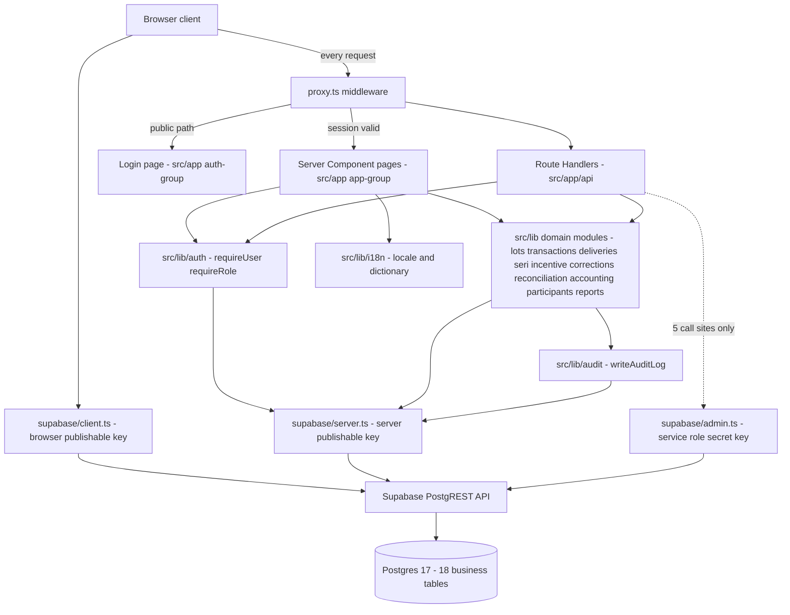
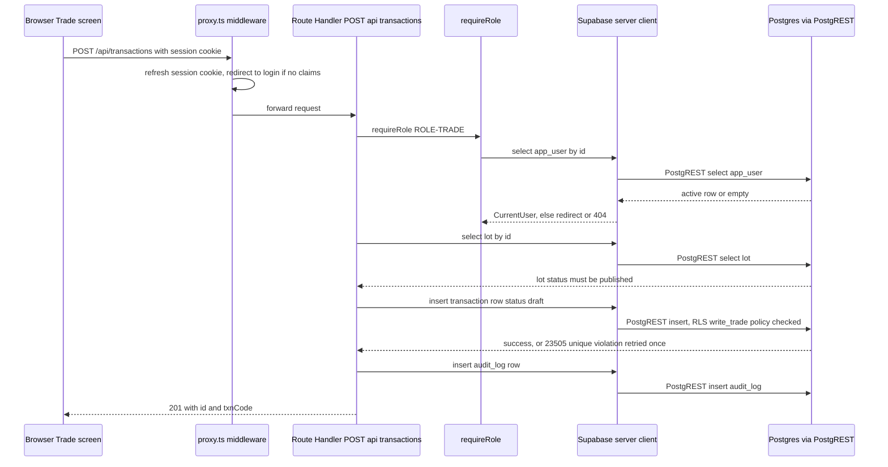

# Architecture

> Reverse-engineered from source. Basis: the graph-derived module import graph in
> `_graph-drafts/architecture-draft.md` (26 modules, 9 edges, commit `30aca250`), verified and
> completed here against source files and Postgres migrations. Every non-obvious claim below
> carries a `file:line` citation; anything the code did not settle is marked `[UNVERIFIED]`.

## System Architecture

This diagram completes the graph draft's 3-node core (`src_app`, `src_components`, `src_lib`,
723/191/186 import edges — `_graph-drafts/architecture-draft.md:36-38`) by resolving what those
blobs actually are: `src/app` is the Next.js App Router (pages + Route Handlers), `src/lib` is a
set of per-domain modules plus three Supabase client factories, and every request from the
browser is forced through `proxy.ts` first (the graph draft's own edge
`src_proxy_ts -->|2| src_lib`, line 44).

| Component | Role | Source |
|---|---|---|
| `Proxy` | Next 16 renames `middleware.ts` to `proxy.ts`; build output labels it `Proxy (Middleware)`. Refreshes the auth cookie, redirects unauthenticated requests to `/login` for every path except `/login` and `/api/auth/*` | `src/proxy.ts:1-12`, `src/lib/supabase/proxy.ts:11-59` |
| `AuthLib` | Three-tier gate: `requireUser` (session + active `app_user` row) then `requireRole` (role allow-list, 404 on mismatch) | `src/lib/auth/require-role.ts:58-78` |
| `ClientBrowser` / `ClientServer` | `@supabase/ssr` factories using only the publishable (anon) key; one client per request per `server.ts`'s own comment (Fluid compute) | `src/lib/supabase/client.ts:1-10`, `src/lib/supabase/server.ts:1-30` |
| `ClientAdmin` | The one client allowed to hold `SUPABASE_SECRET_KEY`; `"server-only"` import fails the build if a Client Component ever imports it | `src/lib/supabase/admin.ts:1-21` |
| `PostgREST` | The only DB access path — no raw `pg` driver, no RPC (§ Data Access below) | `src/lib/lots/availability-service.ts:9-19` |

**26-module graph draft correction:** the draft's remaining 23 nodes (`package.json`,
`tsconfig.json`, 8 `docs/*.md`, 6 `scripts/*.mjs`, `AGENTS.md`, `README.md`, config files) are
config/tooling/docs, not runtime architecture — correctly small-weight leaves in the import graph,
not corrected further here; they are covered by Tech Stack and are out of scope for a runtime
diagram.

## Module Architecture (`src/lib` domain breakdown)

The graph draft's single `src_lib` node (368 symbols) is one folder per business domain, each with
its own queries/services file, mirroring the RFP's feature split (F001–F011). Verified against
`scout-report.md`'s File Inventory (`scout-report.md:243-324`) plus direct reads of one
representative file per domain:

| Domain folder | Representative file (read) | Responsibility |
|---|---|---|
| `accounting/` | `create-export-batch.ts`, `tax.ts` | F-ACC export batch creation, JPY tax calc |
| `audit/` | `write-audit-log.ts:30-51` | Shared `writeAuditLog()` primitive (FR-AUDIT-01) |
| `auth/` | `require-role.ts:58-78`, `lockout.ts` | Session/role gate, 5-attempt/15-min lockout |
| `corrections/` | `approve-correction.ts`, `create-correction.ts` | F008 post-lock correction workflow |
| `db/` | `business-date.ts` (`todayJst()`), `types.ts` | Server-computed business date; generated `Database` type (`npm run db:types` → `package.json:12`) |
| `deliveries/` | `record-shipment.ts`, `qty-math.ts` | F006 delivery/shipment recording |
| `i18n/` | `get-locale.ts:8-12`, `get-dictionary.ts` | Cookie-based locale (vi/ja), `React.cache()`-deduped per request |
| `incentive/` | `calculate-incentive.ts`, `run-incentive-for-period.ts` | F009 完納奨励金 rule versions + calculation |
| `lots/` | `availability-service.ts:1-110` | F003 lot intake/publish; CAS `available_qty` guard |
| `participants/` | `eligibility.ts`, `state-machine.ts` | F002 participant lifecycle/eligibility |
| `reconciliation/` | `lock-business-day.ts`, `handle-locked-write.ts` | F007 day-lock workflow |
| `reports/` | `registry.ts` + `queries/rpt-01..08` (8 report queries) | F010 reporting registry |
| `seri/` | `seri-queries.ts` | F005 せり (auction) records |
| `supabase/` | `client.ts`, `server.ts`, `admin.ts`, `proxy.ts` | The 4 Supabase client factories (§ System Architecture) |
| `transactions/` | `confirm-transaction.ts`, `txn-code.ts` | F004 相対取引 transaction lifecycle |

`src/app` splits into three route groups (`scout-report.md:13-104`): `(app)/*` — 20 authenticated
screens gated by `requireUser()` at the group layout (`src/app/(app)/layout.tsx:11`); `(auth)/login`
— the one public screen; `api/*` — ~30 Route Handlers, one file per resource, each independently
calling `requireUser`/`requireRole` (no shared API middleware layer — confirmed by
`src/app/api/transactions/route.ts:124,134` calling the gate inline in every exported handler).

`src/components` (255 symbols) is presentational, grouped by the same domain names as `src/lib`
plus a shared `ui/` (empty-state, status-badge) and `pipeline/` (the process-flow visualization
components) — `scout-report.md:170-242`.

## Tech Stack

| Layer | Technology | Version | Source |
|---|---|---|---|
| Framework | Next.js (App Router) | 16.3.4 | `package.json:17` |
| UI | React / react-dom | 19.2.8 | `package.json:18-19` |
| Language | TypeScript (strict) | ^5 | `package.json:30`, `tsconfig.json:7` |
| Styling | Tailwind CSS (CSS-first, v4) | ^4 via `@tailwindcss/postcss` | `package.json:23,29` |
| DB client | `@supabase/ssr` | ^0.12.5 | `package.json:15` |
| DB client | `@supabase/supabase-js` | ^2.115.0 | `package.json:16` |
| Database | Supabase Postgres | major_version 17 | `supabase/config.toml:41` |
| Data access | PostgREST (via supabase-js) — no raw `pg` driver, no RPC | n/a | `src/lib/lots/availability-service.ts:9-19` (verified: no `pg`/`Pool`/`.rpc(` hits in `src/`) |
| Lint | ESLint + eslint-config-next | ^9 / 16.3.4 | `package.json:27-28` |
| Cache | None | — | no Redis/memcached dependency in `package.json` |
| Queue | None | — | no background execution (§ Cross-Cutting Facts) |
| Fonts | next/font/google — Noto Sans JP, Roboto Mono | — | `src/app/layout.tsx:2,14-26` |

## Data Flow

Representative flow: `POST /api/transactions` (F004, draft a 相対取引 transaction), showing the
three-tier gate, the boundary re-check on the posted `lotId`, and the audit-log side write.

Source: `src/app/api/transactions/route.ts:38-131` (handler + gate calls), `src/lib/audit/write-audit-log.ts:30-51`.

## Cross-Cutting Architectural Facts

These were the load-bearing facts flagged before this artifact was written. All 7 confirmed in
source; none contradicted.

1. **`proxy.ts` is Next 16's middleware.** Confirmed — `src/proxy.ts:1-12` wraps
   `src/lib/supabase/proxy.ts`'s `updateSession()`; matcher excludes static assets
   (`src/proxy.ts:8-11`).
2. **RLS enforces writes only; reads are open to every active role; page access is gated in the
   app layer with a 404, not 403.** Confirmed on all three points — `read_all_active_users` policy
   repeated per-table in `supabase/migrations/20260904090900_rls_core.sql:31-62` (16 tables), then extended to a
   17th by `supabase/migrations/20260907090000_lot_attachment.sql` and an 18th by
   `supabase/migrations/20260908090000_accounting_export.sql:49-50` — **18 tables today**;
   `requireRole()` calls `notFound()` (404), never a 403 page —
   `src/lib/auth/require-role.ts:72-78`; the same split is restated in `README.md:71-88`.
3. **Business-day lock is a trigger (`trg_block_after_lock`), not RLS — 4 tables, `BEFORE UPDATE
   OR DELETE` only.** Confirmed exactly as stated —
   `supabase/migrations/20260904090500_business_day_lock.sql:61-75` (trigger on `transaction`,
   `seri_result`, `mekiki_record`, `delivery_shipment`, no `INSERT`). The RLS-vs-trigger ordering
   bug (RLS filters the row out of the UPDATE candidate set before the BEFORE-ROW trigger runs,
   yielding `200 []` instead of an error) is documented as an empirically-found and fixed bug in
   `supabase/migrations/20260904091100_lock_enforcement_fix.sql:12-22`; `service_role`'s
   `BYPASSRLS` still needed an explicit `grant execute` for the trigger's own lookup function
   (same file, lines 1-10).
4. **No cross-table transactions; PostgREST-only; compare-and-swap retry loops instead.**
   Confirmed — `src/lib/lots/availability-service.ts:9-31` states the reasoning directly ("no raw
   `pg` driver and no stored procedure"; PostgREST update payloads accept only literal values) and
   implements `reserveLotQty`/`releaseLotQty` as a 25-attempt CAS loop (lines 48-110). No
   `pg`/`Pool`/`.rpc(` hit anywhere under `src/`.
5. **`accounting_export_batch` is append-only: insert-only RLS, no lock trigger, immutable `jsonb`
   snapshot.** Confirmed — `read_all_active_users` (select) + `write_settlement` (insert only) is
   the entire policy set, no update/delete policy exists
   (`supabase/migrations/20260908090000_accounting_export.sql:45-58`); the migration's own comment
   explains why no lock trigger applies (lines 59-67); `lines jsonb not null` is the immutable
   snapshot column (line 27).
6. **One admin (service-role) client, 5 call sites.** Confirmed — `src/lib/supabase/admin.ts:1-21`
   defines `createAdminClient()`; importers are exactly:
   `src/app/api/corrections/[id]/approve/route.ts`,
   `src/app/api/reconciliation/[businessDate]/lock/route.ts`,
   `src/app/api/auth/sign-out/route.ts`, `src/app/api/auth/sign-in/route.ts`,
   `src/lib/auth/lockout.ts`.
7. **No background/scheduled execution — 2 markers, both `addEventListener`/`removeEventListener`
   in `nav-shell.tsx`.** Confirmed — `src/components/layout/nav-shell.tsx:29,32`; this is a
   client-side `storage` event listener syncing the nav-collapsed preference across open browser
   tabs (`nav-shell.tsx:26-35`), not a server job. No cron/queue/worker exists anywhere in `src/`.

## Deployment View

> Derived from repository infrastructure-as-code — not verified against production.

N/A — no infrastructure-as-code found in repository (no Dockerfile, docker-compose, Kubernetes
manifest, Terraform, systemd unit, Procfile, nginx config, or PaaS manifest under any scanned
directory in `scout-report.md`). `package.json` carries only the standard `next dev`/`next
build`/`next start` scripts (`package.json:6-8`) with no platform-specific build hook.

Two facts are documented but do not constitute an IaC-verifiable topology, so are stated here as
context only, not rendered as a diagram/table per the degradation rule:
- The project's own README records the Supabase backing project (`Aicoding`, ref
  `esgqneojskshvidhivgv`, region `ap-southeast-1`) — `README.md:11-16`.
- The same README has an explicit placeholder for the deploy target and states it is **not yet
  deployed**: `"Vercel URL: <chưa deploy — điền sau>"` — `README.md:99`. The environment brief for
  this task states the intended platform is Vercel; the repository has no `vercel.json` or other
  Vercel-specific config confirming this beyond that one placeholder line.
